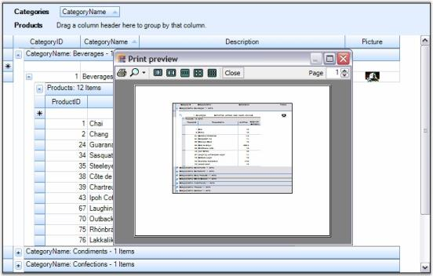

# Print and Print Preview

Grid Grouping control supports printing and printing previews through the .NET Framework classes System.Windows.Forms.PrintPreviewDialog and System.Windows.Forms.PrintDialog. A derived GridPrintDocument, which represents the print document is passed to these classes. This GridPrintDocument implements printing logic that is needed to print multipage grids.

Code for Print Preview Dialog Box

  

GridPrintDocument pd = new GridPrintDocument(this.gridGroupingControl1.TableControl, true);

PrintPreviewDialog ppv = new PrintPreviewDialog();

ppv.Document = pd;

pd.DefaultPageSettings.Landscape = true;

ppv.ShowDialog();



 

Dim pd As New GridPrintDocument(Me.gridGroupingControl1.TableControl, True)

Dim ppv As New PrintPreviewDialog()

ppv.Document = pd

pd.DefaultPageSettings.Landscape = True

ppv.ShowDialog()



Code for Print Dialog Box

  

GridPrintDocument pd = new GridPrintDocument(this.gridGroupingControl1.TableControl);

PrintDialog printDialog = new PrintDialog();

printDialog.Document = pd;

pd.DefaultPageSettings.Landscape = true;

if (printDialog.ShowDialog() == DialogResult.OK)

pd.Print();



 

Dim pd As New GridPrintDocument(Me.gridGroupingControl1.TableControl)

Dim printDialog As New PrintDialog()

printDialog.Document = pd

pd.DefaultPageSettings.Landscape = True

If printDialog.ShowDialog() = Windows.Forms.DialogResult.OK Then

pd.Print()

End If



Given below are sample screen shots.

  

  

N>: For more details, refer to the following browser sample:

> _&lt;Install Location&gt;\Syncfusion\EssentialStudio\[Version Number]\Windows\Grid.Grouping.Windows\Samples\Printing\Hierarchical Grid Demo_

Advanced printing

Grid Grouping control supports printing of entire grid's column in a single page. Also, it allows the user to specify the header and footer for the page to be printed. This can be achieved by using GridPrintDocumentAdv class. Column can be specified to fit in a single page by setting ScaleColumnsToFitPage property to true, header and footer can be added using the events DrawGridPrintHeader and DrawGridPrintFooter.

The following code example illustrates setting the header and footer for the page to be printed.

  

Syncfusion.GridHelperClasses.GridPrintDocumentAdv pd = new Syncfusion.GridHelperClasses.GridPrintDocumentAdv(this.gridGroupingControl1.TableControl);

pd.DefaultPageSettings.Margins = new System.Drawing.Printing.Margins(25, 25, 25, 25);

//Sets header and footer height.

pd.HeaderHeight = 70;

pd.FooterHeight = 50;

//Scales columns to fit page.

pd.ScaleColumnsToFitPage = true;

//Handles the following events to draw the header and footer.

pd.DrawGridPrintHeader += new Syncfusion.GridHelperClasses.GridPrintDocumentAdv.DrawGridHeaderFooterEventHandler(pd_DrawGridPrintHeader);

pd.DrawGridPrintFooter += new Syncfusion.GridHelperClasses.GridPrintDocumentAdv.DrawGridHeaderFooterEventHandler(pd_DrawGridPrintFooter); pd = new GridPrintDocument(this.gridGroupingControl1.TableControl);

PrintDialog printDialog = new PrintDialog();

printDialog.Document = pd;

pd.DefaultPageSettings.Landscape = true;

if (printDialog.ShowDialog() == DialogResult.OK)

pd.Print();



 

Dim pd As Syncfusion.GridHelperClasses.GridPrintDocumentAdv = New Syncfusion.GridHelperClasses.GridPrintDocumentAdv(Me.gridGroupingControl1.TableControl)

pd.DefaultPageSettings.Margins = New System.Drawing.Printing.Margins(25, 25, 25, 25)

'Sets header and footer height. 

pd.HeaderHeight = 70

pd.FooterHeight = 50

'Scales columns to fit page.

pd.ScaleColumnsToFitPage = True

'Handles the following events to draw header and footer.

AddHandler pd.DrawGridPrintHeader, AddressOf pd_DrawGridPrintHeader

AddHandler pd.DrawGridPrintFooter, AddressOf pd_DrawGridPrintFooter



N>: For more details, refer to the following browser sample:

> _&lt;Install Location&gt;\Syncfusion\EssentialStudio\[Version Number]\Windows\Grid.Grouping.Windows\Samples\Printing\Hierarchical Grid Demo_

  

