# Printing in Windows Forms GridGrouping control
GridGroupingControl supports printing and previewing the printing document in dialog box. A derived [GridPrintDocument](https://help.syncfusion.com/cr/windowsforms/Syncfusion.Windows.Forms.Grid.GridPrintDocument.html), which represents the print document is passed to these classes. This `GridPrintDocument` implements printing logic that is needed to print multi page grids. 

For printing the grid make use of the [PrintDialog](https://learn.microsoft.com/en-us/dotnet/api/system.windows.forms.printdialog?view=windowsdesktop-7.0&viewFallbackFrom=net-5.0) class. For printing the document get the grid as document with the help of `GridPrintDocument` class, then assign this document to the property [Document](https://learn.microsoft.com/en-us/dotnet/api/system.windows.forms.printdialog.document?view=windowsdesktop-7.0&viewFallbackFrom=net-5.0) of the `PrintDialog` object. It also supports hierarchical grid printing.



GridPrintDocument pd = new GridPrintDocument(this.gridGroupingControl1.TableControl);
PrintDialog printDialog = new PrintDialog();
printDialog.Document = pd;

if (printDialog.ShowDialog() == DialogResult.OK)
pd.Print();


Dim pd As New GridPrintDocument(Me.gridGroupingControl1.TableControl)
Dim printDialog As New PrintDialog()
printDialog.Document = pd

If printDialog.ShowDialog() = Windows.Forms.DialogResult.OK Then
pd.Print()
End If


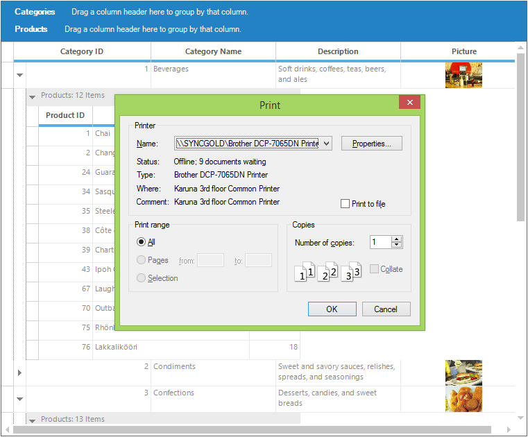

## Print Preview
Printing gives support for showing a print preview dialog. To access it, [PrintPreviewDialog](https://learn.microsoft.com/en-us/dotnet/api/system.windows.forms.printpreviewdialog?view=windowsdesktop-7.0&viewFallbackFrom=net-5.0) class has to be used and [GridPrintDocument](https://help.syncfusion.com/cr/windowsforms/Syncfusion.Windows.Forms.Grid.GridPrintDocument.html) has to be assigned to Document property of its object.



GridPrintDocument pd = new GridPrintDocument(this.gridGroupingControl1.TableControl, true);
PrintPreviewDialog printPreviewDialog = new PrintPreviewDialog();
printPreviewDialog.Document = pd;
printPreviewDialog.ShowDialog();


Dim pd As New GridPrintDocument(Me.gridGroupingControl1.TableControl, True)
Dim printPreviewDialog As New PrintPreviewDialog()
printPreviewDialog.Document = pd
printPreviewDialog.ShowDialog()


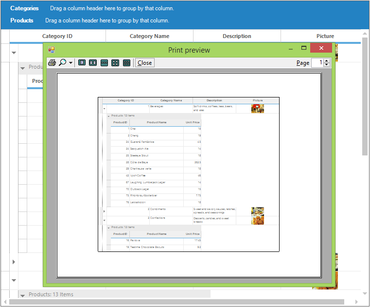

### Printing using Keyboard shortcut
There is no direct support for printing the grid using <kbd>Ctrl</kbd>+<kbd>P</kbd> key combination but this can be achieved by handling the [TableControl.KeyDown](https://learn.microsoft.com/en-us/dotnet/api/system.windows.forms.control.keydown?view=windowsdesktop-7.0&viewFallbackFrom=net-5.0) event of the grid.



this.gridGroupingControl1.TableControl.KeyDown += new KeyEventHandler(TableControl_KeyDown);

private void TableControl_KeyDown(object sender, KeyEventArgs e)
{

   if (e.Control && e.KeyCode == Keys.P)
   {
      GridPrintDocumentAdv printDocument = new GridPrintDocument(this.gridGroupingControl1.TableControl);
      PrintPreviewDialog previewDialog = new PrintPreviewDialog();
      previewDialog.Document = printDocument;
      previewDialog.Show();
   }
}



AddHandler gridGroupingControl1.TableControl.KeyDown, AddressOf TableControl_KeyDown

Private Sub TableControl_KeyDown(ByVal sender As Object, ByVal e As KeyEventArgs)

   If e.Control AndAlso e.KeyCode = Keys.P Then
      Dim printDocument As New GridPrintDocument(Me.gridGroupingControl1.TableControl)
      Dim previewDialog As New PrintPreviewDialog()
      previewDialog.Document = printDocument
      previewDialog.Show()
   End If
End Sub



## Advanced Print Document
The [GridPrintDocumentAdv](https://help.syncfusion.com/cr/windowsforms/Syncfusion.GridHelperClasses.GridPrintDocumentAdv.html) class provides the advanced options to print the grid. To have this printing support, the [Syncfusion.GridHelperClasses.Windows.dll](https://help.syncfusion.com/cr/windowsforms/Syncfusion.Windows.Forms.Grid.GridRecordNavigationControl.html) assembly needs to be added into the assembly reference. 

This class provides the following functionalities,

* Printing the grid with scaling
* Determining the heights of headers and footers
* Headers and Footers styles
* Events for headers and footers



GridPrintDocumentAdv printDocument = new GridPrintDocumentAdv(this.gridGroupingControl1.TableControl);
PrintPreviewDialog previewDialog = new PrintPreviewDialog();
previewDialog.Document = printDocument;
previewDialog.Show();


Dim printDocument As New GridPrintDocumentAdv(Me.gridGroupingControl1.TableControl)
Dim previewDialog As New PrintPreviewDialog()
previewDialog.Document = printDocument
previewDialog.Show()



The detailed information about the advanced printing is discussed in below sections.

## Print options
The GridGroupingControl can be printed with various options. i.e. scaling, print frame, and Orientation of the print document can be applied on printing. 

### Scaling
All the columns of the GridGroupingControl can be printed with in a single page by enabling the [ScaleColumnsToFitPage](https://help.syncfusion.com/cr/windowsforms/Syncfusion.GridHelperClasses.GridPrintDocumentAdv.html#Syncfusion_GridHelperClasses_GridPrintDocumentAdv_ScaleColumnsToFitPage) property of the `GridPrintDocumentAdv`.



//Create the Grid as printing document
GridPrintDocumentAdv gridPrintDocument = new GridPrintDocumentAdv(this.gridGroupingControl1.TableControl);
PrintDialog pd = new PrintDialog();

//Scale all columns to fit within a page
gridPrintDocument.ScaleColumnsToFitPage = true;
pd.Document = gridPrintDocument;

//Print the contents of the Grid
gridPrintDocument.Print();           


'Create the Grid as printing document
Dim gridPrintDocument As New GridPrintDocumentAdv(Me.gridGroupingControl1.TableControl)
Dim pd As New PrintDialog()

'Scale all columns to fit within a page
gridPrintDocument.ScaleColumnsToFitPage = True
pd.Document = gridPrintDocument

'Print the contents of the Grid
gridPrintDocument.Print()



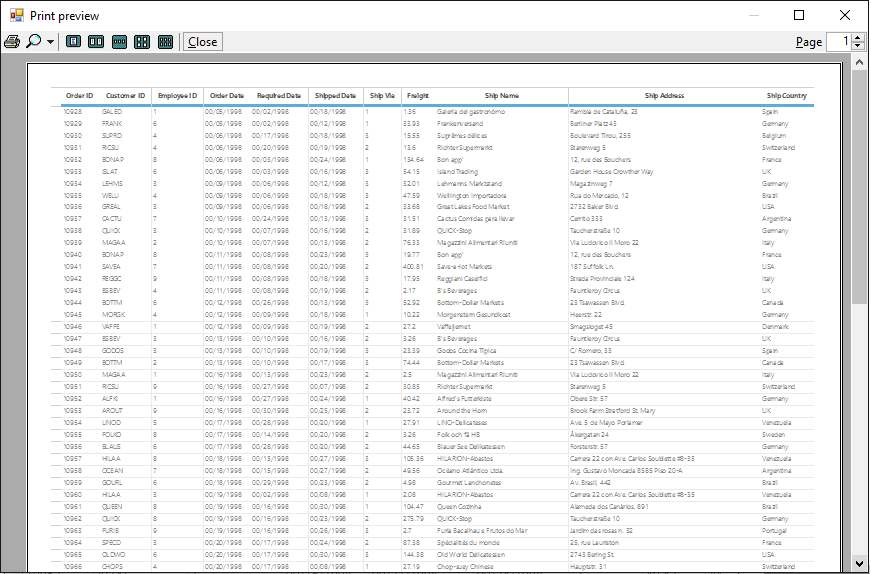

### Printing All the Contents into a Single Page
The grid data will be fit to a single page or the minimal number of pages using [PagesToFit](https://help.syncfusion.com/cr/windowsforms/Syncfusion.GridHelperClasses.GridPrintDocumentAdv.html#Syncfusion_GridHelperClasses_GridPrintDocumentAdv_PagesToFit) property and this option will be enabled only when the [PrintColumnToFitPage](https://help.syncfusion.com/cr/windowsforms/Syncfusion.GridHelperClasses.GridPrintDocumentAdv.html#Syncfusion_GridHelperClasses_GridPrintDocumentAdv_PrintColumnToFitPage) is set to `true`.



//Create the grid document for print
GridPrintDocumentAdv gridPrintDocument = new GridPrintDocumentAdv(this.gridGroupingControl1.TableControl);

//Used to print all columns to fit within a page
gridPrintDocument.PrintColumnToFitPage = true;

// Printing All the Contents into a Single Page
gridPrintDocument.PagesToFit = 1;
PrintDialog pd = new PrintDialog();
pd.Document = gridPrintDocument;
gridPrintDocument.Print();           


'Create the grid document for print
Dim gridPrintDocument As New GridPrintDocumentAdv(Me.gridGroupingControl1.TableControl)

'Used to print all columns to fit within a page
gridPrintDocument.PrintColumnToFitPage = True

' Printing All the Contents into a Single Page
gridPrintDocument.PagesToFit = 1
Dim pd As New PrintDialog()
pd.Document = gridPrintDocument
gridPrintDocument.Print()



### Printing the grid with the Frame
The contents of the grid can be printed with an outer frame by setting the [PrintFrame](https://help.syncfusion.com/cr/windowsforms/Syncfusion.Windows.Forms.Grid.GridProperties.html#Syncfusion_Windows_Forms_Grid_GridProperties_PrintFrame) property to `true`.



//Print the grid with frame
this.gridGroupingControl1.TableModel.Properties.PrintFrame = true;


'Print the grid with frame
Me.gridGroupingControl1.TableModel.Properties.PrintFrame = True



### Page Orientation
The orientation of the printing layout can be changed to landscape by setting [LandScape](https://learn.microsoft.com/en-us/dotnet/api/system.drawing.printing.pagesettings.landscape?view=dotnet-plat-ext-7.0&viewFallbackFrom=net-5.0) property to `true`.



GridPrintDocument pd = new GridPrintDocument(this.gridGroupingControl1.TableControl);
PrintDialog printDialog = new PrintDialog();
printDialog.Document = pd;

//Setting page layout as Landscape
pd.DefaultPageSettings.Landscape = true;

if (printDialog.ShowDialog() == DialogResult.OK)
pd.Print();


Dim pd As New GridPrintDocument(Me.gridGroupingControl1.TableControl)
Dim printDialog As New PrintDialog()
printDialog.Document = pd

'Setting page layout as Landscape
pd.DefaultPageSettings.Landscape = True

If printDialog.ShowDialog() = Windows.Forms.DialogResult.OK Then
pd.Print()
End If



## Black and White Printing 
The grid can be printed with the `black and white` color combination by setting [BlackWhite](https://help.syncfusion.com/cr/windowsforms/Syncfusion.Windows.Forms.Grid.GridProperties.html#Syncfusion_Windows_Forms_Grid_GridProperties_BlackWhite) property to `true`. 



//To print the grid in a Black and White color
this.gridGroupingControl1.TableModel.Properties.BlackWhite = true;


'To print the grid in a Black and White color
Me.gridGroupingControl1.TableModel.Properties.BlackWhite = True



## Multiple Grid Printing
Multiple GridGroupingControl can be printed across various pages using helper class [MultipleGridPrintDocument](https://help.syncfusion.com/cr/windowsforms/Syncfusion.GridHelperClasses.MultiGridPrintDocument.html). This is achieved by drawing full-size grid to a large bitmap and then scaling this bitmap to fit the output page.

The [GridPrintOption](https://help.syncfusion.com/cr/windowsforms/Syncfusion.GridHelperClasses.MultiGridPrintDocument.html#Syncfusion_GridHelperClasses_MultiGridPrintDocument_GridPrintOption) property is used to specify the multiple grids printing options. 

**MultiGridPrinting** - Customizes the way printing support is provided for grids. It enables multiple grids to be printed in a single print. 
**PrintGridInNewPage** - Multiple grids can be printed continuously. However, the consecutive grid’s starting page will begin on a new page. 
**DefaultGridPrint** - Multiple grids will be printed without considering column breaks. 
**ScaleColumnsToFit** - Multiple grid columns will be scaled to fit the printed page.



//Iterating the GridGroupingControl
List&lt;Control&gt; grids = new List&lt;Control&gt;();

foreach (Control control in this.panel1.Controls)
{

   if (control is GridGroupingControl)
   {
     grids.Add((control as GridGroupingControl).TableControl);
   }
}

//Defining MultiGridPrintDocument
MultiGridPrintDocument multiDocumentPrint = new MultiGridPrintDocument(grids);
multiDocumentPrint.GridPrintOption = MultiGridPrintDocument.GridPrintOptions.MultipleGridPrint;
multiDocumentPrint.ShowHeaderFooterOnAllPages = true;

//Print preview dialog
PrintPreviewDialog previewDialog = new PrintPreviewDialog();
previewDialog.Document = multiDocumentPrint;
previewDialog.Show();


'Iterating the GridGroupingControl
Dim grids As New List(Of Control)()

For Each control As Control In Me.panel1.Controls

   If TypeOf control Is GridGroupingControl Then
     grids.Add((TryCast(control, GridGroupingControl)).TableControl)
   End If
Next control

'Defining MultiGridPrintDocument
Dim multiDocumentPrint As New MultiGridPrintDocument(grids)
multiDocumentPrint.GridPrintOption = MultiGridPrintDocument.GridPrintOptions.MultipleGridPrint
multiDocumentPrint.ShowHeaderFooterOnAllPages = True

'Print preview dialog
Dim previewDialog As New PrintPreviewDialog()
previewDialog.Document = multiDocumentPrint
previewDialog.Show()



## Setting Header and Footer 
The GridGroupingControl can be printed with the headers and footers by setting the [HeaderPrintStyleInfo](https://help.syncfusion.com/cr/windowsforms/Syncfusion.GridHelperClasses.GridPrintDocumentAdv.html#Syncfusion_GridHelperClasses_GridPrintDocumentAdv_HeaderPrintStyleInfo) and [FooterPrintStyleInfo](https://help.syncfusion.com/cr/windowsforms/Syncfusion.GridHelperClasses.GridPrintDocumentAdv.html#Syncfusion_GridHelperClasses_GridPrintDocumentAdv_FooterPrintStyleInfo) properties of the advanced `GridPrintDocument`. 



GridPrintDocumentAdv gridPrintDocument = new GridPrintDocumentAdv(this.gridGroupingControl1.TableControl);
PrintPreviewDialog printPreviewDialog = new PrintPreviewDialog();
printPreviewDialog.Document = gridPrintDocument;

//Setting the height for header and footer
gridPrintDocument.HeaderHeight = 30;
gridPrintDocument.FooterHeight = 30;
gridPrintDocument.HeaderPrintStyleInfo.Text = "Syncfusion Software Private Ltd";
gridPrintDocument.FooterPrintStyleInfo.Text = "Time :" + DateTime.Now.TimeOfDay.ToString();
gridPrintDocument.HeaderPrintStyleInfo.TextColor = Color.Orange;
gridPrintDocument.HeaderPrintStyleInfo.Font.Bold = true;
gridPrintDocument.HeaderPrintStyleInfo.Font.Size = 20;

//Set the alignments 
gridPrintDocument.HeaderPrintStyleInfo.HorizontalAlignment = GridHorizontalAlignment.Center;
gridPrintDocument.FooterPrintStyleInfo.HorizontalAlignment = GridHorizontalAlignment.Right;
printPreviewDialog.ShowDialog();


Dim gridPrintDocument As New GridPrintDocumentAdv(Me.gridGroupingControl1.TableControl)
Dim printPreviewDialog As New PrintPreviewDialog()
printPreviewDialog.Document = gridPrintDocument

'Setting the height for header and footer
gridPrintDocument.HeaderHeight = 30
gridPrintDocument.FooterHeight = 30
gridPrintDocument.HeaderPrintStyleInfo.Text = "Syncfusion Software Private Ltd"
gridPrintDocument.FooterPrintStyleInfo.Text = "Time :" & DateTime.Now.TimeOfDay.ToString()
gridPrintDocument.HeaderPrintStyleInfo.TextColor = Color.Orange
gridPrintDocument.HeaderPrintStyleInfo.Font.Bold = True
gridPrintDocument.HeaderPrintStyleInfo.Font.Size = 20

'Set the alignments 
gridPrintDocument.HeaderPrintStyleInfo.HorizontalAlignment = GridHorizontalAlignment.Center
gridPrintDocument.FooterPrintStyleInfo.HorizontalAlignment = GridHorizontalAlignment.Right
printPreviewDialog.ShowDialog()



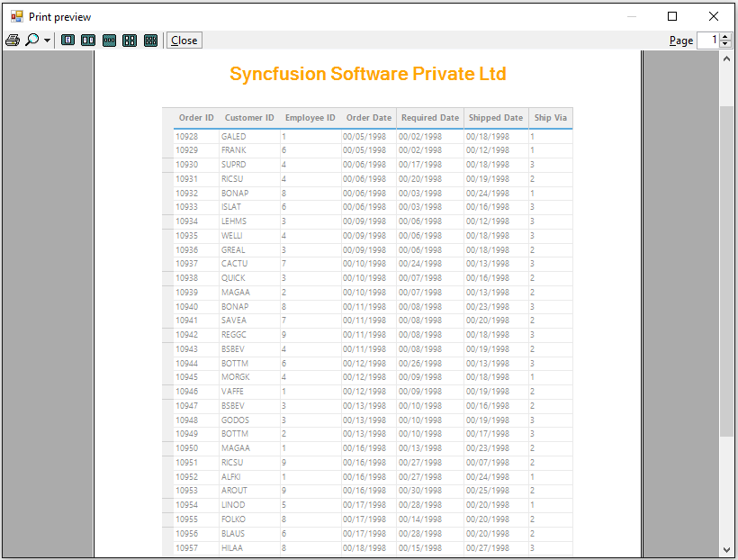

## Customizing Header and Footer
The header and footer can be customized as per user need by handling the [DrawGridPrintHeader](https://help.syncfusion.com/cr/windowsforms/Syncfusion.GridHelperClasses.GridPrintDocumentAdv.html#Syncfusion_GridHelperClasses_GridPrintDocumentAdv_DrawGridPrintHeader) and [DrawGridPrintFooter](https://help.syncfusion.com/cr/windowsforms/Syncfusion.GridHelperClasses.GridPrintDocumentAdv.html#Syncfusion_GridHelperClasses_GridPrintDocumentAdv_DrawGridPrintFooter) event.



//Handle the events to draw the header / footer
pd.DrawGridPrintHeader += new Syncfusion.GridHelperClasses.GridPrintDocumentAdv.DrawGridHeaderFooterEventHandler(pd_DrawGridPrintHeader);
pd.DrawGridPrintFooter += new Syncfusion.GridHelperClasses.GridPrintDocumentAdv.DrawGridHeaderFooterEventHandler(pd_DrawGridPrintFooter);

//Used to create own header
void pd_DrawGridPrintHeader(object sender, Syncfusion.GridHelperClasses.GridPrintHeaderFooterTemplateArgs e)
{

    // Get the rectangle area to draw
    Rectangle header = e.DrawRectangle;

    //IMAGE

    //scale the image
    SizeF imageSize = new SizeF(header.Width / 3, header.Height * 0.8f);

    //Locating the logo on the right corner of the Drawing Surface
    PointF imageLocation = new PointF(e.DrawRectangle.Width - imageSize.Width - 20, header.Y + 5);
    Bitmap image = new Bitmap(@"..\..\Data\logo.png");

    //Draw the image in the Header.
    e.Graphics.DrawImage(image, new RectangleF(imageLocation, imageSize));

    //TITLE
    Color activeColor = Color.FromArgb(44, 71, 120);
    SolidBrush brush = new SolidBrush(activeColor);
    Font font = new Font("Helvetica", 20, FontStyle.Bold);

    //Set formatting for the text
    StringFormat format = new StringFormat();
    format.Alignment = StringAlignment.Near;
    format.LineAlignment = StringAlignment.Near;

    //Draw the title
    e.Graphics.DrawString("Customers Order Report", font, brush, new RectangleF(header.Location.X + 20, header.Location.Y + 20, e.DrawRectangle.Width, e.DrawRectangle.Height), format);

    ///BORDER LINES - Draw some lines in the header
    Pen pen = new Pen(Color.DarkBlue, 0.8f);
    e.Graphics.DrawLine(pen, new Point(header.Left, header.Top + 2), new Point(header.Right, header.Top + 2));
    e.Graphics.DrawLine(pen, new Point(header.Left, header.Top + 5), new Point(header.Right, header.Top + 5));
    e.Graphics.DrawLine(pen, new Point(header.Left, header.Bottom - 8), new Point(header.Right, header.Bottom - 8));
    e.Graphics.DrawLine(pen, new Point(header.Left, header.Bottom - 5), new Point(header.Right, header.Bottom - 5));

    //Dispose drawing resources
    font.Dispose();
    format.Dispose();
    pen.Dispose();
}

//Used to create own footer
void pd_DrawGridPrintFooter(object sender, Syncfusion.GridHelperClasses.GridPrintHeaderFooterTemplateArgs e)
{

    //Get the rectangle area to draw
    Rectangle footer = e.DrawRectangle;

    //Draw copy right
    StringFormat format = new StringFormat();
    format.LineAlignment = StringAlignment.Center;
    format.Alignment = StringAlignment.Center;
    Font font = new Font("Helvetica", 8);
    SolidBrush brush = new SolidBrush(Color.Red);
    e.Graphics.DrawString("@copyright", font, brush, GridUtil.CenterPoint(footer), format);

    //Draw page number
    format.LineAlignment = StringAlignment.Far;
    format.Alignment = StringAlignment.Far;
    e.Graphics.DrawString(string.Format("page {0} of {1}", e.PageNumber, e.PageCount), font, brush, new Point(footer.Right - 100, footer.Bottom - 20), format);

    //Dispose resources
    format.Dispose();
    font.Dispose();
    brush.Dispose();
}



'Handle the events to draw the header / footer
AddHandler pd.DrawGridPrintHeader, AddressOf pd_DrawGridPrintHeader
AddHandler pd.DrawGridPrintFooter, AddressOf pd_DrawGridPrintFooter

'Used to create own header
Private Sub pd_DrawGridPrintHeader(ByVal sender As Object, ByVal e As Syncfusion.GridHelperClasses.GridPrintHeaderFooterTemplateArgs)

    ' Get the rectangle area to draw
    Dim header As Rectangle = e.DrawRectangle

    'IMAGE

    'scale the image
    Dim imageSize As New SizeF(header.Width \ 3, header.Height * 0.8f)

    'Locating the logo on the right corner of the Drawing Surface
    Dim imageLocation As New PointF(e.DrawRectangle.Width - imageSize.Width - 20, header.Y + 5)
    Dim image As New Bitmap("..\..\Data\logo.png")

    'Draw the image in the Header.
    e.Graphics.DrawImage(image, New RectangleF(imageLocation, imageSize))

    'TITLE
    Dim activeColor As Color = Color.FromArgb(44, 71, 120)
    Dim brush As New SolidBrush(activeColor)
    Dim font As New Font("Helvetica", 20, FontStyle.Bold)

    'Set formatting for the text
    Dim format As New StringFormat()
    format.Alignment = StringAlignment.Near
    format.LineAlignment = StringAlignment.Near

    'Draw the title
    e.Graphics.DrawString("Customers Order Report", font, brush, New RectangleF(header.Location.X + 20, header.Location.Y + 20, e.DrawRectangle.Width, e.DrawRectangle.Height), format)

    '''BORDER LINES - Draw some lines in the header
    Dim pen As New Pen(Color.DarkBlue, 0.8f)
    e.Graphics.DrawLine(pen, New Point(header.Left, header.Top + 2), New Point(header.Right, header.Top + 2))
    e.Graphics.DrawLine(pen, New Point(header.Left, header.Top + 5), New Point(header.Right, header.Top + 5))
    e.Graphics.DrawLine(pen, New Point(header.Left, header.Bottom - 8), New Point(header.Right, header.Bottom - 8))
    e.Graphics.DrawLine(pen, New Point(header.Left, header.Bottom - 5), New Point(header.Right, header.Bottom - 5))

    'Dispose drawing resources
    font.Dispose()
    format.Dispose()
    pen.Dispose()
End Sub

'Used to create own footer
Private Sub pd_DrawGridPrintFooter(ByVal sender As Object, ByVal e As Syncfusion.GridHelperClasses.GridPrintHeaderFooterTemplateArgs)

    'Get the rectangle area to draw
    Dim footer As Rectangle = e.DrawRectangle

    'Draw copy right
    Dim format As New StringFormat()
    format.LineAlignment = StringAlignment.Center
    format.Alignment = StringAlignment.Center
    Dim font As New Font("Helvetica", 8)
    Dim brush As New SolidBrush(Color.Red)
    e.Graphics.DrawString("@copyright", font, brush, GridUtil.CenterPoint(footer), format)

    'Draw page number
    format.LineAlignment = StringAlignment.Far
    format.Alignment = StringAlignment.Far
    e.Graphics.DrawString(String.Format("page {0} of {1}", e.PageNumber, e.PageCount), font, brush, New Point(footer.Right - 100, footer.Bottom - 20), format)

    'Dispose resources
    format.Dispose()
    font.Dispose()
    brush.Dispose()
End Sub




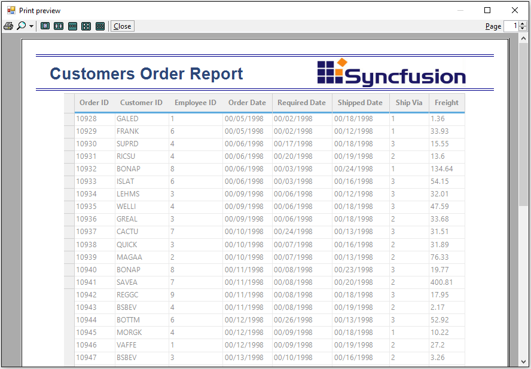

## Printing with Application Form
The printing with application forms can be done in the following ways by handling the [PrintDocument](https://learn.microsoft.com/en-us/dotnet/api/system.drawing.printing.printdocument?view=dotnet-plat-ext-7.0&viewFallbackFrom=net-5.0) class.

* Printing the whole application form
* Printing the client area in form

### Printing the whole application form
The whole application form can be printed by handling the [PrintPage](https://learn.microsoft.com/en-us/dotnet/api/system.drawing.printing.printdocument.printpage?view=dotnet-plat-ext-7.0&viewFallbackFrom=net-5.0) in the `PrintDocument` class. 



PrintDocument document = new PrintDocument();

//Triggering the PrintPage event
document.PrintPage += new PrintPageEventHandler(document_PrintPage);

PrintPreviewDialog previewDialog = new PrintPreviewDialog();
previewDialog.Document = document;
previewDialog.Show();

void document_PrintPage(object sender, PrintPageEventArgs e)
{

    //Set the image
    Bitmap bitMapImage = new Bitmap(this.Width, this.Height);

    //set the rendering to the specified bitmap
    this.DrawToBitmap(bitMapImage, new Rectangle(0, 0, this.Width, this.Height));

    //draw the image in the given location.
    e.Graphics.DrawImage(bitMapImage, new Point(0, 0));
}



Dim document As New PrintDocument()

'Triggering the PrintPage event
AddHandler document.PrintPage, AddressOf document_PrintPage

Dim previewDialog As New PrintPreviewDialog()
previewDialog.Document = document
previewDialog.Show()

Private Sub document_PrintPage(ByVal sender As Object, ByVal e As PrintPageEventArgs)

    'Set the image
    Dim bitMapImage As New Bitmap(Me.Width, Me.Height)

    'set the rendering to the specified bitmap
    Me.DrawToBitmap(bitMapImage, New Rectangle(0, 0, Me.Width, Me.Height))

    'draw the image in the given location.
    e.Graphics.DrawImage(bitMapImage, New Point(0, 0))
End Sub



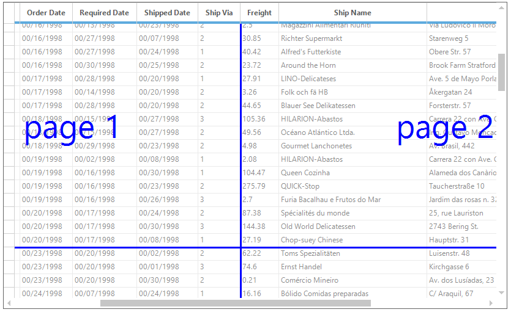

### Printing the Client Area in Form
The GridGroupingControl does not have built-in support for printing the client application form. It can be done by using the `PrintDocument` class and following customization,

1. Call the [BitBlt](https://learn.microsoft.com/en-us/windows/win32/api/wingdi/nf-wingdi-bitblt) function   ie. unmanaged code in a managed application. 



using System.Runtime.InteropServices;

[DllImport("gdi32.dll")]

private static extern bool BitBlt(IntPtr hdc, int nX, int nY,
int nWidthInt, int nHeight, IntPtr hdcSrcInt, int nXSrcInt, int nYSrc, System.Int32 n);


Imports System.Runtime.InteropServices

<DllImport("gdi32.dll")>

Private Shared Function BitBlt(ByVal hdc As IntPtr, ByVal nX As Integer, ByVal nY As Integer, ByVal nWidthInt As Integer, ByVal nHeight As Integer, ByVal hdcSrcInt As IntPtr, ByVal nXSrcInt As Integer, ByVal nYSrc As Integer, ByVal n As System.Int32) As Boolean
End Function



{{ codesnippet1 | OrderList_Indent_Level_1 }}

2. Draw an image of application form using the [PrintPage](https://learn.microsoft.com/en-us/dotnet/api/system.drawing.printing.printdocument.printpage?view=dotnet-plat-ext-7.0&viewFallbackFrom=net-5.0) event.




PrintDocument printDocument = new PrintDocument();
printDocument.PrintPage += new PrintPageEventHandler(printDocument_PrintPage);
previewDialog.Document = printDocument;
previewDialog.Show();

void printDocument_PrintPage(object sender, PrintPageEventArgs e)
{
   e.Cancel = true;
   Graphics graphic = CreateGraphics();
   Image image = new Bitmap(Size.Width, Size.Height, graphic);
   Graphics graphics = Graphics.FromImage(image);
   IntPtr dc1 = graphic.GetHdc();
   IntPtr dc2 = graphics.GetHdc();
   BitBlt(dc2, 0, 0, ClientRectangle.Width, ClientRectangle.Height, dc1, 0, 0, 13369376);
   graphic.ReleaseHdc(dc1);
   graphics.ReleaseHdc(dc2);
   e.Graphics.DrawImage(image, 0, 0);
}


Private printDocument As New PrintDocument()
Private printDocument.PrintPage += New PrintPageEventHandler(AddressOf printDocument_PrintPage)
previewDialog.Document = printDocument
previewDialog.Show()

void printDocument_PrintPage(Object sender, PrintPageEventArgs e)
   e.Cancel = True
   Dim graphic As Graphics = CreateGraphics()
   Dim image As Image = New Bitmap(Size.Width, Size.Height, graphic)
   Dim graphics As Graphics = Graphics.FromImage(image)
   Dim dc1 As IntPtr = graphic.GetHdc()
   Dim dc2 As IntPtr = graphics.GetHdc()
   BitBlt(dc2, 0, 0, ClientRectangle.Width, ClientRectangle.Height, dc1, 0, 0, 13369376)
   graphic.ReleaseHdc(dc1)
   graphics.ReleaseHdc(dc2)
   e.Graphics.DrawImage(image, 0, 0)



{{ codesnippet2 | OrderList_Indent_Level_1 }}

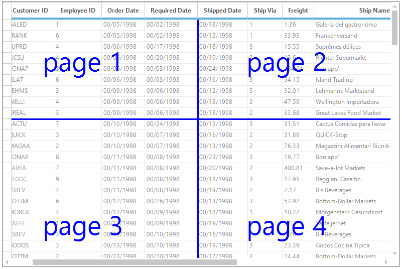

## Print Layout Helper
The Print Page Layout feature enables viewing page layout on the grid by displaying a segment line and page number with each segment. This helps to analyze page breaks within the grid, and manage them accordingly.

The [LayoutSupportHelper](https://help.syncfusion.com/cr/windowsforms/Syncfusion.GridHelperClasses.LayoutSupportHelper.html) class provides the functionality of the layout helper in grid. It provides the following options to view the pages,

* Page breaks
* Customization in page break line color and line width
* Customization in page flow
* Print settings

To enable the page layout line, the [ShowLayoutLines](https://help.syncfusion.com/cr/windowsforms/Syncfusion.GridHelperClasses.LayoutSupportHelper.html#Syncfusion_GridHelperClasses_LayoutSupportHelper_ShowLayoutLines) property should be enabled.


LayoutSupportHelper helper = new LayoutSupportHelper(this.gridGroupingControl1.TableControl);
helper.ShowLayoutLines = true;


Dim helper As New LayoutSupportHelper(Me.gridGroupingControl1.TableControl)
helper.ShowLayoutLines = true


The detailed information about the Layout helper is discussed in the following sections.

## Page Break
Properties are available to define colors for the line and text of the page layout. The number of rows and columns to be printed for each page can be set by using the [PageBreakRows](https://help.syncfusion.com/cr/windowsforms/Syncfusion.GridHelperClasses.LayoutSupportHelper.html#Syncfusion_GridHelperClasses_LayoutSupportHelper_PageBreakRows) and [PageBreakCols](https://help.syncfusion.com/cr/windowsforms/Syncfusion.GridHelperClasses.LayoutSupportHelper.html#Syncfusion_GridHelperClasses_LayoutSupportHelper_PageBreakCols) through `LayoutSupportHelper`. The following code examples illustrate how to set the line and text color of the page layout.



LayoutSupportHelper helper = new LayoutSupportHelper(this.gridGroupingControl1.TableControl);
helper.ShowLayoutLines = true;
helper.LineColor = Color.Blue;
helper.TextColor = Color.Blue;


Dim helper As New LayoutSupportHelper(Me.gridGroupingControl1.TableControl)
helper.ShowLayoutLines = true
helper.LineColor = Color.Blue
helper.TextColor = Color.Blue


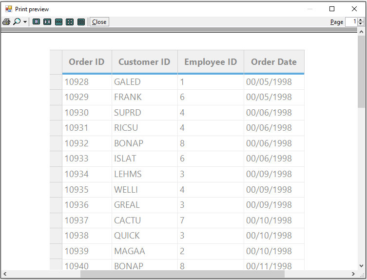

### Customizing Layout Lines and Text
The page layout line and text can be changed by using the [LineColor](https://help.syncfusion.com/cr/windowsforms/Syncfusion.GridHelperClasses.LayoutSupportHelper.html#Syncfusion_GridHelperClasses_LayoutSupportHelper_LineColor), [TextColor](https://help.syncfusion.com/cr/windowsforms/Syncfusion.GridHelperClasses.LayoutSupportHelper.html#Syncfusion_GridHelperClasses_LayoutSupportHelper_TextColor), [LineWidth](https://help.syncfusion.com/cr/windowsforms/Syncfusion.GridHelperClasses.LayoutSupportHelper.html#Syncfusion_GridHelperClasses_LayoutSupportHelper_LineWidth) and [PageTextFormat](https://help.syncfusion.com/cr/windowsforms/Syncfusion.GridHelperClasses.LayoutSupportHelper.html#Syncfusion_GridHelperClasses_LayoutSupportHelper_PageTextFormat) properties.


LayoutSupportHelper helper = new LayoutSupportHelper(this.gridGroupingControl1.TableControl);
helper.ShowLayoutLines = true;
helper.LineColor = Color.HotPink;
helper.LineWidth = 3;
helper.TextColor = Color.DeepPink;
helper.PageTextFormat = "Paper";


Dim helper As New LayoutSupportHelper(Me.gridGroupingControl1.TableControl)
helper.ShowLayoutLines = True
helper.LineColor = Color.HotPink
helper.LineWidth = 3
helper.TextColor = Color.DeepPink
helper.PageTextFormat = "Paper"


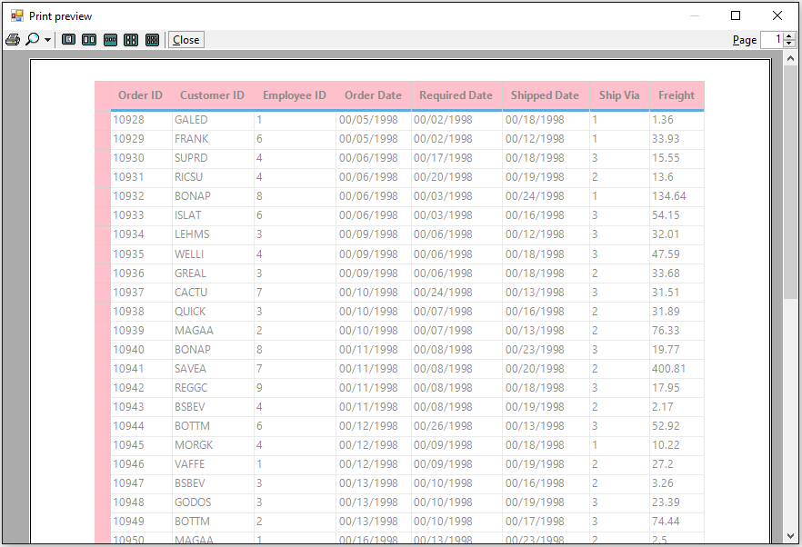

### Customizing Page Flow
The page number will be considered based on the horizontally by default. This can be handled by using the [PageFlow](https://help.syncfusion.com/cr/windowsforms/Syncfusion.GridHelperClasses.LayoutSupportHelper.html#Syncfusion_GridHelperClasses_LayoutSupportHelper_PageFlow) property.


LayoutSupportHelper helper = new LayoutSupportHelper(this.gridGroupingControl1.TableControl);
helper.ShowLayoutLines = true;
helper.PageFlow = PageFlowDirection.Vertical;


Dim helper As New LayoutSupportHelper(Me.gridGroupingControl1.TableControl)
helper.ShowLayoutLines = true
helper.PageFlow = PageFlowDirection.Vertical


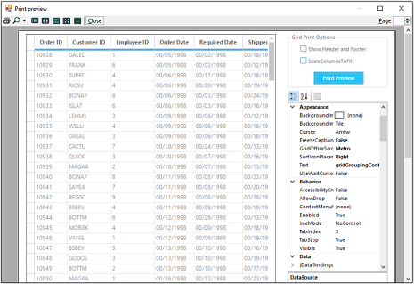

### Customizing Page Break Rows and Columns
The below example shows the number of rows and number of columns are provided for `PageBreaks`,


//Defining page breaking rows
List<int> pageBreakRows = new List<int>();
pageBreakRows.Add(10);
pageBreakRows.Add(30);

//Defining page breaking columns
List<int> pageBreakColumns = new List<int>();
pageBreakColumns.Add(5);
pageBreakColumns.Add(9);
LayoutSupportHelper helper = new LayoutSupportHelper(this.gridGroupingControl1.TableControl);
helper.LineColor = Color.Blue;
helper.TextColor = Color.Blue;

//Setting Page breaking rows
helper.PageBreakRows = pageBreakRows;
helper.PageBreakCols = pageBreakColumns;
helper.ShowLayoutLines = true;


'Defining page breaking rows
Dim pageBreakRows As New List(Of Integer)()
pageBreakRows.Add(10)
pageBreakRows.Add(30)

'Defining page breaking columns
Dim pageBreakColumns As New List(Of Integer)()
pageBreakColumns.Add(5)
pageBreakColumns.Add(9)
Dim helper As New LayoutSupportHelper(Me.gridGroupingControl1.TableControl)
helper.LineColor = Color.Blue
helper.TextColor = Color.Blue

'Setting Page breaking rows
helper.PageBreakRows = pageBreakRows
helper.PageBreakCols = pageBreakColumns
helper.ShowLayoutLines = True



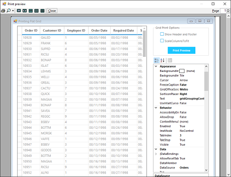

### Customizing Page Breaks
The row breaks and column breaks for each pages can be customized by using the [PrintInfo](https://help.syncfusion.com/cr/windowsforms/Syncfusion.Windows.Forms.Grid.GridControlBase.html#Syncfusion_Windows_Forms_Grid_GridControlBase_PrintInfo) property. This will provide the list of first row index and first column index of each pages while printing.
The below example shows the 30 rows and 5 columns are printed for each pages,


GridPrintDocumentAdv printDocument = new GridPrintDocumentAdv(this.gridGroupingControl1.TableControl);

printDocument.PrintPage += new System.Drawing.Printing.PrintPageEventHandler(pd_PrintPage);

private void pd_PrintPage(object sender, System.Drawing.Printing.PrintPageEventArgs e)
{

  // set the row count need to be printed for each page
  this.gridGroupingControl1.TableControl.PrintInfo.m_awPageFirstRow = new ArrayList();
  this.gridGroupingControl1.TableControl.PrintInfo.m_awPageFirstRow.Add(0);
  this.gridGroupingControl1.TableControl.PrintInfo.m_awPageFirstRow.Add(30);
  this.gridGroupingControl1.TableControl.PrintInfo.m_awPageFirstRow.Add(60);

  // Set the starting column count for each page
  this.gridGroupingControl1.TableControl.PrintInfo.m_awPageFirstCol = new ArrayList();
  this.gridGroupingControl1.TableControl.PrintInfo.m_awPageFirstCol.Add(0);
  this.gridGroupingControl1.TableControl.PrintInfo.m_awPageFirstCol.Add(5);
}



Dim printDocument As New GridPrintDocumentAdv(Me.gridGroupingControl1.TableControl)

AddHandler printDocument.PrintPage, AddressOf pd_PrintPage

Private Sub pd_PrintPage(ByVal sender As Object, ByVal e As System.Drawing.Printing.PrintPageEventArgs)

  ' set the row count need to be printed for each page
  Me.gridGroupingControl1.TableControl.PrintInfo.m_awPageFirstRow = New ArrayList()
  Me.gridGroupingControl1.TableControl.PrintInfo.m_awPageFirstRow.Add(0)
  Me.gridGroupingControl1.TableControl.PrintInfo.m_awPageFirstRow.Add(30)
  Me.gridGroupingControl1.TableControl.PrintInfo.m_awPageFirstRow.Add(60)

  ' Set the starting column count for each page
  Me.gridGroupingControl1.TableControl.PrintInfo.m_awPageFirstCol = New ArrayList()
  Me.gridGroupingControl1.TableControl.PrintInfo.m_awPageFirstCol.Add(0)
  Me.gridGroupingControl1.TableControl.PrintInfo.m_awPageFirstCol.Add(5)
End Sub



### Preventing Page Number Being Displayed
To prevent the page number is being displayed from the print page layout, the [DrawPageNumber](https://help.syncfusion.com/cr/windowsforms/Syncfusion.GridHelperClasses.LayoutSupportHelper.html#Syncfusion_GridHelperClasses_LayoutSupportHelper_DrawPageNumber) event can be used. 


LayoutSupportHelper helper = new LayoutSupportHelper(this.gridGroupingControl1.TableControl);
helper.ShowLayoutLines = true;
helper.DrawPageNumber += new DrawPageNumberEventHandler(helper_DrawPageNumber);

void helper_DrawPageNumber(GridControlBase grid, DrawPageNumberEventArgs e)
{

    if (e.Text == "page 1" || e.Text == "page 2")
    {

        //Canceling the Page number to be displayed
        e.Cancel = true;
    }
}


Dim helper As New LayoutSupportHelper(Me.gridGroupingControl1.TableControl)
helper.ShowLayoutLines = True
AddHandler helper.DrawPageNumber, AddressOf helper_DrawPageNumber

Private Sub helper_DrawPageNumber(ByVal grid As GridControlBase, ByVal e As DrawPageNumberEventArgs)

    If e.Text = "page 1" OrElse e.Text = "page 2" Then

        'Canceling the Page number to be displayed
        e.Cancel = True
    End If
End Sub


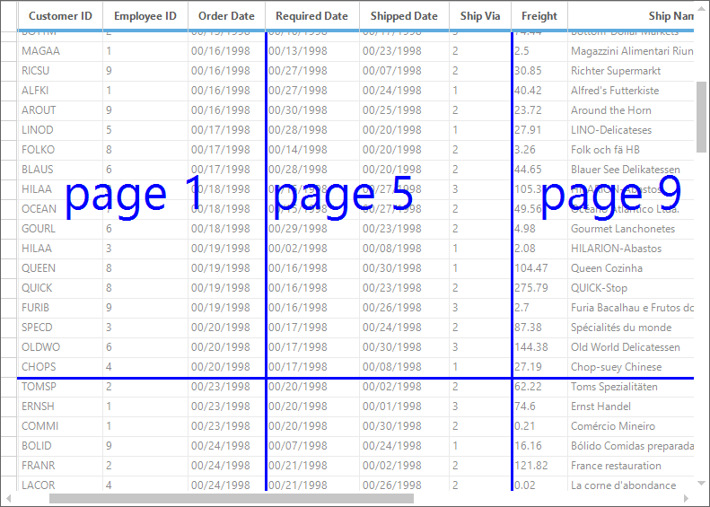

## Printing Customizations
The printing options of the grid can be customized by using the following methods.

### Applying Header Colors While Printing
The cell styles can be changed dynamically on printing the grid by using [PrintingMode](https://help.syncfusion.com/cr/windowsforms/Syncfusion.Windows.Forms.Grid.GridControlBase.html#Syncfusion_Windows_Forms_Grid_GridControlBase_PrintingMode) property. The following code snippet is used to set the header colors for the GridGroupingControl only on the printed document,



//Triggering the QueryCellStyleInfo event
this.gridGroupingControl1.QueryCellStyleInfo += new GridTableCellStyleInfoEventHandler(gridGroupingControl1_QueryCellStyleInfo);

void gridGroupingControl1_QueryCellStyleInfo(object sender, GridTableCellStyleInfoEventArgs e)
{

    if (this.gridGroupingControl1.TableControl.PrintingMode)
    {

        if (e.TableCellIdentity.TableCellType == GridTableCellType.ColumnHeaderCell
            || e.TableCellIdentity.TableCellType == GridTableCellType.RecordRowHeaderCell
            || e.TableCellIdentity.TableCellType == GridTableCellType.AlternateRecordRowHeaderCell)
        {
            e.Style.BackColor = Color.Pink;
        }
    }
}


'Triggering the QueryCellStyleInfo event
Private Me.gridGroupingControl1.QueryCellStyleInfo += New GridTableCellStyleInfoEventHandler(AddressOf gridGroupingControl1_QueryCellStyleInfo)

Private Sub gridGroupingControl1_QueryCellStyleInfo(ByVal sender As Object, ByVal e As GridTableCellStyleInfoEventArgs)

If Me.gridGroupingControl1.TableControl.PrintingMode Then

If e.TableCellIdentity.TableCellType = GridTableCellType.ColumnHeaderCell OrElse e.TableCellIdentity.TableCellType = GridTableCellType.RecordRowHeaderCell OrElse e.TableCellIdentity.TableCellType = GridTableCellType.AlternateRecordRowHeaderCell Then
e.Style.BackColor = Color.Pink
End If
End If
End Sub



### Hiding Row and Column Headers 
To hide the row and column headers while printing or print previewing the grid, set the [PrintRowHeader](https://help.syncfusion.com/cr/windowsforms/Syncfusion.Windows.Forms.Grid.Grouping.GridGroupingControl.html#Syncfusion_Windows_Forms_Grid_Grouping_GridGroupingControl_PrintRowHeader) and [PrintColumnHeader](https://help.syncfusion.com/cr/windowsforms/Syncfusion.Windows.Forms.Grid.Grouping.GridGroupingControl.html#Syncfusion_Windows_Forms_Grid_Grouping_GridGroupingControl_PrintColumnHeader) property values as `false` which are available in the [TableModel](https://help.syncfusion.com/cr/windowsforms/Syncfusion.Windows.Forms.Grid.Grouping.GridGroupingControl.html#Syncfusion_Windows_Forms_Grid_Grouping_GridGroupingControl_TableModel) property.



//Hide Row and column headers while printing the document
this.gridGroupingControl1.TableModel.Properties.PrintRowHeader = false;
this.gridGroupingControl1.TableModel.Properties.PrintColHeader = false;


'Hide Row and column headers while printing the document
Me.gridGroupingControl1.TableModel.Properties.PrintRowHeader = False
Me.gridGroupingControl1.TableModel.Properties.PrintColHeader = False



### Customizing the Print Alignment
The grid can be centered vertically while printing by setting the [CenterVertical](https://help.syncfusion.com/cr/windowsforms/Syncfusion.Windows.Forms.Grid.GridProperties.html#Syncfusion_Windows_Forms_Grid_GridProperties_CenterVertical) property to `true`. The grid can be printed with centered horizontally by enabling the [CenterHorizontal](https://help.syncfusion.com/cr/windowsforms/Syncfusion.Windows.Forms.Grid.GridProperties.html#Syncfusion_Windows_Forms_Grid_GridProperties_CenterHorizontal) property.

This property will disable the default alignment and the alignments can be determined by setting the margins using the [Margins](https://learn.microsoft.com/en-us/dotnet/api/system.drawing.printing.pagesettings.margins?view=dotnet-plat-ext-7.0&viewFallbackFrom=net-5.0) property.



//Specifies if the grid should be centered vertically on printing.
this.gridGroupingControl1.TableModel.Properties.CenterVertical = true;

//Specifies if the grid should be centered horizontally while printing.
this.gridGroupingControl1.TableModel.Properties.CenterHorizontal = true;
GridPrintDocument printDocument = new GridPrintDocument(this.gridGroupingControl1.TableControl);
PrintPreviewDialog previewDialog = new PrintPreviewDialog();

//Setting the Margins
printDocument.DefaultPageSettings.Margins = new Margins(0, 0, 0, 700);
previewDialog.Document = printDocument;
previewDialog.Show();


'Specifies if the grid should be centered vertically on printing.
Me.gridGroupingControl1.TableModel.Properties.CenterVertical = True

'Specifies if the grid should be centered horizontally while printing.
Me.gridGroupingControl1.TableModel.Properties.CenterHorizontal = True
Dim printDocument As New GridPrintDocument(Me.gridGroupingControl1.TableControl)
Dim previewDialog As New PrintPreviewDialog()

'Setting the Margins
printDocument.DefaultPageSettings.Margins = New Margins(0, 0, 0, 700)
previewDialog.Document = printDocument
previewDialog.Show()


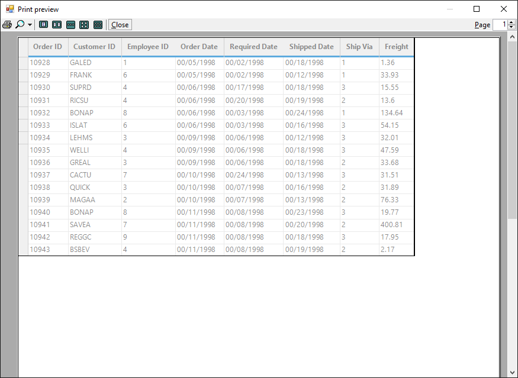

### Hiding Grid Lines While Printing
The horizontal and the vertical lines can be hidden in the printed document by setting the following code snippet,


//To avoid printing the Horizontal and vertical lines
this. gridGroupingControl1.PrintHorizontalLines = false;
this. gridGroupingControl1.PrintVerticalLines = false;


'To avoid printing the Horizontal and vertical lines
Me. gridGroupingControl1.PrintHorizontalLines = False
Me. gridGroupingControl1.PrintVerticalLines = False


### Hiding the Row/columns using Events
To hide some of the rows and columns while printing the grid, set the size of the row height and column width value as zero at the [QueryRowHeight](https://help.syncfusion.com/cr/windowsforms/Syncfusion.Windows.Forms.Grid.GridModel.html#Syncfusion_Windows_Forms_Grid_GridModel_QueryRowHeight) and [QueryColWidth](https://help.syncfusion.com/cr/windowsforms/Syncfusion.Windows.Forms.Grid.GridModel.html#Syncfusion_Windows_Forms_Grid_GridModel_QueryColWidth) events while the grid entered into the [PrintingMode](https://help.syncfusion.com/cr/windowsforms/Syncfusion.Windows.Forms.Grid.GridControlBase.html#Syncfusion_Windows_Forms_Grid_GridControlBase_PrintingMode).


// Triggering the QueryRowHeight event
this.gridGroupingControl1.TableModel.QueryRowHeight += new GridRowColSizeEventHandler(TableModel_QueryRowHeight);

// Triggering the QueryColWidth event
this.gridGroupingControl1.TableModel.QueryColWidth += new GridRowColSizeEventHandler(TableModel_QueryColWidth);

void TableModel_QueryColWidth(object sender, GridRowColSizeEventArgs e)
{

  //Apply the condition only on printing

  if (this.gridGroupingControl1.TableControl.PrintingMode)
  {

    if (e.Index == 3 || e.Index == 4)
    {

      //Set the row height value as zero while the Grid in printing mode
      e.Size = 0;
      e.Handled = true;
    }
  }
}

void TableModel_QueryRowHeight(object sender, GridRowColSizeEventArgs e)
{

   //Apply the condition only on printing

   if (this.gridGroupingControl1.TableControl.PrintingMode)
   {

     if (e.Index == 8)
     {

        //Set the row height value as zero while the Grid in printing mode
        e.Size = 0;
        e.Handled = true;
     }
  }
}


' Triggering the QueryRowHeight event

Private Me.gridGroupingControl1.TableModel.QueryRowHeight += New GridRowColSizeEventHandler(AddressOf TableModel_QueryRowHeight)

' Triggering the QueryColWidth event

Private Me.gridGroupingControl1.TableModel.QueryColWidth += New GridRowColSizeEventHandler(AddressOf TableModel_QueryColWidth)

Private Sub TableModel_QueryColWidth(ByVal sender As Object, ByVal e As GridRowColSizeEventArgs)

  'Apply the condition only on printing

  If Me.gridGroupingControl1.TableControl.PrintingMode Then

    If e.Index = 3 OrElse e.Index = 4 Then

      'Set the row height value as zero while the Grid in printing mode
      e.Size = 0
      e.Handled = True
    End If
  End If
End Sub

Private Sub TableModel_QueryRowHeight(ByVal sender As Object, ByVal e As GridRowColSizeEventArgs)

   'Apply the condition only on printing

   If Me.gridGroupingControl1.TableControl.PrintingMode Then

     If e.Index = 8 Then

        'Set the row height value as zero while the Grid in printing mode
        e.Size = 0
        e.Handled = True
     End If
   End If
End Sub




### Print the selected range of the cells 
To print only the selected range of cells from the grid, set the [PrintRange](https://learn.microsoft.com/en-us/dotnet/api/system.drawing.printing.printrange?view=dotnet-plat-ext-7.0&viewFallbackFrom=net-5.0) value as `Selection`. It will print the selected range of cells or the selected page from the GridGroupingControl. 

This will only print the selected range which is enabled by the [AllowSelection](https://help.syncfusion.com/cr/windowsforms/Syncfusion.Windows.Forms.Grid.Grouping.GridTableOptionsStyleInfo.html#Syncfusion_Windows_Forms_Grid_Grouping_GridTableOptionsStyleInfo_AllowSelection) property. So It will not print the selected ranges which is enabled by the[ListBoxSelectionMode](https://help.syncfusion.com/cr/windowsforms/Syncfusion.Windows.Forms.Grid.Grouping.GridTableOptionsStyleInfo.html#Syncfusion_Windows_Forms_Grid_Grouping_GridTableOptionsStyleInfo_ListBoxSelectionMode) selection.



//Enabling the AllowSelection type selection
this.gridGroupingControl1.TableOptions.AllowSelection = GridSelectionFlags.Any;
GridPrintDocument gridPrintDocument = new GridPrintDocument(this.gridGroupingControl1.TableControl, true);

//To print the selected range of cells
gridPrintDocument.PrinterSettings.PrintRange = System.Drawing.Printing.PrintRange.Selection;


'Enabling the AllowSelection type selection
Me.gridGroupingControl1.TableOptions.AllowSelection = GridSelectionFlags.Any
Dim gridPrintDocument As New GridPrintDocument(Me.gridGroupingControl1.TableControl, True)

'To print the selected range of cells
gridPrintDocument.PrinterSettings.PrintRange = System.Drawing.Printing.PrintRange.Selection



The `PrintRange` enumeration has the following printing options,

**AllPages –**Used to print all the pages of the Grid 
**CurrentPage –**Used to print the Current page 
**Selection –**Used to print the selected range of cells 
**SomePages –**Used to print particular range of pages. 

N> By default the [PrintRange](https://learn.microsoft.com/en-us/dotnet/api/system.drawing.printing.printrange?view=dotnet-plat-ext-7.0&viewFallbackFrom=net-5.0) will be pointed to `AllPages`, so that the print method will print all the pages of the grid.

### Printing needed pages alone
The needed pages in the grid can only be printed by setting the [PrintRange](https://learn.microsoft.com/en-us/dotnet/api/system.drawing.printing.printrange?view=dotnet-plat-ext-7.0&viewFallbackFrom=net-5.0) property value as `SomePages`.



GridPrintDocument gridPrintDocument = new GridPrintDocument(this. gridGroupingControl1.TableControl, true);
PrintPreviewDialog printPreviewDialog = new PrintPreviewDialog();
printPreviewDialog.Document = gridPrintDocument;

//To print the specific range of pages
gridPrintDocument.PrinterSettings.FromPage = 2;
gridPrintDocument.PrinterSettings.ToPage = 3;
gridPrintDocument.PrinterSettings.PrintRange = System.Drawing.Printing.PrintRange.SomePages;
printPreviewDialog.ShowDialog();


Dim gridPrintDocument As New GridPrintDocument(Me.gridGroupingControl1.TableControl, True)
Dim printPreviewDialog As New PrintPreviewDialog()
printPreviewDialog.Document = gridPrintDocument

'To print the specific range of pages
gridPrintDocument.PrinterSettings.FromPage = 2
gridPrintDocument.PrinterSettings.ToPage = 3
gridPrintDocument.PrinterSettings.PrintRange = System.Drawing.Printing.PrintRange.SomePages
printPreviewDialog.ShowDialog()



## Deriving GridPrintDocument 
The [GridPrintDocument](https://help.syncfusion.com/cr/windowsforms/Syncfusion.Windows.Forms.Grid.GridPrintDocument.html) has the events [BeginPrint](https://help.syncfusion.com/cr/windowsforms/Syncfusion.Windows.Forms.Grid.GridPrintDocument.html), [PrintPage](https://help.syncfusion.com/cr/windowsforms/Syncfusion.Windows.Forms.Grid.GridPrintDocument.html) and [EndPrint](https://help.syncfusion.com/cr/windowsforms/Syncfusion.Windows.Forms.Grid.GridPrintDocument.html) inherited from `PrintDocument`, which allows to access the printing flow at certain points. To gain more control over the printing document, derive the `GridPrintDocument` and override the members like `OnPrintPage`. Using this overrides, the [ViewLayout](https://help.syncfusion.com/cr/windowsforms/Syncfusion.Windows.Forms.Grid.GridControlBase.html#Syncfusion_Windows_Forms_Grid_GridControlBase_ViewLayout) and [TopRowIndex](https://help.syncfusion.com/cr/windowsforms/Syncfusion.Windows.Forms.Grid.GridControlBase.html#Syncfusion_Windows_Forms_Grid_GridControlBase_TopRowIndex) of the grid members can be accessed to obtain the information about the page that is being printed. 

The following code shows how to print the header and footer with each page count,



public class GridPrintAtLocDocument : GridPrintDocument
{
   private GridControlBase _grid;
   private int headerHeight;
   private int footerHeight;
   private int pageNo;

   public GridPrintAtLocDocument(GridControlBase grid, bool printPreview) :
               base(grid, printPreview)
   {
      _grid = grid;
        headerHeight = 50;
        footerHeight = 20;
      int left = this.DefaultPageSettings.Margins.Left;
      int top = (this.DefaultPageSettings.Margins.Top + headerHeight);

      // 50 lower
      int right = this.DefaultPageSettings.Margins.Right;
      int bottom = this.DefaultPageSettings.Margins.Bottom;
      this.DefaultPageSettings.Margins = new Margins(left, right, top, bottom);
      pageNo = 1;
   }

   protected override void OnPrintPage(System.Drawing.Printing.PrintPageEventArgs e)
   {
       base.OnPrintPage(e);

       // compute the position of the header
       float x = float.Parse(this.DefaultPageSettings.Bounds.X);
       float y = (float.Parse(this.DefaultPageSettings.Margins.Top) - (headerHeight - 30));
       float w = float.Parse(this.DefaultPageSettings.Bounds.Width);
       float h = (float.Parse(headerHeight) + 30);

       // setup the alignment
       StringFormat format = new StringFormat();
       format.LineAlignment = StringAlignment.Center;
       format.Alignment = StringAlignment.Center;

       // define the header text and draw it
       string text = string.Format("Header Text {0}", pageNo);
       Font font = new Font(_grid.Font.Name, 30);
       e.Graphics.DrawString(text, font, Brushes.Black, new RectangleF(x, y, w, h), format);

       // position the footer; align the footer ; print the footer
       y = float.Parse((this.DefaultPageSettings.Bounds.Top + (this.DefaultPageSettings.Bounds.Height - footerHeight)));
       h = float.Parse(footerHeight);
       format.Alignment = StringAlignment.Center;

       //  Gets the page No. with the Maximum Page
       text = string.Format("Footer Text {0} of {1}", pageNo, this.PrinterSettings.MaximumPage);
       font = new Font(_grid.Font.Name, 10);
       e.Graphics.DrawString(text, font, Brushes.Black, new RectangleF(x, y, w, h), format);
       pageNo++;
   }
}


Public Class GridPrintAtLocDocument
    Inherits GridPrintDocument
    Private _grid As GridControlBase
    Private headerHeight As Integer
    Private footerHeight As Integer
    Private pageNo As Integer

    Public Sub New(ByVal grid As GridControlBase, ByVal printPreview As Boolean)
        MyBase.New(grid, printPreview)
        _grid = grid
        headerHeight = 50
        footerHeight = 20
        Dim left As Integer = Me.DefaultPageSettings.Margins.Left
        Dim top As Integer = (Me.DefaultPageSettings.Margins.Top + headerHeight)

        ' 50 lower
        Dim right As Integer = Me.DefaultPageSettings.Margins.Right
        Dim bottom As Integer = Me.DefaultPageSettings.Margins.Bottom
        Me.DefaultPageSettings.Margins = New Margins(left, right, top, bottom)
        pageNo = 1
    End Sub

    Protected Overrides Sub OnPrintPage(ByVal e As System.Drawing.Printing.PrintPageEventArgs)
        MyBase.OnPrintPage(e)

        ' compute the position of the header
        Dim x As Single = Single.Parse(Me.DefaultPageSettings.Bounds.X)
        Dim y As Single = (Single.Parse(Me.DefaultPageSettings.Margins.Top) - (headerHeight - 30))
        Dim w As Single = Single.Parse(Me.DefaultPageSettings.Bounds.Width)
        Dim h As Single = (Single.Parse(headerHeight) + 30)

        ' setup the alignment
        Dim format As New StringFormat()
        format.LineAlignment = StringAlignment.Center
        format.Alignment = StringAlignment.Center

        ' define the header text and draw it
        Dim text As String = String.Format("Header Text {0}", pageNo)
        Dim font As New Font(_grid.Font.Name, 30)
        e.Graphics.DrawString(text, font, Brushes.Black, New RectangleF(x, y, w, h), format)

        ' position the footer; align the footer ; print the footer
        y = Single.Parse((Me.DefaultPageSettings.Bounds.Top + (Me.DefaultPageSettings.Bounds.Height - footerHeight)))
        h = Single.Parse(footerHeight)
        format.Alignment = StringAlignment.Center

        '  Gets the page No. with the Maximum Page
        text = String.Format("Footer Text {0} of {1}", pageNo, Me.PrinterSettings.MaximumPage)
        font = New Font(_grid.Font.Name, 10)
        e.Graphics.DrawString(text, font, Brushes.Black, New RectangleF(x, y, w, h), format)
        pageNo += 1
    End Sub
End Class



