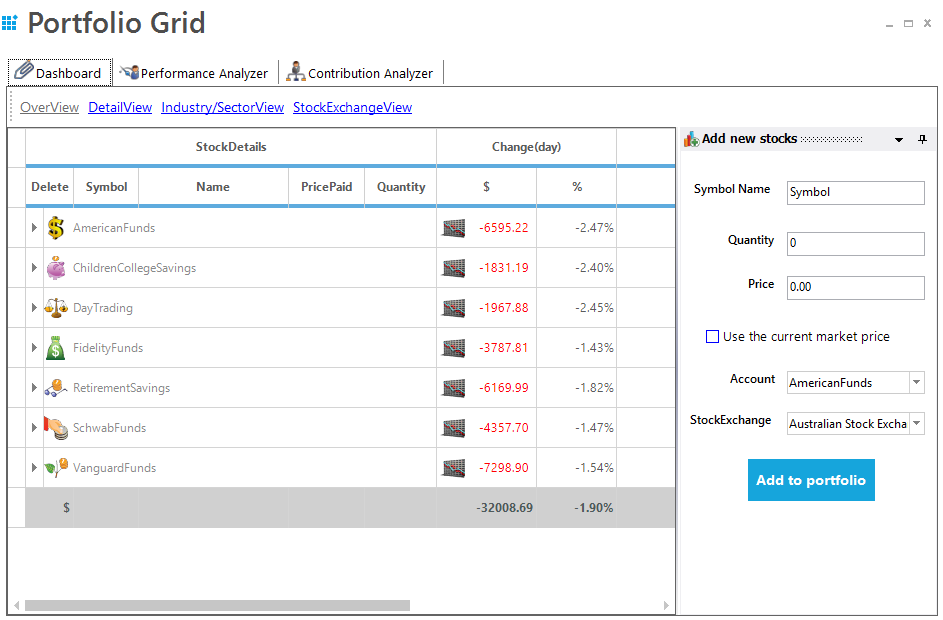
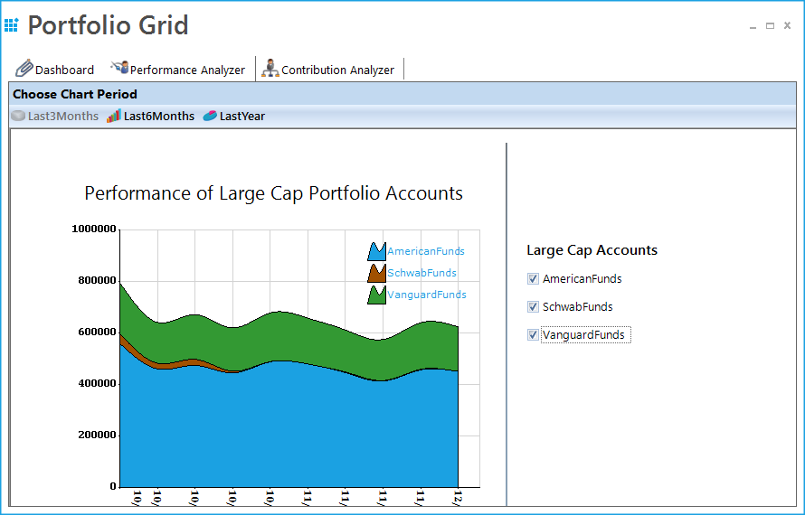
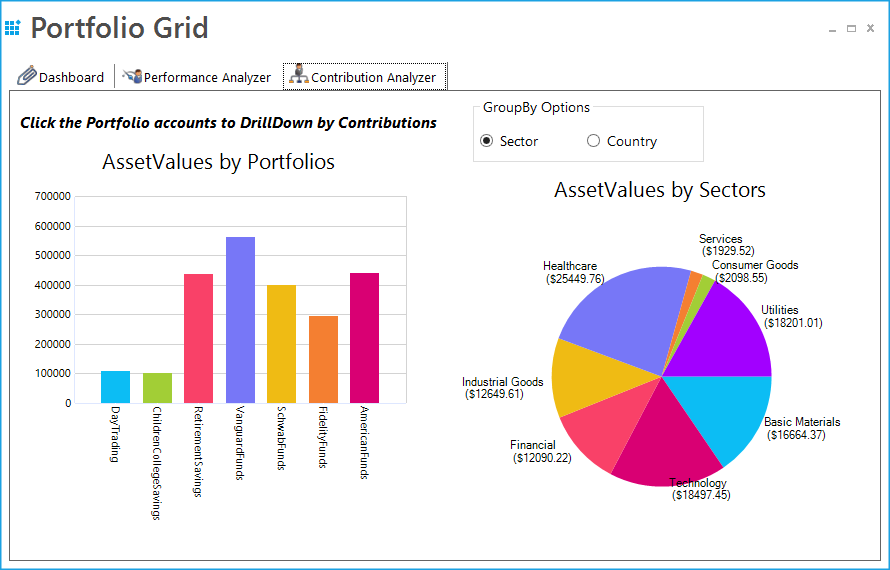
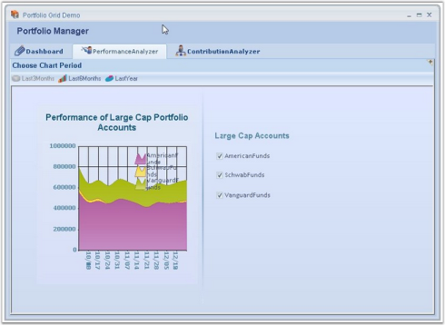
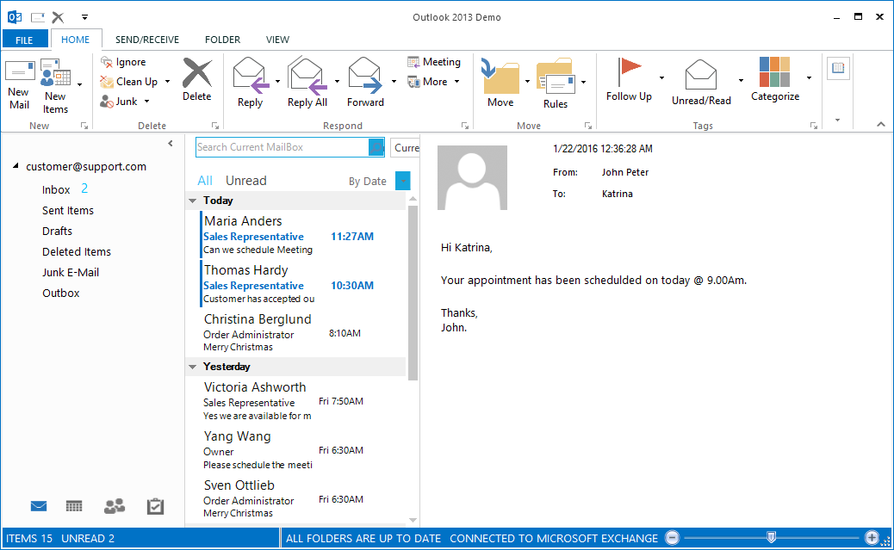
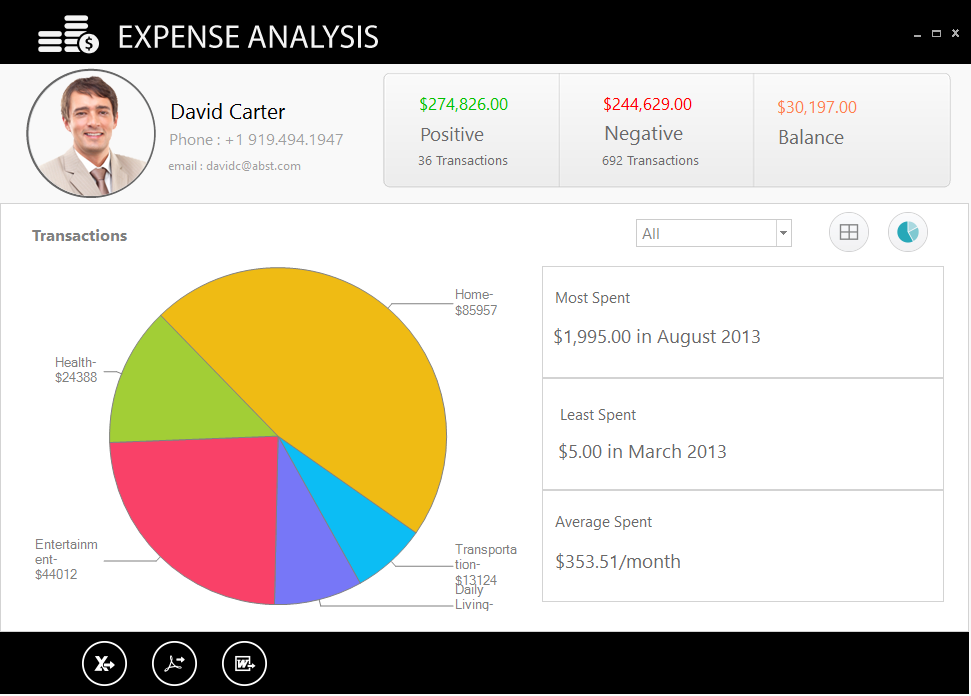
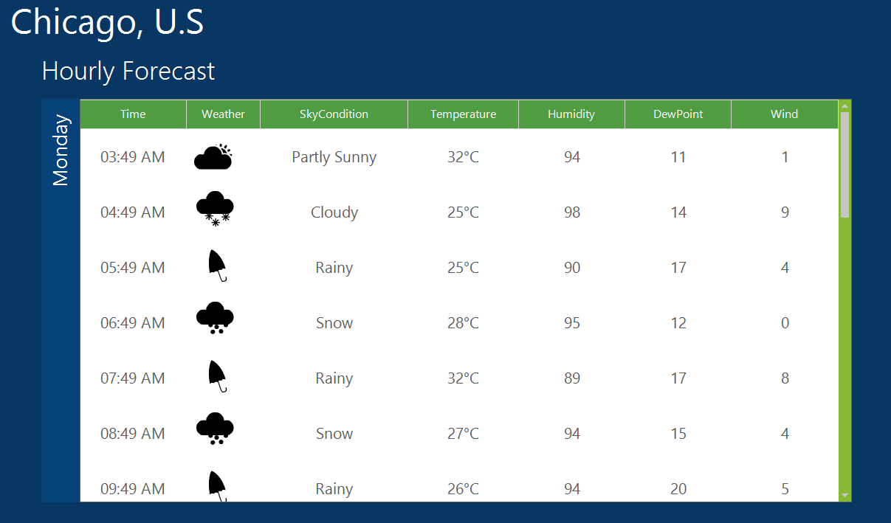
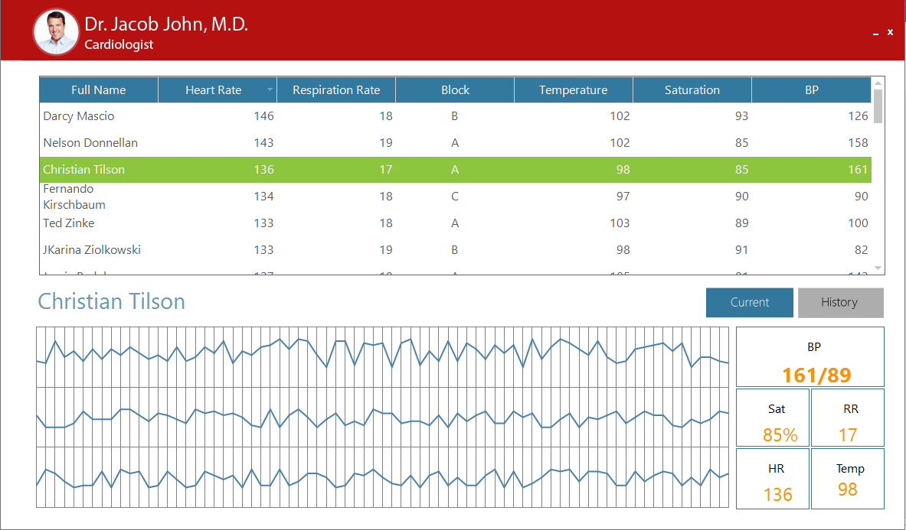

# Real Time Applications in Windows Forms GridGrouping
The GridGroupingControl can be used in any of the `Real Time application` which needs the database maintenance or other kind of data representations. The GridGroupingControl can be used at any level to represent the data. 

## Portfolio Grid
The user can simulate Portfolio Manager Application by using GridGroupingControl. It allows the user to track all his investments and assets in stocks and mutual funds. It provides an insight on current market pricing which helps to plan future investments.

N> For more details, refer to the following dashboard sample: &lt;Installed_Location&gt;\Syncfusion\EssentialStudio\&lt;Version_Number&gt;\Windows\Grid.Grouping.Windows\Samples\Product Showcase\Portfolio Grid

The Portfolio manager application consists of following three modules. They are,

* Dashboard
* Performance Analyzer
* Contribution Analyzer

### Dashboard
Dashboard is the place where the user can track the status of all his investments. There are four parts in dashboard which helps the user to identify the data easily. 

* **Overview** - Provides a consolidated view of mutual fund holdings. The user can get useful information on the investments such as rate of change per day, current market price, total returns etc. 
* **Details View** - Provides a more detailed view, allowing the user to get the stock details of mutual funds. 
* **Industry/Sector View**- Provides a consolidated view of the users stock holdings. 
* **Stock Exchange View** – This will display the details with respect to individual stock exchange. 

### Performance Analyzer
Performance Analyzer is another module which does a performance analysis and displays the market history for the top three large cap accounts. You have options to view the history for last three months, last six months, and last year.

### Contribution Analyzer
Contribution Analyzer is a module which illustrates the contributions of different stocks for every portfolio account in a graphical representation by using chart controls. Click the desired portfolio account on the left side chart to view its contributions.

## Outlook Demo
Microsoft Outlook UI can be implemented by using GridGroupingControl and other Syncfusion® controls like RibbonControl etc. The themes can also be changed as per the user requirement. 

GridGroupingControl supports all Office 2007, Office2010 and Metro (Office 2013) related look and feel. Some of the major features available in MS Outlook has been given in this real time application.

### Outlook 2007
The Outlook 2007 look and feel can also be implemented with the GridGroupingControl. 

N> For more details, refer to the following dashboard sample: &lt;Installed_Location&gt;\Syncfusion\EssentialStudio\&lt;Version_Number&gt;\Grid.Grouping.Windows\Samples\Product Showcase\Outlook Demo

### Outlook 2013
The Outlook 2013 look and feel can be customized using GridGroupingControl. The GridGroupingControl has the built-in theme support named as `Metro` which provides the Office 2013 look and feel. 

N> For more details, refer to the following dashboard sample: &lt;Installed_Location&gt;\Syncfusion\EssentialStudio\&lt;Version_Number&gt;\Windows\Showcase\Outlook Demo\

The following customizations are implemented in both the application,

* Office 2007 and 2013 theme 
* The grouping of columns in the mails display area. Right click on the column headers and select `ArrangeBy` in the column. 
* Custom selection navigation with all arrow keys. 
* Custom grouping for dates, size, priority, and flag fields. 
* Dynamic formatting when narrowly switching between column-set view and normal view. 
* Events when deleting records. 
* Customized current view. 
* Outlook appearance and functionalities. 

## Expense Analysis
Users can maintain their expenses and its analysis details using the GridGroupingControl. The details can be easily analyzed and the details can be exported to Excel, PDF or Word files. 

The `Expense Analysis` application has the following modules,

* Grid View Analysis 
* Chart View Analysis 
* Exporting 

### Grid View Analysis
User can view the details of their in the GridGroupingControl. In this view, the details like Date, Category, Sub-Category, Description etc., can be viewed.

### Chart View Analysis
User can view the details of their in the chart format. The individual contribution of expenses can be viewed in this format.

### Exporting
The expense analysis details can be exported to Excel, PDF, or Word files. The data can be exported along with the images and templates.

N> For more details, refer to the following dashboard sample: &lt;Installed_Location&gt;\Syncfusion\EssentialStudio\&lt;Version_Number&gt;\Windows\Showcase\Expense Analysis Demo

## Weather Analysis
The weather analysis application can be simulated using GridGroupingControl. The weather details can be simulated with animation in the GridGroupingControl. 

The GridGroupingControl allows an user to implement the animation icons wherever it needs. 

N> For more details, refer to the following dashboard sample: &lt;Installed_Location&gt;\Syncfusion\EssentialStudio\&lt;Version_Number&gt;\Windows\Showcase\Weather Analysis Demo

## Trader Grid Test
The financial instruments like stocks, bonds, commodities and derivatives are requiring frequent update of data in real time. GridGroupingControl supports the frequent data update without compromising on performance.

The GridGroupingControl supports grouping, filtering, sorting and coloring on real time.

N> For more details, refer to the following dashboard sample: &lt;Installed_Location&gt;\Syncfusion\EssentialStudio\&lt;Version_Number&gt;\Windows\Showcase\Grouping Trader Grid Test Demo

## Patient monitoring
The `Patient Monitoring Application` allows user to monitor or track the health details of the patient. In this application, the GridGroupingControl can be used to display the details of the patient.

N> For more details, refer to the following dashboard sample: &lt;Installed_Location&gt;\Syncfusion\EssentialStudio\&lt;Version_Number&gt;\Windows\Showcase\PatientMonitoringDemo
