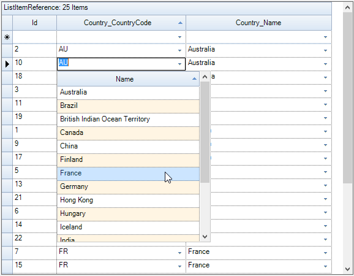
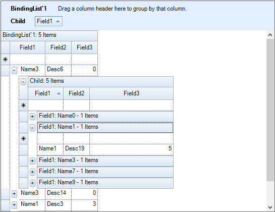

# Relations and Hierarchy in Windows Forms GridGrouping
GridGroupingControl can display nested tables in a hierarchy using master-detail configuration. In a hierarchical view, all the tables in the data source are inter-connected via relations. Generally a relation between any two tables can take any of the following forms: `1:1`, `1:n`, `n:1` or `n:n`.

A GridGroupingControl can automatically detect [DataRelations](https://learn.microsoft.com/en-us/dotnet/framework/data/adonet/dataset-datatable-dataview/adding-datarelations) in a [dataset](https://learn.microsoft.com/en-us/dotnet/api/system.data.dataset?view=net-5.0) for display. By default, `Relation` is created for each relation found in dataset. Hence, the data relations defined in a dataset are sufficient enough for the grid to form relations. No additional code is required in this case.

With nested tables, each record in the parent table will have an associated set of records in the child table. Every record in the relation is provided with a `+/-` button called `RecordPlusMinus` that can be expanded (as well as collapsed) to bring the underlying records in the child table into view. The number of tables that can be nested with relations using a grid is `unlimited`.

## Adding Relations
The relations of the table can be defined by adding it to the [TableDescriptor.Relations](https://help.syncfusion.com/cr/windowsforms/Syncfusion.Windows.Forms.Grid.Grouping.GridTableDescriptor.html#Syncfusion_Windows_Forms_Grid_Grouping_GridTableDescriptor_Relations) collection. By default the GridGroupingControl will create a relation (RelatedMasterDetails) for each `DataRelation` found in a `DataSet`. Relations can either be related foreign key tables or nested child tables that can be expanded and collapsed. Each entry in this collection is owned by[RelationDescriptor](https://help.syncfusion.com/cr/windowsforms/Syncfusion.Windows.Forms.Grid.Grouping.GridRelationDescriptor.html) that stores details of a relation. All the `RelationDescriptors` for a given table is managed by RelationDescriptor Collection which is returned by `TableDescriptor.Relations` property.

[TableDescriptor.RelationChildColumns](https://help.syncfusion.com/cr/windowsforms/Syncfusion.Windows.Forms.Grid.Grouping.GridTableDescriptor.html) collection is internally initialized and contains child key fields of the [RelationDescriptor.RelationKeys](https://help.syncfusion.com/cr/windowsforms/Syncfusion.Windows.Forms.Grid.Grouping.GridRelationDescriptor.html) collection of a [RelationKind.RelatedMasterDetails](https://help.syncfusion.com/cr/windowsforms/Syncfusion.Windows.Forms.Grid.Grouping.GridRelationDescriptor.html) relation. You should not modify this collection.
[TableDescriptor.PrimaryKeyColumns](https://help.syncfusion.com/cr/windowsforms/Syncfusion.Windows.Forms.Grid.Grouping.GridTableDescriptor.html) collection defines fields that form a unique primary key for the table. By default, `PrimaryKeyColumns` collection is initialized from the child key fields of the `RelationDescriptor.RelationKeys` collection of a `RelationKind.ForeignKeyReference` relation. If the table is not a foreign table and `UniqueConstraint` for a data table is present, the collection is initialized with fields from that `UniqueConstraint`. Users can also manually modify the collection. If the table is the foreign table of a `RelationKind.ForeignKeyReference` relation, the parent table uses the fields that are defined in the `PrimaryKeyColumns` collection to look-up and identify records in the foreign table.

### Adding Relations through Designer
After binding the hierarchical dataset to the grid, user could find that [TableDescriptor.Relations](https://help.syncfusion.com/cr/windowsforms/Syncfusion.Windows.Forms.Grid.Grouping.GridTableDescriptor.html#Syncfusion_Windows_Forms_Grid_Grouping_GridTableDescriptor_Relations) collection is populated with values. These values represent the relationship between the parent and child tables.

The following [GridRelationDescriptor](https://help.syncfusion.com/cr/windowsforms/Syncfusion.Windows.Forms.Grid.Grouping.GridRelationDescriptor.html) properties are used to set up the relations in GridGroupingControl.

**Name**                 - Specifies the relation name. 
**ChildTableName**       - Specifies the name of the ChildTable. 
**RelationKeys**         - Defines the mapping between the parent and child columns in a master-detail relation. 
**MappingName**          - Specifies the name of the PropertyDescriptor in the parent table that contains the details about the relation. 
**RelationKind**         - Specifies the type of the relation. This options includes the follows.RelatedMasterDetails, ForeignKeyReference, ForeignKey KeyWords, UniformChildList, ListItemReference. 
**AllowCacheChildList**  - Indicates whether the ChildList associated with a view can be cached. Used with UniformChildList relation. 
**ChildTableDescriptor** - Specifies the table schema of Child Table. 

## Supported Relations

The following are the types of relations supported by the GridGroupingControl,

* [RelatedMasterDetails](#related-master-details)
* [ForeignKey Reference](#foreign-key-reference)
* [ForeignKey KeyWords](#foreignkey-keywords-relation)
* [ListItem Reference](#list-item-reference)
* [UniformChildList](#uniform-child-list)

### Related Master Details Relation
It is a Master-Details relation where matching keys in a columns of the parent and child tables define a relationship between two tables. This is a `1:n` relation where each record in the child table can only belong to one parent record.

This section demonstrates how to manually specify master-detail relations between three independent tables that have primary key and foreign key column in common.

1. Setup three data tables that have primary and foreign key columns in common.



private int numberParentRows = 5;
private int numberChildRows = 20;
private int numberGrandChildRows = 50;

//Creates Parent Table.

private DataTable GetParentTable()
{
    DataTable dataTable = new DataTable("ParentTable");
    dataTable.Columns.Add(new DataColumn("parentID"));
    dataTable.Columns.Add(new DataColumn("ParentName"));
    dataTable.Columns.Add(new DataColumn("ParentDec"));

    for (int i = 0; i < numberParentRows; i++)
    {
        DataRow dataRow = dataTable.NewRow();
        dataRow[0] = i;
        dataRow[1] = string.Format("parentName{0}", i);
        dataRow[1] = string.Format("parentName{0}", i);
        dataTable.Rows.Add(dataRow);
    }
    return dataTable;
}

//Creates Child Table.

private DataTable GetChildTable()
{
    DataTable dataTable = new DataTable("ChildTable");
    dataTable.Columns.Add(new DataColumn("childID"));
    dataTable.Columns.Add(new DataColumn("Name"));
    dataTable.Columns.Add(new DataColumn("ParentID"));

    for (int i = 0; i < numberChildRows; i++)
    {
        DataRow dataRow = dataTable.NewRow();
        dataRow[0] = i.ToString();
        dataRow[1] = string.Format("ChildName{0}", i);
        dataRow[2] = (i % numberParentRows).ToString();

        dataTable.Rows.Add(dataRow);
    }
    return dataTable;
}

//Creates Grand Child Table.
private DataTable GetGrandChildTable()
{
    DataTable dataTable = new DataTable("GrandChildTable");
    dataTable.Columns.Add(new DataColumn("GrandChildID"));
    dataTable.Columns.Add(new DataColumn("Name"));
    dataTable.Columns.Add(new DataColumn("ChildID"));

    for (int i = 0; i < numberGrandChildRows; i++)
    {
        DataRow dataRow = dataTable.NewRow();
        dataRow[0] = i.ToString();
        dataRow[1] = string.Format("GrandChildName{0}", i);
        dataRow[2] = (i % numberChildRows).ToString();
        dataTable.Rows.Add(dataRow);
    }
    return dataTable;
}


Private numberParentRows As Integer = 5
Private numberChildRows As Integer = 20
Private numberGrandChildRows As Integer = 50

'Creates Parent Table.

Private Function GetParentTable() As DataTable
    Dim dataTable As New DataTable("ParentTable")
    dataTable.Columns.Add(New DataColumn("parentID"))
    dataTable.Columns.Add(New DataColumn("ParentName"))
    dataTable.Columns.Add(New DataColumn("ParentDec"))

    For i As Integer = 0 To numberParentRows - 1
        Dim dataRow As DataRow = dataTable.NewRow()
        dataRow(0) = i
        dataRow(1) = String.Format("parentName{0}", i)
        dataRow(1) = String.Format("parentName{0}", i)
        dataTable.Rows.Add(dataRow)
    Next i
    Return dataTable
End Function

'Creates Child Table.

Private Function GetChildTable() As DataTable
    Dim dataTable As New DataTable("ChildTable")
    dataTable.Columns.Add(New DataColumn("childID"))
    dataTable.Columns.Add(New DataColumn("Name"))
    dataTable.Columns.Add(New DataColumn("ParentID"))

    For i As Integer = 0 To numberChildRows - 1
        Dim dataRow As DataRow = dataTable.NewRow()
        dataRow(0) = i.ToString()
        dataRow(1) = String.Format("ChildName{0}", i)
        dataRow(2) = (i Mod numberParentRows).ToString()

        dataTable.Rows.Add(dataRow)
    Next i
    Return dataTable
End Function

'Creates Grand Child Table.

Private Function GetGrandChildTable() As DataTable
    Dim dataTable As New DataTable("GrandChildTable")
    dataTable.Columns.Add(New DataColumn("GrandChildID"))
    dataTable.Columns.Add(New DataColumn("Name"))
    dataTable.Columns.Add(New DataColumn("ChildID"))

    For i As Integer = 0 To numberGrandChildRows - 1
        Dim dataRow As DataRow = dataTable.NewRow()
        dataRow(0) = i.ToString()
        dataRow(1) = String.Format("GrandChildName{0}", i)
        dataRow(2) = (i Mod numberChildRows).ToString()
        dataTable.Rows.Add(dataRow)
    Next i
    Return dataTable
End Function



{{ codesnippet1 | OrderList_Indent_Level_1 }}

2. Manually set up relationships between tables and add relation to the parent and child tables.



DataTable parentTable = GetParentTable();
DataTable childTable = GetChildTable();
DataTable grandChildTable = GetGrandChildTable();
GridRelationDescriptor parentToChildRelationDescriptor = new GridRelationDescriptor();

//Same as SourceListSetEntry.Name for Child Table.
parentToChildRelationDescriptor.ChildTableName = "MyChildTable";
parentToChildRelationDescriptor.RelationKind = RelationKind.RelatedMasterDetails;
parentToChildRelationDescriptor.RelationKeys.Add("parentID", "ParentID");

//Adds relation to Parent Table.
gridGroupingControl1.TableDescriptor.Relations.Add(parentToChildRelationDescriptor);
GridRelationDescriptor childToGrandChildRelationDescriptor = new GridRelationDescriptor();

//Same as SourceListSetEntry.Name for Grand Child Table.
childToGrandChildRelationDescriptor.ChildTableName = "MyGrandChildTable";
childToGrandChildRelationDescriptor.RelationKind = RelationKind.RelatedMasterDetails;
childToGrandChildRelationDescriptor.RelationKeys.Add("childID", "ChildID");

//Adds relation to Child Table.
parentToChildRelationDescriptor.ChildTableDescriptor.Relations.Add(childToGrandChildRelationDescriptor);


Dim parentTable As DataTable = GetParentTable()
Dim childTable As DataTable = GetChildTable()
Dim grandChildTable As DataTable = GetGrandChildTable()

Dim parentToChildRelationDescriptor As New GridRelationDescriptor()

'Same as SourceListSetEntry.Name for Child Table.
parentToChildRelationDescriptor.ChildTableName = "MyChildTable"
parentToChildRelationDescriptor.RelationKind = RelationKind.RelatedMasterDetails
parentToChildRelationDescriptor.RelationKeys.Add("parentID", "ParentID")

'Adds relation to Parent Table.
gridGroupingControl1.TableDescriptor.Relations.Add(parentToChildRelationDescriptor)
Dim childToGrandChildRelationDescriptor As New GridRelationDescriptor()

'Same as SourceListSetEntry.Name for Grand Child Table.
childToGrandChildRelationDescriptor.ChildTableName = "MyGrandChildTable"
childToGrandChildRelationDescriptor.RelationKind = RelationKind.RelatedMasterDetails
childToGrandChildRelationDescriptor.RelationKeys.Add("childID", "ChildID")

'Adds relation to Child Table.
parentToChildRelationDescriptor.ChildTableDescriptor.Relations.Add(childToGrandChildRelationDescriptor)



{{ codesnippet2 | OrderList_Indent_Level_1 }}

3. Register the data tables with[Engine.SourceListSet](https://help.syncfusion.com/cr/windowsforms/Syncfusion.Windows.Forms.Grid.Grouping.GridEngine.html) so that [RelationDescriptor](https://help.syncfusion.com/cr/windowsforms/Syncfusion.Windows.Forms.Grid.Grouping.GridRelationDescriptor.html) can resolve the name. 



// Register any DataTable/IList with SourceListSet, so that RelationDescriptor can resolve the name
this.gridGroupingControl1.Engine.SourceListSet.Add("MyParentTable", parentTable);
this.gridGroupingControl1.Engine.SourceListSet.Add("MyChildTable", childTable);
this.gridGroupingControl1.Engine.SourceListSet.Add("MyGrandChildTable", grandChildTable);


' Register any DataTable/IList with SourceListSet, so that RelationDescriptor can resolve the name
Me.gridGroupingControl1.Engine.SourceListSet.Add("MyParentTable", parentTable)
Me.gridGroupingControl1.Engine.SourceListSet.Add("MyChildTable", childTable)
Me.gridGroupingControl1.Engine.SourceListSet.Add("MyGrandChildTable", grandChildTable)



{{ codesnippet3 | OrderList_Indent_Level_1 }}

4. Finally, bind hierarchical data source, which has been created through the above steps to a grid by assigning parent table to the data source.



this.gridGroupingControl1.DataSource = parentTable;


Me.gridGroupingControl1.DataSource = parentTable



{{ codesnippet4 | OrderList_Indent_Level_1 }}

While running the sample the tables are connected with Master-Details relation as of follows,

**Sample Location:**
&lt;Installed_Location&gt;\Syncfusion\EssentialStudio[Version_Number]\Windows\Windows\Grid.Grouping.Windows\Samples\
Relation And Hierarchy\Related Master Details Demo

### Foreign Key Reference Relation
It is a foreign-key relation for looking up values where an id column in the main table can be used to look up a record in a related table. This is an `n:1` relation where multiple records in the parent table can reference the same record in the related table. Fields in the related table can be referenced using a `.` dot in the [FieldDescriptor.MappingName](https://help.syncfusion.com/cr/windowsforms/Syncfusion.Windows.Forms.Grid.Grouping.GridColumnDescriptor.html#Syncfusion_Windows_Forms_Grid_Grouping_GridColumnDescriptor_MappingName) of the main table.

#### Creating Foreign Key Reference 
This section sets up a foreign key reference relation between data table and the collection `USStates`. Data table represents parent table of the relation and `USStates` collection serves as the related child list wherein the values can be looked up using a key. The collection derives from `ArrayList` in which every item is an `USState `object having two properties named `Key` and `Name`. It also defines a method named `CreateDefaultCollection` that returns an instance of itself populated with a set of values.

A foreign key reference relation can be set up between the lists by defining a relation descriptor with its attributes carrying the relation details and adding this descriptor to the Relations collection of the main table.

The following steps demonstrate this process.

1. Create a collection named `USStates` in which each entry stores `USState` object.



//US States Collection.
[Serializable]

public class USStatesCollection : ArrayList
{

    public new USState this[int index]
    {
        get
        {
            return (USState)base[index];
        }
        set
        {
            base[index] = value;
        }
    }

    public static USStatesCollection CreateDefaultCollection()
    {
        USStatesCollection states = new USStatesCollection();
        states.Add(new USState("AL", "Alabama"));
        states.Add(new USState("AK", "Alaska"));
        states.Add(new USState("CA", "California"));
        states.Add(new USState("FL", "Florida"));
        states.Add(new USState("GA", "Georgia"));
        states.Add(new USState("IN", "Indiana"));
        states.Add(new USState("MS", "Mississippi"));
        states.Add(new USState("NJ", "New Jersey"));
        states.Add(new USState("NM", "New Mexico"));
        states.Add(new USState("NY", "New York"));
        states.Add(new USState("TX", "Texas"));
        states.Add(new USState("WA", "Washington"));
        states.Add(new USState("PE", "Prince Edward Island"));
        states.Add(new USState("YT", "Yukon Territories"));
        return states;
    }

    public override bool IsReadOnly
    {
        get
        {                               
            return true;
        }
    }

    public override bool IsFixedSize
    {
        get
        {
            return true;
        }
    }
}

//US State Class.
[Serializable]

public class USState
{
    private string _code;
    private string _name;

    public USState()
    { }

    public USState(string key, string name)
    {
        this._code = key;
        this._name = name;
    }

    [Browsable(true)]

    public string Key
    {
        get
        {
            return _code;
        }
        set
        {
            _code = value;
        }
    }

    [Browsable(true)]
    public string Name
    {
        get
        {
            return _name;
        }
        set
        {
            _name = value;
        }
    }

    public override string ToString()
    {
        return this._name + "(" + this._code + ")";
    }
}


'US States Collection.
<Serializable>

Public Class USStatesCollection
    Inherits ArrayList
    Default Public Shadows Property Item(ByVal index As Integer) As USState
        Get
            Return CType(MyBase.Item(index), USState)
        End Get
        Set(ByVal value As USState)
            MyBase.Item(index) = value
        End Set
    End Property

    Public Shared Function CreateDefaultCollection() As USStatesCollection
        Dim states As New USStatesCollection()
        states.Add(New USState("AL", "Alabama"))
        states.Add(New USState("AK", "Alaska"))
        states.Add(New USState("CA", "California"))
        states.Add(New USState("FL", "Florida"))
        states.Add(New USState("GA", "Georgia"))
        states.Add(New USState("IN", "Indiana"))
        states.Add(New USState("MS", "Mississippi"))
        states.Add(New USState("NJ", "New Jersey"))
        states.Add(New USState("NM", "New Mexico"))
        states.Add(New USState("NY", "New York"))
        states.Add(New USState("TX", "Texas"))
        states.Add(New USState("WA", "Washington"))
        states.Add(New USState("PE", "Prince Edward Island"))
        states.Add(New USState("YT", "Yukon Territories"))
        Return states
    End Function

    Public Overrides ReadOnly Property IsReadOnly() As Boolean
        Get
            Return True
        End Get
    End Property

    Public Overrides ReadOnly Property IsFixedSize() As Boolean
        Get
            Return True
        End Get
    End Property
End Class

'US State Class.
<Serializable>
Public Class USState
    Private _code As String
    Private _name As String

    Public Sub New()
    End Sub

    Public Sub New(ByVal key As String, ByVal name As String)
        Me._code = key
        Me._name = name
    End Sub
    <Browsable(True)>

    Public Property Key() As String
        Get
            Return _code
        End Get

        Set(ByVal value As String)
            _code = value
        End Set
    End Property
    <Browsable(True)>

    Public Property Name() As String
        Get
            Return _name
        End Get
        Set(ByVal value As String)
            _name = value
        End Set
    End Property

    Public Overrides Function ToString() As String
        Return Me._name & "(" & Me._code & ")"
    End Function
End Class



{{ codesnippet5 | OrderList_Indent_Level_1 }}

2. Create an object of `USStates` and add this object into the[SourceListSet](https://help.syncfusion.com/cr/windowsforms/Syncfusion.Windows.Forms.Grid.Grouping.GridEngine.html) with a lookup name.



USStatesCollection usStates = USStatesCollection.CreateDefaultCollection();
this.gridGroupingControl1.Engine.SourceListSet.Add("USStates", usStates);


Dim usStates As USStatesCollection = USStatesCollection.CreateDefaultCollection()
Me.gridGroupingControl1.Engine.SourceListSet.Add("USStates", usStates)



{{ codesnippet6 | OrderList_Indent_Level_1 }}

3. Creates a DataTable with the Key from USState as one of the columns.



DataTable table = new DataTable();
table.Columns.Add("Id", typeof(string));
table.Columns.Add("State", typeof(string));

//Adds rows.

for (int i = 0; i < 25; i++)
{
    table.Rows.Add(table.NewRow());
    table.Rows[i][0] = i;
    table.Rows[i][1] = usStates[i % 8].Key;
}


Dim table As New DataTable()
table.Columns.Add("Id", GetType(String))
table.Columns.Add("State", GetType(String))

'Adds rows.

For i As Integer = 0 To 24
    table.Rows.Add(table.NewRow())
    table.Rows(i)(0) = i
    table.Rows(i)(1) = usStates(i Mod 8).Key
Next i



{{ codesnippet7 | OrderList_Indent_Level_1 }}

4. Establish Foreign key Reference relationship.



GridTableDescriptor mainTd = this.gridGroupingControl1.TableDescriptor;
GridRelationDescriptor usStatesRd = new GridRelationDescriptor();
usStatesRd.Name = "State";
usStatesRd.RelationKind = RelationKind.ForeignKeyReference;

//SourceListSet name for look up.
usStatesRd.ChildTableName = "USStates";
usStatesRd.RelationKeys.Add("State", "Key");

//Formats ChildList.
usStatesRd.ChildTableDescriptor.Appearance.AlternateRecordFieldCell.BackColor = Color.FromArgb(255, 245, 227);

//Hides the Key column.
usStatesRd.ChildTableDescriptor.VisibleColumns.Add("Name");
usStatesRd.ChildTableDescriptor.SortedColumns.Add("Name");
usStatesRd.ChildTableDescriptor.AllowEdit = false;

//Disallows users to modify states.
usStatesRd.ChildTableDescriptor.AllowNew = false;
mainTd.Relations.Add(usStatesRd);

//Assigns data source.
this.gridGroupingControl1.DataSource = table;
mainTd.Name = "ForeignKeyReference";



Dim mainTd As GridTableDescriptor = Me.gridGroupingControl1.TableDescriptor
Dim usStatesRd As New GridRelationDescriptor()
usStatesRd.Name = "State"
usStatesRd.RelationKind = RelationKind.ForeignKeyReference

'SourceListSet name for look up.
usStatesRd.ChildTableName = "USStates"
usStatesRd.RelationKeys.Add("State", "Key")

'Formats ChildList.
usStatesRd.ChildTableDescriptor.Appearance.AlternateRecordFieldCell.BackColor = Color.FromArgb(255, 245, 227)

'Hides the Key column.
usStatesRd.ChildTableDescriptor.VisibleColumns.Add("Name")
usStatesRd.ChildTableDescriptor.SortedColumns.Add("Name")
usStatesRd.ChildTableDescriptor.AllowEdit = False

'Disallows users to modify states.
usStatesRd.ChildTableDescriptor.AllowNew = False
mainTd.Relations.Add(usStatesRd)

'Assigns data source.
Me.gridGroupingControl1.DataSource = table
mainTd.Name = "ForeignKeyReference"



{{ codesnippet8 | OrderList_Indent_Level_1 }}

**Sample Location:**
&lt;Install_Location&gt;\Syncfusion\EssentialStudio[Version_Number]\Windows\Grid.Grouping.Windows\Samples\Relation And Hierarchy\Foreign-Key Reference Demo

#### ForeignKey Helper 
The foreign key relations can be easily added to the grid by using the [GridForeignKeyHelper](https://help.syncfusion.com/cr/windowsforms/Syncfusion.GridHelperClasses.GridForeignKeyHelper.html). It is used to create the foreign key look up with a single method call instead of going through all the steps described above.

The GridForeignKeyHelper class exposes a static method called [SetupForeignTableLookUp](https://help.syncfusion.com/cr/windowsforms/Syncfusion.GridHelperClasses.GridForeignKeyHelper.html#Syncfusion_GridHelperClasses_GridForeignKeyHelper_SetupForeignTableLookUp_Syncfusion_Windows_Forms_Grid_Grouping_GridGroupingControl_System_String_System_Data_DataTable_System_String_System_String_) that accepts GridGroupingControl, main table, foreign table, main table column, foreign table value column and foreign table display column and sets up the Foreign Key relation using these parameter values.



string valueColInMainTable = "Country", valueColInForeignTable = "CountryCode", displayColInForeignTable = "CountryName";
GridForeignKeyHelper.SetupForeignTableLookUp(gridGroupingControl1, valueColInMainTable, countries, valueColInForeignTable, displayColInForeignTable);


Dim valueColInMainTable As String = "Country", valueColInForeignTable As String = "CountryCode", displayColInForeignTable As String = "CountryName"
GridForeignKeyHelper.SetupForeignTableLookUp(gridGroupingControl1, valueColInMainTable, countries, valueColInForeignTable, displayColInForeignTable)



### ForeignKey KeyWords Relation
It is a unique relation kind offered by the grouping engine. It is a foreign key relation where matching keys in the columns of the parent and child table define a relationship between two tables. This is an `m:n` relation. Field summaries of the related child table can be referenced using a `.` dot in the [FieldDescriptor.MappingName](https://help.syncfusion.com/cr/windowsforms/Syncfusion.Windows.Forms.Grid.Grouping.GridRelationDescriptor.html) of the main table. This relation kind allows the user to have multi-valued columns in the grid.

The following steps illustrates the creation of `ForeignKeyKeyWords` relation.

1. Create two data tables, Customers and Items, and add a list of records into them.



private int numberParentRow = 6;
private int numberChildRow = 20;

private DataTable GetParentTable()
{
    DataTable dataTable = new DataTable("Customers");
    dataTable.Columns.Add(new DataColumn("customerID"));
    dataTable.Columns.Add(new DataColumn("CustomerName"));
    dataTable.Columns.Add(new DataColumn("Address"));

    for (int i = 0; i < numberParentRow; ++i)
    {
        DataRow dataRow = dataTable.NewRow();
        dataRow[0] = i;
        dataRow[1] = string.Format("CustomerName{0}", i);
        dataRow[2] = string.Format("Address{0}", i);
        dataTable.Rows.Add(dataRow);
    }
    return dataTable;
}

private DataTable GetChildTable()
{
    DataTable dataTable = new DataTable("Items");

    dataTable.Columns.Add(new DataColumn("ItemID"));
    dataTable.Columns.Add(new DataColumn("ItemName"));
    dataTable.Columns.Add(new DataColumn("CustomerID"));
    dataTable.Columns.Add(new DataColumn("Price"));
    Random rand = new Random();

    for (int i = 0; i < numberChildRow; ++i)
    {
        DataRow dataRow = dataTable.NewRow();
        dataRow[0] = i.ToString();
        dataRow[1] = string.Format("ItemName{0}", i);
        dataRow[2] = (i % numberParentRows).ToString();
        dataRow[3] = rand.Next(500).ToString();
        dataTable.Rows.Add(dataRow);
    }
    return dataTable;
}


Private numberParentRow As Integer = 6
Private numberChildRow As Integer = 20

Private Function GetParentTable() As DataTable
    Dim dataTable As New DataTable("Customers")
    dataTable.Columns.Add(New DataColumn("customerID"))
    dataTable.Columns.Add(New DataColumn("CustomerName"))
    dataTable.Columns.Add(New DataColumn("Address"))

    For i As Integer = 0 To numberParentRow - 1
        Dim dataRow As DataRow = dataTable.NewRow()
        dataRow(0) = i
        dataRow(1) = String.Format("CustomerName{0}", i)
        dataRow(2) = String.Format("Address{0}", i)
        dataTable.Rows.Add(dataRow)
    Next i
    Return dataTable
End Function

Private Function GetChildTable() As DataTable
    Dim dataTable As New DataTable("Items")
    dataTable.Columns.Add(New DataColumn("ItemID"))
    dataTable.Columns.Add(New DataColumn("ItemName"))
    dataTable.Columns.Add(New DataColumn("CustomerID"))
    dataTable.Columns.Add(New DataColumn("Price"))
    Dim rand As New Random()

    For i As Integer = 0 To numberChildRow - 1
        Dim dataRow As DataRow = dataTable.NewRow()
        dataRow(0) = i.ToString()
        dataRow(1) = String.Format("ItemName{0}", i)
        dataRow(2) = (i Mod numberParentRows).ToString()
        dataRow(3) = rand.Next(500).ToString()
        dataTable.Rows.Add(dataRow)
    Next i
    Return dataTable
End Function



{{ codesnippet9 | OrderList_Indent_Level_1 }}

2. Register the child table (Items) into the `SourceListSet` of the grouping engine.



DataTable parentTable = GetParentTable();
DataTable childTable = GetChildTable();
this.gridGroupingControl1.Engine.SourceListSet.Add("Items", childTable);


Dim parentTable As DataTable = GetParentTable()
Dim childTable As DataTable = GetChildTable()
Me.gridGroupingControl1.Engine.SourceListSet.Add("Items", childTable)



{{ codesnippet10 | OrderList_Indent_Level_1 }}

3. Assign the data source for the GridGroupingControl.



this.gridGroupingControl1.DataSource = parentTable;


Me.gridGroupingControl1.DataSource = parentTable



{{ codesnippet11 | OrderList_Indent_Level_1 }}

4. Establish `ForeignKeyKeyWords` relationship between the tables.



GridRelationDescriptor childRelation = new GridRelationDescriptor();
childRelation.RelationKind = RelationKind.ForeignKeyKeyWords;

//SourceListSet name for look up.
childRelation.ChildTableName = "Items";
childRelation.RelationKeys.Add("customerID", "CustomerID");
childRelation.ChildTableDescriptor.AllowEdit = true;
childRelation.ChildTableDescriptor.AllowNew = true;
this.gridGroupingControl1.TableDescriptor.Relations.Add(childRelation);


Dim childRelation As New GridRelationDescriptor()
childRelation.RelationKind = RelationKind.ForeignKeyKeyWords

'SourceListSet name for look up.
childRelation.ChildTableName = "Items"
childRelation.RelationKeys.Add("customerID", "CustomerID")
childRelation.ChildTableDescriptor.AllowEdit = True
childRelation.ChildTableDescriptor.AllowNew = True
Me.gridGroupingControl1.TableDescriptor.Relations.Add(childRelation)



{{ codesnippet12 | OrderList_Indent_Level_1 }}

**Sample Location:**
&lt;Install_Location&gt;\Syncfusion\EssentialStudio[Version_Number]\Windows\Grid.Grouping.Windows\Samples\Relation And Hierarchy\Employee Territory Order Demo

### List Item Reference Relation
It is an object reference relation for looking up values from a strong typed collection. Like `ForeignKeyReference`, it is also an `n:1` relation where multiple records in the parent table can reference the same record in the related table. One difference between the `ForeignKeyReference` and `ListItemReference` is that the former uses a key to look up the values whereas the latter uses an object to look up the values in a nested collection.

The following steps demonstrate creating process of List item reference relation.

1. Create a collection named Countries in which each entry stores a Country object.



//Countries Collection.

public class CountriesCollection : ArrayList
{

    public new Country this[int index]
    {
        get
        {
            return (Country)base[index];
        }
        set
        {
            base[index] = value;
        }
    }       

    public static CountriesCollection CreateDefaultCollection()
    {
        CountriesCollection countries = new CountriesCollection();
        countries.Add(new Country("US", "United States"));
        countries.Add(new Country("CA", "Canada"));
        countries.Add(new Country("AU", "Australia"));
        countries.Add(new Country("BR", "Brazil"));
        countries.Add(new Country("IO", "British Indian Ocean Territory"));
        countries.Add(new Country("CN", "China"));
        countries.Add(new Country("FI", "Finland"));
        countries.Add(new Country("FR", "France"));
        countries.Add(new Country("DE", "Germany"));
        countries.Add(new Country("HK", "Hong Kong"));
        countries.Add(new Country("HU", "Hungary"));
        countries.Add(new Country("IS", "Iceland"));
        countries.Add(new Country("IN", "India"));
        countries.Add(new Country("JP", "Japan"));
        countries.Add(new Country("MY", "Malaysia"));
        countries.Add(new Country("SG", "Singapore"));
        countries.Add(new Country("CH", "Switzerland"));
        return countries;
    }

    public override bool IsReadOnly
    {
        get
        {
            return true;
        }
    }        

    public override bool IsFixedSize
    {
        get
        {
            return true;
        }
    }
}

//Country Class.

public class Country
{
    private string _code;
    private string _name;

    public Country()
    { }

    public Country(string strCode, string strName)
    {
        this._code = strCode;
        this._name = strName;
    }

    public string CountryCode
    {
        get
        {
            return _code;
        }
        set
        {
            _code = value;
        }
    }

    public string Name
    {
        get
        {
            return _name;
        }
        set
        {
            _name = value;
        }
    }

    public override string ToString()
    {
        return this._name + "(" + this._code + ")";
    }
}


'Countries Collection.

Public Class CountriesCollection
    Inherits ArrayList
 
    Default Public Shadows Property Item(ByVal index As Integer) As Country
        Get
            Return CType(MyBase.Item(index), Country)
        End Get
        Set(ByVal value As Country)
            MyBase.Item(index) = value
        End Set
    End Property

    Public Shared Function CreateDefaultCollection() As CountriesCollection
        Dim countries As New CountriesCollection()
        countries.Add(New Country("US", "United States"))
        countries.Add(New Country("CA", "Canada"))
        countries.Add(New Country("AU", "Australia"))
        countries.Add(New Country("BR", "Brazil"))
        countries.Add(New Country("IO", "British Indian Ocean Territory"))
        countries.Add(New Country("CN", "China"))
        countries.Add(New Country("FI", "Finland"))
        countries.Add(New Country("FR", "France"))
        countries.Add(New Country("DE", "Germany"))
        countries.Add(New Country("HK", "Hong Kong"))
        countries.Add(New Country("HU", "Hungary"))
        countries.Add(New Country("IS", "Iceland"))
        countries.Add(New Country("IN", "India"))
        countries.Add(New Country("JP", "Japan"))
        countries.Add(New Country("MY", "Malaysia"))
        countries.Add(New Country("SG", "Singapore"))
        countries.Add(New Country("CH", "Switzerland"))
        Return countries
    End Function

    Public Overrides ReadOnly Property IsReadOnly() As Boolean
        Get
            Return True
        End Get
    End Property

    Public Overrides ReadOnly Property IsFixedSize() As Boolean
        Get
            Return True
        End Get
    End Property
End Class

'Country Class.

Public Class Country
    Private _code As String
    Private _name As String

    Public Sub New()
    End Sub

    Public Sub New(ByVal strCode As String, ByVal strName As String)
        Me._code = strCode
        Me._name = strName
    End Sub

    Public Property CountryCode() As String
        Get
            Return _code
        End Get
        Set(ByVal value As String)
            _code = value
        End Set
    End Property

    Public Property Name() As String
        Get
            Return _name
        End Get
        Set(ByVal value As String)
            _name = value
        End Set
    End Property

    Public Overrides Function ToString() As String
        Return Me._name & "(" & Me._code & ")"
    End Function
End Class



{{ codesnippet13 | OrderList_Indent_Level_1 }}

2. Create an object of `USStates` and add this object into the `SourceListSet` with a lookup name.



CountriesCollection countries = CountriesCollection.CreateDefaultCollection();
this.gridGroupingControl1.Engine.SourceListSet.Add("Countries", countries);


Dim countries As CountriesCollection = CountriesCollection.CreateDefaultCollection()
Me.gridGroupingControl1.Engine.SourceListSet.Add("Countries", countries)



{{ codesnippet14 | OrderList_Indent_Level_1 }}

3. Create a data table with one of the columns type as Country.



DataTable table = new DataTable();
table.Columns.Add("Id", typeof(string));
table.Columns.Add("Country", typeof(Country));

//Adds Rows.
for (int i = 0; i < 25; i++)
{
    table.Rows.Add(table.NewRow());
    table.Rows[i][0] = i;
    table.Rows[i][1] = countries[i % 8];
}


Dim table As New DataTable()
table.Columns.Add("Id", GetType(String))
table.Columns.Add("Country", GetType(Country))

'Adds Rows.
For i As Integer = 0 To 24
    table.Rows.Add(table.NewRow())
    table.Rows(i)(0) = i
    table.Rows(i)(1) = countries(i Mod 8)
Next i



{{ codesnippet15 | OrderList_Indent_Level_1 }}

4. Establish the `ForeignKeyReference` relationship.



GridTableDescriptor mainTd = this.gridGroupingControl1.TableDescriptor;
GridRelationDescriptor countriesRd = new GridRelationDescriptor();
countriesRd.Name = "Country";
countriesRd.MappingName = "Country";
countriesRd.RelationKind = RelationKind.ListItemReference;

//SourceListSet name for look up.
countriesRd.ChildTableName = "Countries";

//Formats ChildList.
countriesRd.ChildTableDescriptor.Appearance.AlternateRecordFieldCell.BackColor = Color.FromArgb(255, 245, 227);

//Hides Key column.
countriesRd.ChildTableDescriptor.VisibleColumns.Add("Name");
countriesRd.ChildTableDescriptor.SortedColumns.Add("Name");
countriesRd.ChildTableDescriptor.AllowEdit = true;

//Disallows users to modify states.
countriesRd.ChildTableDescriptor.AllowNew = true;
mainTd.Relations.Add(countriesRd);

//Assigns data source.
this.gridGroupingControl1.DataSource = table;
mainTd.Name = "ListItemReference";


Dim mainTd As GridTableDescriptor = Me.gridGroupingControl1.TableDescriptor
Dim countriesRd As New GridRelationDescriptor()
countriesRd.Name = "Country"
countriesRd.MappingName = "Country"
countriesRd.RelationKind = RelationKind.ListItemReference

'SourceListSet name for look up.
countriesRd.ChildTableName = "Countries"

'Formats ChildList.
countriesRd.ChildTableDescriptor.Appearance.AlternateRecordFieldCell.BackColor = Color.FromArgb(255, 245, 227)

'Hides Key column.
countriesRd.ChildTableDescriptor.VisibleColumns.Add("Name")
countriesRd.ChildTableDescriptor.SortedColumns.Add("Name")
countriesRd.ChildTableDescriptor.AllowEdit = True

'Disallows users to modify states.
countriesRd.ChildTableDescriptor.AllowNew = True
mainTd.Relations.Add(countriesRd)

'Assigns data source.
Me.gridGroupingControl1.DataSource = table
mainTd.Name = "ListItemReference"



{{ codesnippet16 | OrderList_Indent_Level_1 }}

**Sample Location:**
&lt;Install_Location&gt;\Syncfusion\EssentialStudio[Version_Number]\Windows\Grid.Grouping.Windows\Samples\Relation And Hierarchy\List Item Reference Demo

### Uniform Child List Relation
This relation can be used to map nested strong typed collection inside a parent collection. If a public property is an object, then it will be displayed in a Nested Table. The collection in the below example consists of two kinds of objects, `ParentObj` and `ChildObj`, where every ParentObj is associated with a collection of ChildObj and is represented by the public property named ‘Child’. Hence, a nested table is always created to display associated children for a given parent.

The following steps are used to create the `UniformChildList` Relation,

1. Create a class (ChildObj) whose instances form the child table records.



public class ChildObj : INotifyPropertyChanged
{
    private string f1, f2;
    private int f3;

    public ChildObj(string f1, string f2, int f3)
    {
        this.f1 = f1;
        this.f2 = f2;
        this.f3 = f3;
    }

    public string Field1
    {
        get { return f1; }
        set
        {
            if (f1 != value)
            {
                f1 = value;
                RaisePropertyChanged("Field1");
            }
        }
    }

    public string Field2
    {
        get { return f2; }
        set
        {
            if (f2 != value)
            {
                f2 = value;
                RaisePropertyChanged("Field2");
            }
        }
    }

    public int Field3
    {
        get { return f3; }
        set
        {

            if (f3 != value)
            {
                f3 = value;
                RaisePropertyChanged("Field3");
            }
        }
    }

    void RaisePropertyChanged(string name)
    {

        if (PropertyChanged != null)
            PropertyChanged(this, new PropertyChangedEventArgs(name));
    }
    public event PropertyChangedEventHandler PropertyChanged;
}


Public Class ChildObj
    Implements INotifyPropertyChanged
    Private f1, f2 As String
    Private f3 As Integer

    Public Sub New(ByVal f1 As String, ByVal f2 As String, ByVal f3 As Integer)
        Me.f1 = f1
        Me.f2 = f2
        Me.f3 = f3
    End Sub

    Public Property Field1() As String
        Get
            Return f1
        End Get
        Set(ByVal value As String)

            If f1 <> value Then
                f1 = value
                RaisePropertyChanged("Field1")
            End If
        End Set
    End Property

    Public Property Field2() As String
        Get
            Return f2
        End Get
        Set(ByVal value As String)

            If f2 <> value Then
                f2 = value
                RaisePropertyChanged("Field2")
            End If
        End Set
    End Property

    Public Property Field3() As Integer
        Get
            Return f3
        End Get
        Set(ByVal value As Integer)

            If f3 <> value Then
                f3 = value
                RaisePropertyChanged("Field3")
            End If
        End Set
    End Property

    Private Sub RaisePropertyChanged(ByVal name As String)
        RaiseEvent PropertyChanged(Me, New PropertyChangedEventArgs(name))
    End Sub
    Public Event PropertyChanged As PropertyChangedEventHandler
End Class



{{ codesnippet17 | OrderList_Indent_Level_1 }}

2. Create another class (ParentObj) that contains a reference to the above class (ChildObj). The instances of this class make the parent records. Both the classes implement `INotifyPropertyChanged` interface in order to get notified of any property changes.



public class ParentObj : INotifyPropertyChanged
{
    private string f1, f2;
    private int f3;

    private BindingList<ChildObj> childObj = new BindingList<ChildObj>();

    public ParentObj(string f1, string f2, int f3, params ChildObj[] c)
    {
        this.f1 = f1;
        this.f2 = f2;
        this.f3 = f3;

        foreach (ChildObj i in c)
            childObj.Add(i);
    }

    public string Field1
    {
        get { return f1; }
        set
        {

            if (f1 != value)
            {
                f1 = value;
                RaisePropertyChanged("Field1");
            }
        }
    }

    public string Field2
    {
        get { return f2; }
        set
        {

            if (f2 != value)
            {
                f2 = value;
                RaisePropertyChanged("Field2");
            }
        }
    }

    public int Field3
    {
        get { return f3; }
        set
        {

            if (f3 != value)
            {
                f3 = value;
                RaisePropertyChanged("Field3");
            }
        }
    }

    public BindingList<ChildObj> Child
    {
        get { return childObj; }
    }        

    void RaisePropertyChanged(string name)
    {

        if (PropertyChanged != null)
            PropertyChanged(this, new PropertyChangedEventArgs(name));
    }

    public event PropertyChangedEventHandler PropertyChanged;
}


Public Class ParentObj
    Implements INotifyPropertyChanged
    Private f1, f2 As String
    Private f3 As Integer

    Private childObj As New BindingList(Of ChildObj)()

    Public Sub New(ByVal f1 As String, ByVal f2 As String, ByVal f3 As Integer, ParamArray ByVal c() As ChildObj)
        Me.f1 = f1
        Me.f2 = f2
        Me.f3 = f3
        For Each i As ChildObj In c
            childObj.Add(i)
        Next i
    End Sub

    Public Property Field1() As String
        Get
            Return f1
        End Get
        Set(ByVal value As String)

            If f1 <> value Then
                f1 = value
                RaisePropertyChanged("Field1")
            End If
        End Set
    End Property

    Public Property Field2() As String
        Get
            Return f2
        End Get
        Set(ByVal value As String)

            If f2 <> value Then
                f2 = value
                RaisePropertyChanged("Field2")
            End If
        End Set
    End Property

    Public Property Field3() As Integer
        Get
            Return f3
        End Get
        Set(ByVal value As Integer)

            If f3 <> value Then
                f3 = value
                RaisePropertyChanged("Field3")
            End If
        End Set
    End Property

    Public ReadOnly Property Child() As BindingList(Of ChildObj)
        Get
            Return childObj
        End Get
    End Property

    Private Sub RaisePropertyChanged(ByVal name As String)
        RaiseEvent PropertyChanged(Me, New PropertyChangedEventArgs(name))
    End Sub

    Public Event PropertyChanged As PropertyChangedEventHandler
End Class



{{ codesnippet18 | OrderList_Indent_Level_1 }}

3. Generate the collection using `BindingList` class, which implements [ListChanged](https://help.syncfusion.com/cr/windowsforms/Syncfusion.Collections.DataTableWrapperList.html) events in itself so that the grid can listen to those events when the list is changed. Add few items into the collection.



BindingList<ParentObj> topList = new BindingList<ParentObj>();
BindingList<ChildObj> childList = new BindingList<ChildObj>();
Random r = new Random();

for (int i = 0; i < 30; i++)
    childList.Add(new ChildObj(string.Format("Name{0}", r.Next(10)), string.Format("Desc{0}", r.Next(20)), r.Next(30)));

for (int i = 0; i < 5; i++)
{
    topList.Add(new ParentObj(string.Format("Name{0}", r.Next(5)), string.Format("Desc{0}", r.Next(15)), r.Next(20)));

    for (int j = i * 5; j < (i * 5) + 5; j++)
        topList[i].Child.Add(childList[j]);
}



Dim topList As New BindingList(Of ParentObj)()
Dim childList As New BindingList(Of ChildObj)()
Dim r As New Random()

For i As Integer = 0 To 29
    childList.Add(New ChildObj(String.Format("Name{0}", r.Next(10)), String.Format("Desc{0}", r.Next(20)), r.Next(30)))
Next i

For i As Integer = 0 To 4
    topList.Add(New ParentObj(String.Format("Name{0}", r.Next(5)), String.Format("Desc{0}", r.Next(15)), r.Next(20)))
    
    For j As Integer = i * 5 To (i * 5) + 5 - 1
        topList(i).Child.Add(childList(j))
    Next j
Next i



{{ codesnippet19 | OrderList_Indent_Level_1 }}

4. Assign the above collection to the data source of GridGroupingControl.



this.gridGroupingControl1.DataSource = topList;


Me.gridGroupingControl1.DataSource = topList



{{ codesnippet20 | OrderList_Indent_Level_1 }}

5. Establish UniformChildList relation kind.



GridRelationDescriptor relation = new GridRelationDescriptor();
relation.RelationKind = RelationKind.UniformChildList;
relation.MappingName = "Child";
relation.Name = "Child";
relation.ChildTableName = "ChildTable";
gridGroupingControl1.TableDescriptor.Relations.Add(relation);
this.gridGroupingControl1.ShowGroupDropArea = true;
GridTable childTable = gridGroupingControl1.GetTable("ChildTable");
this.gridGroupingControl1.AddGroupDropArea(childTable);
childTable.TableDescriptor.GroupedColumns.Add("Field1");


Dim relation As New GridRelationDescriptor()
relation.RelationKind = RelationKind.UniformChildList
relation.MappingName = "Child"
relation.Name = "Child"
relation.ChildTableName = "ChildTable"
gridGroupingControl1.TableDescriptor.Relations.Add(relation)
Me.gridGroupingControl1.ShowGroupDropArea = True
Dim childTable As GridTable = gridGroupingControl1.GetTable("ChildTable")
Me.gridGroupingControl1.AddGroupDropArea(childTable)
childTable.TableDescriptor.GroupedColumns.Add("Field1")



{{ codesnippet21 | OrderList_Indent_Level_1 }}

The following screenshot will be the outcome of the above steps,

## Generate Auto Relations 
The [AutoPopulateRelations](https://help.syncfusion.com/cr/windowsforms/Syncfusion.Windows.Forms.Grid.Grouping.GridGroupingControl.html#Syncfusion_Windows_Forms_Grid_Grouping_GridGroupingControl_AutoPopulateRelations) property is used to specify, whether the relations should be automatically generated when the DataSource assigned to a `DataTable` with constraints or a `DataSet` with relations defined. This will be enabled by default.



this.gridGroupingControl1.AutoPopulateRelations = false;


Me.gridGroupingControl1.AutoPopulateRelations = False



## Display Dependent Fields
When a foreign key relation (or related collection) is used, [ShowRelationFields](https://help.syncfusion.com/cr/windowsforms/Syncfusion.Windows.Forms.Grid.Grouping.GridGroupingControl.html#Syncfusion_Windows_Forms_Grid_Grouping_GridGroupingControl_ShowRelationFields) property controls the display of dependent fields from a related table in the main table.

**Hide** - Hides all the fields. 
**ShowAllRelatedFields** - Shows all related fields including Primary and Foreign Keys.**ShowDisplayFieldsOnly**- Shows only dependent fields; Hides Primary and Foreign Keys.

The default value of this property is set to `ShowDisplayFieldsOnly`.



this.gridGroupingControl1.ShowRelationFields = ShowRelationFields.ShowAllRelatedFields;


Me.gridGroupingControl1.ShowRelationFields = ShowRelationFields.ShowAllRelatedFields



## Self-Relation Recurrence 
When nested collection is used, [MaxNestedCollectionRecursionLevel](https://help.syncfusion.com/cr/windowsforms/Syncfusion.Windows.Forms.Grid.Grouping.GridEngine.html) property specifies the number of levels of recursion allowed when self-relations are detected. The settings below lets the grid to loop through up to four recursion levels.



this.gridGroupingControl1.Engine.MaxNestedCollectionRecurseLevel = 4;


Me.gridGroupingControl1.Engine.MaxNestedCollectionRecurseLevel = 4



## Display Relation Fields
The [QueryShowRelationDisplayFields](https://help.syncfusion.com/cr/windowsforms/Syncfusion.Windows.Forms.Grid.Grouping.GridEngine.html) is raised for every foreign-key relation. At runtime, it allows the user to control related fields of the child table to be added to the `FieldDescriptorCollection`. Inside this event, can get the specific fields and set `e.Cancel` to `true` to avoid adding those fields.



this.gridGroupingControl1.Engine.QueryShowRelationDisplayFields += new QueryShowRelationFieldsEventHandler(Engine_QueryShowRelationDisplayFields);

void Engine_QueryShowRelationDisplayFields(object sender, QueryShowRelationFieldsEventArgs e)
{

    if (e.Relation.ChildTableName == "Countries")
    {
        e.ShowRelationFields = ShowRelationFields.Hide;
    }
}


Private Me.gridGroupingControl1.Engine.QueryShowRelationDisplayFields += New QueryShowRelationFieldsEventHandler(AddressOf Engine_QueryShowRelationDisplayFields)

Private Sub Engine_QueryShowRelationDisplayFields(ByVal sender As Object, ByVal e As QueryShowRelationFieldsEventArgs)

    If e.Relation.ChildTableName = "Countries" Then
        e.ShowRelationFields = ShowRelationFields.Hide
    End If
End Sub



### Removing unwanted fields through Event 
The [QueryShowField](https://help.syncfusion.com/cr/windowsforms/Syncfusion.Windows.Forms.Grid.Grouping.GridEngine.html) gets fired for every field in the `FieldDescriptorCollection` of individual tables in the dataset. It lets you control the population of field descriptors. Using this event, user can check for specific fields and cancel the population of desired fields at runtime.



this.gridGroupingControl1.Engine.QueryShowField += new QueryShowFieldEventHandler(Engine_QueryShowField);

void Engine_QueryShowField(object sender, QueryShowFieldEventArgs e)
{

    if (e.Field.Name == "GrandChildID")
        e.Cancel = true;
}


Private Me.gridGroupingControl1.Engine.QueryShowField += New QueryShowFieldEventHandler(AddressOf Engine_QueryShowField)

Private Sub Engine_QueryShowField(ByVal sender As Object, ByVal e As QueryShowFieldEventArgs)

    If e.Field.Name = "GrandChildID" Then
        e.Cancel = True
    End If
End Sub



## Notify Adding Relation 
The [QueryAddRelation](https://help.syncfusion.com/cr/windowsforms/Syncfusion.Windows.Forms.Grid.Grouping.GridEngine.html) event is invoked for every relation that is being added to the [RelationDescriptorCollection](https://help.syncfusion.com/cr/windowsforms/Syncfusion.Windows.Forms.Grid.Grouping.GridRelationDescriptorCollection.html). By setting `e.Cancel` to `true`, user can avoid specific relations being added.



this.gridGroupingControl1.Engine.QueryAddRelation += new QueryAddRelationEventHandler(Engine_QueryAddRelation);

void Engine_QueryAddRelation(object sender, QueryAddRelationEventArgs e)
{
    Console.WriteLine(e.Relation.Name);
}


Private Me.gridGroupingControl1.Engine.QueryAddRelation += New QueryAddRelationEventHandler(AddressOf Engine_QueryAddRelation)

Private Sub Engine_QueryAddRelation(ByVal sender As Object, ByVal e As QueryAddRelationEventArgs)
    Console.WriteLine(e.Relation.Name)
End Sub



## Display Individual Fields
The [QueryShowNestedPropertiesFields](https://help.syncfusion.com/cr/windowsforms/Syncfusion.Windows.Forms.Grid.Grouping.GridEngine.html) event is called when there exists nested properties in the bound data source. With the help of this event, user can determine if the individual fields in the nested property should be displayed.



this.gridGroupingControl1.Engine.QueryShowNestedPropertiesFields += new QueryShowNestedPropertiesFieldsEventHandler(Engine_QueryShowNestedPropertiesFields);

void Engine_QueryShowNestedPropertiesFields(object sender, QueryShowNestedPropertiesFieldsEventArgs e)
{

    if (e.PropertyDescriptor.PropertyType == typeof(BaseClass))
        e.Cancel = true;
}


Private Me.gridGroupingControl1.Engine.QueryShowNestedPropertiesFields += New QueryShowNestedPropertiesFieldsEventHandler(AddressOf Engine_QueryShowNestedPropertiesFields)

Private Sub Engine_QueryShowNestedPropertiesFields(ByVal sender As Object, ByVal e As QueryShowNestedPropertiesFieldsEventArgs)

    If e.PropertyDescriptor.PropertyType Is GetType(BaseClass) Then
        e.Cancel = True
    End If
End Sub


