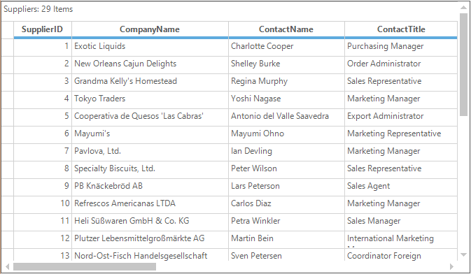
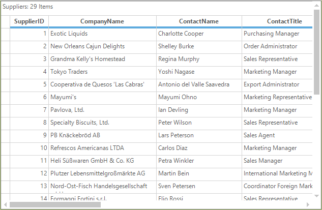
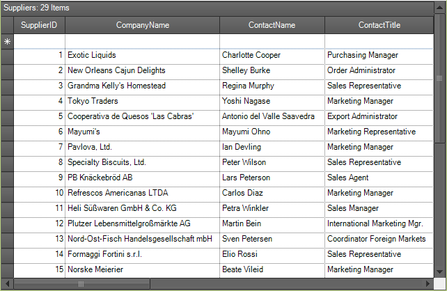
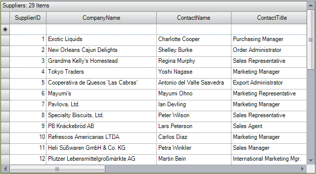
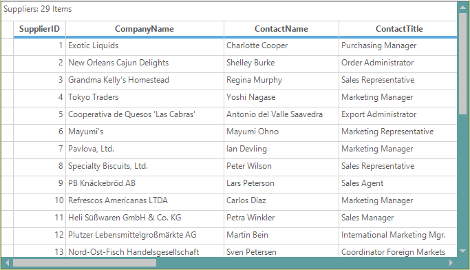
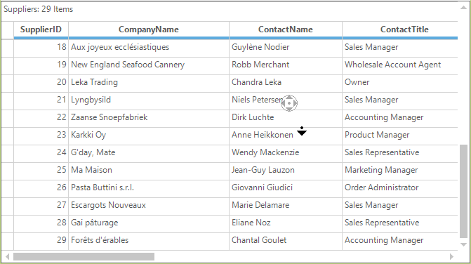
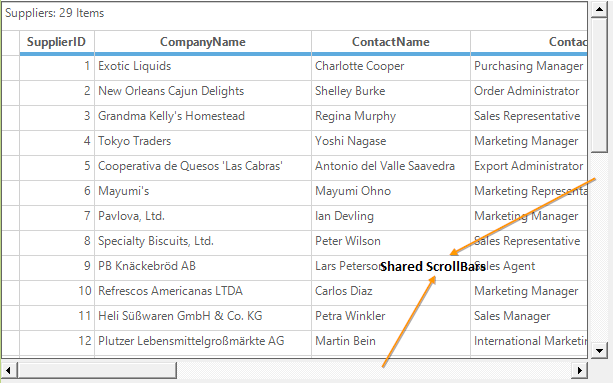

# Scrolling in Windows Forms GridGrouping control
GridGroupingControl provides the built in support for scrolling. Scrolling can be enabled or disabled in GridGroupingControl by using the [HScrollBehavior](https://help.syncfusion.com/cr/windowsforms/Syncfusion.Windows.Forms.Grid.Grouping.GridGroupDropArea.html#Syncfusion_Windows_Forms_Grid_Grouping_GridGroupDropArea_HScrollBehavior) and [VScrollBehavior](https://help.syncfusion.com/cr/windowsforms/Syncfusion.Windows.Forms.Grid.Grouping.GridGroupDropArea.html#Syncfusion_Windows_Forms_Grid_Grouping_GridGroupDropArea_VScrollBehavior) properties respectively.



// Enables Horizontal ScrollBar
this.gridGroupingControl1.TableControl.HScroll = true;
this.gridGroupingControl1.TableControl.HScrollBehavior = GridScrollbarMode.Enabled;

// Enables Vertical ScrollBar
this.gridGroupingControl1.TableControl.VScroll = true;
this.gridGroupingControl1.TableControl.VScrollBehavior = GridScrollbarMode.Enabled;

// Disables Horizontal ScrollBar
this.gridGroupingControl1.TableControl.HScroll = false;
this.gridGroupingControl1.TableControl.HScrollBehavior = GridScrollbarMode.Disabled;

// Disables Vertical ScrollBar
this.gridGroupingControl1.TableControl.VScroll = false;
this.gridGroupingControl1.TableControl.VScrollBehavior = GridScrollbarMode.Disabled;


'Enables Horizontal ScrollBar
Me.gridGroupingControl1.TableControl.HScroll = True
Me.gridGroupingControl1.TableControl.HScrollBehavior = GridScrollbarMode.Enabled

'Enables Vertical ScrollBar
Me.gridGroupingControl1.TableControl.VScroll = True
Me.gridGroupingControl1.TableControl.VScrollBehavior = GridScrollbarMode.Enabled

'Disables Horizontal ScrollBar
Me.gridGroupingControl1.TableControl.HScroll = False
Me.gridGroupingControl1.TableControl.HScrollBehavior = GridScrollbarMode.Disabled

'Disables Vertical ScrollBar
Me.gridGroupingControl1.TableControl.VScroll = False
Me.gridGroupingControl1.TableControl.VScrollBehavior = GridScrollbarMode.Disabled



Properties and methods related to scrolling has been already explained in our GridControl topic under the section [Scrolling](https://help.syncfusion.com/windowsforms/grid-control/scrolling). You can check that link for more information on Scrolling.

## Programmatic Scrolling
It is possible to scroll programmatically in GridGroupingControl by using the [ScrollCellInView](https://help.syncfusion.com/cr/windowsforms/Syncfusion.Windows.Forms.Grid.GridControlBase.html#Syncfusion_Windows_Forms_Grid_GridControlBase_ScrollCellInView_Syncfusion_Windows_Forms_Grid_GridRangeInfo_) method. You can directly pass the row and column index in this method or you can pass a range of cells using the [GridRangeInfo](https://help.syncfusion.com/cr/windowsforms/Syncfusion.Windows.Forms.Grid.GridRangeInfo.html) class.



// Grid will scroll to the position of 7,7.
this.gridGroupingControl1.TableControl.ScrollCellInView(7, 7);


' Grid will scroll to the position of 7,7.
Me.gridGroupingControl1.TableControl.ScrollCellInView(7, 7)



## Scrollbars Appearance
The columns and rows of the GridGroupingControl can be scrolled horizontally and vertically using built-in scrollbars. The appearance of the scrollbar can be applied using [GridOfficeScrollBar](https://help.syncfusion.com/cr/windowsforms/Syncfusion.Windows.Forms.Grid.Grouping.GridGroupingControl.html#Syncfusion_Windows_Forms_Grid_Grouping_GridGroupingControl_GridOfficeScrollBars) property. The default scrollbar is `OfficeScrollBars.None`. The following are the different styles of scrollbars available for GridGroupingControl,

* Metro
* Office2007
* Office2010
* None



// Sets the Metro theme for Grid Office Scroll Bars
this.gridGroupingControl1.GridOfficeScrollBars = Syncfusion.Windows.Forms.OfficeScrollBars.Metro; 


' Sets the Metro theme for Grid Office Scroll Bars
Me.gridGroupingControl1.GridOfficeScrollBars = Syncfusion.Windows.Forms.OfficeScrollBars.Metro



### Setting the Color Scheme for Office Scrollbars 
The themes can be applied for the office scrollbars by setting the appropriate color scheme. Following are the color schemes available for the GridGroupingControl.

[Office2007ScrollBarsColorScheme](https://help.syncfusion.com/cr/windowsforms/Syncfusion.Windows.Forms.Grid.GridModelOptions.html#Syncfusion_Windows_Forms_Grid_GridModelOptions_Office2007ScrollBarsColorScheme) – Used to apply the color scheme for Office 2007 Scrollbars
[Office2010ScrollBarsColorScheme](https://help.syncfusion.com/cr/windowsforms/Syncfusion.Windows.Forms.Grid.GridControlBase.html#Syncfusion_Windows_Forms_Grid_GridControlBase_Office2010ScrollBarsColorScheme) – Used to apply color scheme for Office 2010 scrollbars



// Sets the Office2010 Office ScrollBars
this.gridGroupingControl1.GridOfficeScrollBars = Syncfusion.Windows.Forms.OfficeScrollBars.Office2010;

//Set the color scheme
this.gridGroupingControl1.Office2010ScrollBarsColorScheme = Syncfusion.Windows.Forms.Office2010ColorScheme.Black;


' Sets the Office2010 Office ScrollBars
Me.gridGroupingControl1.GridOfficeScrollBars = Syncfusion.Windows.Forms.OfficeScrollBars.Office2010

'Set the color scheme
Me.gridGroupingControl1.Office2010ScrollBarsColorScheme = Syncfusion.Windows.Forms.Office2010ColorScheme.Black





// Sets the Office2007 Office ScrollBars
this.gridGroupingControl1.GridOfficeScrollBars = Syncfusion.Windows.Forms.OfficeScrollBars.Office2007;

//Set the color scheme
this.gridGroupingControl1.Office2007ScrollBarsColorScheme = Syncfusion.Windows.Forms.Office2007ColorScheme.Silver;


' Sets the Office2007 Office ScrollBars
Me.gridGroupingControl1.GridOfficeScrollBars = Syncfusion.Windows.Forms.OfficeScrollBars.Office2007

'Set the color scheme
Me.gridGroupingControl1.Office2007ScrollBarsColorScheme = Syncfusion.Windows.Forms.Office2007ColorScheme.Silver



### Changing the Back Color for the Metro Scrollbars 
The back color of the metro scrollbars can be customized to the desired color by using [ScrollerBackground](https://help.syncfusion.com/cr/windowsforms/Syncfusion.Windows.Forms.MetroColorTable.html#Syncfusion_Windows_Forms_MetroColorTable_ScrollerBackground) property of the `MetroColorTable`.



// Sets the Metro theme for Grid Office Scroll Bars
this.gridGroupingControl1.GridOfficeScrollBars = Syncfusion.Windows.Forms.OfficeScrollBars.Metro;

// Changes the back color of the scroll bar
this.gridGroupingControl1.TableControl.MetroColorTable.ScrollerBackground = Color.CadetBlue;


' Sets the Metro theme for Grid Office Scroll Bars
Me.gridGroupingControl1.GridOfficeScrollBars = Syncfusion.Windows.Forms.OfficeScrollBars.Metro

' Changes the back color of the scroll bar
Me.gridGroupingControl1.TableControl.MetroColorTable.ScrollerBackground = Color.CadetBlue



## Intelligence Mouse Scrolling 
The contents of the GridGroupingControl can be automatically scrolled by setting the [EnableIntelliMouse](https://help.syncfusion.com/cr/windowsforms/Syncfusion.Windows.Forms.ISupportIntelliMouse.html#Syncfusion_Windows_Forms_ISupportIntelliMouse_EnableIntelliMouse) property to `true`. 



//Enable intelligent Mouse scroll
this. gridGroupingControl1.EnableIntelliMouse = true;


'Enable intelligent Mouse scroll
Me. gridGroupingControl1.EnableIntelliMouse = True



## Shared Scrollbars
The GridGroupingControl can share the scroll bars with other controls by setting the [HScrollBehavior](https://help.syncfusion.com/cr/windowsforms/Syncfusion.Windows.Forms.Grid.GridControlBase.html#Syncfusion_Windows_Forms_Grid_GridControlBase_HScrollBehavior) and [VScrollBehavior](https://help.syncfusion.com/cr/windowsforms/Syncfusion.Windows.Forms.Grid.GridControlBase.html#Syncfusion_Windows_Forms_Grid_GridControlBase_VScrollBehavior)  property value as `GridScrollbarMode.Shared`. This can be used to synchronize the scrolling of multiple grids. 



//Set the shared scrollbar mode 
this.gridGroupingControl1.TableControl.HScrollBehavior = GridScrollbarMode.Shared;
this.gridGroupingControl1.TableControl.VScrollBehavior = GridScrollbarMode.Shared;

//Enable the Shared Scrollbars
this.gridGroupingControl1.TableControl.UseSharedScrollBars = true;

//Set the inner scrollbar which is shared to the grid
this.gridGroupingControl1.TableControl.HScrollBar.InnerScrollBar = hScrollBar1;
this.gridGroupingControl1.TableControl.VScrollBar.InnerScrollBar = vScrollBar1;


'Set the shared scrollbar mode 
Me.gridGroupingControl1.TableControl.HScrollBehavior = GridScrollbarMode.Shared
Me.gridGroupingControl1.TableControl.VScrollBehavior = GridScrollbarMode.Shared

'Enable the Shared Scrollbars
Me.gridGroupingControl1.TableControl.UseSharedScrollBars = True

'Set the inner scrollbar which is shared to the grid
Me.gridGroupingControl1.TableControl.HScrollBar.InnerScrollBar = hScrollBar1
Me.gridGroupingControl1.TableControl.VScrollBar.InnerScrollBar = vScrollBar1



## Scrolling Events
[HorizontalScroll](https://help.syncfusion.com/cr/windowsforms/Syncfusion.Windows.Forms.ScrollControl.html) and [VerticalScroll](https://help.syncfusion.com/cr/windowsforms/Syncfusion.Windows.Forms.ScrollControl.html) are the events that gets fired each time when scroll bar is moved respectively. The [e.NewValue](https://help.syncfusion.com/cr/windowsforms/Syncfusion.Windows.Forms.ScrollControl.html) will get the value of the scroll bar for each changes done in the Horizontal and Vertical scroll bar respectively. To know more on events, check the [Scrolling Events](https://help.syncfusion.com/windowsforms/grid-control/scrolling#scrolling-events) topic in GridControl.



this.gridGroupingControl1.TableControl.HorizontalScroll += new ScrollEventHandler(TableControl_HorizontalScroll);

void TableControl_HorizontalScroll(object sender, ScrollEventArgs e)
{

    // Displays the changed horizontal scroll value
    Console.WriteLine(e.NewValue);
}
this.gridGroupingControl1.TableControl.VerticalScroll += new ScrollEventHandler(TableControl_VerticalScroll);

void TableControl_VerticalScroll(object sender, ScrollEventArgs e)
{

    // Displays the changed vertical scroll value
    Console.WriteLine(e.NewValue);
}



Private Me.gridGroupingControl1.TableControl.HorizontalScroll += New ScrollEventHandler(AddressOf TableControl_HorizontalScroll)

Private Sub TableControl_HorizontalScroll(ByVal sender As Object, ByVal e As ScrollEventArgs)

	'Displays the changed horizontal scroll value
	Console.WriteLine(e.NewValue)
End Sub

Private Me.gridGroupingControl1.TableControl.VerticalScroll += New ScrollEventHandler(AddressOf TableControl_VerticalScroll)

Private Sub TableControl_VerticalScroll(ByVal sender As Object, ByVal e As ScrollEventArgs)

	'Displays the changed vertical scroll value
	Console.WriteLine(e.NewValue)
End Sub




## Custom Scrolling
Custom scroll bar can be added by using the [ScrollersFrame](https://help.syncfusion.com/cr/windowsforms/Syncfusion.Windows.Forms.ScrollersFrame.html) control. ScrollersFrame control has to be added into the application and then the GridGroupingControl has to be added. The GridGroupingControl and ScrollersFrame control has to be referred to each other by using the [AttachedTo](https://help.syncfusion.com/cr/windowsforms/Syncfusion.Windows.Forms.ScrollersFrame.html#Syncfusion_Windows_Forms_ScrollersFrame_AttachedTo) property.



//Attach the scroll Frame to the GridGroupingControl
this.scrollersFrame1.AttachedTo =this.gridGroupingControl1.TableControl;


'Attach the scroll Frame to the GridGroupingControl
Me.scrollersFrame1.AttachedTo = Me. gridGroupingControl1.TableControl


N> For more information regarding the custom scrolling and its styles, refer the GridControl topic under the section [Custom Scrolling](https://help.syncfusion.com/windowsforms/grid-control/scrolling#custom-scrollbar). 

