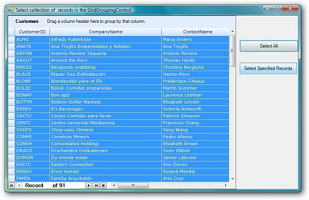
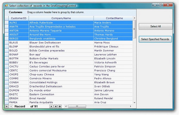

# Select Collection of Records In GridGroupingControl in Windows Forms

Essential® GridGroupingControl now supports two methods for selecting records in grid table. 

* SelectAll
* Select Specified Record

## Selecting All

The following code illustrates how to select all record in grid table.


 

//Selects all the records from the grid table.
this.gridGroupingControl1.Table.Records.SelectAll();



When the code runs, selecting all record is bound to Select All button.

 

## Selecting Specified Records

The following code illustrates how to select specified records.

N> Method Name:  AddRange   Parameter: Specify the Record collection to be selected


 

//Defining record collection
Record[] recordCollection = new Record[5];

//Adding records to collection

for (int index = 0; index < recordCollection.Length; index++)
{
    recordCollection[index] = this.gridGroupingControl1.Table.Records[index];
}

//Adding records collection to SelectedRecords
this.gridGroupingControl1.Table.SelectedRecords.AddRange(recordCollection);




When the code runs, selecting specified records is bound to Select Specified Records button. 

  

