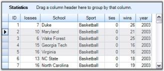
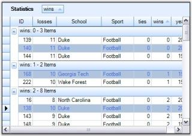
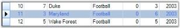
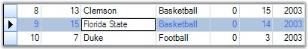
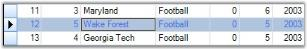

# Selections in Windows Forms GridGrouping control

There are two type of selection architectures in a Grid Grouping control. One is designed specifically for Grid Grouping control referred as Record-Based Selection and the other is inherited from GridControlBase named as Model-Based Selection. 

If you use the Record-Based selection functionality, then whole records are selected and these selections function properly with nested tables, sorting, and so on. If you choose the inherited selection capability, you will be able to select cell ranges, but the selections will have no knowledge of nested tables, grouping, or sorting, and thus is limited in Grid Grouping control. 

To use the Grid Grouping control record selections, you must set AllowSelections to None and then set ListBoxSelectionMode to something other than None. To use inherited selection capability, set AllowSelections to something other than None.

## Model Based Selection

Model Based Selection is cell-based that allows you to select across the cell, which is not possible with record-based selection. This derives from the GridControlBase and hence will not be aware of grouping elements like nested tables, groups, and so on. Model-based selection can be set by initializing AllowSelection property to a value other than None. The possible values for this type of selection is defined by the enum GridSelectionFlags. By setting various flags in AllowSelection, you can control the selection behavior of the grouping grids.

### Selection Flags

<table>
<tr>
<th>
FLAG NAMES</th><th>
DESCRIPTION</th></tr>
<tr>
<td>
AlphaBlend</td><td>
Uses alpha blending to highlight selected cells.</td></tr>
<tr>
<td>
Cell</td><td>
Individual cells can be selected.</td></tr>
<tr>
<td>
Column</td><td>
Columns can be selected.</td></tr>
<tr>
<td>
Row</td><td>
Rows can be selected.</td></tr>
<tr>
<td>
Table</td><td>
Whole table can be selected.</td></tr>
<tr>
<td>
Shift</td><td>
Allows user to extend existing selection by holding Shift key and clicking a cell.</td></tr>
<tr>
<td>
MixRangeType</td><td>
Allows you to select multiple ranges by holding CTRL key.</td></tr>
<tr>
<td>
Multiple</td><td>
Allows both rows and columns to be selected at the same time when GridSelectionFlags.Multiple is enabled.</td></tr>
<tr>
<td>
Keyboard</td><td>
Allows extension of existing selection when user holds SHIFT+Arrow keys.</td></tr>
<tr>
<td>
Any</td><td>
Default behavior for selecting cells: Rows, Columns, Cells, Table, Multiple, Extends Shift Key support, and alpha blending.</td></tr>
<tr>
<td>
None</td><td>
Disable selecting cells.</td></tr>
</table>
You can combine more than one flags to customize current selection behavior.

#### Example

Following code example illustrates how to set the selection mode for selecting multiple rows with alpha blending.


  
this.gridGroupingControl1.TableOptions.AllowSelection = GridSelectionFlags.AlphaBlend | GridSelectionFlags.Row | GridSelectionFlags.Multiple;

  
Me.gridGroupingControl1.TableOptions.AllowSelection = GridSelectionFlags.AlphaBlend Or GridSelectionFlags.Row Or GridSelectionFlags.Multiple



  

### Format Selection

It is possible to modify default color used for AlphaBlend selection. This can be achieved by assigning a desired color to AlphaBlendSelectionColor property. The example given below uses Red Color for alpha blending.


  
this.gridGroupingControl1.TableOptions.AllowSelection = GridSelectionFlags.AlphaBlend | GridSelectionFlags.Cell;
this.gridGroupingControl1.TableModel.Options.AlphaBlendSelectionColor = Color.Red;

  
Me.gridGroupingControl1.TableOptions.AllowSelection = GridSelectionFlags.AlphaBlend Or GridSelectionFlags.Cell
Me.gridGroupingControl1.TableModel.Options.AlphaBlendSelectionColor = Color.Red



  

N> For more details, refer to the following browser sample:

> _&lt;Install Location&gt;\Syncfusion\EssentialStudio\[Version Number]\Windows\Grid.Grouping.Windows\Samples\Grouping Grid Options\Table Options Demo_

## Record Based Selection

This type of selection mechanism allows selection in terms of record. It is not cell based. This selection mode is specifically designed for a Grouping Grid and hence it is aware of nested tables, nested groups, and the like. Any selection that is record based affects Table.SelectedRecords collection. 

Grid Grouping control offers three types of record based selections, which together are called ListBoxSelection Modes. To enable record based selection, you need to set ListBoxSelectionMode property to a value other than None. Once a listbox selection is enabled, it automatically turns off the model based selection by assigning None to AllowSelection property.

Following code example illustrates the different types of record based selections.

### SelectionMode - One

It allows you to select only one item (record).


 
this.gridGroupingControl1.TableOptions.ListBoxSelectionMode = SelectionMode.One;

  
Me.gridGroupingControl1.TableOptions.ListBoxSelectionMode = SelectionMode.One



  

### SelectionMode - MultiSimple

You can select multiple items individually. It does not support the use of SHIFT, CTRL and ARROW keys to extend the selection.


  
this.gridGroupingControl1.TableOptions.ListBoxSelectionMode = SelectionMode.MultiSimple;

 
Me.gridGroupingControl1.TableOptions.ListBoxSelectionMode = SelectionMode.MultiSimple



  

#### SelectionMode - MultiExtended

This selection type allows selection of multiple items through Shift, Ctrl and Arrow keys.


  
this.gridGroupingControl1.TableOptions.ListBoxSelectionMode = SelectionMode.MultiExtended;

 
Me.gridGroupingControl1.TableOptions.ListBoxSelectionMode = SelectionMode.MultiExtended



  

#### Format ListBox Selections

ListBoxSelection appearance can be customized by setting the properties: SelectionBackColor, SelectionTextColor and ListBoxSelectionColorOptions. By default, SystemColors.Highlight and SystemColors.HighlightText are the colors used as BackColor and TextColor to highlight selected records. SelectionBackColor and SelectionTextColor property settings can be used to override these default colors.

ListBoxSelectionColorOptions is used to control the appearance of the selections. The GridListBoxSelectionColorOptions enumeration specifies the options for this property.

* ApplySelectionColor

Gets the required colors from the SelectionBackColor and SelectionTextColor properties.


  
this.gridGroupingControl1.TableOptions.ListBoxSelectionColorOptions = GridListBoxSelectionColorOptions.ApplySelectionColor;
this.gridGroupingControl1.TableOptions.SelectionBackColor = Color.PaleGreen;
this.gridGroupingControl1.TableOptions.SelectionTextColor = Color.Green;

  
Me.gridGroupingControl1.TableOptions.ListBoxSelectionColorOptions = GridListBoxSelectionColorOptions.ApplySelectionColor
Me.gridGroupingControl1.TableOptions.SelectionBackColor = Color.PaleGreen
Me.gridGroupingControl1.TableOptions.SelectionTextColor = Color.Green



Here is the effect of the above settings.

  

* Draw AlphaBlend

Draws AlphaBlending over the selected row.


  
this.gridGroupingControl1.TableOptions.ListBoxSelectionColorOptions = GridListBoxSelectionColorOptions.DrawAlphablend;

  
Me.gridGroupingControl1.TableOptions.ListBoxSelectionColorOptions = GridListBoxSelectionColorOptions.DrawAlphablend



  

* InvertCells

Inverts the cells in selected row. As a result, the back color of the cell is used to draw the text and CellTextColor becomes its BackColor.


  
this.gridGroupingControl1.TableOptions.ListBoxSelectionColorOptions = GridListBoxSelectionColorOptions.InvertCells;

  
Me.gridGroupingControl1.TableOptions.ListBoxSelectionColorOptions = GridListBoxSelectionColorOptions.InvertCells



  

* None

Do not change the appearance of the cells. The cell appearance could be specified manually by handling TableControlPrepareViewStyleInfo and TableControlCellDrawn events.


  
this.gridGroupingControl1.TableOptions.ListBoxSelectionColorOptions = GridListBoxSelectionColorOptions.None;

  
Me.gridGroupingControl1.TableOptions.ListBoxSelectionColorOptions = GridListBoxSelectionColorOptions.None



  

#### ListBoxSelection CurrentCellOptions

When ListBoxSelection mode is set, you can control the appearance and behavior of the CurrentCell by setting ListBoxSelectionCurrentCellOptions property to a desired value. Possible values are defined by GridListBoxSelectionCurrentCellOptions enumeration described below.

* HideCurrentCell

Do not select a current cell in the current row.

  

* WhiteCurrentCell

When a current cell is in current row, it is drawn with the original cell background color.

  

* None

When a current cell is in current row, it is drawn with the same color used for highlighting the whole record. 

  

* MoveCurrentCellWithMouse

Used only with SelectionMode.MultiExtended. Moves current cell when user extends the selection with mouse. The image below illustrates this mode well. Here, the selection started with the cell {R2:C1} and has extended up to Row4 through a mouse drag that made the current cell to shift to the cell {R4:C1} by following the mouse.

  

N> For more details, refer to the following browser sample:

> _&lt;Install Location&gt;\Syncfusion\EssentialStudio\[Version Number]\Windows\Grid.Grouping.Windows\Samples\2.0\Grouping Grid Options\Table Options Demo_

## Focused Selection

Grouping Grid selection behavior can also be customized by handling appropriate events as required. Here is an example implementation that focuses current selection onto the desired grid elements like only the Current Cell, only the entire Row that contains the current cell, only the entire column that contains the current cell, or both the row and the column that contains the current cell. The focused grid element is highlighted to show the current selection.

 

<table>
<tr>
<th>
NAME</th><th>
DESCRIPTION</th></tr>
<tr>
<td>
</td><td>
</td></tr>
<tr>
<td>
Cell Only</td><td>
Selects only the individual cells.</td></tr>
<tr>
<td>
Row Only</td><td>
Selects only the row.</td></tr>
<tr>
<td>
Column Only</td><td>
Selects only the column.</td></tr>
<tr>
<td>
Row and Column</td><td>
Selects the row and the column with respect to the current cell.</td></tr>
<tr>
<td>
Default</td><td>
Enables ListBoxSelection mode by default.</td></tr>
<tr>
<td>
None</td><td>
Disables the cell selection.</td></tr>
</table>

### Implementation

Follow the steps below to create a sample that shows the above selections.

1. Create a grid grouping control and bind it to any data table. This example uses the grouping grid that has been bound to the Statistics Table from Northwind.MDB.

2. Setup the designer to add options for different selection types. Add six radio buttons to the form to enable selection options Cell Only, Row Only, Column Only, Row and Column, Default and None.

3. Set the required flags with respect to the current cell.



  
this.gridGroupingControl1.TableModel.Options.RefreshCurrentCellBehavior = GridRefreshCurrentCellBehavior.RefreshCell;
this.gridGroupingControl1.TableModel.Options.ShowCurrentCellBorderBehavior = GridShowCurrentCellBorder.GrayWhenLostFocus;

  
Me.gridGroupingControl1.TableModel.Options.RefreshCurrentCellBehavior = GridRefreshCurrentCellBehavior.RefreshCell
Me.gridGroupingControl1.TableModel.Options.ShowCurrentCellBorderBehavior = GridShowCurrentCellBorder.GrayWhenLostFocus



{{ codesnippet1 | OrderList_Indent_Level_1 }}

4. Handle PrepareViewStyleInfo event to focus the current selection according to the chosen selection type. It also includes the code to highlight the current selection. This works for CellOnly, RowOnly, ColumnOnly, and Row and Column types.


  
this.gridGroupingControl1.TableControl.PrepareViewStyleInfo += new GridPrepareViewStyleInfoEventHandler(TableControl_PrepareViewStyleInfo);

void TableControl_PrepareViewStyleInfo(object sender, Syncfusion.Windows.Forms.Grid.GridPrepareViewStyleInfoEventArgs e)
{
    GridCurrentCell cc = gridGroupingControl1.TableControl.CurrentCell;
    GridControlBase grid = this.gridGroupingControl1.TableControl.CurrentCell.Grid;

//Code for RowOnly.

    if (radioButton3.Checked)
    {

//Highlights the current row with SystemColors.Highlight and Bold font.

        if (e.RowIndex > grid.Model.Rows.HeaderCount && e.ColIndex > grid.Model.Cols.HeaderCount
        && cc.HasCurrentCellAt(e.RowIndex))
        {
            e.Style.Interior = new BrushInfo(SystemColors.Highlight);
            e.Style.TextColor = SystemColors.HighlightText;
            e.Style.Font.Bold = true;
        }
    }

//Code for CellOnly.

    else if (radioButton2.Checked)
    {

//Highlights the current cell with SystemColors.Highlight and Bold font.

        if (e.RowIndex > grid.Model.Rows.HeaderCount && e.ColIndex > grid.Model.Cols.HeaderCount
        && cc.HasCurrentCellAt(e.RowIndex, e.ColIndex))
        {
        e.Style.Interior = new BrushInfo(SystemColors.Highlight);
        e.Style.TextColor = SystemColors.HighlightText;
        e.Style.Font.Bold = true;
        }
    }

//Code for ColumnOnly.

    else if (radioButton4.Checked)
    {

//Highlight the current column with SystemColors.Highlight and Bold font.

        if (e.RowIndex > grid.Model.Rows.HeaderCount && e.ColIndex > grid.Model.Cols.HeaderCount
        && cc.ColIndex == e.ColIndex)
        {
            e.Style.Interior = new BrushInfo(SystemColors.Highlight);
            e.Style.TextColor = SystemColors.HighlightText;
            e.Style.Font.Bold = true;
        }
    }

//Code for Row and Column.

    else if (radioButton5.Checked)
    {

//Highlights the current row and column with SystemColors.Highlight and Bold font.

        if (e.RowIndex > grid.Model.Rows.HeaderCount && e.ColIndex > grid.Model.Cols.HeaderCount
        && (cc.RowIndex == e.RowIndex || cc.ColIndex == e.ColIndex))
        {
            e.Style.Interior = new BrushInfo(SystemColors.Highlight);
            e.Style.TextColor = SystemColors.HighlightText;
            e.Style.Font.Bold = true;
        }
    }
}

  
AddHandler gridGroupingControl1.TableControl.PrepareViewStyleInfo, AddressOf TableControl_PrepareViewStyleInfo

Private Sub TableControl_PrepareViewStyleInfo(ByVal sender As Object, ByVal e As GridPrepareViewStyleInfoEventArgs)
Dim cc As GridCurrentCell = gridGroupingControl1.TableControl.CurrentCell
Dim grid As GridControlBase = Me.gridGroupingControl1.TableControl.CurrentCell.Grid

'Code for RowOnly.

If radioButton3.Checked Then

'Highlights the current row with SystemColors.Highlight and Bold font.

If e.RowIndex > grid.Model.Rows.HeaderCount AndAlso e.ColIndex > grid.Model.Cols.HeaderCount AndAlso cc.HasCurrentCellAt(e.RowIndex) Then
e.Style.Interior = New BrushInfo(SystemColors.Highlight)
e.Style.TextColor = SystemColors.HighlightText
e.Style.Font.Bold = True
End If

'Code for CellOnly.

ElseIf radioButton2.Checked Then

'Highlights the current cell with SystemColors.Highlight and Bold font.

If e.RowIndex > grid.Model.Rows.HeaderCount AndAlso e.ColIndex > grid.Model.Cols.HeaderCount AndAlso cc.HasCurrentCellAt(e.RowIndex, e.ColIndex) Then
e.Style.Interior = New BrushInfo(SystemColors.Highlight)
e.Style.TextColor = SystemColors.HighlightText
e.Style.Font.Bold = True
End If

'Code for ColumnOnly.

ElseIf radioButton4.Checked Then

'Highlights the current column with SystemColors.Highlight and Bold font.

If e.RowIndex > grid.Model.Rows.HeaderCount AndAlso e.ColIndex > grid.Model.Cols.HeaderCount AndAlso cc.ColIndex = e.ColIndex Then
e.Style.Interior = New BrushInfo(SystemColors.Highlight)
e.Style.TextColor = SystemColors.HighlightText
e.Style.Font.Bold = True
End If

'Code for Row and Column.

ElseIf radioButton5.Checked Then

'Highlights the current row and column with SystemColors.Highlight and Bold font.

If e.RowIndex > grid.Model.Rows.HeaderCount AndAlso e.ColIndex > grid.Model.Cols.HeaderCount AndAlso (cc.RowIndex = e.RowIndex OrElse cc.ColIndex = e.ColIndex) Then
e.Style.Interior = New BrushInfo(SystemColors.Highlight)
e.Style.TextColor = SystemColors.HighlightText
e.Style.Font.Bold = True
End If
End If
End Sub



{{ codesnippet2 | OrderList_Indent_Level_1 }}

Enable ListBoxSelection mode to expose the default selection.



  

//Code for Default option.

private void radioButton1_CheckedChanged(object sender, System.EventArgs e)
{

    if (this.radioButton1.Checked)
    this.gridGroupingControl1.TableOptions.ListBoxSelectionMode = SelectionMode.One;

    else
    this.gridGroupingControl1.TableOptions.ListBoxSelectionMode = SelectionMode.None;

    foreach (Table t in this.gridGroupingControl1.Engine.EnumerateTables())
    this.gridGroupingControl1.GetTable(t.TableDescriptor.Name).SelectedRecords.Clear();
}

  

'Code for Default option.

Private Sub radioButton1_CheckedChanged(ByVal sender As Object, ByVal e As System.EventArgs) Handles radioButton1.CheckedChanged

If Me.radioButton1.Checked Then
Me.gridGroupingControl1.TableOptions.ListBoxSelectionMode = SelectionMode.One

Else
Me.gridGroupingControl1.TableOptions.ListBoxSelectionMode = SelectionMode.None

End If
Dim t As Table

For Each t In Me.gridGroupingControl1.Engine.EnumerateTables()
Me.gridGroupingControl1.GetTable(t.TableDescriptor.Name).SelectedRecords.Clear()
Next t
End Sub



Below is the code for None option that disables the selection.



  

//Code for None option.

private void radioButton6_CheckedChanged(object sender, System.EventArgs e)
{

    if(this.radioButton6.Checked)
    this.gridGroupingControl1.TableModel.Options.ShowCurrentCellBorderBehavior = GridShowCurrentCellBorder.HideAlways;

    else
    this.gridGroupingControl1.TableModel.Options.ShowCurrentCellBorderBehavior = GridShowCurrentCellBorder.GrayWhenLostFocus;
}

 

' Code for None option.

Private Sub radioButton6_CheckedChanged(ByVal sender As Object, ByVal e As System.EventArgs) Handles radioButton6.CheckedChanged

If Me.radioButton6.Checked Then
Me.gridGroupingControl1.TableModel.Options.ShowCurrentCellBorderBehavior = GridShowCurrentCellBorder.HideAlways

Else
Me.gridGroupingControl1.TableModel.Options.ShowCurrentCellBorderBehavior = GridShowCurrentCellBorder.GrayWhenLostFocus
End If
End Sub



Refresh the table control once the selection type is changed. You could also handle TableControlCurrentCellActivating event for this purpose.


  

private void radioButton2_CheckedChanged(object sender, System.EventArgs e)
{
    this.gridGroupingControl1.TableControl.Refresh();
}

private void radioButton3_CheckedChanged(object sender, System.EventArgs e)
{
    this.gridGroupingControl1.TableControl.Refresh();
}

private void radioButton4_CheckedChanged(object sender, System.EventArgs e)
{
    this.gridGroupingControl1.TableControl.Refresh();
}

private void radioButton5_CheckedChanged(object sender, System.EventArgs e)
{
    this.gridGroupingControl1.TableControl.Refresh();
}

void TableControl_CurrentCellActivating(object sender, GridCurrentCellActivatingEventArgs e)
{
    this.gridGroupingControl1.TableControl.Refresh();
}

  

Private Sub radioButton2_CheckedChanged(ByVal sender As Object, ByVal e As System.EventArgs) Handles radioButton2.CheckedChanged
Me.gridGroupingControl1.TableControl.Refresh()
End Sub

Private Sub radioButton3_CheckedChanged(ByVal sender As Object, ByVal e As System.EventArgs) Handles radioButton3.CheckedChanged
Me.gridGroupingControl1.TableControl.Refresh()
End Sub

Private Sub radioButton4_CheckedChanged(ByVal sender As Object, ByVal e As System.EventArgs) Handles radioButton4.CheckedChanged
Me.gridGroupingControl1.TableControl.Refresh()
End Sub

Private Sub radioButton5_CheckedChanged(ByVal sender As Object, ByVal e As System.EventArgs) Handles radioButton5.CheckedChanged
Me.gridGroupingControl1.TableControl.Refresh()
End Sub

Private Sub TableControl_CurrentCellActivating(ByVal sender As Object, ByVal e As GridCurrentCellActivatingEventArgs)
Me.gridGroupingControl1.TableControl.Refresh()
End Sub



Here is a sample output that focuses the current row and column.

  

## Multiple Record Selection

Grid Table supports selection of multiple records. Each record that is being selected is added to the SelectedRecords collection, which manages these records. You can iterate through this collection in order to step through all records marked as selected. When records are added or removed from this collection, the grid raises the events, SelectedRecordsChanging and SelectedRecordsChanged. This section demonstrates how to work with the SelectedRecords collection. 

Selecting Multiple Records

Multiple records can be selected at a time by adding the desired record specifications into the SelectedRecords collection. The following code example illustrates this process. It selects the records with indexes 2, 4 and 0 by adding them into the SelectedRecords collection.


 
Record r1 = this.gridGroupingControl1.Table.Records[2];
Record r2 = this.gridGroupingControl1.Table.Records[4];
Record r3 = this.gridGroupingControl1.Table.Records[0];
Table t = this.gridGroupingControl1.Table;
t.SelectedRecords.Add(r1);
t.SelectedRecords.Add(r2);
t.SelectedRecords.Add(r3);

 
Dim r1 As Record = Me.gridGroupingControl1.Table.Records(2)
Dim r2 As Record = Me.gridGroupingControl1.Table.Records(4)
Dim r3 As Record = Me.gridGroupingControl1.Table.Records(0)
Dim t As Table = Me.gridGroupingControl1.Table
t.SelectedRecords.Add(r1)
t.SelectedRecords.Add(r2)
t.SelectedRecords.Add(r3)



  

N> For more details, refer to the following browser sample:

> _&lt;Install Location&gt;\Syncfusion\EssentialStudio\[Version Number]\Windows\Grid.Grouping.Windows\Samples\Selection\Record Range Selection Demo_

RecordSelection with NestedTables

When nested tables are used, you can extend record selection mechanisms to each of the child table by accessing SelectedRecords collection of the desired child table.


  

//For Parent Table.
Record r1 = this.gridGroupingControl1.Table.Records[1];
Record r2 = this.gridGroupingControl1.Table.Records[2];
Table t = this.gridGroupingControl1.Table;
t.SelectedRecords.Add(r1);
t.SelectedRecords.Add(r2);
t.SelectedRecords.Add(r3);

//For Child Table.
Record cr1 = this.gridGroupingControl1.GetTable("Orders").Records[7];
Record cr2 = this.gridGroupingControl1.GetTable("Orders").Records[12];
this.gridGroupingControl1.GetTable("Orders").SelectedRecords.Add(or1);
this.gridGroupingControl1.GetTable("Orders").SelectedRecords.Add(or2);

 

'For Parent Table.
Dim r1 As Record = Me.gridGroupingControl1.Table.Records(1)
Dim r2 As Record = Me.gridGroupingControl1.Table.Records(2)
Dim t As Table = Me.gridGroupingControl1.Table
t.SelectedRecords.Add(r1)
t.SelectedRecords.Add(r2)
t.SelectedRecords.Add(r3)

'For Child Table.
Dim cr1 As Record = Me.gridGroupingControl1.GetTable("Orders").Records(7)
Dim cr2 As Record = Me.gridGroupingControl1.GetTable("Orders").Records(12)
Me.gridGroupingControl1.GetTable("Orders").SelectedRecords.Add(or1)
Me.gridGroupingControl1.GetTable("Orders").SelectedRecords.Add(or2)



  

Record Search

To search for a particular record, SelectedRecords collection provides a method called FindRecord(). This method searches for the occurrences of the specified record and returns a zero-based index of the occurrence found. If there is no such record, then returns -1. It comes in two versions: one accepts the whole record as its parameter and the other accepts the position of the record in the underlying datasource.


  
Record rec = this.gridGroupingControl1.Table.Records[2];

//Searches for the record 'rec'.
int index = this.gridGroupingControl1.Table.SelectedRecords.FindRecord(rec);

//Searches for the record with index 2.
int index2 = this.gridGroupingControl1.Table.SelectedRecords.FindRecord(2);

 
Dim rec As Record = Me.gridGroupingControl1.Table.Records(2)

'Searches for the record 'rec'.
Dim index As Integer = Me.gridGroupingControl1.Table.SelectedRecords.FindRecord(rec)

'Searches for the record with index 2.
Dim index2 As Integer = Me.gridGroupingControl1.Table.SelectedRecords.FindRecord(2)



Removing a RecordSelection

A record can be removed from the SelectedRecords collection by using the methods Remove() and RemoveAt(). A call to Remove() requires you to specify the whole record as parameter. In case if you know only the record index, you could then make use of RemoveAt(). Both the methods remove the specified record from the collection and mark it as deselect.


  
Record rec = this.gridGroupingControl1.Table.Records[2];

//Removes the record 'rec'.
this.gridGroupingControl1.Table.SelectedRecords.Remove(rec);

//Removes the record at the index 2.
this.gridGroupingControl1.Table.SelectedRecords.RemoveAt(2)

  
Dim rec As Record = Me.gridGroupingControl1.Table.Records(2)

'Removes the record 'rec'.
Me.gridGroupingControl1.Table.SelectedRecords.Remove(rec)

'Removes the record at the index 2.
Me.gridGroupingControl1.Table.SelectedRecords.RemoveAt(2)



Clear Selection

To remove all the selections from the grid, you can call SelectedRecords.Clear() method that removes all the elements from the collection and marks them as deselect.


  
this.gridGroupingControl1.Table.SelectedRecords.Clear();

  
Me.gridGroupingControl1.Table.SelectedRecords.Clear()



N> For more details, refer to the following browser sample:

> _&lt;Install Location&gt;\Syncfusion\EssentialStudio\[Version Number]\Windows\Grid.Grouping.Windows\Samples\Selection\Record Range Selection Demo_

## Selected Ranges Collection

The selections made by the user are saved into a collection named TableModel.SelectedRanges. If the Selection option is turned on, then the grid will always listen to the selections that are being made and records all those selections into the SelectedRanges collection. You can loop through every selection range of this collection to get the information about the records. The SelectedRanges.ActiveRange property gives the current selection range (i.e. last range in the collection).

Example

This example shows how to loop through SelectedRanges collection to retrieve information about the records that are being selected.

1. Turn on the model-based selection. It is enabled by setting AllowSelection property to a value other than None. You could set the selection colors as well.



  
this.gridGroupingControl1.TableOptions.AllowSelection = GridSelectionFlags.AlphaBlend | GridSelectionFlags.Row;
this.gridGroupingControl1.TableModel.Options.AlphaBlendSelectionColor = Color.Red;

  
Me.gridGroupingControl1.TableOptions.AllowSelection = GridSelectionFlags.AlphaBlend | GridSelectionFlags.Row
Me.gridGroupingControl1.TableModel.Options.AlphaBlendSelectionColor = Color.Red



{{ codesnippet3 | OrderList_Indent_Level_1 }}

2. The code below loops through the ranges of all the selections and writes the record values that have been selected to a listbox control. 


 

foreach (GridRangeInfo range in gridGroupingControl1.TableModel.SelectedRanges)
{

    if (range.IsRows)
    {

        for (int i = range.Top; i <= range.Bottom; i++)
        {
            Record rec = gridGroupingControl1.Table.DisplayElements[i].GetRecord();
            listBox1.Items.Add(rec.ToString());
        }
    }
}

  

For Each range As GridRangeInfo In gridGroupingControl1.TableModel.SelectedRanges

If range.IsRows Then
Dim i As Integer = range.Top

Do While i <= range.Bottom
Dim rec As Record = gridGroupingControl1.Table.DisplayElements(i).GetRecord()
listBox1.Items.Add(rec.ToString())
i += 1
Loop
End If
Next range



{{ codesnippet4 | OrderList_Indent_Level_1 }}

3. Here is a sample screenshot.

## Excel like Selection Frame
Excel like selection frame can be enabled by setting the [ExcelLikeSelectionFrame](https://help.syncfusion.com/cr/windowsforms/Syncfusion.Windows.Forms.Grid.GridModelOptions.html#Syncfusion_Windows_Forms_Grid_GridModelOptions_ExcelLikeSelectionFrame) and [ExcelLikeCurrentCell](https://help.syncfusion.com/cr/windowsforms/Syncfusion.Windows.Forms.Grid.GridModelOptions.html#Syncfusion_Windows_Forms_Grid_GridModelOptions_ExcelLikeCurrentCell) properties to `true`. The [SelectionFrameOption](https://help.syncfusion.com/cr/windowsforms/Syncfusion.Windows.Forms.Grid.GridModelOptions.html#Syncfusion_Windows_Forms_Grid_GridModelOptions_SelectionFrameOption) property can be used to enable the 2016 Excel like selection frame or 2003 Excel like selection fame by using [SelectionFrameOption](https://help.syncfusion.com/cr/windowsforms/Syncfusion.Windows.Forms.Grid.SelectionFrameOption.html#) enumeration. The default value of the `SelectionFrameOption` property is `SelectionFrameOption.Excel2016`.
The `SelectionFrameOption` enumeration has the following types of selection frame options, 

 [SelectionFrameOption.Excel2003](https://help.syncfusion.com/cr/windowsforms/Syncfusion.Windows.Forms.Grid.SelectionFrameOption.html#) - It is used the enable the 2003 Excel like selection frame for the grid.
 [SelectionFrameOption.Excel2016](https://help.syncfusion.com/cr/windowsforms/Syncfusion.Windows.Forms.Grid.SelectionFrameOption.html#) - It is used the enable the 2016 Excel like selection frame for the grid.



//Enable the Excel-like selection frame.
this.gridGroupingControl1.TableModel.Options.ExcelLikeSelectionFrame = true;

//Enable the Excel-like current cell.
this.gridGroupingControl1.TableModel.Options.ExcelLikeCurrentCell = true;


'Enable the Excel-like selection frame.
Me.gridGroupingControl1.TableModel.Options.ExcelLikeSelectionFrame = True

'Enable the Excel-like current cell.
Me.gridGroupingControl1.TableModel.Options.ExcelLikeCurrentCell = True



### Setting the 2003 Excel like selection frame
2003 Excel like selection frame can be enabled by setting the `SelectionFrameOption` property to `SelectionFrameOption.Excel2003`.


//Enable the 2003 Excel like selection frame.
this.gridGroupingControl1.TableModel.Options.SelectionFrameOption = SelectionFrameOption.Excel2003;


'Enable the 2003 Excel like selection frame.
Me.gridGroupingControl1.TableModel.Options.SelectionFrameOption = SelectionFrameOption.Excel2003



### Changing the Selection Border Brush
The selection border brush for 2016 Excel like selection frame can be changed by using the [SelectionBorderBrush](https://help.syncfusion.com/cr/windowsforms/Syncfusion.Windows.Forms.Grid.GridModelOptions.html#Syncfusion_Windows_Forms_Grid_GridModelOptions_SelectionBorderBrush) property.


//Sets the selection border brush for 2016 Excel-like selection frame.
this.gridGroupingControl1.TableModel.Options.SelectionBorderBrush = new SolidBrush(Color.DarkGreen);


'Sets the selection border brush for 2016 Excel-like selection frame.
Me.gridGroupingControl1.TableModel.Options.SelectionBorderBrush = New SolidBrush(Color.DarkGreen)



### Changing the Selection Border Thickness
The selection border thickness for 2016 Excel like selection frame can be changed by using the [SelectionBorderThickness](https://help.syncfusion.com/cr/windowsforms/Syncfusion.Windows.Forms.Grid.GridModelOptions.html#Syncfusion_Windows_Forms_Grid_GridModelOptions_SelectionBorderThickness) property.


//Set the selection border thickness for 2016 Excel-like selection frame.
this.gridGroupingControl1.TableModel.Options.SelectionBorderThickness = 4;


'Set the selection border thickness for 2016 Excel-like selection frame.
Me.gridGroupingControl1.TableModel.Options.SelectionBorderThickness = 4



