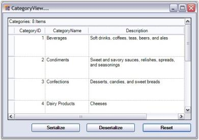
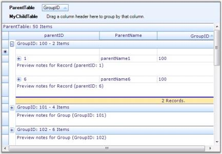
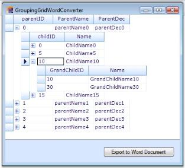
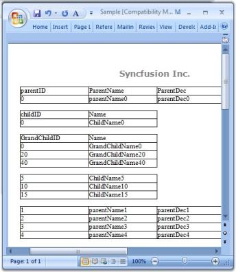
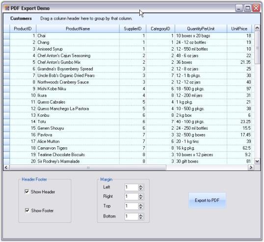

# Serialization

In this section, we will discuss how to serialize and deserialize grouping grid schema information. Serialization is the process of saving the object state into a stream of bytes for further use. The reverse process is Deserialization. Through serialization, the objects are made portable so that they can be serialized at one end and then transferred to the other end of a network where they will again be deserialized into its original form for use.

Grid Grouping control supports two forms of serialization.

## XML Serialization

With XmlSerialization, the grid schema information can be converted into XML format. Grouping Grid provides two methods to support Xml Serialization.

* WriteXmlSchema - It writes the engine settings into an XML stream(Serialization).
* ApplyXmlSchema - It loads the engine settings from an XML stream(Deserialization).

All the grid elements can be serialized. Not only the data, but also the look and feel of the grid can be serialized and deserialized. The following code example best illustrates this process.

Example

1. Setup a grouping grid and load it with some data. Save the initial state of the grid schema so that it could be used to reset the grid. 

  

//Knows the initial state.

System.IO.MemoryStream stream;

stream = new System.IO.MemoryStream();

this.gridGroupingControl1.WriteXmlSchema(new XmlTextWriter(stream, null));



 

' Knows the initial state.

Private stream As System.IO.MemoryStream

stream = New System.IO.MemoryStream()

Me.gridGroupingControl1.WriteXmlSchema(New XmlTextWriter(stream, Nothing))

 

2.Apply the look and feel properties that you desire.

  

//Customizes the Appearance.

this.gridGroupingControl1.TableOptions.GridVisualStyles = GridVisualStyles.Office2007Blue;

this.gridGroupingControl1.TableOptions.GridLineBorder = new GridBorder(GridBorderStyle.Solid, Color.FromArgb(208, 215, 229), GridBorderWeight.Thin);

this.gridGroupingControl1.TopLevelGroupOptions.ShowCaption = false;

this.gridGroupingControl1.Appearance.AnyCell.Font.Facename = "Verdana";

this.gridGroupingControl1.Appearance.AnyCell.TextColor = Color.MidnightBlue;

this.gridGroupingControl1.TableDescriptor.Appearance.AlternateRecordFieldCell.Interior = new BrushInfo(Color.Orange);



  

'Customizes the Appearance.

Me.gridGroupingControl1.TableOptions.GridVisualStyles = GridVisualStyles.Office2007Blue

Me.gridGroupingControl1.TableOptions.GridLineBorder = New GridBorder(GridBorderStyle.Solid, Color.FromArgb(208, 215, 229), GridBorderWeight.Thin)

Me.gridGroupingControl1.TopLevelGroupOptions.ShowCaption = False

Me.gridGroupingControl1.Appearance.AnyCell.Font.Facename = "Verdana"

Me.gridGroupingControl1.Appearance.AnyCell.TextColor = Color.MidnightBlue

Me.gridGroupingControl1.TableDescriptor.Appearance.AlternateRecordFieldCell.Interior = New BrushInfo(Color.Orange)



3.Create a button name 'Serialize', clicking which will start the serialization process. Add the code below into the ButtonClick event handler. This will save the grid schema into an XML file.

  

//Serializes.

private void Serialize_Click(object sender, System.EventArgs e)

{

    FileDialog dlg = new SaveFileDialog();

    dlg.AddExtension = true;

    dlg.Filter = "xml files (*.xml)|*.xml|All files (*.*)|*.*";

    if (dlg.ShowDialog() == DialogResult.OK)

    {

        XmlTextWriter xw = new XmlTextWriter(dlg.FileName, System.Text.Encoding.UTF8);

        xw.Formatting = System.Xml.Formatting.Indented;

        this.gridGroupingControl1.WriteXmlSchema(xw);

        xw.Close();

    }

}



 

'Serializes.

Private Sub Serialize_Click(ByVal sender As Object, ByVal e As System.EventArgs) Handles btnSaveXmlSchema.Click

Dim dlg As FileDialog = New SaveFileDialog()

dlg.AddExtension = True

dlg.Filter = "xml files (*.xml)|*.xml|All files (*.*)|*.*"

If dlg.ShowDialog() = DialogResult.OK Then

Dim xw As XmlTextWriter = New XmlTextWriter(dlg.FileName, System.Text.Encoding.UTF8)

xw.Formatting = System.Xml.Formatting.Indented

Me.gridGroupingControl1.WriteXmlSchema(xw)

xw.Close()

End If

End Sub

 

4.Create another button named 'Deserialize' to deserialize the grid. The following code will help you to load the grid schema back from an XML file.

 

//Deserializes.

private void btnLoadXmlSchema_Click(object sender, System.EventArgs e)

{

    FileDialog dlg = new OpenFileDialog();

    dlg.Filter = "xml files (*.xml)|*.xml|All files (*.*)|*.*";

    if (dlg.ShowDialog() == DialogResult.OK)

    {

        XmlReader xr = new XmlTextReader(dlg.FileName);

        this.gridGroupingControl1.ApplyXmlSchema(xr);

        xr.Close();

    }

}

 

  

'Deserializes.

Private Sub btnLoadXmlSchema_Click(ByVal sender As Object, ByVal e As System.EventArgs) Handles btnLoadXmlSchema.Click

Dim dlg As FileDialog = New OpenFileDialog()

dlg.Filter = "xml files (*.xml)|*.xml|All files (*.*)|*.*"

If dlg.ShowDialog() = DialogResult.OK Then

Dim xr As XmlReader = New XmlTextReader(dlg.FileName)

gridGroupingControl1.ApplyXmlSchema(xr);

xr.Close()

End If

End Sub



5.Create a third button named 'Reset', which will reset the look and feel of the grid.

  

//Resets Grid.

private void reset_Click(object sender, System.EventArgs e)

{

    System.IO.MemoryStream stream2 = new System.IO.MemoryStream(stream.ToArray());

    this.gridGroupingControl1.ApplyXmlSchema(new XmlTextReader(stream2));

}



  

'Resets Grid.

Private Sub reset_Click(ByVal sender As Object, ByVal e As System.EventArgs) Handles reset.Click

Dim stream2 As System.IO.MemoryStream = New System.IO.MemoryStream(stream.ToArray())

Me.gridGroupingControl1.ApplyXmlSchema(New XmlTextReader(stream2))

End Sub



6.While running the sample, click Serialize button and save the grid schema into an XML file. Then click Reset button to switch the grid to its default state. It removes all the appearance settings done in the first step. You can also make changes in the TableDescriptor of the grid manually like rearranging columns through drag and drop so that after reloading the grid schema, you would notice that the entire grid schema has been serialized. Reloading will transform the grouping grid back to the state before serialization.

  

 

  

N>: For more details, refer to the following browser samples:

> _&lt;Install Location&gt;\Syncfusion\EssentialStudio\[Version Number]\Windows\Grid.Grouping.Windows\Samples\Serialization\XML Serialization Demo_

> _&lt;Install Location&gt;\Syncfusion\EssentialStudio\[Version Number]\Windows\Grid.Grouping.Windows\Samples\Serialization\Employee View Demo_

Saving and Restoring Look and Feel Properties

You can save, look, and feel properties in XML format. This will allow you to design a basic look and feel to use with all your Grid Grouping controls, and then easily apply this look and feel to new grids at design-time or runtime.

It can be done in the following ways.

* Through Verbs 
* Through Code

Through Verbs

The verbs "Save Look and Feel" and "Choose Look and Feel" that are found at the bottom of the property grid of Grid Grouping control will allow you to easily accomplish this task. Use the Save verb to save Look and Feel properties of the current Grid Grouping control. Then use Choose verb to apply the saved settings to a different control.

  

Through Code

To apply the Look and Feel properties saved as XML at runtime, simply call ApplyXmlLookandFeel method. For example, the code below shows the code that is necessary to load such a file in the form's constructor.

  

public Form1()

{

    System.Xml.XmlReader xr = new System.Xml.XmlReader("BaseLandF.xml");

    this.gridGroupingControl1.ApplyXmlLookAndFeel(xr);

}



  

Public Sub New()

Dim xr As System.Xml.XmlReader = New System.Xml.XmlReader("BaseLandF.xml")

Me.gridGroupingControl1.ApplyXmlLookAndFeel(xr)

End Sub



## Excel Export

Export to Excel is one of the most common functionalities required in the .Net world. The Essential Grid Control has in-built support for Excel Export. Users can download data from the Grouping Grid control into an Excel spreadsheet for offline verification and/or computation. This can be achieved by making use of the GroupingGridExcelConverter class. This section will walk you through the conversion of the contents of grid to an excel file as well as discuss various converter options.

GroupingGridExcelConverter class derives from GridExcelConverterBase. It contains a number of methods that helps in exporting different components of the grouping grid. Its properties will let you control the export of grid schema like styles and grid elements. You will be able to export Styles, RecordPlusMinus, GroupCaptionPlusMinus, Borders and PreviewRows as well.

ConverterOptions

Exporting of a Grouping Grid to Excel has two options: Visible and Default. Visible option will allow you to export only the visible contents of the grid, whereas Default option exports the entire elements of the grouping grid. Converter options are defined in GridExcelConverter.ConverterOptions enumeration.

The following table lists the properties offered by Grouping Grid Excel Converter. By setting these properties, you would be able to choose the elements you need to export.

_Table 107: Grouping Grid Excel Converter properties_

<table>
<tr>
<th>
PROPERTIES</th><th>
DESCRIPTION</th></tr>
<tr>
<td>
ExportBorders</td><td>
Specifies if borders should be exported.</td></tr>
<tr>
<td>
ExportStyle</td><td>
Indicates if style should be exported.</td></tr>
<tr>
<td>
ExportGroupPlusMinus</td><td>
Specifies if GridGroup should be exported as Excel Group.</td></tr>
<tr>
<td>
ExportRecordPlusMinus</td><td>
When true, the record with related tables will be exported as Excel Group.</td></tr>
<tr>
<td>
ExportPreviewRows</td><td>
When enabled, PreviewRows will be exported.</td></tr>
<tr>
<td>
CaptionBackColor</td><td>
Specifies the color to be used for Caption in the worksheet.</td></tr>
<tr>
<td>
HeaderBackColor</td><td>
Indicates the color to be used for Header in the worksheet.</td></tr>
</table>

Method

Grouping Grid Excel Converter control provides a method called GroupingGridToExcel. This is the method that converts grouping grid contents to an excel file. It accepts three parameters: grouping grid to be converted, filename of the destination worksheet, and convert options.

Syntax

  

GroupingGridExcelConverterControl converter = new GroupingGridExcelConverterControl();

converter.GroupingGridToExcel(this.gridGroupingControl1, "Grid.xls", ConverterOptions.Visible);



  

Dim converter As GroupingGridExcelConverter = New GroupingGridExcelConverter()

converter.GroupingGridToExcel(Me.gridGroupingControl1, "Grid.xls", ConverterOptions.Visible)



Events

QueryExportPreviewRowInfo is an event offered by the Grouping Grid Excel Converter control that aids in the conversion process. It occurs for each PreviewRow element before exporting the grid and letting you customize the preview row. It accepts two parameters: one contains the Element to export and the other the GridStyleInfo object representing style information.

Syntax

  

GroupingGridExcelConverter converter  = new GroupingGridExcelConverter();

converter.QueryExportPreviewRowInfo += new GroupingGridExcelConverterControl.GroupingGridExportPreviewRowQueryInfoEventHandler(converter_QueryExportPreviewRowInfo);

void converter_QueryExportPreviewRowInfo(object sender, GroupingGridExportPreviewRowQueryInfoEventArgs e)

{

}



  

Dim converter As GroupingGridExcelConverter  = New GroupingGridExcelConverter()

AddHandler converter.QueryExportPreviewRowInfo, AddressOf converter_QueryExportPreviewRowInfo

Private Sub converter_QueryExportPreviewRowInfo(ByVal sender As Object, ByVal e As GroupingGridExportPreviewRowQueryInfoEventArgs)

End Sub



Implementation

Here is an example that illustrates the conversion of a grouping grid to an Excel file.

1. 1. Include the required namespaces.

  

using Syncfusion.XlsIO;

using Syncfusion.GridExcelConverter;

using Syncfusion.GroupingGridExcelConverter;

using Syncfusion.Grouping;

using Syncfusion.Windows.Forms.Grid;

using Syncfusion.Windows.Forms.Grid.Grouping;



  

Imports Syncfusion.XlsIO

Imports Syncfusion.GridExcelConverter

Imports Syncfusion.GroupingGridExcelConverter

Imports Syncfusion.Grouping

Imports Syncfusion.Windows.Forms.Grid

Imports Syncfusion.Windows.Forms.Grid.Grouping



2.2.Setup an hierarchical datasource.

  

private int numberParentRows = 50;

private int numberChildRows = 200;

private int numberGrandChildRows = 500;

private DataTable GetParentTable()

{

    DataTable dt = new DataTable("ParentTable");

    dt.Columns.Add(new DataColumn("parentID"));

    dt.Columns.Add(new DataColumn("ParentName"));

    dt.Columns.Add(new DataColumn("GroupID"));

    Random r = new Random();

    for (int i = 0; i < numberParentRows; i++)

    {

        DataRow dr = dt.NewRow();

        dr[0] = i;

        dr[1] = string.Format("parentName{0}", i);

        dr[2] = r.Next(99, 111);

        dt.Rows.Add(dr);

    }

    return dt;

}

private DataTable GetChildTable()

{

    DataTable dt = new DataTable("ChildTable");

    dt.Columns.Add(new DataColumn("childID"));

    dt.Columns.Add(new DataColumn("Name"));

    dt.Columns.Add(new DataColumn("ParentID"));

    dt.Columns.Add(new DataColumn("ChildGroupID"));

    Random r = new Random();

    for (int i = 0; i < numberChildRows; i++)

    {

        DataRow dr = dt.NewRow();

        dr[0] = i.ToString();

        dr[1] = string.Format("ChildName{0}", i);

        dr[2] = (i % numberParentRows).ToString();

        dr[3] = r.Next(994, 1006);

        dt.Rows.Add(dr);

    }

    return dt;

}



  

Private numberParentRows As Integer = 50

Private numberChildRows As Integer = 200

Private numberGrandChildRows As Integer = 500

Private Function GetParentTable() As DataTable

Dim dt As DataTable = New DataTable("ParentTable")

dt.Columns.Add(New DataColumn("parentID"))

dt.Columns.Add(New DataColumn("ParentName"))

dt.Columns.Add(New DataColumn("GroupID"))

Dim r As Random = New Random()

Dim i As Integer = 0

Do While i < numberParentRows

Dim dr As DataRow = dt.NewRow()

dr(0) = i

dr(1) = String.Format("parentName{0}", i)

dr(2) = r.Next(99, 111)

dt.Rows.Add(dr)

i += 1

Loop

Return dt

End Function

Private Function GetChildTable() As DataTable

Dim dt As DataTable = New DataTable("ChildTable")

dt.Columns.Add(New DataColumn("childID"))

dt.Columns.Add(New DataColumn("Name"))

dt.Columns.Add(New DataColumn("ParentID"))

dt.Columns.Add(New DataColumn("ChildGroupID"))

Dim r As Random = New Random()

Dim i As Integer = 0

Do While i < numberChildRows

Dim dr As DataRow = dt.NewRow()

dr(0) = i.ToString()

dr(1) = String.Format("ChildName{0}", i)

dr(2) = (i Mod numberParentRows).ToString()

dr(3) = r.Next(994, 1006)

dt.Rows.Add(dr)

i += 1

Loop

Return dt

End Function



3.3.Setup a grouping grid and load it with data from data source. Customize the grid by adding preview rows, groups, etc., as required.

  

DataTable parentTable = GetParentTable();

DataTable childTable = GetChildTable();

//Adds Summary row to parent table.

GridSummaryColumnDescriptor gridSummaryColumnDescriptor = new GridSummaryColumnDescriptor();

gridSummaryColumnDescriptor.DisplayColumn = "GroupID";

gridSummaryColumnDescriptor.Format = "  {Count} Records.";

gridSummaryColumnDescriptor.Name = "SummaryColumn";

gridSummaryColumnDescriptor.SummaryType = SummaryType.Count;

this.gridGroupingControl1.TableDescriptor.SummaryRows.Add(new GridSummaryRowDescriptor("SummaryRow", new GridSummaryColumnDescriptor[] {gridSummaryColumnDescriptor}));

//Manually specify relations in grouping engine.

GridRelationDescriptor parentToChildRelationDescriptor = new GridRelationDescriptor();

parentToChildRelationDescriptor.ChildTableName = "MyChildTable";// same as SourceListSetEntry.Name for childTable 

parentToChildRelationDescriptor.RelationKind = RelationKind.RelatedMasterDetails;

parentToChildRelationDescriptor.RelationKeys.Add("parentID", "ParentID");

//Adds Summary Row to child table.

gridSummaryColumnDescriptor = new GridSummaryColumnDescriptor();

gridSummaryColumnDescriptor.DisplayColumn = "ChildGroupID";

gridSummaryColumnDescriptor.Format = "  {Count} Records.";

gridSummaryColumnDescriptor.Name = "SummaryColumn";

gridSummaryColumnDescriptor.SummaryType = SummaryType.Count;

parentToChildRelationDescriptor.ChildTableDescriptor.SummaryRows.Add(new GridSummaryRowDescriptor("SummaryRow", new Syncfusion.Windows.Forms.Grid.Grouping.GridSummaryColumnDescriptor[] {gridSummaryColumnDescriptor}));

//Adds relation to parent table.

gridGroupingControl1.TableDescriptor.Relations.Add(parentToChildRelationDescriptor);

//Registers any DataTable/IList with SourceListSet, so that RelationDescriptor can resolve the name

this.gridGroupingControl1.Engine.SourceListSet.Add("MyParentTable", parentTable);

this.gridGroupingControl1.Engine.SourceListSet.Add("MyChildTable", childTable);

this.gridGroupingControl1.DataSource = parentTable;

this.gridGroupingControl1.ShowGroupDropArea = true;

this.gridGroupingControl1.AddGroupDropArea("MyChildTable");

//The TrackWidthOfParentColumn property of a column descriptor ensures that 

//columns are aligned and synchronized. 

this.gridGroupingControl1.TableDescriptor.Columns[0].Width = 200;

this.gridGroupingControl1.TableDescriptor.Columns[1].Width = 150;

this.gridGroupingControl1.TableDescriptor.Columns[2].Width = 150;

//Synchronizes width of columns in child record with width of column in parent record.

for(int n=0;n<3;n++)

parentToChildRelationDescriptor.ChildTableDescriptor.Columns[n].TrackWidthOfParentColumn = gridGroupingControl1.TableDescriptor.Columns[n].Name;

this.gridGroupingControl1.TableDescriptor.GroupedColumns.Add("GroupID");

this.gridGroupingControl1.TableOptions.ShowRecordPreviewRow = true;

this.gridGroupingControl1.ChildGroupOptions.ShowGroupPreview = true;

this.gridGroupingControl1.TableDescriptor.Columns["GroupID"].Appearance.AnyHeaderCell.HorizontalAlignment = GridHorizontalAlignment.Right;

this.gridGroupingControl1.TableDescriptor.Columns["GroupID"].Appearance.AnyHeaderCell.VerticalAlignment = GridVerticalAlignment.Bottom;

this.gridGroupingControl1.Appearance.AnySummaryCell.Interior = new BrushInfo(Color.FromArgb(255, 231, 162));

//Hooks up this event to handle preview rows.

this.gridGroupingControl1.QueryCellStyleInfo += new GridTableCellStyleInfoEventHandler(gridGroupingControl1_QueryCellStyleInfo);

Private Sub gridGroupingControl1_QueryCellStyleInfo(ByVal sender As Object, ByVal e As GridTableCellStyleInfoEventArgs)

If e.TableCellIdentity.TableCellType = GridTableCellType.RecordPreviewCell Then

Dim el As Element = e.TableCellIdentity.DisplayElement

e.Style.CellValue = "Preview notes for Record (" & el.ParentTableDescriptor.Fields(0).Name & ": " & el.ParentRecord.GetValue(el.ParentTableDescriptor.Fields(0).Name) & ")"

End If

If e.TableCellIdentity.TableCellType = GridTableCellType.GroupPreviewCell Then

Dim el As Element = e.TableCellIdentity.DisplayElement

e.Style.CellValue = "Preview notes for Group (" & el.ParentGroup.Name & ": " & el.ParentGroup.Category.ToString() & ")"

End If

End Sub



  

Dim parentTable As DataTable = GetParentTable()

Dim childTable As DataTable = GetChildTable()

'Adds Summary row to parent table.

Dim gridSummaryColumnDescriptor As New GridSummaryColumnDescriptor()

gridSummaryColumnDescriptor.DisplayColumn = "GroupID"

gridSummaryColumnDescriptor.Format = "  {Count} Records."

gridSummaryColumnDescriptor.Name = "SummaryColumn"

gridSummaryColumnDescriptor.SummaryType = SummaryType.Count

Me.gridGroupingControl1.TableDescriptor.SummaryRows.Add(New GridSummaryRowDescriptor("SummaryRow", New GridSummaryColumnDescriptor() {gridSummaryColumnDescriptor}))

'Manually specify relations in grouping engine.

Dim parentToChildRelationDescriptor As New GridRelationDescriptor()

parentToChildRelationDescriptor.ChildTableName = "MyChildTable" ' same as SourceListSetEntry.Name for childTable

parentToChildRelationDescriptor.RelationKind = RelationKind.RelatedMasterDetails

parentToChildRelationDescriptor.RelationKeys.Add("parentID", "ParentID")

'Adds Summary Row to child table.

gridSummaryColumnDescriptor = New GridSummaryColumnDescriptor()

gridSummaryColumnDescriptor.DisplayColumn = "ChildGroupID"

gridSummaryColumnDescriptor.Format = "  {Count} Records."

gridSummaryColumnDescriptor.Name = "SummaryColumn"

gridSummaryColumnDescriptor.SummaryType = SummaryType.Count

parentToChildRelationDescriptor.ChildTableDescriptor.SummaryRows.Add(New GridSummaryRowDescriptor("SummaryRow", New Syncfusion.Windows.Forms.Grid.Grouping.GridSummaryColumnDescriptor() {gridSummaryColumnDescriptor}))

'Adds relation to parent table.

gridGroupingControl1.TableDescriptor.Relations.Add(parentToChildRelationDescriptor)

'Registers any DataTable/IList with SourceListSet, so that RelationDescriptor can resolve the name

Me.gridGroupingControl1.Engine.SourceListSet.Add("MyParentTable", parentTable)

Me.gridGroupingControl1.Engine.SourceListSet.Add("MyChildTable", childTable)

Me.gridGroupingControl1.DataSource = parentTable

Me.gridGroupingControl1.ShowGroupDropArea = True

Me.gridGroupingControl1.AddGroupDropArea("MyChildTable")

'The TrackWidthOfParentColumn property of a column descriptor ensures that 

'columns are aligned and synchronized. 

Me.gridGroupingControl1.TableDescriptor.Columns(0).Width = 200

Me.gridGroupingControl1.TableDescriptor.Columns(1).Width = 150

Me.gridGroupingControl1.TableDescriptor.Columns(2).Width = 150

'Synchronizes width of columns in child record with width of column in parent record.

For n As Integer = 0 To 2

parentToChildRelationDescriptor.ChildTableDescriptor.Columns(n).TrackWidthOfParentColumn = gridGroupingControl1.TableDescriptor.Columns(n).Name

Next n

Me.gridGroupingControl1.TableDescriptor.GroupedColumns.Add("GroupID")

Me.gridGroupingControl1.TableOptions.ShowRecordPreviewRow = True

Me.gridGroupingControl1.ChildGroupOptions.ShowGroupPreview = True

Me.gridGroupingControl1.TableDescriptor.Columns("GroupID").Appearance.AnyHeaderCell.HorizontalAlignment = GridHorizontalAlignment.Right

Me.gridGroupingControl1.TableDescriptor.Columns("GroupID").Appearance.AnyHeaderCell.VerticalAlignment = GridVerticalAlignment.Bottom

Me.gridGroupingControl1.Appearance.AnySummaryCell.Interior = New BrushInfo(Color.FromArgb(255, 231, 162))

'Hooks up this event to handle preview rows.

AddHandler gridGroupingControl1.QueryCellStyleInfo, AddressOf gridGroupingControl1_QueryCellStyleInfo

private void gridGroupingControl1_QueryCellStyleInfo(Object sender,GridTableCellStyleInfoEventArgs e)

If e.TableCellIdentity.TableCellType = GridTableCellType.RecordPreviewCell Then

Dim el As Element = e.TableCellIdentity.DisplayElement

e.Style.CellValue = "Preview notes for Record (" & el.ParentTableDescriptor.Fields(0).Name & ": " & el.ParentRecord.GetValue(el.ParentTableDescriptor.Fields(0).Name) & ")"

End If

If e.TableCellIdentity.TableCellType = GridTableCellType.GroupPreviewCell Then

Dim el As Element = e.TableCellIdentity.DisplayElement

e.Style.CellValue = "Preview notes for Group (" & el.ParentGroup.Name & ": " & el.ParentGroup.Category.ToString() & ")"

End Sub



4.4.Set up a Grouping Grid Excel Converter and choose the elements you want to export by setting the appropriate properties.

  

GroupingGridExcelConverterControl converter = new GroupingGridExcelConverterControl();

converter.ExportBorders = true;

converter.ExportGroupPlusMinus = true;

converter.ExportPreviewRows = true;

converter.ExportRecordPlusMinus = true;

converter.ExportStyle = true;

converter.HeaderBackColor = Color.Orange;

converter.CaptionBackColor = Color.Lavender;



  

Dim converter As GroupingGridExcelConverterControl = New GroupingGridExcelConverterControl()

converter.ExportBorders = True

converter.ExportGroupPlusMinus = True

converter.ExportPreviewRows = True

converter.ExportRecordPlusMinus = True

converter.ExportStyle = True

converter.HeaderBackColor = Color.Orange

converter.CaptionBackColor = Color.Lavender



5.5.Handle the QueryExportPreviewRowInfo event to customize preview rows before export.

 

converter.QueryExportPreviewRowInfo += new GroupingGridExcelConverterControl.GroupingGridExportPreviewRowQueryInfoEventHandler(converter_QueryExportPreviewRowInfo);

void converter_QueryExportPreviewRowInfo(object sender, GroupingGridExportPreviewRowQueryInfoEventArgs e)

{

    if (e.Element.Kind == DisplayElementKind.GroupPreview)

    {

        Element el = e.Element;

        e.Style.CellValue = "Preview notes for Group (" + el.ParentGroup.Name + ": " + el.ParentGroup.Category.ToString() + ")";

        e.Style.BackColor = Color.MistyRose;

        e.Handled = true;

    }

    if (e.Element.Kind == DisplayElementKind.RecordPreview)

    {

        Element el = e.Element;

        e.Style.CellValue = "Preview notes for Record (" + el.ParentTableDescriptor.Fields[0].Name + ": " +                                       el.ParentRecord.GetValue(el.ParentTableDescriptor.Fields[0].Name) + ")";

        e.Style.BackColor = Color.MistyRose;

        e.Handled = true;

    }

}

 

  

AddHandler converter.QueryExportPreviewRowInfo, AddressOf converter_QueryExportPreviewRowInfo)

Private Sub converter_QueryExportPreviewRowInfo(ByVal sender As Object, ByVal e As GroupingGridExportPreviewRowQueryInfoEventArgs)

If e.Element.Kind = DisplayElementKind.GroupPreview Then

Dim el As Element = e.Element

e.Style.CellValue = "Preview notes for Group (" & el.ParentGroup.Name & ": " & el.ParentGroup.Category.ToString() & ")"

e.Style.BackColor = Color.MistyRose

e.Handled = True

End If

If e.Element.Kind = DisplayElementKind.RecordPreview Then

Dim el As Element = e.Element

e.Style.CellValue = "Preview notes for Record (" & el.ParentTableDescriptor.Fields(0).Name & ": " & el.ParentRecord.GetValue(el.ParentTableDescriptor.Fields(0).Name) & ")"

e.Style.BackColor = Color.MistyRose

e.Handled = True

End If

End Sub



6.6.Export the grouping grid to an Excel file. 

  

converter.GroupingGridToExcel(this.gridGroupingControl1, "ExcelGrid.xls", ConverterOptions.Default);



  

converter.GroupingGridToExcel(Me.gridGroupingControl1, "ExcelGrid.xls", ConverterOptions.Default)



Here are screen shots showing grouping grid and the exported grid in Excel file.

  

  

N>: For more details, refer to the following browser sample:

> _&lt;Install Location&gt;\Syncfusion\EssentialStudio\[Version Number]\Windows\Grid.Grouping.Windows\Samples\Exporting\Excel Export Demo_

## Word Converter

Export to Word is one of the most common functionalities that is required in the .NET world. Essential Grid Control has in-built support for Word Export. Users can download data from the Grouping Grid control into a Word document for offline verification and/or computation. This can be achieved by making use of GroupingGridWordConverter class. This section will walk you through the conversion of the contents of the grid to a word file as well as discuss the various converter options.

GroupingGridWordConverter class derives from GridWordConverterBase. It contains a number of methods that helps in exporting different components of the grouping grid. You can export NestedTables as well.

The following table lists the properties offered by Grouping Grid Word Converter. By setting these properties, you can choose the elements you need to export.

_Table 108: Properties_

<table>
<tr>
<th>
PROPERTIES</th><th>
DESCRIPTION</th></tr>
<tr>
<td>
ShowHeader</td><td>
Specifies if header should be displayed.</td></tr>
<tr>
<td>
ShowFooter</td><td>
Specifies if footer should be displayed.</td></tr>
</table>

Method

Grouping Grid Word Converter control provides a method called GroupingGridToWord. This is the method that does the conversion of grouping grid contents to a word file. It accepts two parameters: grouping grid to be converted and filename of the destination Word document.

Syntax

 

GroupingGridWordConverter converter = new GroupingGridWordConverter();

converter.GroupingGridToWord("Grid.doc", this.gridGroupingControl1);

 

  

Dim converter As GroupingGridWordConverter = New GroupingGridWordConverter()

converter.GroupingGridToWord("Grid.doc", Me.gridGroupingControl1)



Events

DrawHeader and DrawFooter are the events offered by Grouping Grid Word Converter that aids in adding as well as customizing header and footer in the destination Word document. 

Sample Output

The images below depict the conversion of grid content to a Word file.

  

  

N>: For more details, refer to the following browser sample:

> _&lt;Install Location&gt;\Syncfusion\EssentialStudio\[Version Number]\Windows\Grid.Grouping.Windows\Samples\Exporting\Word Converter Demo_

## PDF Converter

PDF Export

Essential Grid Grouping control supports conversion of grid contents to a PDF file. Users can convert data from Grid Grouping control into a PDF document using GridPDFConverter class. PDF libraries are used to support conversion of grid content to a PDF page. 

To ensure convertion of grid data to PDF document, the following dll files should be added along with default dll files in the reference folder:

* Syncfusion.Pdf.Base  
* Syncfusion.GridHelperClasses.Windows

ExportToPdf method should be used to export the grid to a PDF file. 

The following code example illustrates the conversion of grid data to PDF document.

 

GridPDFConverter pdfConvertor = new GridPDFConverter();

pdfConvertor.ExportToPdf("Sample.pdf", this.gridGroupingControl1.TableControl);

//Launches PDF file by using default Application [Acrobat Reader].

System.Diagnostics.Process.Start("Sample.pdf");

 

 

Dim pdfConvertor As GridPDFConverter = New GridPDFConverter()

pdfConvertor.ExportToPdf("Sample.pdf", Me.gridGroupingControl1.TableControl)

'Launches PDF file by using default Application [Acrobat Reader].

System.Diagnostics.Process.Start("Sample.pdf")

 

 

  

