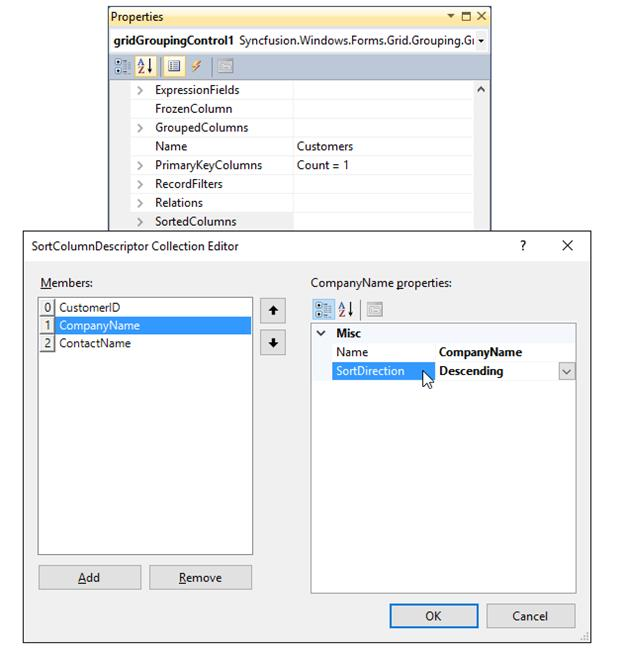
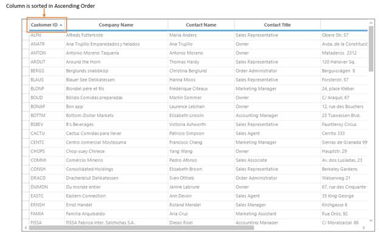
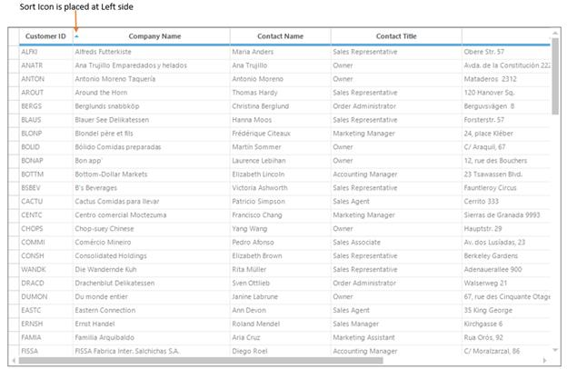
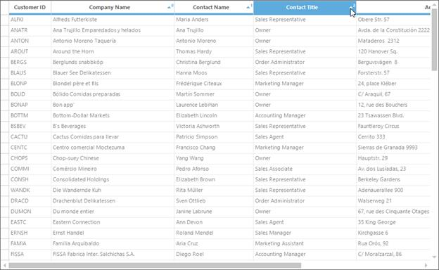
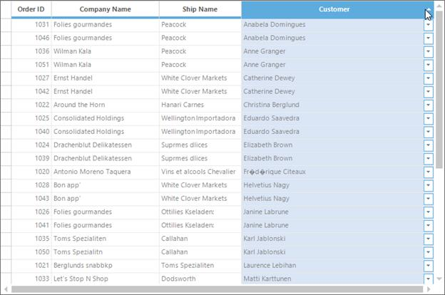

# Sorting in Windows Forms GridGrouping control
GridGroupingControl allows users to sort table data against one or more columns. When sorting is applied, grid will rearrange data to match the current sort criteria.

There are multiple ways to sort table data. A simple one is to click the desired column headers that needs to be sorted. Also sorting can be performed programmatically. Once sorting is applied, the grid will display a sort icon in the respective column headers showing sort direction. 

At design time, data can be sorted by accessing [SortedColumns](http://help.syncfusion.com/cr/windowsforms/Syncfusion.Grouping.SortColumnDescriptorCollection.html) property under [TableDescriptor](https://help.syncfusion.com/cr/windowsforms/Syncfusion.Windows.Forms.Grid.Grouping.GridGroupingControl.html#Syncfusion_Windows_Forms_Grid_Grouping_GridGroupingControl_TableDescriptor) section in the property grid of GridGroupingControl. This will open `SortColumnDescriptor` Collection Editor. 

In that Editor, clicking `Add` button will add existing columns into the collection. [Name](https://help.syncfusion.com/cr/windowsforms/Syncfusion.Grouping.SortColumnDescriptor.html#Syncfusion_Grouping_SortColumnDescriptor_Name) and [SortDirection](https://help.syncfusion.com/cr/windowsforms/Syncfusion.Grouping.SortColumnDescriptor.html#Syncfusion_Grouping_SortColumnDescriptor_SortDirection) in the property window of the editor will let user specify their desired field name to sort and the sort order.

## Programmatic Sorting
The [SortedColumns](http://help.syncfusion.com/cr/windowsforms/Syncfusion.Grouping.SortColumnDescriptorCollection.html) collection is used to define the sort order for records with groups. Multiple entries can be added with the first entry having precedence while sorting records. The properties and methods in this collection lets users manage elements in the collection.

Sorting can be applied to the grid data by specifying the desired field name to the [TableDescriptor.SortedColumns.Add()](https://help.syncfusion.com/cr/windowsforms/Syncfusion.Grouping.SortColumnDescriptorCollection.html#Syncfusion_Grouping_SortColumnDescriptorCollection_Add_Syncfusion_Grouping_SortColumnDescriptor_).



// ‘CustomerID` column will be sorted.
this.gridGroupingControl1.TableDescriptor.SortedColumns.Add("CustomerID");


' ‘CustomerID` column will be sorted.
Me.gridGroupingControl1.TableDescriptor.SortedColumns.Add("CustomerID")



## Removing Sorting
Sorting can be removed for a particular or range of columns by specifying the desired column name in the [SortedColumns.Remove](https://help.syncfusion.com/cr/windowsforms/Syncfusion.Grouping.SortColumnDescriptorCollection.html#Syncfusion_Grouping_SortColumnDescriptorCollection_Remove_Syncfusion_Grouping_SortColumnDescriptor_) method or by specifying the particular column index in the [SortedColumns.RemoveAt](https://help.syncfusion.com/cr/windowsforms/Syncfusion.Grouping.SortColumnDescriptorCollection.html#Syncfusion_Grouping_SortColumnDescriptorCollection_RemoveAt_System_Int32_) method.



// Sorting will be removed for the ‘ProductName’ column. 
this.gridGroupingControl1.TableDescriptor.SortedColumns.Remove("ProductName");

// Sorting will be removed for the column with index 2.
this.gridGroupingControl1.TableDescriptor.SortedColumns.RemoveAt(2);


' Sorting will be removed for the ‘ProductName’ column. 
Me.gridGroupingControl1.TableDescriptor.SortedColumns.Remove("ProductName")

' Sorting will be removed for the column with index 2.
Me.gridGroupingControl1.TableDescriptor.SortedColumns.RemoveAt(2)



## Clearing Sorting
To clear the sorting from the GridGroupingControl, [SortedColumns.Clear](https://help.syncfusion.com/cr/windowsforms/Syncfusion.Grouping.SortColumnDescriptorCollection.html#Syncfusion_Grouping_SortColumnDescriptorCollection_Clear) can be used. This will clear all the `SortColumnDescriptor` from the `SortColumnDescriptorCollection`.



//Clearing sorted columns
this.gridGroupingControl1.TableDescriptor.SortedColumns.Clear();


'Clearing sorted columns
Me.gridGroupingControl1.TableDescriptor.SortedColumns.Clear()



## Preventing Column from Being Sorted
To disable a column from being sorted, the [AllowSort](https://help.syncfusion.com/cr/windowsforms/Syncfusion.Windows.Forms.Grid.Grouping.GridColumnDescriptor.html#Syncfusion_Windows_Forms_Grid_Grouping_GridColumnDescriptor_AllowSort) property of the desired column which is to be disabled from sorting can be set to `false`. 



// Disabling `CompanyName` column from being sorted
this.gridGroupingControl1.TableDescriptor.Columns["CompanyName"].AllowSort = false;


' Disabling `CompanyName` column from being sorted
Me.gridGroupingControl1.TableDescriptor.Columns("CompanyName").AllowSort = False



## Preventing Column from being Sorted using Event
Sorting specified columns can also be controlled by handling [TableControlQueryAllowSortColumn](https://help.syncfusion.com/cr/windowsforms/Syncfusion.Windows.Forms.Grid.Grouping.GridGroupingControl.html) event. The event accepts an instance of[GridQueryAllowSortColumnEventArgs](http://help.syncfusion.com/cr/windowsforms/Syncfusion.Windows.Forms.Grid.Grouping.GridQueryAllowSortColumnEventArgs.html) as a parameter that contains details of the column being affected. Using this instance, user can check for a particular column and cancel sorting behavior.



this.gridGroupingControl1.TableControlQueryAllowSortColumn+=new GridQueryAllowSortColumnEventHandler(gridGroupingControl1_TableControlQueryAllowSortColumn);

private void gridGroupingControl1_TableControlQueryAllowSortColumn(object sender, GridQueryAllowSortColumnEventArgs e)
{

    if(e.Column.GetName() == "CompanyName")
    {
        e.AllowSort=false;
    }
}


AddHandler gridGroupingControl1.TableControlQueryAllowSortColumn, AddressOf gridGroupingControl1_TableControlQueryAllowSortColumn

Private Sub gridGroupingControl1_TableControlQueryAllowSortColumn(ByVal sender As Object, ByVal e As GridQueryAllowSortColumnEventArgs)

If e.Column.GetName() = "CompanyName" Then
e.AllowSort=False
End If
End Sub



## Disabling Sorting
The sorting functionality of the GridGroupingControl can be disabled by using the [TableOptions.AllowSortColumns](https://help.syncfusion.com/cr/windowsforms/Syncfusion.Windows.Forms.Grid.Grouping.GridTableOptionsStyleInfo.html#Syncfusion_Windows_Forms_Grid_Grouping_GridTableOptionsStyleInfo_AllowSortColumns) property.



this.gridGroupingControl1.TableOptions.AllowSortColumns = false;


Me.gridGroupingControl1.TableOptions.AllowSortColumns = False



## Sort Icon Placement
The sort icon will be displayed in the respective column headers which are sorted at `Right` side by default. The sort icon place can be changed by using the [SortIconPlacement](https://help.syncfusion.com/cr/windowsforms/Syncfusion.Windows.Forms.Grid.Grouping.GridGroupingControl.html#Syncfusion_Windows_Forms_Grid_Grouping_GridGroupingControl_SortIconPlacement) property.

The `SortIconPlacement` has the following options,

* **Left**      -  Sort icon will be displayed at left side of the column header.
* **Right**    -  Sort icon will be displayed at right side of the column header. This is the default option.
* **Top**       -  Sort icon will be displayed at top or above to the column header text.

### Sort Icon at Left side


// Setting sort icon at left side
this.gridGroupingControl1.SortIconPlacement = SortIconPlacement.Left;


' Setting sort icon at left side
Me.gridGroupingControl1.SortIconPlacement = SortIconPlacement.Left



### Sort Icon at Top


// Setting sort icon at left side
this.gridGroupingControl1.SortIconPlacement = SortIconPlacement.Top;


' Setting sort icon at left side
Me.gridGroupingControl1.SortIconPlacement = SortIconPlacement.Top



## Multi Column Sorting
The multiple columns can be sorted by clicking each column with pressing the &lt;kbd&gt;CTRL&lt;kbd&gt; key by default. 

### Programmatic Multi Column Sorting
The multiple columns can be sorted by adding the field names into [SortedColumns](https://help.syncfusion.com/cr/windowsforms/Syncfusion.Windows.Forms.Grid.Grouping.GridTableDescriptor.html) property and optionally specifying sort direction.



this.gridGroupingControl1.TableDescriptor.SortedColumns.Add("CompanyName");
this.gridGroupingControl1.TableDescriptor.SortedColumns.Add("ContactName", ListSortDirection.Descending);
this.gridGroupingControl1.TableDescriptor.SortedColumns.Add("ContactTitle");


Me.gridGroupingControl1.TableDescriptor.SortedColumns.Add("CompanyName")
Me.gridGroupingControl1.TableDescriptor.SortedColumns.Add("ContactName", ListSortDirection.Descending)
Me.gridGroupingControl1.TableDescriptor.SortedColumns.Add("ContactTitle")



### Disabling Multi Column Sorting
To disable the multi column sorting, the [TableOptions.AllowMultiColumnSort](https://help.syncfusion.com/cr/windowsforms/Syncfusion.Windows.Forms.Grid.Grouping.GridTableOptionsStyleInfo.html#Syncfusion_Windows_Forms_Grid_Grouping_GridTableOptionsStyleInfo_AllowMultiColumnSort) property can be set to `false`. 



this.gridGroupingControl1.TableOptions.AllowMultiColumnSort = false;


Me.gridGroupingControl1.TableOptions.AllowMultiColumnSort = False



## Sorting Grouped Columns
When grouping is applied, the grid will sort the records based on the values of grouped column by default. The sort icon will be also displayed in the grouped column of `GridGroupDropArea`. 

The grouped column can be sorted by clicking on the grouped column in `GridGroupDropArea`. 

The following events will be raised when sorting the grouped columns in `GroupDropArea`,

* [SortingItemsInGroup](https://help.syncfusion.com/cr/windowsforms/Syncfusion.Windows.Forms.Grid.Grouping.GridGroupingControl.html)        -        This event will be raised before the records for a group are sorted.
* [SortedItemsInGroup](https://help.syncfusion.com/cr/windowsforms/Syncfusion.Windows.Forms.Grid.Grouping.GridGroupingControl.html)         -        This event will be raised after the records for a group are sorted.



this.gridGroupingControl1.SortingItemsInGroup += new GroupEventHandler(gridGroupingControl1_SortingItemsInGroup);

this.gridGroupingControl1.SortedItemsInGroup += new GroupEventHandler(gridGroupingControl1_SortedItemsInGroup);

void gridGroupingControl1_SortingItemsInGroup(object sender, GroupEventArgs e)
{

    // To-Do
    e.Cancel = true;
}

void gridGroupingControl1_SortedItemsInGroup(object sender, GroupEventArgs e)
{

    // To-Do
    e.Cancel = true;            
}



AddHandler gridGroupingControl1.SortingItemsInGroup, AddressOf gridGroupingControl1_SortingItemsInGroup

AddHandler gridGroupingControl1.SortedItemsInGroup, AddressOf gridGroupingControl1_SortedItemsInGroup

Private Sub gridGroupingControl1_SortingItemsInGroup(ByVal sender As Object, ByVal e As GroupEventArgs)

	' To-Do
	e.Cancel = True
End Sub

Private Sub gridGroupingControl1_SortedItemsInGroup(ByVal sender As Object, ByVal e As GroupEventArgs)

	' To-Do
	e.Cancel = True
End Sub




The detailed information about events has been discussed in [Events](http://help.syncfusion.com/windowsforms/gridgrouping/events) section.

## Sort by Summary
To sort the records based on the values of the group summaries by creating the own custom comparer to define the sort order or to make use of built-in method that is specially designed to use in this scenario, named [SetGroupSummaryOrder](https://help.syncfusion.com/cr/windowsforms/Syncfusion.Grouping.SortColumnDescriptor.html#Syncfusion_Grouping_SortColumnDescriptor_SetGroupSummarySortOrder_System_String_System_String_). 

This `SetGroupSummaryOrder` method will set up a custom comparer for sorting groups to enable groups to be sorted in a different order.



//Specifies group sort order behavior when adding SortColumnDescriptor to GroupedColumns.
this.gridGroupingControl1.TableDescriptor.GroupedColumns.Clear();
SortColumnDescriptor columnDescriptor = new SortColumnDescriptor("ShipCountry");

//Specifies a summary name and the property (values will be determined using reflection).
columnDescriptor.SetGroupSummarySortOrder(summaryColumn1.GetSummaryDescriptorName(), "Average");
this.gridGroupingControl1.TableDescriptor.GroupedColumns.Add(columnDescriptor);


'Specifies group sort order behavior when adding SortColumnDescriptor to GroupedColumns.
Me.gridGroupingControl1.TableDescriptor.GroupedColumns.Clear()
Dim columnDescriptor As New SortColumnDescriptor("ShipCountry")

'Specifies a summary name and the property (values will be determined using reflection).
columnDescriptor.SetGroupSummarySortOrder(summaryColumn1.GetSummaryDescriptorName(), "Average")
Me.gridGroupingControl1.TableDescriptor.GroupedColumns.Add(columnDescriptor)


For more information about `Sort by Summary`, refer the [Sort by Summary](http://help.syncfusion.com/windowsforms/gridgrouping/summaries#sort-by-summary-in-caption "") section.

## Sort by Display Member
The GridGroupingControl sorts the grid based on Value member of the grid data, by default. The user can also sort grid data by Display members of foreign-key combo boxes by setting up a foreign-key reference relation between related tables. 

N> A foreign-key reference relation allows the user to look up values in a related table using an id column in the main table.

The following code example illustrates the usage of foreign-key relation:

1.Save the location of the `mainTable.Customer` column, it can be swapped after foreign table reference has been set.


//Remember the location of lookup col so it can be swapped out later
GridTableDescriptor td = this.gridGroupingControl1.TableDescriptor;
td.VisibleColumns.LoadDefault();
int lookUpIndex = td.VisibleColumns.IndexOf("Customer");


'Remember the location of lookup col so it can be swapped out later
Dim td As GridTableDescriptor = Me.gridGroupingControl1.TableDescriptor
td.VisibleColumns.LoadDefault()
Dim lookUpIndex As Integer = td.VisibleColumns.IndexOf("Customer")



2.Add foreign table to the Engine's source list.


this.gridGroupingControl1.Engine.SourceListSet.Add(ForeignTableName, ForeignTable.DefaultView);


Me.gridGroupingControl1.Engine.SourceListSet.Add(ForeignTableName, ForeignTable.DefaultView)



3.Create and setup `RelationKind.ForeignKeyReference` relation. 


//Set up relation descriptor that defines mapping between main table and foreign table
GridRelationDescriptor rd = new GridRelationDescriptor();
rd.Name = "CustomerColDisplay"; //Just some unique name
rd.RelationKind = RelationKind.ForeignKeyReference; //Foreign key look up
rd.ChildTableName = lookUpDataTable.TableName;  // SourceListSet name for lookup


'Set up relation descriptor that defines mapping between main table and foreign table
Dim rd As New GridRelationDescriptor()
rd.Name = "CustomerColDisplay" 'Just some unique name
rd.RelationKind = RelationKind.ForeignKeyReference 'Foreign key look up
rd.ChildTableName = lookUpDataTable.TableName ' SourceListSet name for lookup



4.Set any optional properties on the relation. 


//Displays column.     
rd.ChildTableDescriptor.VisibleColumns.Add("CustomerName");

//Sorts it for dropdown display.
rd.ChildTableDescriptor.SortedColumns.Add("CustomerName");


'Displays column.    
rd.ChildTableDescriptor.VisibleColumns.Add("CustomerName")

'Sorts it for dropdown display. 
rd.ChildTableDescriptor.SortedColumns.Add("CustomerName")



5.Add relation descriptor to `MainTableDescriptor`.


//Add relation descriptor to MainTableDescriptor
td.Relations.Add(rd);


'Add relation descriptor to MainTableDescriptor
td.Relations.Add(rd)


6. Replace mainTable.Customer with `foreignTable.CustomerName`


string foreignCustomerColInMainTable = rd.Name + "_" + "CustomerName"; 
td.VisibleColumns.Insert(CustomerColIndex, foreignCustomerColInMainTable);


Dim foreignCustomerColInMainTable As String = rd.Name & "_" & "CustomerName"
td.VisibleColumns.Insert(CustomerColIndex, foreignCustomerColInMainTable)



**Sample Location** 
&lt;Installation Location&gt;\Syncfusion\EssentialStudio\[Version_ Number]\Windows\Grid.Grouping.Windows\Samples\Sorting\Sort By Display Member Demo

## Events
The followings events will be raised when the column is sorted in the GridGroupingControl. 

* [SortedColumns.Changing](https://help.syncfusion.com/cr/windowsforms/Syncfusion.Grouping.SortColumnDescriptorCollection.html)                      -        This event will be raised before the collection is modified.
* [SortedColumns.Changed](https://help.syncfusion.com/cr/windowsforms/Syncfusion.Grouping.SortColumnDescriptorCollection.html)                       -        This event will be raised after the collection was modified.
* [TableControlQueryAllowSortColumn](https://help.syncfusion.com/cr/windowsforms/Syncfusion.Windows.Forms.Grid.Grouping.GridGroupingControl.html)  -         This event will be raised when the user hovers the mouse over a column header or clicks on it.

N> The detailed information about the `Events` of GridGroupingControl has been discussed in [Events](http://help.syncfusion.com/windowsforms/gridgrouping/events) section.



this.gridGroupingControl1.TableControlQueryAllowSortColumn += new Syncfusion.Windows.Forms.Grid.Grouping.GridQueryAllowSortColumnEventHandler(gridGroupingControl1_TableControlQueryAllowSortColumn);
this.gridGroupingControl1.TableDescriptor.SortedColumns.Changed += new Syncfusion.Collections.ListPropertyChangedEventHandler(SortedColumns_Changed);
this.gridGroupingControl1.TableDescriptor.SortedColumns.Changing += new Syncfusion.Collections.ListPropertyChangedEventHandler(SortedColumns_Changing);

private void gridGroupingControl1_TableControlQueryAllowSortColumn(object sender, Syncfusion.Windows.Forms.Grid.Grouping.GridQueryAllowSortColumnEventArgs e)
 {

   if (e.Column.GetName() == "CompanyName")
   {

	   //To-Do
   }
 }

 private void SortedColumns_Changing(object sender, Syncfusion.Collections.ListPropertyChangedEventArgs e)
 {

   if (e.Action == Syncfusion.Collections.ListPropertyChangedType.Add)
   {

	   // To-Do
   }
 }

 private void SortedColumns_Changed(object sender, Syncfusion.Collections.ListPropertyChangedEventArgs e)
 {

   if (e.Action == Syncfusion.Collections.ListPropertyChangedType.Add)
   {

	  // To-Do
   }
 }



AddHandler gridGroupingControl1.TableControlQueryAllowSortColumn, AddressOf gridGroupingControl1_TableControlQueryAllowSortColumn
AddHandler gridGroupingControl1.TableDescriptor.SortedColumns.Changed, AddressOf SortedColumns_Changed
AddHandler gridGroupingControl1.TableDescriptor.SortedColumns.Changing, AddressOf SortedColumns_Changing

Private Sub gridGroupingControl1_TableControlQueryAllowSortColumn(ByVal sender As Object, ByVal e As Syncfusion.Windows.Forms.Grid.Grouping.GridQueryAllowSortColumnEventArgs)

   If e.Column.GetName() = "CompanyName" Then

	   'To-Do
   End If
End Sub

Private Sub SortedColumns_Changing(ByVal sender As Object, ByVal e As Syncfusion.Collections.ListPropertyChangedEventArgs)

   If e.Action = Syncfusion.Collections.ListPropertyChangedType.Add Then

	   ' To-Do
   End If
 End Sub

Private Sub SortedColumns_Changed(ByVal sender As Object, ByVal e As Syncfusion.Collections.ListPropertyChangedEventArgs)

   If e.Action = Syncfusion.Collections.ListPropertyChangedType.Add Then

	  ' To-Do
   End If
 End Sub




## Custom Sorting
The custom sorting can be done by creating own custom comparer using the [IComparer](https://docs.microsoft.com/en-us/dotnet/api/system.collections.icomparer?view=net-5.0) interface and creating the custom comparer in the [Compare](https://docs.microsoft.com/en-us/dotnet/api/system.collections.icomparer.compare?view=net-5.0) method.

The below example shows the `Description` column is sorted and `empty` cells in that column will be placed at bottom. The remaining value cells will be sorted at top. 



//Form()

//Set the sort direction
sortColumnDescriptor.SortDirection = System.ComponentModel.ListSortDirection.Ascending;

//Handles the empty cells at bottom
sortColumnDescriptor.Comparer = new CustomSortComparer(true);

// Custom Sorting Comparer

public class CustomSortComparer : IComparer
{
  private bool isAscending = true;

  public CustomSortComparer(bool isAscendingSortDirection)
  {
	isAscending = isAscendingSortDirection;
  }

  public int Compare(object x, object y)
  {

	if (isAscending)
	{

	   if (x == null && y == null)
	   {
		return 0;
	   }

	   if (((string.IsNullOrEmpty(x.ToString())) && (string.IsNullOrEmpty(y.ToString()))) || string.IsNullOrEmpty(x.ToString()))
	   {
		  return 1;
	   }

	   else if (string.IsNullOrEmpty(y.ToString()))
	   {
		  return -1;
	   }

	   else
	   {
		  return ((IComparable)(x.ToString())).CompareTo(y.ToString());
	   }
	}

	else
	{

	  if (x == null && y == null)
	  {
		 return 0;
	  }

	  if ((string.IsNullOrEmpty(x.ToString())) && (string.IsNullOrEmpty(y.ToString())))
	  {
		 return 0;
	  }

	  else if (string.IsNullOrEmpty(x.ToString()))
	  {
		 return -1;
	  }

	  else if (string.IsNullOrEmpty(y.ToString()))
	  {
		 return 1;
	  }

	  else
	  {
		 return ((IComparable)(x.ToString())).CompareTo(y.ToString());
	  }
	}
  }

   private long CustomParser(object s)
   {

	 if (string.IsNullOrEmpty(s.ToString()))
	 {
		return If(isAscending, int.MaxValue, int.MinValue);
	 }

	 else
	 {
		return 0;
	 }
   }
}



'Form()

'Set the sort direction
sortColumnDescriptor.SortDirection = System.ComponentModel.ListSortDirection.Ascending

'Handles the empty cells at bottom
sortColumnDescriptor.Comparer = New CustomSortComparer(True)

' Custom Sorting Comparer

public class CustomSortComparer : IComparer

  private Boolean isAscending = True

  public CustomSortComparer(Boolean isAscendingSortDirection)
	isAscending = isAscendingSortDirection

  public Integer Compare(Object x, Object y)

	If isAscending Then

	   If x Is Nothing AndAlso y Is Nothing Then
		Return 0
	   End If

	   If ((String.IsNullOrEmpty(x.ToString())) AndAlso (String.IsNullOrEmpty(y.ToString()))) OrElse String.IsNullOrEmpty(x.ToString()) Then
		  Return 1

	   ElseIf String.IsNullOrEmpty(y.ToString()) Then
		  Return -1

	   Else
		  Return (CType(x.ToString(), IComparable)).CompareTo(y.ToString())
	   End If

	Else

	  If x Is Nothing AndAlso y Is Nothing Then
		 Return 0
	  End If

	  If (String.IsNullOrEmpty(x.ToString())) AndAlso (String.IsNullOrEmpty(y.ToString())) Then
		 Return 0

	  ElseIf String.IsNullOrEmpty(x.ToString()) Then
		 Return -1

	  ElseIf String.IsNullOrEmpty(y.ToString()) Then
		 Return 1

	  Else
		 Return (CType(x.ToString(), IComparable)).CompareTo(y.ToString())
	  End If
	End If

   private Long CustomParser(Object s)

	 If String.IsNullOrEmpty(s.ToString()) Then
		Return If(isAscending, Integer.MaxValue, Integer.MinValue)

	 Else
		Return 0
	 End If




