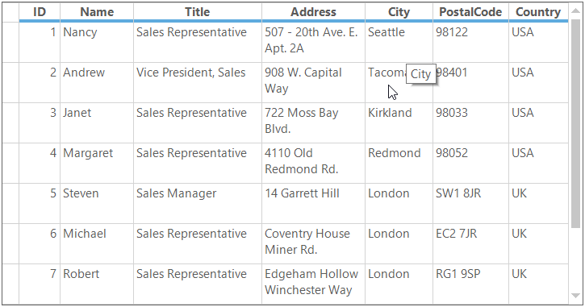
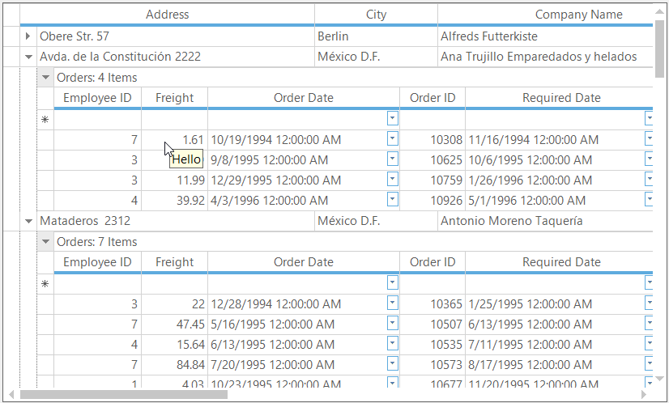
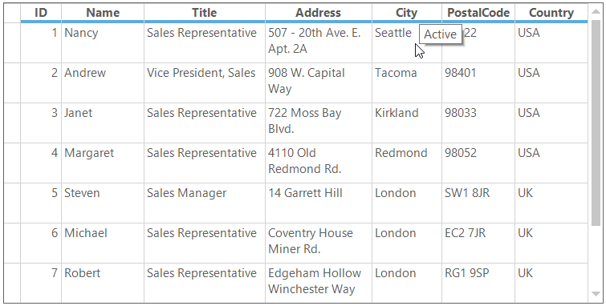

# ToolTip in Windows Forms GridGrouping control

The ToolTip can be added to the individual cells. This allows a user to show more information about the particular cell on mouse hover.

## Adding ToolTip

The ToolTip can be added to the particular cell by setting [CellTipText](https://help.syncfusion.com/cr/windowsforms/Syncfusion.Windows.Forms.Grid.GridStyleInfo.html#Syncfusion_Windows_Forms_Grid_GridStyleInfo_CellTipText) property in the [QueryCellStyleInfo](https://help.syncfusion.com/cr/windowsforms/Syncfusion.Windows.Forms.Grid.Grouping.GridGroupingControl.html) event. 



this.gridGroupingControl1.QueryCellStyleInfo += gridGroupingControl1_QueryCellStyleInfo;

void gridGroupingControl1_QueryCellStyleInfo(object sender, Syncfusion.Windows.Forms.Grid.Grouping.GridTableCellStyleInfoEventArgs e)
{

    if (e.Style.TableCellIdentity.Column != null && e.Style.TableCellIdentity.Column.Name == "FirstName"
        && e.TableCellIdentity.DisplayElement != null && e.TableCellIdentity.DisplayElement.Kind == Syncfusion.Grouping.DisplayElementKind.Record)
    {

        //Setting the ToolTip text.
        e.Style.CellTipText = e.TableCellIdentity.Column.Name + " is " + e.Style.Text;
    }
}


AddHandler gridGroupingControl1.QueryCellStyleInfo, AddressOf gridGroupingControl1_QueryCellStyleInfo

Private Sub gridGroupingControl1_QueryCellStyleInfo(ByVal sender As Object, ByVal e As Syncfusion.Windows.Forms.Grid.Grouping.GridTableCellStyleInfoEventArgs)

    If e.Style.TableCellIdentity.Column IsNot Nothing AndAlso e.Style.TableCellIdentity.Column.Name = "FirstName" AndAlso e.TableCellIdentity.DisplayElement IsNot Nothing AndAlso e.TableCellIdentity.DisplayElement.Kind Is Syncfusion.Grouping.DisplayElementKind.Record Then

        'Setting the ToolTip text.
        e.Style.CellTipText = e.TableCellIdentity.Column.Name & " is " & e.Style.Text
    End If
End Sub



### Adding ToolTip to Column

The ToolTip can be added to specific column by setting the `Appearance.AnyRecordFieldCell.CellTipText` property of the particular column descriptor. It will enable the ToolTip for all the cells in the column with same tip text.



//Setting ToolTip for particular column.
this.gridGroupingControl1.TableDescriptor.Columns["City"].Appearance.AnyRecordFieldCell.CellTipText = "City";


'Setting ToolTip for particular column.
Me.gridGroupingControl1.TableDescriptor.Columns("City").Appearance.AnyRecordFieldCell.CellTipText = "City"



### Adding ToolTip to Nested table

The ToolTip can be added for the nested tables by getting the child table descriptor using the  [GetTableDescriptor](https://help.syncfusion.com/cr/windowsforms/Syncfusion.Windows.Forms.Grid.Grouping.GridGroupingControl.html#Syncfusion_Windows_Forms_Grid_Grouping_GridGroupingControl_GetTableDescriptor_System_String_) method and setting the `CellTipText` to the column which you want.



// Adding ToolTip for nested table cells
this.gridGroupingControl1.GetTableDescriptor("Orders").Columns["Freight"].Appearance.AnyRecordFieldCell.CellTipText = "Hello";


' Adding ToolTip for nested table cells
Me.gridGroupingControl1.GetTableDescriptor("Orders").Columns("Freight").Appearance.AnyRecordFieldCell.CellTipText = "Hello"



N> The ToolTip will not be enabled for a cell if the `CellTipText` property of the cell is empty.

## Removing ToolTip

The ToolTip for the cell can be removed by using the [ResetCellTipText](https://help.syncfusion.com/cr/windowsforms/Syncfusion.Windows.Forms.Grid.GridStyleInfo.html#Syncfusion_Windows_Forms_Grid_GridStyleInfo_ResetCellTipText) method. It will reset the `CellTipText` property to the default values.



//Remove the ToolTip for particular column.
this.gridGroupingControl1.TableDescriptor.Columns["ColumnName"].Appearance.AnyRecordFieldCell.ResetCellTipText();


'Remove the ToolTip for particular column.
Me.gridGroupingControl1.TableDescriptor.Columns("ColumnName ").Appearance.AnyRecordFieldCell.ResetCellTipText()



## Disabling ToolTip for Control

The displaying of ToolTip on mouse hover for control can be restricted by setting the `Active` property of `CellToolTip` to `false`.



//Disable the ToolTip for GridGroupingControl.
this.gridGroupingControl1.TableControl.CellToolTip.Active = false;


'Disable the ToolTip for GridGroupingControl.
Me.gridGroupingControl1.TableControl.CellToolTip.Active = False



## Setting ToolTip delay time

The below properties are used to set the ToolTip delay time.

* [AutoPopDelay](https://learn.microsoft.com/en-us/dotnet/api/system.windows.forms.tooltip.autopopdelay?view=windowsdesktop-7.0&viewFallbackFrom=net-5.0)
* [InitialDelay](https://learn.microsoft.com/en-us/dotnet/api/system.windows.forms.tooltip.initialdelay?view=windowsdesktop-7.0&viewFallbackFrom=net-5.0)
* [ReshowDelay](https://learn.microsoft.com/en-us/dotnet/api/system.windows.forms.tooltip.reshowdelay?view=windowsdesktop-7.0&viewFallbackFrom=net-5.0)
* [AutomaticDelay](https://learn.microsoft.com/en-us/dotnet/api/system.windows.forms.tooltip.automaticdelay?view=windowsdesktop-7.0&viewFallbackFrom=net-5.0)

### AutoPopDelay

The `CellToolTip.AutoPopDelay` property enables you to shorten or lengthen the time that the `ToolTip` is displayed when the pointer is on a control. User can increase the value of this property to ensure that the user has sufficient time to read the text. The maximum time you can delay a popup is 5000 milliseconds.



//Set the ToolTip display time.
this.gridGroupingControl1.TableControl.CellToolTip.AutoPopDelay = 5000;


'Set the ToolTip display time.
Me.gridGroupingControl1.TableControl.CellToolTip.AutoPopDelay = 5000



### InitialDelay

The `CellToolTip.InitialDelay` property enables you to shorten or lengthen the time that the `ToolTip` waits before displaying a ToolTip. User can use this property to ensure that the user has ToolTips displayed quickly by shortening the time specified. The value for this property cannot exceed 32767.



//Set the ToolTip Initial delay time.
this.gridGroupingControl1.TableControl.CellToolTip.InitialDelay = 1000;


'Set the ToolTip Initial delay time.
Me.gridGroupingControl1.TableControl.CellToolTip.InitialDelay = 1000



### ReshowDelay

The `CellToolTip.ReshowDelay` property enables you to shorten or lengthen the time that the `ToolTip` waits before displaying a ToolTip after a previous ToolTip is displayed. 

When a ToolTip is currently being displayed and the user moves the pointer to another control that displays a ToolTip, the value of the `CellToolTip.ReshowDelay` property is used before showing the ToolTip for the new control. 

The ToolTip from the previous control must still be displayed in order for the delay specified in the `CellToolTip.ReshowDelay` property to be used; otherwise the `CellToolTip.InitialDelay` property value is used.



//Set the ToolTip reshow delay time.
this.gridGroupingControl1.TableControl.CellToolTip.ReshowDelay = 500;


'Set the ToolTip reshow delay time.
Me.gridGroupingControl1.TableControl.CellToolTip.ReshowDelay = 500



### AutomaticDelay

The `AutomaticDelay` property enables you to set a single delay value, which is then used to set the values of the *AutoPopDelay* , *InitialDelay*, and *ReshowDelay* properties. Each time the `CellToolTip.AutomaticDelay` property is set, the following values are set by default.

<table>
<tr>
<td>
<b>Property</b>  </td><td>
<b>Default Values</b>  </td></tr>
<tr>
<td>
AutoPopDelay  </td><td>
10 times the AutomaticDelay value.  </td></tr>
<tr>
<td>
InitialDelay  </td><td>
Equal to the AutomaticDelay value.  </td></tr>
<tr>
<td>
ReshowDelay  </td><td>
1/5 of the AutomaticDelay value.  </td></tr>
</table>


//Set the delay time for ToolTip
this.gridGroupingControl1.TableControl.CellToolTip.AutomaticDelay = 1000;


'Set the delay time for ToolTip
Me.gridGroupingControl1.TableControl.CellToolTip.AutomaticDelay = 1000



N> The [CellToolTip  ](https://help.syncfusion.com/cr/windowsforms/Syncfusion.Windows.Forms.Grid.Grouping.GridTableControl.html#Syncfusion_Windows_Forms_Grid_Grouping_GridTableControl_CellToolTip) property can be accessed through [TableControl](https://help.syncfusion.com/cr/windowsforms/Syncfusion.Windows.Forms.Grid.Grouping.GridTableControl.html) . The ToolTip delay time can be assigned to Nested tables by using the [GetTableControl](https://help.syncfusion.com/cr/windowsforms/Syncfusion.Windows.Forms.Grid.Grouping.GridGroupingControl.html#Syncfusion_Windows_Forms_Grid_Grouping_GridGroupingControl_GetTableControl_System_String_) method.

## Event

### ActivateToolTip event

[ActivateToolTip](https://help.syncfusion.com/cr/windowsforms/Syncfusion.Windows.Forms.Grid.Grouping.GridTableControl.html) event will be triggered when the mouse hovers on a cell which has the valid [CellTipText](https://help.syncfusion.com/cr/windowsforms/Syncfusion.Windows.Forms.Grid.GridStyleInfo.html#Syncfusion_Windows_Forms_Grid_GridStyleInfo_CellTipText) (`CellTipText` should not be empty).



this.gridGroupingControl1.TableControl.ActivateToolTip += TableControl_ActivateToolTip;

private void TableControl_ActivateToolTip(object sender, GridActivateToolTipEventArgs e)
{
    e.Style.CellTipText = "Active";
}


AddHandler gridGroupingControl1.TableControl.ActivateToolTip, AddressOf TableControl_ActivateToolTip

Private Sub TableControl_ActivateToolTip(ByVal sender As Object, ByVal e As GridActivateToolTipEventArgs)
    e.Style.CellTipText = "Active"
End Sub



## Disabling the ToolTip for particular cell

The displaying of ToolTip on mouse hover for particular cells can be restricted by canceling the `ActivateToolTip` event instead of setting the empty string to `CellTipText` property.



this.gridGroupingControl1.TableControl.ActivateToolTip += TableControl_ActivateToolTip;

private void TableControl_ActivateToolTip(object sender, GridActivateToolTipEventArgs e)
{

    //Disable the ToolTip for particular cell.

    if(e.ColIndex == 3 && e.RowIndex == 3)
    {
        e.Cancel = true;
    }
}


AddHandler gridGroupingControl1.TableControl.ActivateToolTip, AddressOf TableControl_ActivateToolTip

Private Sub TableControl_ActivateToolTip(ByVal sender As Object, ByVal e As GridActivateToolTipEventArgs)

    'Disable the ToolTip for particular cell.

    If e.ColIndex = 3 AndAlso e.RowIndex = 3 Then
        e.Cancel = True
    End If
End Sub



## Identify whether cell has ToolTip

To identify whether the cell has ToolTip or not, [HasCellTipText](https://help.syncfusion.com/cr/windowsforms/Syncfusion.Windows.Forms.Grid.GridStyleInfo.html#Syncfusion_Windows_Forms_Grid_GridStyleInfo_HasCellTipText) property can be used in the `QueryCellStyleInfo` event. 

The below code illustrates that back color and text color are changed for the cells which has ToolTip.



this.gridGroupingControl1.QueryCellStyleInfo += gridGroupingControl1_QueryCellStyleInfo;

void gridGroupingControl1_QueryCellStyleInfo(object sender, Syncfusion.Windows.Forms.Grid.Grouping.GridTableCellStyleInfoEventArgs e)
{

    //Checking whether the cell has ToolTip or not.

    if (e.Style.HasCellTipText)
    {
        e.Style.BackColor = Color.Green;   
        e.Style.TextColor = Color.White;
    }
}


AddHandler gridGroupingControl1.QueryCellStyleInfo, AddressOf gridGroupingControl1_QueryCellStyleInfo

Private Sub gridGroupingControl1_QueryCellStyleInfo(ByVal sender As Object, ByVal e As Syncfusion.Windows.Forms.Grid.Grouping.GridTableCellStyleInfoEventArgs)

    'Checking whether the cell has ToolTip or not.

    If e.Style.HasCellTipText Then
        e.Style.BackColor = Color.Green
        e.Style.TextColor = Color.White
    End If
End Sub 


