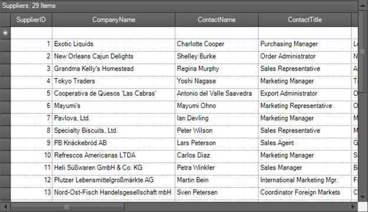
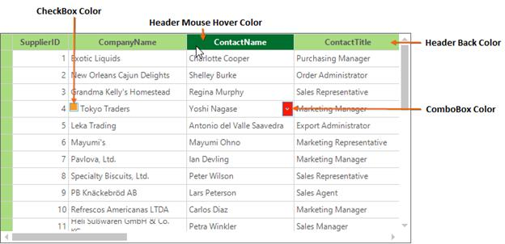
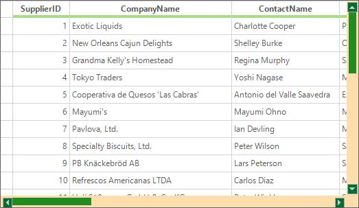

# Visual Styles
The GridGroupingControl can be displayed with the different themes by using the [GridVisualStyles](http://help.syncfusion.com/cr/cref_files/windowsforms/grid/Syncfusion.Grid.Windows~Syncfusion.Windows.Forms.Grid.GridControl~GridVisualStyles.html) property. The following themes are available for GridGroupingControl,

* Office2003
* Office2007Blue
* Office2007Black
* Office2007Silver
* Office2010Blue
* Office2010Black
* Office2010Silver
* Metro
* SystemTheme



//Applying Visual Styles to the Grid 
this.gridGroupingControl1.GridVisualStyles = Syncfusion.Windows.Forms.GridVisualStyles.Office2010Black;


'Applying Visual Styles to the Grid 
Me.gridGroupingControl1.GridVisualStyles = Syncfusion.Windows.Forms.GridVisualStyles.Office2010Black



N> To apply the enhanced themes to the GridGroupingControl, set [EnableLegacyStyle](http://help.syncfusion.com/cr/cref_files/windowsforms/grid/Syncfusion.Grid.Grouping.Windows~Syncfusion.Windows.Forms.Grid.Grouping.GridTableModel~EnableLegacyStyle.html) property to `false`. 

Along with the basic themes defined by `GridVisualStyles`, you can also apply themes by using [GridSkins](http://help.syncfusion.com/cr/cref_files/windowsforms/gridconverter/Syncfusion.GridHelperClasses.Windows~Syncfusion.GridHelperClasses.GridSkins.html). It is available as an add-on feature in the [GridHelperClasses](http://help.syncfusion.com/cr/cref_files/windowsforms/gridconverter/Syncfusion.GridHelperClasses.Windows.html) library. Currently, it comes with `Vista` skin that makes the grid components appear in vista-like look and feel. This can be set to the grid by using the [ApplySkin](http://help.syncfusion.com/cr/cref_files/windowsforms/gridconverter/Syncfusion.GridHelperClasses.Windows~Syncfusion.GridHelperClasses.GridSkins~ApplySkin.html) method.



//Apply skin to the GridGroupingControl
GridSkins.ApplySkin(this.gridGroupingControl1.TableModel, Skins.Vista);


'Apply skin to the GridGroupingControl
GridSkins.ApplySkin(Me.gridGroupingControl1.TableModel, Skins.Vista)



The change of visual styles can be handled by using the [ThemesChanged](http://help.syncfusion.com/cr/cref_files/windowsforms/grid/Syncfusion.Grid.Windows~Syncfusion.Windows.Forms.Grid.GridControlBase~ThemeChanged_EV.html) event. It will be fired while changing the [GridVisualStyles](http://help.syncfusion.com/cr/cref_files/windowsforms/grid/Syncfusion.Grid.Windows~Syncfusion.Windows.Forms.Grid.GridControl~GridVisualStyles.html) of the GridGroupingControl.

## Enabling Visual Styles   
In GridGroupingControl, themes can be enabled by setting the [ThemesEnabled](http://help.syncfusion.com/cr/cref_files/windowsforms/grid/Syncfusion.Grid.Windows~Syncfusion.Windows.Forms.Grid.GridControlBase~ThemesEnabled.html) property value as `true`. By default, the grid will be loaded with the `SystemTheme`.



//To apply other visual styles except SystemTheme
this.gridGroupingControl1.ThemesEnabled = true;


'To apply other visual styles except SystemTheme
Me.gridGroupingControl1.ThemesEnabled = True



## Applying themes for ComboBox Cell
There will be no themes applied to the ComboBox cell by default. If you want to enable the theme, set [EnableGridListControlInComboBox](http://help.syncfusion.com/cr/cref_files/windowsforms/grid/Syncfusion.Grid.Windows~Syncfusion.Windows.Forms.Grid.GridModel~EnableGridListControlInComboBox.html)  property to `false`. It will add the [GridListControl](http://help.syncfusion.com/windowsforms/gridlist/creating-grid-list-control) to the ComboBox drop down and the visual style of the grid will be applied. 



// To Use GridComboBoxCellModel in Grid
this.gridGroupingControl1.TableModel.EnableGridListControlInComboBox = false;


'To Use GridComboBoxCellModel in Grid
Me.gridGroupingControl1.TableModel.EnableGridListControlInComboBox = False



## Modifying Metro Colors
Custom colors can be applied to the metro theme by using the [SetMetroStyle](http://help.syncfusion.com/cr/cref_files/windowsforms/grid/Syncfusion.Grid.Grouping.Windows~Syncfusion.Windows.Forms.Grid.Grouping.GridGroupingControl~SetMetroStyle.html) method. It can be used to change the colors of mouse hover, pressed and clicked colors of the headers and the embedded cell controls of the GridGroupingControl.



//Create GridMetroColors object for customizing the metro visual style
GridMetroColors metroColor = new GridMetroColors();

//Set custom colors to Metro Headers of the GridGroupingControl
metroColor.HeaderColor.NormalColor = Color.FromArgb(169, 219, 128);
metroColor.HeaderColor.HoverColor = Color.FromArgb(0, 110, 46); 
metroColor.HeaderColor.PressedColor = Color.GhostWhite;

metroColor.HeaderBottomBorderWeight = GridBottomBorderWeight.None;
//set bottom border color of the column header
//metroColor.HeaderBottomBorderColor = Color.LightGreen;

//Set the back colors for the CheckBox and ComboBox
metroColor.CheckBoxColor.BackColor = Color.FromArgb(251, 157, 35);
metroColor.ComboboxColor.NormalBackColor = Color.FromArgb(255, 26, 0);

//Apply Custom colors to the Metro visual style
this.gridGroupingControl1.SetMetroStyle(metroColor);



'Create GridMetroColors object for customizing the metro visual style
Dim metroColor As New GridMetroColors()

'Set custom colors to Metro Headers of the GridGroupingControl
metroColor.HeaderColor.NormalColor = Color.FromArgb(169, 219, 128)
metroColor.HeaderColor.HoverColor = Color.FromArgb(0, 110, 46)
metroColor.HeaderColor.PressedColor = Color.GhostWhite

metroColor.HeaderBottomBorderWeight = GridBottomBorderWeight.None
'set bottom border color of the column header
'metroColor.HeaderBottomBorderColor = Color.LightGreen;

'Set the back colors for the CheckBox and ComboBox
metroColor.CheckBoxColor.BackColor = Color.FromArgb(251, 157, 35)
metroColor.ComboboxColor.NormalBackColor = Color.FromArgb(255, 26, 0)

'Apply Custom colors to the Metro visual style
Me.gridGroupingControl1.SetMetroStyle(metroColor)



## Modifying Metro Scrollbar Colors
The scrollbars of the metro visual style can be customized by setting the [MetroColorTable](http://help.syncfusion.com/cr/cref_files/windowsforms/grid/Syncfusion.Shared.Base~Syncfusion.Windows.Forms.MetroColorTable.html) property as of follows. 



//Used to set the custom colors to the Metro scrollbars
this.gridGroupingControl1.TableControl.MetroColorTable.ScrollerBackground = Color.NavajoWhite;
this.gridGroupingControl1.TableControl.MetroColorTable.ArrowNormalBackGround = Color.FromArgb(0, 110, 46);
this.gridGroupingControl1.TableControl.MetroColorTable.ThumbNormal = Color.ForestGreen;


'Used to set the custom colors to the Metro scrollbars
Me.gridGroupingControl1.TableControl.MetroColorTable.ScrollerBackground = Color.NavajoWhite
Me.gridGroupingControl1.TableControl.MetroColorTable.ArrowNormalBackGround = Color.FromArgb(0, 110, 46)
Me.gridGroupingControl1.TableControl.MetroColorTable.ThumbNormal = Color.ForestGreen



N> The scrollbar customization is briefly discussed in the [Scrolling](http://help.syncfusion.com/windowsforms/gridgrouping/sorting) section.

## Skin Manager
Theme can also be applied to the GridGroupingControl by using [SetVisualStyle](http://help.syncfusion.com/cr/cref_files/windowsforms/grid/Syncfusion.Shared.Base~Syncfusion.Windows.Forms.IContextMenuProvider~SetVisualStyle.html) method of [SkinManager](http://help.syncfusion.com/cr/cref_files/windowsforms/grid/Syncfusion.Shared.Base~Syncfusion.Windows.Forms.SkinManager_members.html).



// Code for applying visual theme for only one control.
SkinManager.SetVisualStyle(this.gridGroupingControl1, VisualTheme.Office2010Blue);


' Code for applying visual theme for only one control.
SkinManager.SetVisualStyle(Me.gridGroupingControl1, VisualTheme.Office2010Blue)


The [SkinManager](http://help.syncfusion.com/cr/cref_files/windowsforms/grid/Syncfusion.Shared.Base~Syncfusion.Windows.Forms.SkinManager_members.html) provides the supports for all the [VisualTheme](http://help.syncfusion.com/cr/cref_files/windowsforms/grid/Syncfusion.Shared.Base~Syncfusion.Windows.Forms.VisualTheme.html) available in GridGroupingControl. It is also used to apply the same visual style for all the Syncfusion controls in the form.


// Code for applying visual theme for the whole form.
SkinManager.SetVisualStyle(this, VisualTheme.Office2010Blue);


' Code for applying visual theme for the whole form.
SkinManager.SetVisualStyle(Me, VisualTheme.Office2010Blue)



## Customizing Visual Styles
All the elements of the GridGroupingControl appearance can be customized. This section will explain about the customization of the themes using [IVisualStylesDrawing](http://help.syncfusion.com/cr/cref_files/windowsforms/gridconverter/Syncfusion.Shared.Base~Syncfusion.Windows.Forms.IVisualStylesDrawing.html). 

### Customization Using IVisualStylesDrawing
The grid can be applied with the [custom visual styles](https://www.syncfusion.com/kb/760/how-can-i-create-the-custom-themes-and-apply-to-the-gridcontrol) by implementing the [IVisualStylesDrawing](http://help.syncfusion.com/cr/cref_files/windowsforms/grid/Syncfusion.Shared.Base~Syncfusion.Windows.Forms.IVisualStylesDrawing_members.html) interface. This interface provides the list of methods for drawing the icons and header colors of the grid.



public class CustomTheme : IVisualStylesDrawing
{
    private GridVisualStyles visualStyle;

    public CustomTheme(GridVisualStyles style)
    {
        this.visualStyle = style;

    }
    public CustomTheme(GridVisualStyles style, bool legacyStyle)
    {
        this.visualStyle = style;
        this.isLegacyStyle = legacyStyle;
    }

    
    public void DrawHeaderStyle(Graphics g, Rectangle rect, ThemedHeaderDrawing.HeaderState state)
    {            
        //Check for empty headers
        if (rect.Height == 0 && rect.Width == 0)
            return;

        //Check for the current state of the header and paints the foreground accordingly.

        if (state == ThemedHeaderDrawing.HeaderState.Normal)
        {
            LinearGradientBrush br = new LinearGradientBrush(rect, Color.FromArgb(255, 128, 255), Color.FromArgb(255, 0, 128), LinearGradientMode.Vertical);
            g.FillRectangle(br, rect);                
            g.FillRectangle(br, new Rectangle(rect.X + 1, rect.Y + 1, rect.Width - 2, rect.Height - 2));
            br.Dispose();
        }            
        else
        {               
            LinearGradientBrush br = new LinearGradientBrush(rect, Color.FromArgb(0, 128, 0), Color.FromArgb(128, 255, 128), LinearGradientMode.Vertical);
            g.FillRectangle(br, rect);
            g.FillRectangle(br, new Rectangle(rect.X + 1, rect.Y + 1, rect.Width - 2, rect.Height - 2));
            br.Dispose();
        }
    }
    // IVisualStylesDrawing Members …
}



Public Class CustomTheme
    Implements IVisualStylesDrawing
    Private visualStyle As GridVisualStyles

    Public Sub New(ByVal style As GridVisualStyles)
        Me.visualStyle = style

    End Sub
    Public Sub New(ByVal style As GridVisualStyles, ByVal legacyStyle As Boolean)
        Me.visualStyle = style
        Me.isLegacyStyle = legacyStyle
    End Sub

    Public Sub DrawHeaderStyle(ByVal g As Graphics, ByVal rect As Rectangle, ByVal state As ThemedHeaderDrawing.HeaderState)
        'Check for empty headers
        If rect.Height = 0 AndAlso rect.Width = 0 Then
            Return
        End If

        'Check for the current state of the header and paints the foreground accordingly.

        If state Is ThemedHeaderDrawing.HeaderState.Normal Then
            Dim br As New LinearGradientBrush(rect, Color.FromArgb(255, 128, 255), Color.FromArgb(255, 0, 128), LinearGradientMode.Vertical)
            g.FillRectangle(br, rect)
            g.FillRectangle(br, New Rectangle(rect.X + 1, rect.Y + 1, rect.Width - 2, rect.Height - 2))
            br.Dispose()
        Else
            Dim br As New LinearGradientBrush(rect, Color.FromArgb(0, 128, 0), Color.FromArgb(128, 255, 128), LinearGradientMode.Vertical)
            g.FillRectangle(br, rect)
            g.FillRectangle(br, New Rectangle(rect.X + 1, rect.Y + 1, rect.Width - 2, rect.Height - 2))
            br.Dispose()
        End If
    End Sub
    ' IVisualStylesDrawing Members …
End Class


For applying the customized theme settings to grid, `GridVisualStyles.Custom` option should be set to `GridVisualStyles` property. After that, the `CustomTheme` class can be assigned to [GridVisualStyleDrawing](http://help.syncfusion.com/cr/cref_files/windowsforms/grid/Syncfusion.Grid.Windows~Syncfusion.Windows.Forms.Grid.GridControl~GridVisualStylesDrawing.html) property.



//Adding custom visual styles to the GridGroupingControl
this.gridGroupingControl1.GridVisualStyles = GridVisualStyles.Custom;
this.gridGroupingControl1.TableOptions.GridVisualStylesDrawing = new CustomTheme(this.gridGroupingControl1.GridVisualStyles);


'Adding custom visual styles to the GridGroupingControl
Me.gridGroupingControl1.GridVisualStyles = GridVisualStyles.Custom
Me.gridGroupingControl1.TableOptions.GridVisualStylesDrawing = New CustomTheme(Me.gridGroupingControl1.GridVisualStyles)



