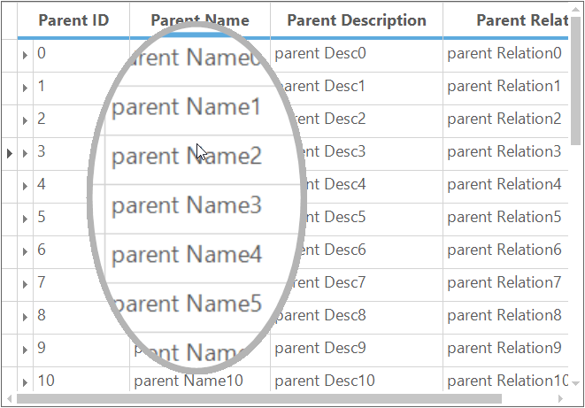

# Zooming in Windows Forms GridGrouping control
GridGroupingControl supports zooming functionality by magnifying the image of grid for better visualization. Zooming can be enabled by initializing [ZoomGroupingGrid](https://help.syncfusion.com/cr/windowsforms/Syncfusion.GridHelperClasses.Zoom.ZoomGroupingGrid.html) class where the constructor takes a parameter as a GridGroupingControl object. The [GridHelperClasses.Windows](https://help.syncfusion.com/cr/windowsforms/Syncfusion.GridHelperClasses.html) assembly provides this support. 



// Initialize the Zooming to GridGroupingControl   
ZoomGroupingGrid zoom = new ZoomGroupingGrid(this.gridGroupingControl1);


' Initialize the Zooming to GridGroupingControl   
Dim zoom As New ZoomGroupingGrid(Me.gridGroupingControl1)



There are two kinds of zooming that can be seen in GridGroupingControl. They are,

1. [Grid Level Zooming](#grid-level-zooming)
2. [Cell Level Zooming](#cell-level-zooming)

## Grid Level Zooming
For enabling the grid level zooming, you can make use of the [zoomGrid](https://help.syncfusion.com/cr/windowsforms/Syncfusion.GridHelperClasses.Zoom.ZoomGroupingGrid.html#Syncfusion_GridHelperClasses_Zoom_ZoomGroupingGrid_zoomGrid_System_String_) method and pass the percentage value as string in this method. The string values can be varied from 0 to 400.



// Initialize the Zooming to GridGroupingControl       
zoom = new ZoomGroupingGrid(this.gridGroupingControl1);

// Enables to zoom the whole grid
zoom.zoomGrid("150");


' Initialize the Zooming to GridGroupingControl       
zoom = New ZoomGroupingGrid(Me.gridGroupingControl1)

' Enables to zoom the whole grid
zoom.zoomGrid("150")



## Cell Level Zooming
GridGroupingControl can be zoomed in cell by cell basis by just clicking over the cell. To achieve this functionality, set the [zoomCell](https://help.syncfusion.com/cr/windowsforms/Syncfusion.GridHelperClasses.Zoom.ZoomGroupingGrid.html#Syncfusion_GridHelperClasses_Zoom_ZoomGroupingGrid_zoomCell) property to `true`.



// Initialize the Zooming to GridGroupingControl   
ZoomGroupingGrid zoom = new ZoomGroupingGrid(this.gridGroupingControl1);

// Enable the zooming of cells
ZoomGroupingGrid.zoomCell = true;


' Initialize the Zooming to GridGroupingControl   
Dim zoom As New ZoomGroupingGrid(Me.gridGroupingControl1)

' Enable the zooming of cells
ZoomGroupingGrid.zoomCell = True



## Customize Zooming

### Zooming in Ellipse Mode
By default, GridGroupingControl uses the ellipse mode while clicking the cells for zooming. To change the mode make use of the [ZoomImageMode](https://help.syncfusion.com/cr/windowsforms/Syncfusion.GridHelperClasses.Zoom.ZoomGroupingGrid.html#Syncfusion_GridHelperClasses_Zoom_ZoomGroupingGrid_ZoomImageMode) property. The display of the ellipse shape can be controlled by using the [ZoomSize](https://help.syncfusion.com/cr/windowsforms/Syncfusion.GridHelperClasses.Zoom.ZoomGroupingGrid.html#Syncfusion_GridHelperClasses_Zoom_ZoomGroupingGrid_ZoomSize) property in which you can set the height and width of the ellipse. The default height and width is `150`. The default value of the zoom factor is `1.5`.



// Sets Zoom mode to ellipse shaped structure
zoom.ZoomImageMode = ZoomGroupingGrid.ImageMode.Ellipse;

// Sets the zoom size while zooming cells
zoom.ZoomSize = new Size(250, 400);


' Sets Zoom mode to ellipse shaped structure while zooming
zoom.ZoomImageMode = ZoomGroupingGrid.ImageMode.Ellipse

' Sets the zoom size while zooming cells
zoom.ZoomSize = New Size(250, 400)



### Zooming in Rectangle Mode
To enable the rectangle shape zooming, set the [ZoomImageMode](https://help.syncfusion.com/cr/windowsforms/Syncfusion.GridHelperClasses.Zoom.ZoomGroupingGrid.html#Syncfusion_GridHelperClasses_Zoom_ZoomGroupingGrid_ZoomImageMode)  property to `ImageMode.Rectangle`. The display of the rectangle shape can be controlled by using the [ZoomSize](https://help.syncfusion.com/cr/windowsforms/Syncfusion.GridHelperClasses.Zoom.ZoomGroupingGrid.html#Syncfusion_GridHelperClasses_Zoom_ZoomGroupingGrid_ZoomSize) property in which you can set the height and width of the rectangle. The default height and width is `150`. The default value of the zoom factor is `1.5`.



// Sets zoom mode to rectangle shaped structure
zoom.ZoomImageMode = ZoomGroupingGrid.ImageMode.Rectangle;

// Sets the zoom size while zooming cells
zoom.ZoomSize = new Size(250, 400);


' Sets zoom mode to rectangle shaped structure
zoom.ZoomImageMode = ZoomGroupingGrid.ImageMode.Rectangle

' Sets the zoom size while zooming cells
zoom.ZoomSize = New Size(250, 400)



### Changing Border Color
The border color can be changed of a cell (which is zoomed) by using the [ZoomBorderColor](https://help.syncfusion.com/cr/windowsforms/Syncfusion.GridHelperClasses.Zoom.ZoomGroupingGrid.html#Syncfusion_GridHelperClasses_Zoom_ZoomGroupingGrid_ZoomBorderColor) property. By default, no color is set.



// Sets the border color of the zoomed cell
zoom.ZoomBorderColor = Color.ForestGreen;


' Sets the border color of the zoomed cell
zoom.ZoomBorderColor = Color.ForestGreen



### Changing Border Size
The size of the border also can be changed by using the [ZoomBorderSize](https://help.syncfusion.com/cr/windowsforms/Syncfusion.GridHelperClasses.Zoom.ZoomGroupingGrid.html#Syncfusion_GridHelperClasses_Zoom_ZoomGroupingGrid_ZoomBorderSize) property. By default, the value is `One`. The border value can be reached up to 50, after that the border value will be considered as 50 automatically.



// Sets the border size of the zoomed cell
zoom.ZoomBorderSize = 50;


' Sets the border size of the zoomed cell
zoom.ZoomBorderSize = 50



### Zoom Factor
In cell level zooming, the zooming factor can be controlled for the zoomed cell by using the [ZoomFactor](https://help.syncfusion.com/cr/windowsforms/Syncfusion.GridHelperClasses.Zoom.ZoomGroupingGrid.html#Syncfusion_GridHelperClasses_Zoom_ZoomGroupingGrid_ZoomFactor) property. The default value is `1.5`. The value of the zoom factor should not be greater than `4.0`.



// Sets the zoom factor while zooming a cell
zoom.ZoomFactor = 2.5f;


' Sets the zoom factor while zooming a cell
zoom.ZoomFactor = 2.5f



