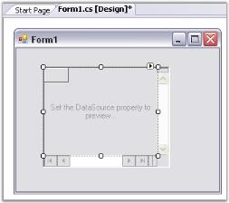

# Getting started

This section will explain to create a simple application with GridRecordNavigationControl and its functionalities.

## Assembly deployment

Refer [control dependencies](https://help.syncfusion.com/windowsforms/control-dependencies#gridrecordnavigationcontrol) section to get the list of assemblies or NuGet package needs to be added as reference to use the control in any application. 

## Creating application with GridRecordNavigationControl

This section will provide step-by-step procedure to create Grid Record Navigation control through designer and through programmatically approach in.NET application.

### Through Designer

With the designer you can drag both Grid Record Navigation control and Grid control (either Grid control or Data Bound Grid) from the toolbox onto your form. But, to get the proper initialization code generated by the designer, you must first drop and position Grid Record Navigation control on your form and then drag the grid directly onto Grid Record Navigation control. Do not drop the grid onto the form.

1. Drag GridRecordNavigationControl object from your toolbox and drop it on the form.

   

2. Size and position it.
3. Drag GridDataBoundGrid object from your toolbox and drop it on Grid Record Navigation control (and not the form itself).

   

4. Set GridDataBoundGrid.DataSource property to an appropriate object.

   

5. Run the application. The following will be the output.

   

   {:.prettyprint}

A Grid Record Navigation control is created.

### Through Code

Here is some minimal code that is necessary to create Grid Record Navigation control.



this.recordNavigationControl1 = new Syncfusion.Windows.Forms.Grid.GridRecordNavigationControl();
this.recordNavigationControl1.Location = new System.Drawing.Point(32, 48);
this.recordNavigationControl1.MaxLabel = "of 1000";
this.recordNavigationControl1.MaxRecord = 1000;
this.recordNavigationControl1.NavigationBarWidth = 237;
this.recordNavigationControl1.Size = new System.Drawing.Size(520, 256);
this.recordNavigationControl1.SplitBars = Syncfusion.Windows.Forms.DynamicSplitBars.Both;
this.gridControl1 = new Syncfusion.Windows.Forms.Grid.GridControl();
this.gridControl1.ColCount = 16;
this.gridControl1.NumberedRowHeaders = false;
this.gridControl1.RowCount = 1000;

//Adds the grid to the Record Navigation control.
this.recordNavigationControl1.Controls.Add(this.gridControl1);

//Adds the Record Navigation control to the form.
this.Controls.Add(this.recordNavigationControl1);


Me.recordNavigationControl1 = New Syncfusion.Windows.Forms.Grid.GridRecordNavigationControl()
Me.recordNavigationControl1.Location = New System.Drawing.Point(32, 48)
Me.recordNavigationControl1.MaxLabel = "of 1000"
Me.recordNavigationControl1.MaxRecord = 1000
Me.recordNavigationControl1.NavigationBarWidth = 237
Me.recordNavigationControl1.Size = New System.Drawing.Size(520, 256)
Me.recordNavigationControl1.SplitBars = Syncfusion.Windows.Forms.DynamicSplitBars.Both
Me.gridControl1 = New Syncfusion.Windows.Forms.Grid.GridControl()
Me.gridControl1.ColCount = 16
Me.gridControl1.NumberedRowHeaders = False
Me.gridControl1.RowCount = 1000

'Adds the grid to the Record Navigation control.
Me.recordNavigationControl1.Controls.Add(Me.gridControl1)

'Adds the Record Navigation control to the form.
Me.Controls.Add(Me.recordNavigationControl1)


