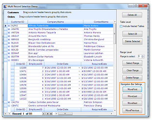

# Built in Navigation in Windows Forms GridRecordNavigationControl

The GridGrouping control provides four types of built-in navigation support to navigate between the first, last, previous, and next records. 

## Use case scenarios

When lots of records are in your application, this feature helps you to easily navigate to the required record.

<table>
<tr>
<th>
METHOD</th><th>
DESCRIPTION</th><th>
PARAMETERS</th><th>
TYPE</th><th>
RETURN TYPE</th><th>
REFERENCE LINKS</th></tr>
<tr>
<td>
MoveFirst()</td><td>
Navigate to the first record.</td><td>
N/A </td><td>
method</td><td>
void </td><td>
N/A. </td></tr>
<tr>
<td>
MoveLast()</td><td>
Navigate to the last record.</td><td>
N/A</td><td>
method</td><td>
void</td><td>
N/A</td></tr>
<tr>
<td>
MoveNext()</td><td>
Navigate to the next record.</td><td>
N/A</td><td>
method</td><td>
void</td><td>
N/A</td></tr>
<tr>
<td>
MovePrevious()</td><td>
Navigate to the previous record.</td><td>
N/A </td><td>
method</td><td>
void</td><td>
N/A</td></tr>
</table>

## Sample link

A demo of this feature is available in the following location:

_<Install Location>\Syncfusion\EssentialStudio\[Version Number]\Windows\Grid.Grouping.Windows\Samples\Selection\Record Range Selection Demo_

## Adding navigation Bar to the RecordNavigationControl

Follow the steps to add navigation bar:

1. Enable navigation bar by setting the ShowNavigationBar property to true. 




 this.gridGroupingControl1.ShowNavigationBar = true;



Me.gridGroupingControl1.ShowNavigationBar = True



{{ codesnippet1 | OrderList_Indent_Level_1 }}

2. Call the methods for navigation bar i.e. MoveFirst(), MoveLast(), MoveNext(), and MovePrevious() methods.  




//This property should set to true to show navigation bar.      
this.gridGroupingControl1.ShowNavigationBar = true;

//This method is used to navigate the first record.this.gridGroupingControl1.RecordNavigationBar.MoveFirst();

//This method is used to navigate the last record.this.gridGroupingControl1.RecordNavigationBar.MoveLast();

//This method is used to navigate the next record.this.gridGroupingControl1.RecordNavigationBar.MoveNext();

//This method is used to navigate the previous record.    
 this.gridGroupingControl1.RecordNavigationBar.MovePrevious();



'This property should set to true to show the navigation bar.      
Me.gridGroupingControl1.ShowNavigationBar = True'This method is used to navigate the first record.   
Me.gridGroupingControl1.RecordNavigationBar.MoveFirst()'This method is used to navigate the last record.   
Me.gridGroupingControl1.RecordNavigationBar.MoveLast()'This method is used to navigate the next record. 
Me.gridGroupingControl1.RecordNavigationBar.MoveNext()'This method is used to navigate the previous record.
Me.gridGroupingControl1.RecordNavigationBar.MovePrevious()



{{ codesnippet2 | OrderList_Indent_Level_1 }}
   
   
