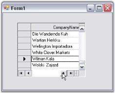

# Getting Started with Windows Forms GridRecordNavigationControl

This section explains creating a simple application with GridRecordNavigationControl and its functionalities.

## Assembly deployment

Following assemblies should be added as reference to use the GridRecordNavigationControl in any application.

<table>
<tr>
<th>
Required assemblies  </th><th>
Description  </th></tr>
<tr>
<td>
{{'[Syncfusion.Grid.Windows](https://help.syncfusion.com/cr/windowsforms/Syncfusion.Windows.Forms.Grid.html)'| markdownify }}  </td><td>
Contains classes that handles all UI operations, fundamentals, and base classes of the GridRecordNavigationControl.  </td></tr>
<tr>
<td>
{{'[Syncfusion.Shared.Base](https://help.syncfusion.com/cr/windowsforms/Syncfusion.Windows.Forms.html)'| markdownify }}  </td><td>
Contains style related properties and various editor controls used in the GridRecordNavigationControl.  </td></tr>
</table>

## Creating application with GridRecordNavigationControl

This section provides step-by-step procedure to create a Grid Record Navigation control through designer and programmatically approach in.NET application.

### Through designer

You can drag both Grid Record Navigation control and Grid control (either Grid control or Data Bound Grid) from the toolbox to the form. But, to get proper initialization code generated by the designer, drop and position the Grid Record Navigation control to the form and drag the grid directly into Grid Record Navigation control. Do not drop the grid in the form.

1. Drag the GridRecordNavigationControl object from your toolbox and drop it on the form.

   

2. Size and position it.
3. Drag the GridDataBoundGrid object from your toolbox and drop it on Grid Record Navigation control (and not the form itself).

   

4. Set the GridDataBoundGrid.DataSource property to an appropriate object.

   

5. Run the application. A GridRecordNavigation control will be created.

   

### Through code

Here is some minimal code necessary to create the GridRecordNavigation control.



this.recordNavigationControl1 = new Syncfusion.Windows.Forms.Grid.GridRecordNavigationControl();
this.recordNavigationControl1.Location = new System.Drawing.Point(32, 48);
this.recordNavigationControl1.MaxLabel = "of 1000";
this.recordNavigationControl1.MaxRecord = 1000;
this.recordNavigationControl1.NavigationBarWidth = 237;
this.recordNavigationControl1.Size = new System.Drawing.Size(520, 256);
this.recordNavigationControl1.SplitBars = Syncfusion.Windows.Forms.DynamicSplitBars.Both;
this.gridControl1 = new Syncfusion.Windows.Forms.Grid.GridControl();
this.gridControl1.ColCount = 16;
this.gridControl1.NumberedRowHeaders = false;
this.gridControl1.RowCount = 1000;

//Adds the grid to the Record Navigation control.
this.recordNavigationControl1.Controls.Add(this.gridControl1);

//Adds the Record Navigation control to the form.
this.Controls.Add(this.recordNavigationControl1);


Me.recordNavigationControl1 = New Syncfusion.Windows.Forms.Grid.GridRecordNavigationControl()
Me.recordNavigationControl1.Location = New System.Drawing.Point(32, 48)
Me.recordNavigationControl1.MaxLabel = "of 1000"
Me.recordNavigationControl1.MaxRecord = 1000
Me.recordNavigationControl1.NavigationBarWidth = 237
Me.recordNavigationControl1.Size = New System.Drawing.Size(520, 256)
Me.recordNavigationControl1.SplitBars = Syncfusion.Windows.Forms.DynamicSplitBars.Both
Me.gridControl1 = New Syncfusion.Windows.Forms.Grid.GridControl()
Me.gridControl1.ColCount = 16
Me.gridControl1.NumberedRowHeaders = False
Me.gridControl1.RowCount = 1000

'Adds the grid to the Record Navigation control.
Me.recordNavigationControl1.Controls.Add(Me.gridControl1)

'Adds the Record Navigation control to the form.
Me.Controls.Add(Me.recordNavigationControl1)


