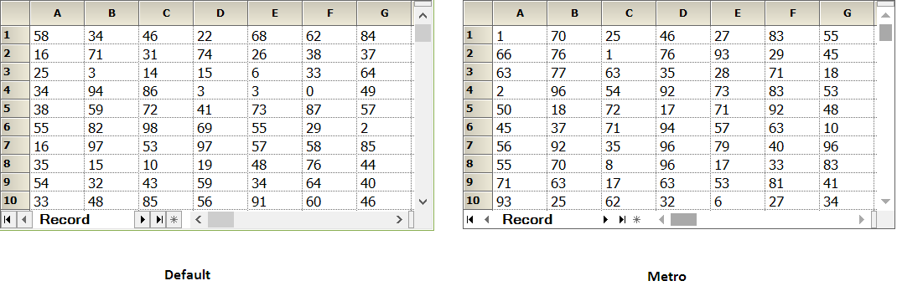
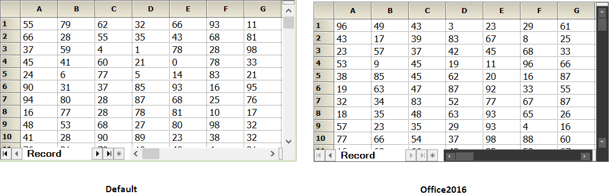

# Style in Windows Forms GridRecordNavigationControl

The RecordNavigationControl supports Visual Styles like Default, Metro, and Office2016 by using the Style property. 



this.recordNavigationControl1.Style = Syncfusion.Windows.Forms.Appearance.Metro;


Me.recordNavigationControl1.Style = Syncfusion.Windows.Forms.Appearance.Metro



 



//Applying Office 2016 Theme.
this.recordNavigationControl1.Style = Syncfusion.Windows.Forms.Appearance.Office2016;
this.recordNavigationControl1.GridOfficeScrollBars = OfficeScrollBars.Office2016;

//Applying color schemes of Office 2016 theme
this.recordNavigationControl1.Office2016ScrollBarsColorScheme = ScrollBarOffice2016ColorScheme.Black;


'Applying Office 2016 Theme.
Me.recordNavigationControl1.Style = Syncfusion.Windows.Forms.Appearance.Office2016
Me.recordNavigationControl1.GridOfficeScrollBars = OfficeScrollBars.Office2016

'Applying Color Schemes of Office 2016 Theme
Me.recordNavigationControl1.Office2016ScrollBarsColorScheme = ScrollBarOffice2016ColorScheme.Black



 
