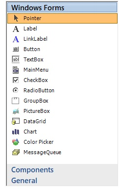
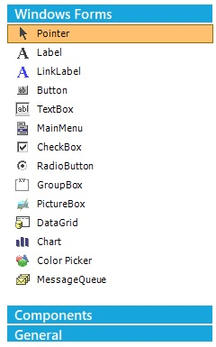
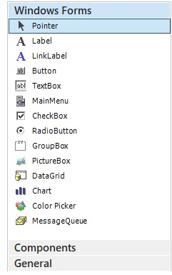

# Visual styles

The GroupBar control for Windows Forms Supports for below listed Visual Styles. You can easily modify the look using the built-in visual styles.

The styles are built in for GroupBar.

•	Default

•	Office2007

•	Office2007Outlook

•	Office2010

•	Metro

•	Office2016Colorful

•	Office2016DarkGray

•	Office2016Black

•	Office2016White

**Default**

This option helps to set the Default theme.





// Default

this.groupBar1.VisualStyle = Syncfusion.Windows.Forms.VisualStyle.Default; 





' Default

Me.groupBar1.VisualStyle = Syncfusion.Windows.Forms.VisualStyle.Default





 

**Office2007**

This option helps to set the Office2007 theme.





// Office2007

this.groupBar1.VisualStyle = Syncfusion.Windows.Forms.VisualStyle.Office2007; 





' Office2007

Me.groupBar1.VisualStyle = Syncfusion.Windows.Forms.VisualStyle.Office2007





 

You can also specify the color schemes for Office 2007 visual styles. They can be Blue, Silver, Black and Managed.

•	Blue

•	Black

•	Silver

•	Managed

**Blue**

This option is used to set the Office2007 Blue theme.





//Office2007themeBlue

this.groupBar1.VisualStyle =Syncfusion.Windows.Forms.VisualStyle.Office2007;
this. groupBar1.Office2007Theme =Syncfusion.Windows.Forms.Office2007Theme.Blue;





'Office2007ThemeBlue

Me.groupBar1.VisualStyle =Syncfusion.Windows.Forms.VisualStyle.Office2007
Me.groupBar1.Office2007Theme =Syncfusion.Windows.Forms.Office2007Theme.Blue





 

**Black**

This option helps to set the Black theme.





// Office2007ThemeBlack

this.groupBar1.VisualStyle =Syncfusion.Windows.Forms.VisualStyle.Office2007;
this.groupBar1.Office2007Theme =Syncfusion.Windows.Forms.Office2007Theme.Black;





' Office2007ThemeBlack

Me.groupBar1.VisualStyle = Syncfusion.Windows.Forms.VisualStyle.Office2007
Me.groupBar1.Office2007Theme = Syncfusion.Windows.Forms.Office2007Theme.Black





 

**Silver**

This option helps to set the Silver theme.





// Office2007ThemeSilver

this.groupBar1.VisualStyle =Syncfusion.Windows.Forms.VisualStyle.Office2007;
this.groupBar1.Office2007Theme = Syncfusion.Windows.Forms.Office2007Theme.Silver;





' Office2007ThemeSilver

Me.groupBar1.VisualStyle = Syncfusion.Windows.Forms.VisualStyle.Office2007
Me.groupBar1.Office2007Theme = Syncfusion.Windows.Forms.Office2007Theme.Silver





 

**Managed**

This option helps to apply the custom colors to the GroupBar by setting Office2007Theme to “Managed” and specifying the custom color through the ApplyManagedColors method as follows.





// Managed

this.groupbarVisualStudio.VisualStyle =Syncfusion.Windows.Forms.VisualStyle.Office2007;
this.groupbarVisualStudio.Office2007Theme = Syncfusion.Windows.Forms.Office2007Theme.Managed;
Syncfusion.Windows.Forms.Office2007Colors.ApplyManagedColors(this, Color.Red);





' Managed
Me.groupbarVisualStudio.VisualStyle = Syncfusion.Windows.Forms.VisualStyle.Office2007
Me.groupbarVisualStudio.Office2007Theme = Syncfusion.Windows.Forms.Office2007Theme.Managed
Syncfusion.Windows.Forms.Office2007Colors.ApplyManagedColors(Me, Color.Red)





 

**Office2010**

This option helps to set the Office2010 theme.





// Office2010

this.groupBar1.VisualStyle = Syncfusion.Windows.Forms.VisualStyle.Office2010; 





' Office2010

Me.groupBar1.VisualStyle = Syncfusion.Windows.Forms.VisualStyle.Office2010





 

It also specifies the color schemes for Office 2010 visual styles. They can be Blue, Silver, Black and Managed.

•	Blue

•	Black

•	Silver

•	Managed

**Blue**

This option is used to set the Office2010 Blue theme.





// Office2010ThemeBlue

this.groupBar1.VisualStyle =Syncfusion.Windows.Forms.VisualStyle.Office2010;
this.groupBar1.Office2010Theme =Syncfusion.Windows.Forms.Office2010Theme.Blue;





' Office2010ThemeBlue

Me.groupBar1.VisualStyle = Syncfusion.Windows.Forms.VisualStyle.Office2010
Me.groupBar1.Office2010Theme = Syncfusion.Windows.Forms.Office2010Theme.Blue





 

**Black**

This option is used to set the Office2010 Black theme.





// Office2010ThemeBlack

this.groupBar1.VisualStyle =Syncfusion.Windows.Forms.VisualStyle.Office2010;
this.groupBar1.Office2010Theme = Syncfusion.Windows.Forms.Office2010Theme.Black;





' Office2010ThemeBlack

Me.groupBar1.VisualStyle = Syncfusion.Windows.Forms.VisualStyle.Office2010
Me.groupBar1.Office2010Theme = Syncfusion.Windows.Forms.Office2010Theme.Black





 

**Silver**

This option is used to set the Office2010 Silver theme.





// Office2010ThemeSilver

this.groupBar1.VisualStyle = Syncfusion.Windows.Forms.VisualStyle.Office2010;
this.groupBar1.Office2010Theme = Syncfusion.Windows.Forms.Office2010Theme.Silver;





' Office2010ThemeSilver

Me.groupBar1.VisualStyle = Syncfusion.Windows.Forms.VisualStyle.Office2010
Me.groupBar1.Office2010Theme = Syncfusion.Windows.Forms.Office2010Theme.Silver





 

**Managed**

This option helps to apply the custom colors to the GroupBar by setting Office2010Theme to “Managed” and specifying the custom color through the ApplyManagedColors method as follows.





//Managed

this.groupbarVisualStudio.VisualStyle = Syncfusion.Windows.Forms.VisualStyle.Office2010;
this.groupbarVisualStudio.Office2010Theme = Syncfusion.Windows.Forms.Office2010Theme.Managed;
Syncfusion.Windows.Forms.Office2010Colors.ApplyManagedColors(this, Color.Red);





' Managed

Me.groupbarVisualStudio.VisualStyle = Syncfusion.Windows.Forms.VisualStyle.Office2010
Me.groupbarVisualStudio.Office2010Theme = Syncfusion.Windows.Forms.Office2010Theme.Managed
Syncfusion.Windows.Forms.Office2010Colors.ApplyManagedColors(Me, Color.Red)





 

**Metro**

This option helps to set the Metro theme.





// Metro

this.groupBar1.VisualStyle = Syncfusion.Windows.Forms.VisualStyle.Metro; 





' Metro

Me.groupBar1.VisualStyle = Syncfusion.Windows.Forms.VisualStyle.Metro





 

**Office2016Colorful**

This option helps to set the Office2016Colorful theme.





// Office2016Colorful

this.groupBar1.VisualStyle = Syncfusion.Windows.Forms.VisualStyle.Office2016Colorful; 





' Office2016Colorful

Me.groupBar1.VisualStyle = Syncfusion.Windows.Forms.VisualStyle.Office2016Colorful





 

**Office2016DarkGray**

This option helps to set the Office2016DarkGray theme.





// Office2016DarkGray

this.groupBar1.VisualStyle = Syncfusion.Windows.Forms.VisualStyle.Office2016DarkGray; 





' Office2016DarkGray

Me.groupBar1.VisualStyle = Syncfusion.Windows.Forms.VisualStyle.Office2016DarkGray





 

**Office2016Black**

This option helps to set the Office2016Black theme.





// Office2016Black

this.groupBar1.VisualStyle = Syncfusion.Windows.Forms.VisualStyle.Office2016Black; 





' Office2016Black

Me.groupBar1.VisualStyle = Syncfusion.Windows.Forms.VisualStyle.Office2016Black





 

**Office2016White**

This option helps to set the Office2016White theme.





// Office2016White

this.groupBar1.VisualStyle = Syncfusion.Windows.Forms.VisualStyle.Office2016White; 
 




' Office2016White

Me.groupBar1.VisualStyle = Syncfusion.Windows.Forms.VisualStyle.Office2016Black





 

