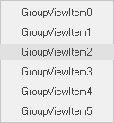

# Getting started

This section describes how to add [GroupView](https://help.syncfusion.com/cr/cref_files/windowsforms/tools/Syncfusion.Shared.Base~Syncfusion.Windows.Forms.Tools.GroupView.html) control in a Windows Forms application and overview of its basic functionalities.

## Assembly deployment

The following list of assemblies should be added as reference to use the [GroupView](https://help.syncfusion.com/cr/cref_files/windowsforms/tools/Syncfusion.Shared.Base~Syncfusion.Windows.Forms.Tools.GroupView.html) in any application:

<table>
<tr>
<td>
{{'**Required assemblies**'| markdownify }}
</td>
<td>
{{'**Description**'| markdownify }}
</td>
</tr>
<tr>
<td>
Syncfusion.Shared.Base
</td>
<td>
The Syncfusion.Shared.Base contains the class that handles all UI operations and contains helper class of GroupView control.
</td>
</tr>
</table>

## Installing NuGet Packages

To use [GroupView](https://help.syncfusion.com/cr/cref_files/windowsforms/tools/Syncfusion.Shared.Base~Syncfusion.Windows.Forms.Tools.GroupView.html) control in Windows Forms application via nuget, the following packages should be installed.
 
<table>
<tr>
<td>{{'**S.No**'| markdownify }}
</td>
<td>{{'**Framework version**'| markdownify }}
</td>
<td>{{'**NuGet Packages**'| markdownify }}
</td>
</tr>
<tr>
<td> 1
</td>
<td> 2.0
</td>
<td> Syncfusion.Shared.Base20
</td>
</tr>
<tr>
<td> 2
</td>
<td> 3.5
</td>
<td> Syncfusion.Shared.Base35
</td>
</tr>
<tr>
<td> 3
</td>
<td> 4.0
</td>
<td> Syncfusion.Shared.Base40
</td>
</tr>
<tr>
<td> 4
</td>
<td> 4.5
</td>
<td> Syncfusion.Shared.Base45
</td>
</tr>
<tr>
<td> 5
</td>
<td> 4.5.1
</td>
<td> Syncfusion.Shared.Base451
</td>
</tr>
<tr>
<td> 6
</td>
<td> 4.6
</td>
<td>Syncfusion.Shared.Base46
</td>
</tr>
</table>
 
Please find more details regarding how to install the nuget packages in windows form application in the below link:
 
[How to install nuget packages](https://help.syncfusion.com/windowsforms/nuget-packages)

# Creating simple application with GroupView

You can create the Windows Forms application with GroupView control as follows:

1. [Creating project](#creating-the-project)
2. [Adding control via designer](#adding-control-via-designer)
3. [Adding control manually using code](#adding-control-manually-using-code)

### Creating the project

Create a new Windows Forms project in the Visual Studio to display the [GroupView](https://help.syncfusion.com/cr/cref_files/windowsforms/tools/Syncfusion.Shared.Base~Syncfusion.Windows.Forms.Tools.GroupView.html) with basic functionalities.

## Adding control via designer

The [GroupView](https://help.syncfusion.com/cr/cref_files/windowsforms/tools/Syncfusion.Shared.Base~Syncfusion.Windows.Forms.Tools.GroupView.html) control can be added to the application by dragging it from the toolbox and dropping it in a designer view. The following required assembly references will be added automatically:

* Syncfusion.Shared.Base.dll

Items can be added to GroupView container using [GroupViewItems](https://help.syncfusion.com/cr/cref_files/windowsforms/tools/Syncfusion.Shared.Base~Syncfusion.Windows.Forms.Tools.GroupView~GroupViewItems.html) collection property.

## Adding control manually using code

To add control manually in C#, follow the given steps:

**Step 1** - Add the following required assembly references to the project:

	* Syncfusion.Shared.Base.dll

**Step 2** - Include the namespaces **Syncfusion.Windows.Forms.Tools**.





using Syncfusion.Windows.Forms.Tools;





Imports Syncfusion.Windows.Forms.Tools



 

**Step 3** - Create `GroupView` control instance and add it to the form.





GroupView groupView1 = new GroupView();

this.Controls.Add(groupView1);





Dim groupView1 As GroupView = New GroupView()

Me.Controls.Add(groupView1)





**Step 4** - Items can be added to GroupView container using [GroupViewItems](https://help.syncfusion.com/cr/cref_files/windowsforms/tools/Syncfusion.Shared.Base~Syncfusion.Windows.Forms.Tools.GroupView~GroupViewItems.html) collection property.





this.groupView1.GroupViewItems.AddRange(new GroupViewItem[] {
            new GroupViewItem("GroupViewItem0",0),
            new GroupViewItem("GroupViewItem1",0),
            new GroupViewItem("GroupViewItem2",0),
            new GroupViewItem("GroupViewItem3",0),
            new GroupViewItem("GroupViewItem4",0),
             new GroupViewItem("GroupViewItem5",0)});





Me.groupView1.GroupViewItems.AddRange(new GroupViewItem[] {
            new GroupViewItem("GroupViewItem0",0),
            new GroupViewItem("GroupViewItem1",0),
            new GroupViewItem("GroupViewItem2",0),
            new GroupViewItem("GroupViewItem3",0),
            new GroupViewItem("GroupViewItem4",0),
             new GroupViewItem("GroupViewItem5",0)})





 