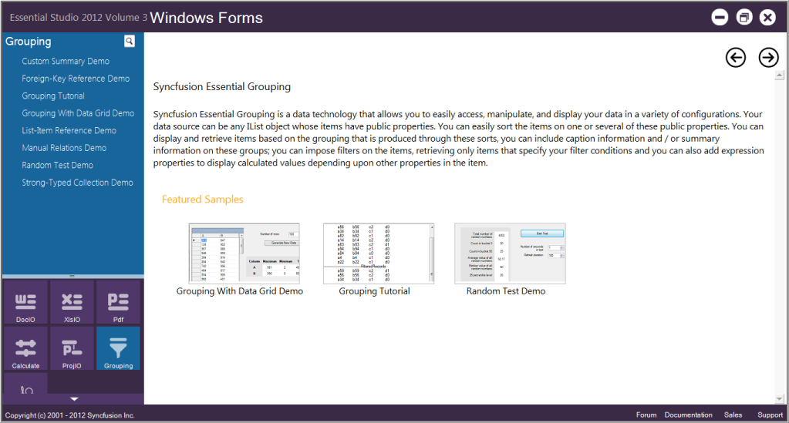
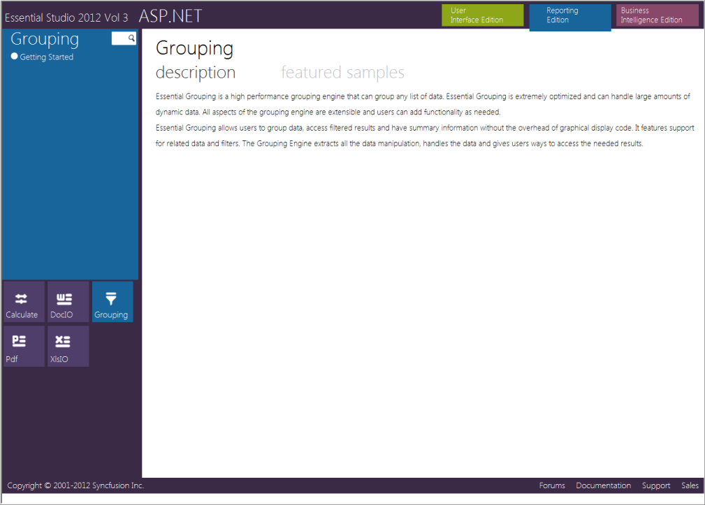

# Installation and Deployment

This section covers information on the install location, samples, licensing, patches update and updation of the recent version of Essential Studio®. It comprises the following subsections:

## Installation

For step-by-step installation procedure for the installation of Essential Studio®, refer to the Installation topic under Installation and Deployment in the Common UG.

For licensing, patches and information on adding or removing selective components refer the following topics in Common UG under Installation and Deployment.

* Licensing
* Patches
* Add / Remove Components

## Where to Find Samples?

This section provides the location of the installed samples and describes the procedure to run the samples in the sample browser and online. It also lists the location of utilities, assemblies, and source code.

Sample Installation Location

Sample install locations for different platforms are listed below:

Windows Forms Samples – The Grouping Windows Forms samples are installed in the following location:

* [Install Location]:\...\Syncfusion\Essential Studio\[Version Number]\Windows\Grouping.Windows\Samples\2.0
* ASP.NET Samples – The Grouping Web samples are installed in the following location:
* [Install Location]:\...\Syncfusion\Essential Studio\[Version Number]\Web\Grouping.Web\Samples\3.5

### Viewing Samples

To view the samples: 

1. Click Start All Programs  Syncfusion®  Essential Studio® <version number>  Dashboard. 

   The UI Edition samples are displayed by default.

   

2. Select Reporting Edition.

   

The steps to view the Grouping samples in various platforms are discussed below:

### Windows

1. In the Dashboard window, click Run Samples for Windows Forms under Reporting Edition panel. The Windows Forms Sample Browser window is displayed.
 
   N> You can view the samples in any of the following three ways:
   >
   > * Run Samples – Click to view the locally installed samples.
   > * Online Samples – Click to view online samples.
   > * Explore Samples – Explore Windows Forms samples on disk.

   

2. Click Grouping from the bottom-left pane. The Grouping samples are displayed.

   

3. Select any sample and browse through the features.

### ASP.NET

1. In the Dashboard window, click Run Samples for ASP.NET under Reporting Edition panel. The ASP.NET Sample Browser window is displayed.
 
   N> You can view the samples in any of the three ways displayed:

   

2. Click Grouping from the bottom-left pane.The Grouping samples are displayed.

   

3. Select any sample and browse through the features.

### Source Code Location

#### Windows Forms Source Code

The default location of the Windows Forms Grouping source code is:

[System Drive]:\Program Files\Syncfusion\Essential Studio\[Version Number]\Windows\Grouping.Windows\Src

#### ASP.NET Source Code

The default location of the ASP.NET Grouping source code is:

[System Drive]:\Program Files\Syncfusion\Essential Studio\[Version Number]\Web\Grouping.Web\Src

## Deployment Requirements

### Assembly List

While deploying an application that references Syncfusion® Essential® Grouping assembly, the following dependencies must be included in the distribution.

#### Windows Forms – Grouping

* Syncfusion.Core.dll
* Syncfusion.Shared.Base.dll
* Syncfusion.Shared.Windows.dll
* Syncfusion.Grouping.Base.dll
* Syncfusion.Grouping.Windows.dll

#### ASP.NET - Grouping

* Syncfusion.Core.dll
* Syncfusion.Shared.Base.dll
* Syncfusion.Shared.Web.dll
* Syncfusion.Grouping.Base.dll
* Syncfusion.Grouping.Windows.dll
* Syncfusion.Grouping.Web.dll
