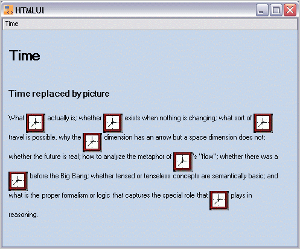

#  Element Format

Essential HTMLUI supports formatting of not only the entire HTML document as a whole, but also the individual elements. With HTMLUI, the user can replace any HTML element into some other format before displaying, in a view to develop advanced user interactivity.

The following snippet shows how a text content can be replaced with an image in a text sequence. 



private const string DEF_IMG_TAG = "";

private const string DEF_TIME = "time";

private void htmluiControl1_LoadFinished(object sender, System.EventArgs e)

{

// Returns the html element by its ID, defined in HTML document.

IHTMLElement p = this.htmluiControl1.Document.GetElementByUserId("p");

// Replace the  HTML inner text of current element. 

p.InnerHTML = p.InnerHTML.Replace(DEF_TIME, DEF_IMG_TAG);

this.htmluiControl1.Refresh();

}





Private Const DEF_IMG_TAG As String = ""

Private Const DEF_TIME As String = "time"

Private Sub htmluiControl1_LoadFinished(ByVal sender As Object, ByVal e As System.EventArgs)

'  Returns the html element by its ID, defined in HTML document. 

Dim p As IHTMLElement = Me.htmluiControl1.Document.GetElementByUserId("p")

' Replace the  HTML inner text of current element 

p.InnerHTML = p.InnerHTML.Replace(DEF_TIME, DEF_IMG_TAG)

Me.htmluiControl1.Refresh()

End Sub



The following image shows the text element Time replaced by an image while displayed using HTMLUI.

## ElementFormat Sample

This sample illustrates Element Formatting in HTMLUI.

