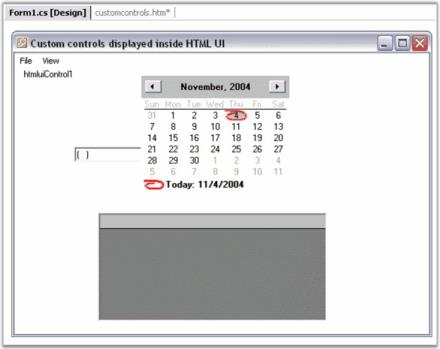

# Getting Started

What You Will Learn

This tutorial will show you how easy it is to get started using Essential HTMLUI. It will give you a basic introduction to the concepts you need to know before getting started with the product and some tips and ideas on how to implement HTMLUI into your projects to improve customization and increase efficiency. The lessons in this tutorial are meant to introduce you to HTMLUI with simple step-by-step procedures.

Creating an HTML Display Application

Lesson 1 will show you how to load HTML from any source and display it as an HTML display application (like a web browser or an HTML enabled email application). 

Creating an HTML Layout

In Lesson 2 you will learn how to lay out your user interfaces using HTMLUI. You will also learn how to let the users interact with the various HTML elements from within your application code.

## Lesson 1: Creating an HTML Display Application

The HTMLUI control can be used for displaying HTML documents with standard HTML / CSS formatting. 

In this lesson, you will learn about the following:

### Displaying HTML By Using the HTMLUI Control

1. Create a new Windows Forms application and open the main form for the application in the designer. Add the Syncfusion controls to your VS.NET toolbox if you haven't done so already. Drag an HTMLUI control onto the form.
2. HTML can be loaded into the HTMLUI control from the following sources:

* From a HTML file
* From a URI (Uniform resource Identifier)
* From a Stream

3. Add a MainMenu component from the toolbox onto the form. Also add a OpenFileDialog component to the form and name it as "openDlg".

{{ '' | markdownify }}
{:.image }

4. Add a handler for the Open menu item by double-clicking on the menu.

[C#]

this.menuItem2.Click += new System.EventHandler(this.menuItem2_Click);

private void menuItem2_Click(object sender, System.EventArgs e)

{

    // Gets or Sets the initial directory displayed by file dialog box

openDlg.InitialDirectory = GetFilesLocation();

     // Gets or Sets the current file name filter string, which determines the choices that appear in the 

    // "Save as File Type" or "File of type" box in the dialog box.

openDlg.Filter = "HTML files (*.htm)|*.htm|HTML Files (*.html)|*.html";

if( DialogResult.OK == openDlg.ShowDialog() )

{

string filePath = openDlg.FileName;

this.htmluiControl1.LoadHTML(filePath);

}

}

[VB.NET]

Me.menuItem2.Click += New System.EventHandler(Me.menuItem2_Click)

Private Sub menuItem2_Click(ByVal sender As Object, ByVal e As System.EventArgs)

'  Gets or Sets the initial directory displayed by file dialog box

openDlg.InitialDirectory = GetFilesLocation()

' Gets or Sets the current file name filter string, which determines the choices that appear in the 

'  "Save as File Type" or "File of type" box in the dialog box.

openDlg.Filter = "HTML files (*.htm)|*.htm|HTML Files (*.html)|*.html"

If DialogResult.OK = openDlg.ShowDialog() Then

Dim filePath As String = openDlg.FileName

Me.htmluiControl1.LoadHTML(filePath)

End If

End Sub

5. Now run the sample and try loading a HTML document into the HTMLUI control.

{{ '' | markdownify }}
{:.image }

Any HTML document can be loaded from a file by using the method shown in this sample.

## Lesson 2: Creating an HTML Layout

The HTMLUI control can be used for displaying sophisticated user interfaces. HTML provides extensive means to layout and customize display elements. The HTMLUI control adds the ability to create user interfaces using HTML from within Windows Forms applications using managed code.

In this lesson, you will learn about about the following:

### Creating the User Interface

1. Create a new Windows Forms application and open the main form for the application in the designer. Add Syncfusion controls to your VS .NET toolbox if you haven't done so already. Drag an HTMLUI control onto the form.

{{ '' | markdownify }}
{:.image }

2. Some of the appearance and behavior-related aspects of the HTMLUI control can be controlled by setting the appropriate properties through the Properties Grid. The HTMLUI control displays a title bar at the top of the control. Set the title for this HTMLUI control to be "HTMLUI Tutorial".

{{ '' | markdownify }}
{:.image }

3. Add a new HTML document to the Windows Forms project. Edit the HTML document to define the user interface. In this case, you will have an HTML table with 3 rows and 1 column.

[HTML]

<HTML>

<HEAD>

<TITLE> Creating User Interface </TITLE>

</HEAD>

<BODY bgcolor="#ffffff">

<TABLE id="Table1" height="360" cellSpacing="1" cellPadding="1" width="392" border="1">

<TR>

<TD align="center" height="72" valign="middle">

<INPUT id="txt" type="text" size="40" name="Text1"></INPUT>

</TD>

</TR>

<TR>

<TD align="center" height="209" valign="middle">

<TEXTAREA id="txtArea" name="Textarea1" rows="9" cols="35"></TEXTAREA>

</TD>

</TR>

<TR>

<TD align="center" valign="middle">

<INPUT id="btn" type="button" size="" value="Button" name="Button1"></INPUT>

</TD>

</TR>

</TABLE>

</BODY>

</HTML>

4. As shown in the HTML document above, a textbox, a textarea and a button control has been added in the HTML document. The objective is to create an user interface by adding a Click event to the button element and on clicking the button, the text controls are made to display some text.

5. The LoadFinished event is executed when the HTML document is loaded in the HTMLUI control. Add a handler for the LoadFinished event of the HTMLUI control. Access the HTML elements inside the managed code with objects created for each element as defined in the HTMLUI namespace.

[C#]

//Objects declaration made global

INPUTElementImpl text;

INPUTElementImpl button;

TEXTAREAElementImpl textArea;

//HTMLUI control LoadFinishedEvent handler declaration

this.htmluiControl1.LoadFinished += new System.EventHandler(this.htmluiControl1_LoadFinished);

//HTMLUI control LoadFinishedEvent definition

private void htmluiControl1_LoadFinished(object sender, System.EventArgs e)

{

Hashtable html = this.htmluiControl1.Document.GetElementsByUserIdHash();

this.text = html["txt"] as INPUTElementImpl;

this.button = html["btn"] as INPUTElementImpl;

this.textArea = html["txtArea"] as TEXTAREAElementImpl;

//Click Event declaration for HTML button element

this.button.Click += new EventHandler(button_Click);

}

private void button_Click(object sender, EventArgs e)

{

//Click Event definition and Text control UserInterface

this.text.UserControl.CustomControl.Text = "HTML provides extensive means to layout and customize display elements.";

this.textArea.UserControl.CustomControl.Text = "The HTMLUI control adds the ability to create user interfaces using HTML from within Windows Forms applications using managed code.";

}

6. Now, run the sample which displays the text on clicking the button as shown below.

{{ '' | markdownify }}
{:.image }

### Creating And Displaying Custom Controls

To create and display Custom Controls:

1. Add the Custom tags in the HTML document to display custom Windows Forms controls. In this case, a MaskedEditBox, MonthCalendar and DataGrid will be displayed in each of the cells in the HTML Table.

[HTML]

<HTML>

<HEAD>

<TITLE>HTMLUI CUSTOM CONTROLS</TITLE>

</HEAD>

<BODY>

<TABLE id="CustomControls" cellSpacing="0" cellPadding="0" width="100%" bgColor="silver" border="1" height="100%" align="center">

<TR>

<TD class="tttDisplay" height="33%" width="100%" id="cctd1" vAlign="center">

<maskededittextbox id="maskedEditTextBox1" height="20" width="136">

</maskededittextbox>

</TD>

</TR>

<TR>

<TD class="tttDisplay" height="33%" width="100%" id="cctd2" vAlign="center">

<monthcalendar id="monthCalendar1" width="199" height="155"></monthcalendar>

</TD>

</TR>

<TR>

<TD class="tttDisplay" height="33%" width="100%" id="cctd3" vAlign="center">

<datagrid id="dataGrid1" width="304" height="144"></datagrid>

</TD>

</TR>

</TABLE>

</BODY>

</HTML>

Note the custom tags maskededitbox, monthcalendar, and datagrid. These tags do not have any relation to the name of the control type they represent. Set the desired size of the custom control by setting the width and height attributes.

In the previous step, three custom controls were defined as part of the HTMLUI interface. The actual Windows Forms controls that represent these definitions have to be added to the form. 

2. Drag a MonthCalendar control from the toolbox and drop it on the form. The MonthCalendar will be named monthCalendar1 by default. Use this name in the next step to associate it with the appropriate HTML-defined control.
3. Drag a MaskedEditBox control and a DataGrid control onto the form.

{{ '' | markdownify }}
{:.image }

4. Add a handler for the PreRenderDocument event of the HTMLUI control.

This step associates the Windows Forms controls on the form with controls defined in the HTML. This is done in the PreRenderDocument event handler of the HTMLUI control. This event is raised before the control renders the HTML elements (after it has parsed the HTML document into HTML elements).

[C#]

this.htmluiControl1.PreRenderDocument += new Syncfusion.Windows.Forms.HTMLUI.PreRenderDocumentEventHandler(this.htmluiControl1_PreRenderDocument);

// Event that is to be raised when a tree of element has been created and their size and location have 

// not been calculated yet.

private void htmluiControl1_PreRenderDocument(object sender, Syncfusion.Windows.Forms.HTMLUI.PreRenderDocumentArgs e)

{

Hashtable htmlelements = new Hashtable();

htmlelements = e.Document.ElementsByUserID;

BaseElement maskedEditTextBoxElement1 = htmlelements["maskedEditTextBox1"] as BaseElement;

   // Create a new Wrapper object

new CustomControlBase( maskedEditTextBoxElement1, this.maskedEditBox1  ); 

BaseElement monthCalendarElement1 = htmlelements["monthCalendar1"] as BaseElement;

new CustomControlBase( monthCalendarElement1, this.monthCalendar1  ); 

BaseElement dataGridElement1 = htmlelements["dataGrid1"] as BaseElement;

new CustomControlBase( dataGridElement1, this.dataGrid1  ); 

}

5. Add a handler for the Load event and load the HTML document resource into the HTMLUI control.

[C#]

this.Load += new System.EventHandler(this.Form1_Load);

private void Form1_Load(object sender, System.EventArgs e)

{

LoadHTMLResource();                        

}

private bool LoadHTMLResource()

{

bool success = false;

try

{

     // Gets the Assembly that contains the code that is currently executing

_assembly = Assembly.GetExecutingAssembly();

        // Loads the specified manifest resource from the Assembly

_htmlStream = (Stream)_assembly.GetManifestResourceStream("HTMLUICustomControls.customcontrols.htm");

if(_htmlStream != null)

{

this.htmluiControl1.LoadHTML(_htmlStream);

success = true;

}

}

catch(Exception ex)

{

MessageBox.Show(ex.ToString());

}

return success;

}

{{ '' | markdownify }}
{:.image }

