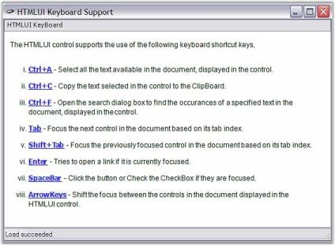

#  Keyboard

The HTMLUI control also supports usage of keyboards for navigating through the links inside a HTML document. Like in popular browsers, HTMLUI control uses the TAB key for shifting the focus on the links.

## HTMLUIKeyboard Sample

This sample shows how elements in the document can be focused by using the Keyboard support in HTMLUI.

By default, this sample can be found under the following location:

...\_My Documents\Syncfusion\EssentialStudio\Version Number\Windows\HTMLUI.Windows\Samples\Advanced Editor Functions\ActionGroupingDemo_

