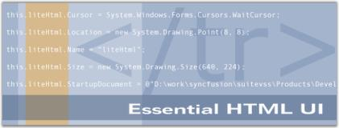

# Overview

## Introduction to Essential HTMLUI

Essential HTMLUI is a .NET Windows Forms control that supports Hyper Text Markup Language (HTML) rendering. HTML elements are exposed as programmatic elements that support standard events. These elements can be custom-painted. HTMLUI can be used as a HTML viewer or to easily lay out and customize rich application interfaces.

This control will benefit those users who want to build flexible applications. Some good examples are applications that need to be localized, themed; interfaces that need to be updated through the network without distributing the whole application, and so on.

HTMLUI is helpful in creating cool UI applications like Chat windows. It can be used to create a multiple dialog application and it can be used as an UI Editor.

### Key Features

Some of the key features of Essential HTMLUI are listed below:

* Essential HTMLUI uses the unique Syncfusion Flex-Layout mechanism to lay out any kind of user interface in a flexible manner. Defining the HTML for the layout renders the display with the rules of HTML layout applied automatically. This flexible approach to layout brings several advantages to applications that need their interfaces to be flexible. 
* HTMLUI is primarily used as an HTML renderer / viewer. The completely managed browser interface provided by HTMLUI is a natural choice for any HTML rendering interfaces such as custom web browsers, HTML help viewers, email readers, and so on.
* MHTML enables you to send and receive Web pages and other HTML documents using e-mail programs. MHTML enables you to embed images directly into the body of your e-mail messages rather than attaching them to the message. MHTML uses MIME (Multipurpose Internet Mail Extensions) which provides facilities to allow multiple objects in a single Internet e-mail message; represents formatted multifont text messages; represents non-textual material such as images, and so on.

The product comes with numerous samples as well as an extensive documentation to guide you. This User Guide provides detailed information on the features and functionalities of the HTMLUI control. It is organized into the following sections:

* Overview-This section gives a brief introduction to our product and its key features.
* Installation and Deployment-This section elaborates on the install location of the samples, license etc.
* Getting Started-This section guides you on getting started with Windows application, controls etc.
* Concepts and Features-The features of Essential HTMLUI are illustrated with use case scenarios, code examples and screen shots under this section.
* Frequently Asked Questions-This section discusses various frequently asked questions with their answers illustrated with examples and code snippets.

### Document Conventions

The conventions listed below will help you to quickly identify the important sections of information, while using the content:

<table>
<tr>
<th>
Convention</th><th>
Icon</th><th>
Description</th></tr>
<tr>
<td>
Note</td><td>

{{ 'Note:' | markdownify}}</td><td>
Represents important information</td></tr>
<tr>
<td>
Example</td><td>
Example</td><td>
Represents an example</td></tr>
<tr>
<td>
Tip</td><td>
{{ '' | markdownify}}

</td><td>
Represents useful hints that will help you in using the controls/features</td></tr>
<tr>
<td>
Additional Information</td><td>
{{ '' | markdownify}}

</td><td>
Represents additional information on the topic</td></tr>
</table>

## Prerequisites and Compatibility

This section covers the requirements that are mandatory for using Essential HTMLUI. It also lists operating systems and browsers compatible with the product.

### Prerequisites

The prerequisites details are listed below:

<table>
<tr>
<td>
Development Environments</td><td>
<ul>
<li> Visual Studio 2013</li>
<li> Visual Studio 2012</li>
<li> Visual Studio 2010 (Ultimate and Express)</li>
<li> Visual Studio 2008 (Team, Professional, Standard and Express)</li>
<li> Visual Studio 2005 (Team, Professional, Standard and Express)</li>
<li> Borland Delphi for .NET</li>
<li> SharpCode</li></ul> </td></tr>
<tr>
<td>
 .NET Framework versions</td><td>
<ul>
<li> .NET 4.5.1</li>
<li> .NET 4.5</li>
<li> .NET 4.0</li>
<li> .NET 3.5</li>
<li> .NET 2.0</li></ul></td></tr>
</table>

### Compatibility

The compatibility details are listed below:

<table>
<tr>
<td>
Operating Systems</td><td>
<ul>
<li> Windows 8.1 (32 bit and 64 bit)</li>
<li> Windows 8 (32 bit and 64 bit)</li>
<li> Windows Server 2013 (32 bit and 64 bit)</li>
<li> Windows Server 2012 (32 bit and 64 bit)</li>
<li> Windows Server 2008 (32 bit and 64 bit)</li>
<li> Windows 7 (32 bit and 64 bit)</li>
<li> Windows Vista (32 bit and 64 bit)</li></ul></td></tr>
</table>

## Documentation

Syncfusion provides the following documentation segments to provide all necessary information for using Essential Tools controls in an efficient manner.

<table>
<tr>
<th>
Type of documentation</th><th>
Location</th></tr>
<tr>
<td>
Readme</td><td>
[drive:]\Program Files\Syncfusion\Essential Studio\x.x.x.x\Infrastructure\Data\Release Notes\readme.htm </td></tr>
<tr>
<td>
Release Notes</td><td>
[drive:]\Program Files\Syncfusion\Essential Studio\x.x.x.x\Infrastructure\Data\Release Notes\Release Notes.htm </td></tr>
<tr>
<td>
User Guide (this document)</td><td>
Online{{ '<http://docs.syncfusion.com/windowsforms/htmlui/overview>' | markdownify }}  (Navigate to the HTMLUI for Windows Forms User Guide.)> 

{{ 'Note: Click Download as PDF to access a PDF version.' | markdownify }} Installed DocumentationDashboard -> Documentation -> Installed Documentation. </td></tr>
<tr>
<td>
Class Reference</td><td>
Online{{ '<http://docs.syncfusion.com/windowsforms/overview> (Navigate to the Windows Forms User Guide. Select {{ '_HTMLUI_' | markdownify }} in the second text box, and then click the Class Reference link found in the upper right section of the page.)Installed DocumentationDashboard -> Documentation -> Installed Documentation.</td></tr>
</table>

