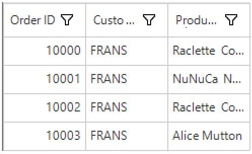
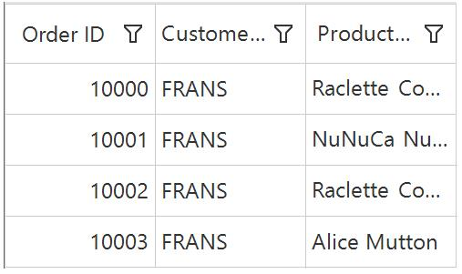
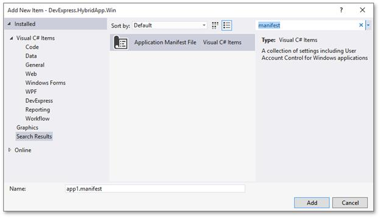
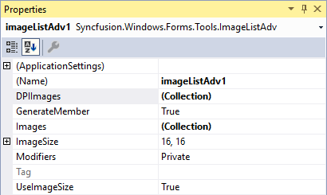
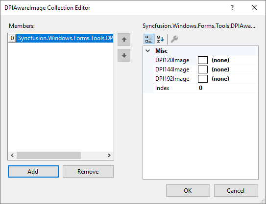
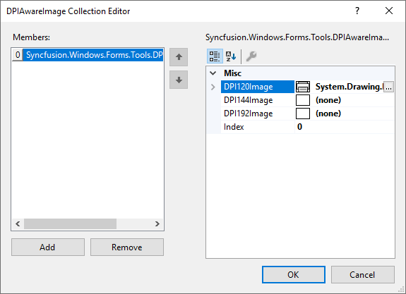
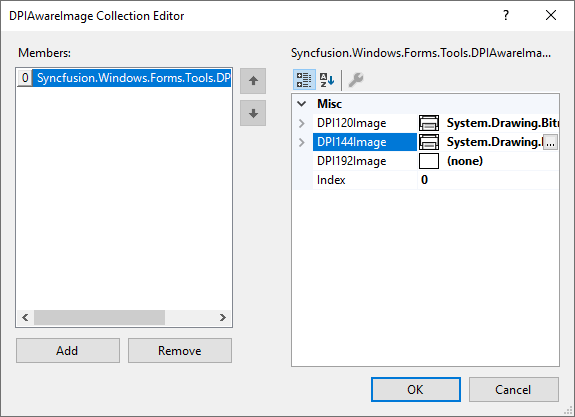
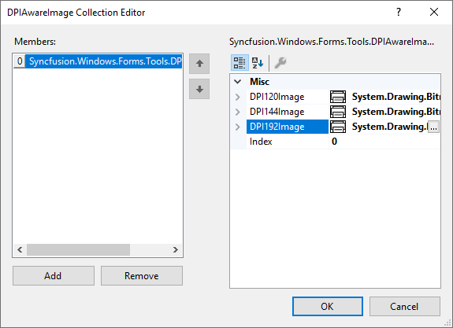

# High DPI Support in Windows Forms

DPI stands for Dots Per Inch is the number of pixels or points rendered in one inch on the interface. The high DPI displays are displayed with an increased number of pixel density compared to the default or standard DPI screen.

## DPI awareness

Desktop application fall into two categories based on the DPI awareness:

* Non-DPI aware application
* DPI aware application

### Non-DPI aware application

Non-DPI aware applications always render at 96 DPI, scale it up to the actual DPI, and leave entire scaling to the operating system. It keeps your application layout intact at the cost of quality - blurred images and more.

Refer to the following DataGrid sample demo screenshot that runs under 192 DPI with blurred text and icons.

### DPI aware application

The applications render themselves based on the actual DPI of a screen and provide a much better visual experience. The controls or applications needs manual implementation, such DPI awareness by retrieving the current monitor DPI value, scaling its content, applying different icon sets, and more. 

The following DataGrid sample demo screenshot runs under 192 DPI, you can see the better quality of text and icon.

## DPI compatibility

To access your applications DPI compatibility, test your application at a variety of resolutions with different high DPI settings.

The following table provides a recommended set of DPI settings and minimum resolutions to consider when testing the DPI awareness level.

<table>
<tr>
<td>
{{'**DPI**'| markdownify }}
</td>
<td>
{{'**Scaling**'| markdownify }}
</td>
<td>
{{'**Minimum resolution**'| markdownify }}
</td>
</tr>
<tr>
<td>
96
</td>
<td>
100%
</td>
<td>
1024*720
</td>
</tr>
<tr>
<td>
120
</td>
<td>
125%
</td>
<td>
1280*960
</td>
</tr>
<tr>
<td>
144
</td>
<td>
150%
</td>
<td>
1536*1080
</td>
</tr>
<tr>
<td>
192
</td>
<td>
200%
</td>
<td>
2048*1440
</td>
</tr>
</table>

The application or control created in 96 DPI value must be properly changed based on the current DPI values when trying to use the control or application to other DPI values.

## DPI scaling

The DPI scaling mechanism calculates the scaling difference between the system that form has been designed on and the running system. This DPI scaling will only trigger if your application declares to be DPI aware. Otherwise, the system will be rendered in the default DPI (96 DPI) sandbox and bitmap scaling of the OS will be used.

You have probably noticed the following two properties:

* [AutoScaleDimensions](https://docs.microsoft.com/en-us/dotnet/api/system.windows.forms.containercontrol.autoscaledimensions?view=netframework-4.7.2#System_Windows_Forms_ContainerControl_AutoScaleDimensions): The Visual Studio designer will serialize the dimensions of the unit used for comparison either font or DPI. When running the form with different DPI settings, its dimensions will be obtained and compared against the serialized dimensions. The scaling factor is computed based on that, then it is applied.
* [AutoScaleMode](https://docs.microsoft.com/en-us/dotnet/api/system.windows.forms.containercontrol.autoscalemode?view=netframework-4.7.2#System_Windows_Forms_ContainerControl_AutoScaleMode): Indicates the method to calculate the scale factor. Depending on it, the scaling mechanism will calculate the scale factor according to the dimensions of the system font or system DPI. If the AutoScaleMode is set to `None`, the automatic scaling will be disabled. When the scale factor is calculated, the framework calls the scale method of form which basically recalculates the size and the location of child controls on it. Their scale method is also called as properly scale.




this.AutoScaleDimensions = new System.Drawing.SizeF(5F, 12F);
this.AutoScaleMode = System.Windows.Forms.AutoScaleMode.Font;



Me.AutoScaleDimensions = New System.Drawing.SizeF(5F, 12F)
Me.AutoScaleMode = System.Windows.Forms.AutoScaleMode.Font



## Enable high DPI support

To turn your desktop application into DPI-aware and add `app.manifest` file, follow the steps:

1.Right click the sample project.

2.Click `Add`, select `New Item` or press the `CTRL+SHIFT+A` shortcut.

3.Search for the **Application Manifest File** item and click `Add`.

4.When setting the `dpiAware` to true, the control will be drawn using the current DPI value. In this, the font size and image size will be automatically increased. The high DPI controls can be enabled by the following code snippet.




  <application xmlns="urn:schemas-microsoft-com:asm.v3">
    <windowsSettings>
      <dpiAware xmlns="http://schemas.microsoft.com/SMI/2005/WindowsSettings">true</dpiAware>
    </windowsSettings>
  </application>




5.Most of the Syncfusion controls support high DPI through manifest file. But, the following Syncfusion controls provides the high DPI support by adding both manifest file and enabling the [DpiAware](https://help.syncfusion.com/cr/windowsforms/Syncfusion.Windows.Forms.ScrollControl.html#Syncfusion_Windows_Forms_ScrollControl_DpiAware) property.

* GridControl
* GridGroupingControl
* GridDataBoundGrid
* GridListControl




//To enable DpiAware in GridControl
gridControl.DpiAware = true;

//To enable DpiAware in GridDataBoundGrid control
gridDataBoundGrid1.DpiAware = true;

//To enable DpiAware in GridGroupingControl
this.gridGroupingControl1.TableControl.DpiAware = true;

//To enable DpiAware in GridListControl
gridListControl1.Grid.DpiAware = true;




'To enable DpiAware in GridControl
gridControl.DpiAware = True

'To enable DpiAware in GridDataBoundGrid control
gridDataBoundGrid1.DpiAware = True

'To enable DpiAware in GridGroupingControl
Me.gridGroupingControl1.TableControl.DpiAware = True

'To enable DpiAware in GridListControl
gridListControl1.Grid.DpiAware = True




## Automatically change images based on DPI through ImageListAdv component

ImageListAdv component provides an option to set images with respect to different DPI scaling during application design. It helps the application to automatically switch the image when running on different machines in different DPI scaling. Images for different DPI scaling can be set using the [`DPIAwareImage`](https://help.syncfusion.com/cr/windowsforms/Syncfusion.Windows.Forms.Tools.ImageListAdv.html#Syncfusion_Windows_Forms_Tools_ImageListAdv_DPIImages) object in each item added to the [`DPIImages`](https://help.syncfusion.com/cr/windowsforms/Syncfusion.Windows.Forms.Tools.ImageListAdv.html#Syncfusion_Windows_Forms_Tools_ImageListAdv_DPIImages) collection of the **ImageListAdv** component. The [`DPIAwareImage`](https://help.syncfusion.com/cr/windowsforms/Syncfusion.Windows.Forms.Tools.ImageListAdv.html#Syncfusion_Windows_Forms_Tools_ImageListAdv_DPIImages) contains the following properties.

* **DPI120Image** - This sets the image of the item for 125 scaling and above.
* **DPI144Image** - This sets the image of the item for 150 scaling and above. 
* **DPI192Image** - This sets the image of the item for 200 scaling and above.
* **Index** - Maps the index of the default image present in the [`Images`](https://help.syncfusion.com/cr/windowsforms/Syncfusion.Windows.Forms.Tools.ImageListAdv.html#Syncfusion_Windows_Forms_Tools_ImageListAdv_Images) collection bound the ImageListAdv component. 

N> The image present in the **Images[1]** index can have its relevant DPI scaling images set in the **DPIImages[7]** index (at any dynamic position) and to map them, the [`Index`](https://help.syncfusion.com/cr/windowsforms/Syncfusion.Windows.Forms.Tools.ImageListAdv.html#Syncfusion_Windows_Forms_Tools_ImageListAdv_DPIImages) property is set to **1** (which is the actual default image position). 

N> If the image for a particular DPI scaling is not set in the [`DPIAwareImage`](https://help.syncfusion.com/cr/windowsforms/Syncfusion.Windows.Forms.Tools.ImageListAdv.html#Syncfusion_Windows_Forms_Tools_ImageListAdv_DPIImages), either the lower scaling image or the default image from the [`Images`](https://help.syncfusion.com/cr/windowsforms/Syncfusion.Windows.Forms.Tools.ImageListAdv.html#Syncfusion_Windows_Forms_Tools_ImageListAdv_Images) collection will be consumed for display.

The steps below illustrate the setting of image for a ButtonAdv using ImageListAdv for different DPI scaling.

1.Drag and drop the ImageListAdv from the toolbox to the designer. 

2.Add the required images to the [`Images`](https://help.syncfusion.com/cr/windowsforms/Syncfusion.Windows.Forms.Tools.ImageListAdv.html#Syncfusion_Windows_Forms_Tools_ImageListAdv_Images) collection of the ImageListAdv. These images will act as default images that will be displayed at all scaling when no DPI images are set.

3.To set the images for various DPI scaling, open the [`DPIImages`](https://help.syncfusion.com/cr/windowsforms/Syncfusion.Windows.Forms.Tools.ImageListAdv.html#Syncfusion_Windows_Forms_Tools_ImageListAdv_DPIImages) collection in the ImageListAdv and add a new [`DPIAwareImage`](https://help.syncfusion.com/cr/windowsforms/Syncfusion.Windows.Forms.Tools.ImageListAdv.html#Syncfusion_Windows_Forms_Tools_ImageListAdv_DPIImages) item using the **Add** button.

4.For 125 scaling and above, set the desired image to the [`DPI120Image`](https://help.syncfusion.com/cr/windowsforms/Syncfusion.Windows.Forms.Tools.ImageListAdv.html#Syncfusion_Windows_Forms_Tools_ImageListAdv_DPIImages) property.

5.For 150 scaling and above, set the desired image to the [`DPI144Image`](https://help.syncfusion.com/cr/windowsforms/Syncfusion.Windows.Forms.Tools.ImageListAdv.html#Syncfusion_Windows_Forms_Tools_ImageListAdv_DPIImages) property.

6.For 200 scaling and above, set the desired image to the [`DPI192Image`](https://help.syncfusion.com/cr/windowsforms/Syncfusion.Windows.Forms.Tools.ImageListAdv.html#Syncfusion_Windows_Forms_Tools_ImageListAdv_DPIImages) property.

7.To map this [`DPIAwareImage`](https://help.syncfusion.com/cr/windowsforms/Syncfusion.Windows.Forms.Tools.ImageListAdv.html#Syncfusion_Windows_Forms_Tools_ImageListAdv_DPIImages) to its default image, set the index of the appropriate image from the [`Images`](https://help.syncfusion.com/cr/windowsforms/Syncfusion.Windows.Forms.Tools.ImageListAdv.html#Syncfusion_Windows_Forms_Tools_ImageListAdv_Images) collection to the [`Index`](https://help.syncfusion.com/cr/windowsforms/Syncfusion.Windows.Forms.Tools.ImageListAdv.html#Syncfusion_Windows_Forms_Tools_ImageListAdv_DPIImages) property. 

8.Now map the desired image from the [`Images`](https://help.syncfusion.com/cr/windowsforms/Syncfusion.Windows.Forms.Tools.ImageListAdv.html#Syncfusion_Windows_Forms_Tools_ImageListAdv_Images) collection to the ButtonAdv control using its [`Image`](https://help.syncfusion.com/cr/windowsforms/Syncfusion.Windows.Forms.ButtonAdv.html) property.




buttonAdv1.Image = imageListAdv1.Images[0];





buttonAdv1.Image = imageListAdv1.Images(0)




9.Run the application and the image for the ButtonAdv will be displayed as per the image set for different DPI scaling as shown below.

#### 100 DPI Scaling

#### 125 Scaling

#### 150 Scaling 

#### 200 Scaling

