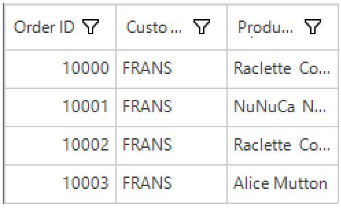
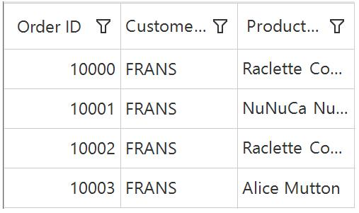
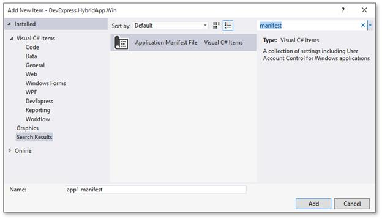
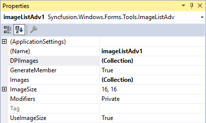
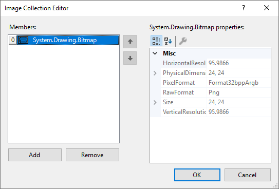
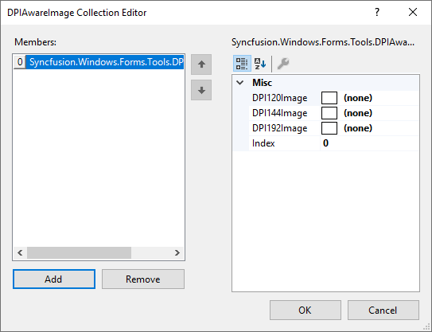
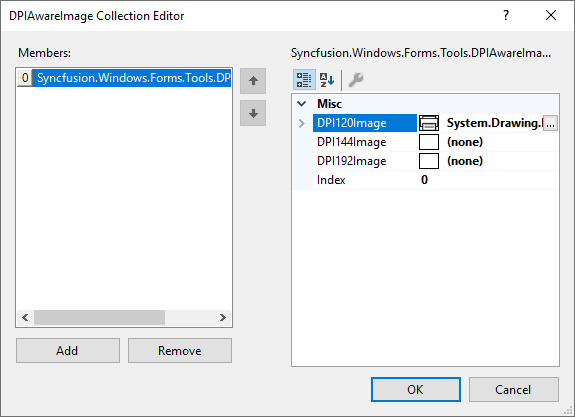
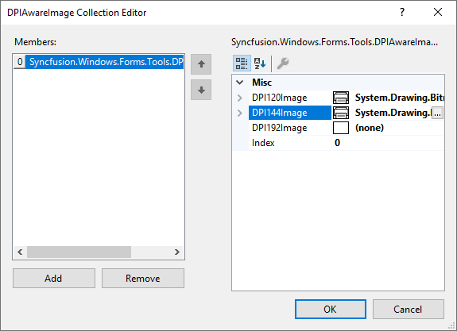
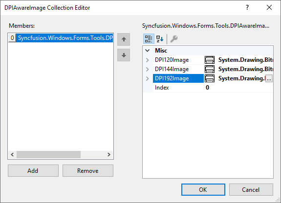

# High DPI Support in Windows Forms Controls

DPI stands for Dots Per Inch, which is the number of pixels or points rendered in one inch on the interface. High DPI displays have a higher pixel density than standard DPI displays.

## Contents

* [DPI awareness](#dpi-awareness)
* [DPI scaling](#dpi-scaling)
* [Enable high DPI support](#enable-high-dpi-support)
* [DPI compatibility](#dpi-compatibility)
* [Automatically change images based on DPI through ImageListAdv component](#automatically-change-images-based-on-dpi-through-imagelistadv-component)
* [Troubleshooting](#troubleshooting)
* [Related links](#related-links)

## Requirements

The DPI features described in this document apply to Syncfusion Windows Forms controls. Behavior may vary depending on the Syncfusion version and target framework. Refer to the Syncfusion Windows Forms documentation for the latest DPI support information and supported target framework versions.

## DPI awareness

Desktop applications fall into two categories based on DPI awareness:

* Non-DPI aware application
* DPI aware application

### Non-DPI aware application

Non-DPI aware applications always render at 96 DPI, are scaled up to the actual DPI by the operating system, and leave all scaling to the OS. This keeps your application layout intact at the cost of quality, such as blurred images and text.

Refer to the following DataGrid sample screenshot that runs at 200% scaling (192 DPI) with blurred text and icons.

### DPI aware application
These applications render themselves based on the screen's actual DPI and provide a much better visual experience. The application or its controls may need to handle DPI awareness by retrieving the current monitor DPI, scaling content, and using different icon sets where required. Syncfusion provides APIs and control-level support to help with DPI-aware rendering, but DPI configuration and testing should be handled as part of the application.

The following DataGrid sample screenshot runs at 200% scaling (192 DPI); note the improved text and icon quality.

## DPI compatibility

To verify your application's DPI compatibility, test it at a variety of resolutions with different DPI settings. The following table provides a recommended set of DPI values, the corresponding Windows scaling percentages, and minimum display resolutions to consider when testing DPI awareness.

### Testing procedure

To test your application across the recommended DPI values:

1. Open **Windows Settings → Display** and change the scale to 100%, 125%, 150%, and 200%.
2. Run the application at each scaling level and verify the layout, fonts, icons, and images.
3. If you have multiple monitors with different scaling percentages, drag the application between them to test Per-Monitor awareness.
4. On Windows 10 version 1903 or later, you can also use the built-in DPI simulator in Visual Studio to test without changing your display settings.

The following table summarizes the recommended values:

<table>
<tr>
<td>
{{'**DPI**'| markdownify }}
</td>
<td>
{{'**Scaling**'| markdownify }}
</td>
<td>
{{'**Minimum resolution**'| markdownify }}
</td>
</tr>
<tr>
<td>
96
</td>
<td>
100%
</td>
<td>
1024×720
</td>
</tr>
<tr>
<td>
120
</td>
<td>
125%
</td>
<td>
1280×960
</td>
</tr>
<tr>
<td>
144
</td>
<td>
150%
</td>
<td>
1536×1080
</td>
</tr>
<tr>
<td>
192
</td>
<td>
200%
</td>
<td>
2048×1440
</td>
</tr>
</table>

## DPI scaling

The DPI scaling mechanism calculates the scaling difference between the system that form has been designed on and the running system. This DPI scaling will only trigger if your application declares to be DPI aware. Otherwise, the system will be rendered in the default DPI (96 DPI) sandbox and bitmap scaling of the OS will be used.

You have probably noticed the following two properties:

* [AutoScaleDimensions](https://docs.microsoft.com/en-us/dotnet/api/system.windows.forms.containercontrol.autoscaledimensions?view=netframework-4.7.2#System_Windows_Forms_ContainerControl_AutoScaleDimensions): The Visual Studio designer serializes the dimensions of the unit used for comparison, either font or DPI. When the form runs with different DPI settings, its dimensions are obtained and compared against the serialized dimensions. The scaling factor is computed based on that comparison and then applied.
* [AutoScaleMode](https://docs.microsoft.com/en-us/dotnet/api/system.windows.forms.containercontrol.autoscalemode?view=netframework-4.7.2#System_Windows_Forms_ContainerControl_AutoScaleMode): Indicates the method used to calculate the scale factor. Depending on this value, the scaling mechanism calculates the scale factor from the system font dimensions or the system DPI. If `AutoScaleMode` is set to `None`, automatic scaling is disabled. When the scale factor is calculated, the framework calls the form's `Scale` method, which recalculates the size and location of child controls; each child control's `Scale` method is also called to scale it appropriately.

The following table lists the available `AutoScaleMode` values:

| Value   | Description                                                                 |
|---------|-----------------------------------------------------------------------------|
| `None`  | Disables automatic scaling.                                                 |
| `Font`  | Scales controls relative to the system font dimensions.                     |
| `Dpi`   | Scales controls relative to the system DPI value.                          |
| `Inherit` | Inherits the scaling mode from the parent container.                      |

The following example sets `AutoScaleDimensions` and `AutoScaleMode` in the form's constructor (or the designer-generated `InitializeComponent` method):




// Set in the Form constructor (or InitializeComponent).
this.AutoScaleDimensions = new System.Drawing.SizeF(5F, 12F);
this.AutoScaleMode = System.Windows.Forms.AutoScaleMode.Font;




' Set in the Form constructor (or InitializeComponent).
Me.AutoScaleDimensions = New System.Drawing.SizeF(5F, 12F)
Me.AutoScaleMode = System.Windows.Forms.AutoScaleMode.Font



To detect the current DPI at runtime, use `Control.DeviceDpi` on a form or control:





// Retrieve the current DPI of the form at runtime.
int currentDpi = this.DeviceDpi;
float scaleFactor = currentDpi / 96f;




' Retrieve the current DPI of the form at runtime.
Dim currentDpi As Integer = Me.DeviceDpi
Dim scaleFactor As Single = currentDpi / 96f



{{ codesnippet_runtime_dpi | OrderList_Indent_Level_1 }}

## Enable high DPI support

To make your desktop application DPI aware, add an `app.manifest` file to the project and declare the DPI-awareness setting. DPI-awareness is an application-level setting; it is applied to the entire process, not to a single control.

The manifest element hierarchy that holds the DPI setting is:

`manifest` → `assembly` → `application` → `windowsSettings` → DPI element

Follow the steps below:

1. Right click the sample project.

2. Click `Add`, select `New Item`, or press the `CTRL+SHIFT+A` shortcut.

3. Search for the **Application Manifest File** item and click `Add`.

4. Set the DPI-awareness value in the manifest. The example below shows the legacy `<dpiAware>` element (used by Windows Vista through Windows 8.1). On Windows 10 version 1703 and later, Microsoft recommends the `<dpiAwareness>` element with the value `PerMonitorV2` for the best high-DPI experience. Refer to the [Microsoft Per-Monitor DPI documentation](https://learn.microsoft.com/en-us/windows/win32/hidpi/manifest-changes) for details on supported values and target Windows versions.

N> The snippet below is a fragment showing only the DPI-related portion of `app.manifest`. Place it inside the `<assembly>` → `<application>` element of a complete manifest file.





  <application xmlns="urn:schemas-microsoft-com:asm.v3">
    <windowsSettings>
      <dpiAware xmlns="http://schemas.microsoft.com/SMI/2005/WindowsSettings">true</dpiAware>
    </windowsSettings>
  </application>




{{ codesnippet1 | OrderList_Indent_Level_1 }}

5. Rebuild the project so the updated manifest is embedded in the application output.

6. Run the application and verify that it is now DPI aware. In **Windows Settings → Display**, change the scale to 100%, 125%, 150%, and 200%, and confirm that fonts, icons, and layout scale correctly at each level.

7. Most Syncfusion controls support high DPI through the manifest file. However, the following Syncfusion controls require both a manifest file and the `DpiAware` property enabled on the control:

  * [GridControl](https://help.syncfusion.com/cr/windowsforms/Syncfusion.Windows.Forms.Grid.GridControl.html) (DpiAware inherited via `Syncfusion.Windows.Forms.ScrollControl`)
  * [GridGroupingControl](https://help.syncfusion.com/cr/windowsforms/Syncfusion.Windows.Forms.Grid.Grouping.GridGroupingControl.html)
  * [GridDataBoundGrid](https://help.syncfusion.com/cr/windowsforms/Syncfusion.Windows.Forms.Grid.DataBound.GridDataBoundGrid.html)
  * [GridListControl](https://help.syncfusion.com/cr/windowsforms/Syncfusion.Windows.Forms.Grid.List.GridListControl.html)

  The `DpiAware` property is defined on `Syncfusion.Windows.Forms.ScrollControl` and is inherited by the grid controls listed above. Refer to the [DpiAware API reference](https://help.syncfusion.com/cr/windowsforms/Syncfusion.Windows.Forms.ScrollControl.html#Syncfusion_Windows_Forms_ScrollControl_DpiAware) for details.





//To enable DpiAware in GridControl
gridControl.DpiAware = true;

//To enable DpiAware in GridDataBoundGrid control
gridDataBoundGrid1.DpiAware = true;

//To enable DpiAware in GridGroupingControl
this.gridGroupingControl1.TableControl.DpiAware = true;

//To enable DpiAware in GridListControl
gridListControl1.Grid.DpiAware = true;




'To enable DpiAware in GridControl
gridControl.DpiAware = True

'To enable DpiAware in GridDataBoundGrid control
gridDataBoundGrid1.DpiAware = True

'To enable DpiAware in GridGroupingControl
Me.gridGroupingControl1.TableControl.DpiAware = True

'To enable DpiAware in GridListControl
gridListControl1.Grid.DpiAware = True




{{ codesnippet2 | OrderList_Indent_Level_1 }}

## Automatically change images based on DPI through ImageListAdv component

The [`ImageListAdv`](https://help.syncfusion.com/cr/windowsforms/Syncfusion.Windows.Forms.Tools.ImageListAdv.html) component lets you specify images for different DPI scaling levels at design time, so the application automatically switches to the correct image at runtime.

N> **Prerequisite:** Before you begin, ensure the Syncfusion WinForms assemblies are referenced and the Syncfusion Toolbox Installer has been run, so the **ImageListAdv** component appears in the Visual Studio toolbox.

Images for different DPI scaling are provided through [`DPIAwareImage`](https://help.syncfusion.com/cr/windowsforms/Syncfusion.Windows.Forms.Tools.DPIAwareImage.html) items in the [`DPIImages`](https://help.syncfusion.com/cr/windowsforms/Syncfusion.Windows.Forms.Tools.ImageListAdv.html#Syncfusion_Windows_Forms_Tools_ImageListAdv_DPIImages) collection of the `ImageListAdv` component. Each `DPIAwareImage` item has the following properties:

| Property         | Description                                                                                       |
|------------------|---------------------------------------------------------------------------------------------------|
| **DPI120Image**  | Image used at 125% scaling and above.                                                             |
| **DPI144Image**  | Image used at 150% scaling and above.                                                             |
| **DPI192Image**  | Image used at 200% scaling and above.                                                             |
| **Index**        | Index of the default image in the [`Images`](https://help.syncfusion.com/cr/windowsforms/Syncfusion.Windows.Forms.Tools.ImageListAdv.html#Syncfusion_Windows_Forms_Tools_ImageListAdv_Images) collection that this DPI variant maps to. |

The property names reflect the DPI value (120, 144, 192); the descriptions above describe the corresponding Windows scaling percentages at which each variant is used.

The steps below illustrate setting images for a `ButtonAdv` using `ImageListAdv` for different DPI scaling.

1. Drag and drop the `ImageListAdv` from the toolbox onto the form (for example, `Form1`) in the designer.

2. Add the required images to the [`Images`](https://help.syncfusion.com/cr/windowsforms/Syncfusion.Windows.Forms.Tools.ImageListAdv.html#Syncfusion_Windows_Forms_Tools_ImageListAdv_Images) collection of the `ImageListAdv`. These images act as the default images displayed at all scaling levels when no DPI-specific image is set.

3. To set the images for various DPI scaling levels, open the [`DPIImages`](https://help.syncfusion.com/cr/windowsforms/Syncfusion.Windows.Forms.Tools.ImageListAdv.html#Syncfusion_Windows_Forms_Tools_ImageListAdv_DPIImages) collection in the `ImageListAdv` and add a new `DPIAwareImage` item using the **Add** button.

4. For 125% scaling and above, set the desired image to the `DPI120Image` property.

5. For 150% scaling and above, set the desired image to the `DPI144Image` property.

6. For 200% scaling and above, set the desired image to the `DPI192Image` property.

7. To map this `DPIAwareImage` to its default image, set the `Index` property to the index of the appropriate image in the `Images` collection.

8. Assign the image from the `Images` collection to the `ButtonAdv` control. The `ButtonAdv` is `ImageListAdv`-aware: when assigned an image through `ImageList` and `ImageIndex`, it automatically selects the DPI variant that matches the current scaling level. Assigning `Image` directly with an `Image` reference bypasses DPI selection and is not recommended for DPI-aware scenarios.





buttonAdv1.Image = imageListAdv1.Images[0];





buttonAdv1.Image = imageListAdv1.Images(0)




{{ codesnippet3 | OrderList_Indent_Level_1 }}

9. Run the application. The image for the `ButtonAdv` is displayed using the image set for the current DPI scaling, as shown below.

N> **Index mapping:** The image at `Images[1]` can have its DPI variants stored at any position in `DPIImages` (for example, `DPIImages[7]`). To associate a `DPIAwareImage` with the default image at `Images[1]`, set its `Index` property to `1`. The position in `DPIImages` is independent of the position in `Images`; the link is established through the `Index` property.

N> **Fallback behavior:** If the image for a particular DPI scaling is not set in the `DPIAwareImage`, the lower-DPI variant is used, or, if none is available, the default image from the `Images` collection is displayed. This fallback applies to all three DPI levels (120, 144, 192).

#### 100 DPI Scaling

#### 125 Scaling

#### 150 Scaling 

#### 200 Scaling

## Troubleshooting

This section lists common issues and suggested actions. If your situation does not match a description below, verify DPI behavior in your target Windows version and deployment environment, or refer to the control-specific API documentation for supported DPI features.

* **Application is rendered blurry at high DPI.** The application is not declared DPI aware. Add a manifest file with a DPI-awareness element (see [Enable high DPI support](#enable-high-dpi-support)) and rebuild the project.
* **Manifest changes are not picked up.** Clean the build output and rebuild the project so the updated manifest is embedded in the application.
* **A Syncfusion control does not scale at high DPI.** Some controls, such as `GridControl`, `GridGroupingControl`, `GridDataBoundGrid`, and `GridListControl`, require both a manifest file and the `DpiAware` property set to `true`. See [Enable high DPI support](#enable-high-dpi-support) for the list of affected controls.
* **The `DpiAware` property is not available on a control.** The `DpiAware` property is defined on `Syncfusion.Windows.Forms.ScrollControl`. Refer to the control-specific API documentation to confirm whether the control inherits `ScrollControl`.
* **`ImageListAdv` does not switch images at different DPI scaling.** Ensure each `DPIAwareImage` has its `Index` set to the correct image in the `Images` collection, and assign the image to the consumer control (for example, `ButtonAdv`) through `ImageList` and `ImageIndex` rather than `Image`.
* **No image is shown for a particular DPI level.** Verify that the corresponding `DPI120Image`, `DPI144Image`, or `DPI192Image` is set on the `DPIAwareImage`. When a level is not set, the lower-DPI variant or the default image is used.

## Related links

* [ImageListAdv API reference](https://help.syncfusion.com/cr/windowsforms/Syncfusion.Windows.Forms.Tools.ImageListAdv.html)
* [DpiAware API reference](https://help.syncfusion.com/cr/windowsforms/Syncfusion.Windows.Forms.ScrollControl.html#Syncfusion_Windows_Forms_ScrollControl_DpiAware)
* [Microsoft Per-Monitor DPI documentation](https://learn.microsoft.com/en-us/windows/win32/hidpi/manifest-changes)
* [AutoScaleMode (System.Windows.Forms.ContainerControl)](https://docs.microsoft.com/en-us/dotnet/api/system.windows.forms.containercontrol.autoscalemode?view=netframework-4.7.2#System_Windows_Forms_ContainerControl_AutoScaleMode)
* [AutoScaleDimensions (System.Windows.Forms.ContainerControl)](https://docs.microsoft.com/en-us/dotnet/api/system.windows.forms.containercontrol.autoscaledimensions?view=netframework-4.7.2#System_Windows_Forms_ContainerControl_AutoScaleDimensions)

