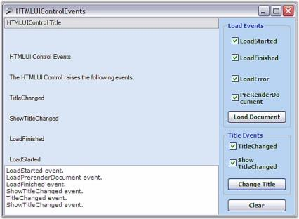

# Control Events in Windows Forms Html Viewer (HTMLUI)

HTMLUI control comes with a rich set of events to help the application developer in keeping track of the execution. These events are programmed based on the Event arguments containing data related to the event.

The events executed by the HTMLUI control are as follows:

* [LinkClicked event](#linkclicked-event)
* [LoadStarted event](#loadstarted-event)
* [LoadFinished event](#loadfinished-event)
* [LoadError event](#loaderror-event)
* [PreRenderDocument event](#prerenderdocument-event)
* [ShowTitleChanged event](#showtitlechanged-event)
* [TitleChanged event](#titlechanged-event)
* [Border3DStyleChanged event](#border3dstylechanged-event)
* [BorderColorChanged event](#bordercolorchanged-event)
* [BorderSingleChanged event](#bordersinglechanged-event)
* [BorderSidesChanged event](#bordersideschanged-event)
* [BorderStyleChanged event](#borderstylechanged-event)

## LinkClicked event

This [LinkClicked event](https://help.syncfusion.com/cr/windowsforms/Syncfusion.Windows.Forms.HTMLUI.HTMLUIControl.html) is raised after the hyperlink is clicked and before the hyperlink tries to load a new resource. The event properties associated with the Link Forward Event Arguments are as follows.

* Cancel: A boolean value which indicates whether the default processing of resource loading should be canceled or not.
* Path: Specifies the location of the resource.





// Event that is to be raised after the hyperlink was clicked and before the hyperlink tries to load 

// a new resource.

this.htmluiControl1.LinkClicked += new Syncfusion.Windows.Forms.HTMLUI.LinkForwardEventHandler(this.htmluiControl1_LinkClicked);

private void htmluiControl1_LinkClicked(object sender, Syncfusion.Windows.Forms.HTMLUI.LinkForwardEventArgs e)

{

     e.Cancel = true;

     Form2 form2 = new Form2(GetFilesLocation() + e.Path);

     form2.Show();

}  





' Event that is to be raised after the hyperlink was clicked and before the hyperlink tries to load 

' a new resource. 

Me.HtmluiControl1.LinkClicked += New Syncfusion.Windows.Forms.HTMLUI.LinkForwardEventHandler(Me.htmluiControl1_LinkClicked)

Private Sub htmluiControl1_LinkClicked(ByVal sender As Object, ByVal e As Syncfusion.Windows.Forms.HTMLUI.LinkForwardEventArgs)

e.Cancel = True

Dim form2 As Form2 = New Form2(GetFilesLocation() + e.Path)

form2.Show()

End Sub





## LoadStarted event

This [LoadStarted event](https://help.syncfusion.com/cr/windowsforms/Syncfusion.Windows.Forms.HTMLUI.HTMLUIControl.html) is raised when a new HTML document has started loading into the HTMLUI control from the specified resource.





// Event that is to be raised when the HTMLUI control starts loading a new html document.

this.htmluiControl1.LoadStarted += new  System.EventHandler(this.htmluiControl1_LoadStarted);

private void htmluiControl1_LoadStarted(object sender, System.EventArgs e)

{

      Console.WriteLine("Started Loading...");                        

}





‘Event that is to be raised when the HTMLUI control starts loading a new html document.

Me.HtmluiControl1.LoadStarted += New System.EventHandler(Me.htmluiControl1_LoadStarted)

Private Sub htmluiControl1_LoadStarted(ByVal sender As Object, ByVal e As System.EventArgs)

Console.WriteLine("Started Loading...")

End Sub





## LoadFinished event

This [LoadFinished event](https://help.syncfusion.com/cr/windowsforms/Syncfusion.Windows.Forms.HTMLUI.HTMLUIControl.html) is raised after the loading of HTML document inside the HTMLUI control is completed.





// Event that is to raised after the HTML document have been rendered in the control.

this.htmluiControl1.LoadFinished += new System.EventHandler(this.htmluiControl1_LoadFinished);

private void htmluiControl1_LoadFinished(object sender, System.EventArgs e)

{

       Console.WriteLine("Load successfully completed");

}   





‘Event that is to raised after the HTML document have been rendered in the control.

Me.HtmluiControl1.LoadFinished += New System.EventHandler(Me.htmluiControl1_LoadFinished)

Private Sub htmluiControl1_LoadFinished(ByVal sender As Object, ByVal e As System.EventArgs)

Console.WriteLine("Load successfully completed")

End Sub





## LoadError event

This [LoadError event](https://help.syncfusion.com/cr/windowsforms/Syncfusion.Windows.Forms.HTMLUI.HTMLUIControl.html) is raised when an error occurs during loading or rendering an HTML document from the specified resource. The LoadErrorEventArgs contains the following property that defines the data related to the action of this event.

* Document:Specifies the document whose rendering triggers the execution of the LoadError event.





// Event that is to be raised when an error occurs during HTML document is being rendered in the HTMLUI control.

this.htmluiControl1.LoadError += new Syncfusion.Windows.Forms.HTMLUI.LoadErrorEventHandler(this.htmluiControl1_LoadError);

private void htmluiControl1_LoadError(object sender, Syncfusion.Windows.Forms.HTMLUI.LoadErrorEventArgs e)

{

      Console.WriteLine("Error loading due to"+ e.ToString());

}  





‘Event that is to be raised when an error occurs during HTML document is being rendered in the HTMLUI control.

Me.HtmluiControl1.LoadError += New Syncfusion.Windows.Forms.HTMLUI.LoadErrorEventHandler(Me.htmluiControl1_LoadError)

Private Sub htmluiControl1_LoadError(ByVal sender As Object, ByVal e As Syncfusion.Windows.Forms.HTMLUI.LoadErrorEventArgs)

Console.WriteLine("Error loading due to" + e.ToString())

End Sub





## PreRenderDocument event

This [PreRenderDocument event](https://help.syncfusion.com/cr/windowsforms/Syncfusion.Windows.Forms.HTMLUI.HTMLUIControl.html) is raised when the elements in the HTML document are created in the HTMLUI control, but their size and location are not calculated yet.





// Event that is to be raised when a tree of element has been created and their size and location have not been calculated yet.

this.htmluiControl1.PreRenderDocument += new Syncfusion.Windows.Forms.HTMLUI.PreRenderDocumentEventHandler

(this.htmluiControl1_PreRenderDocument);

private void htmluiControl1_PreRenderDocument(object sender, Syncfusion.Windows.Forms.HTMLUI.PreRenderDocumentArgs e)

{

      Console.WriteLine("This is the Prerender document event");

} 





‘Event that is to be raised when a tree of element has been created and their size and location have not been calculated yet.

Me.HtmluiControl1.PreRenderDocument += New Syncfusion.Windows.Forms.HTMLUI.PreRenderDocumentEventHandler

(Me.htmluiControl1_PreRenderDocument)

Private Sub htmluiControl1_PreRenderDocument(ByVal sender As Object, ByVal e As Syncfusion.Windows.Forms.HTMLUI.PreRenderDocumentArgs)

Console.WriteLine("This is the Prerender document event")

End Sub





## ShowTitleChanged event

This [ShowTitleChanged event](https://help.syncfusion.com/cr/windowsforms/Syncfusion.Windows.Forms.HTMLUI.HTMLUIControl.html) is raised after the ShowTitle property of the HTMLUI control is changed. The event handler receives its data from the ValueChangedEventArguments. The following properties are associated with the ShowTitleChanged event handling.

* Empty-Gets the instance of the class that is found to be empty or having null value.
* newValue-Indicates the current value of the ShowTitle property.
* oldValue-Indicates the old value of the ShowTitle property.





// Event that is raised after the ShowTitle property of the HTMLUI control is changed.

this.htmluiControl1.ShowTitleChanged += new Syncfusion.Windows.Forms.HTMLUI.ValueChangedEventHandler(this.htmluiControl1_ShowTitleChanged);

private void htmluiControl1_ShowTitleChanged(object sender, ValueChangedEventArgs e)

{

   MessageBox.Show("ShowTitle Changed");

}   





‘Event that is raised after the ShowTitle property of the HTMLUI control is changed.

Me.HtmluiControl1.ShowTitleChanged += New Syncfusion.Windows.Forms.HTMLUI.ValueChangedEventHandler(Me.htmluiControl1_ShowTitleChanged)

Private Sub htmluiControl1_ShowTitleChanged(ByVal sender As Object, ByVal e As ValueChangedEventArgs)

MessageBox.Show("ShowTitle Changed")

End Sub





## TitleChanged event

The [TitleChanged event](https://help.syncfusion.com/cr/windowsforms/Syncfusion.Windows.Forms.HTMLUI.HTMLUIControl.html) is raised after the Title property of the HTMLUI control is changed. The Title value can be set explicitly by the user or it can be extracted from the title tag of the HTML document that is to be loaded into the HTMLUI control.

The event handler receives its data from the ValueChangedEventArguments. The following properties are associated with the TitleChanged event handling.

* newValue: Gets the new value for the Title.
* oldValue: Gets the old value that has been changed.





// Event is raised after the Title property of the HTMLUI control is changed.

this.htmluiControl1.TitleChanged += new Syncfusion.Windows.Forms.HTMLUI.ValueChangedEventHandler (this.htmluiControl1_TitleChanged);

private void htmluiControl1_TitleChanged(object sender, ValueChangedEventArgs e)

{

MessageBox.Show("Title Changed");

}  





'Event is raised after the Title property of the HTMLUI control is changed.

Me.HtmluiControl1.TitleChanged += New Syncfusion.Windows.Forms.HTMLUI.ValueChangedEventHandler(Me.htmluiControl1_TitleChanged)

Private Sub htmluiControl1_TitleChanged(ByVal sender As Object, ByVal e As ValueChangedEventArgs)

MessageBox.Show("Title Changed")

End Sub





## Border3DStyleChanged event

This [Border3DStyleChanged event](https://help.syncfusion.com/cr/windowsforms/Syncfusion.Windows.Forms.HTMLUI.HTMLUIControl.html) is handled when the value of the Border3DStyle property is changed. The Border3DStyle property indicates the style of the 3D border.

The event handler receives an argument of type EventArgs.





// Set the BorderStyle property to 'Fixed3D' to view the 3D border style.

this.htmluiControl1.BorderStyle = System.Windows.Forms.BorderStyle.Fixed3D;

// Set the 3D border style for the HTMLUIControl using the Border3DStyle property.

this.htmluiControl1.Border3DStyle = System.Windows.Forms.Border3DStyle.Bump;

// Handle the Border3DStyleChanged event.

this.htmluiControl1.Border3DStyleChanged+= new System.EventHandler(htmluiControl1_Border3DStyleChanged);

private void htmluiControl1_Border3DStyleChanged(object sender, EventArgs e)

{

     // The following line is displayed in the output window at runtime, when this event is fired.

     Console.WriteLine(" Border3DStyleChanged event is raised ");

}





'Set the BorderStyle property to 'Fixed3D' to view the 3D border style.

Me.htmluiControl1.BorderStyle = System.Windows.Forms.BorderStyle.Fixed3D

'Set the 3D border style for the HTMLUIControl control using the Border3DStyle property.

Me.htmluiControl1.Border3DStyle = System.Windows.Forms.Border3DStyle.Bump

'Handle the Border3DStyleChanged event.

AddHandler Me.htmluiControl1.Border3DStyleChanged, AddressOf htmluiControl1_Border3DStyleChanged

 Private Sub htmluiControl1_Border3DStyleChanged(ByVal sender As Object, ByVal e As EventArgs) Handles HtmluiControl1.Border3DStyleChanged

    ' The following line is displayed in the output window at runtime, when this event is fired.

   Console.WriteLine(" Border3DStyleChanged event is raised ")

End Sub





## BorderColorChanged event

This [BorderColorChanged event](https://help.syncfusion.com/cr/windowsforms/Syncfusion.Windows.Forms.HTMLUI.HTMLUIControl.html) is handled when the value of the BorderColor property is changed. The BorderColor property indicates the color of the 2D border.

The event handler receives an argument of type EventArgs.





// Set the border color for the HTMLUIControl using the BorderColor property.

this.htmluiControl1.BorderColor = System.Drawing.Color.DeepPink;

// Set the BorderStyle property to 'FixedSingle' to view the 2D border color.

this.htmluiControl1.BorderStyle = System.Windows.Forms.BorderStyle.FixedSingle;

// Handle the BorderColorChanged event.

this.htmluiControl1.BorderColorChanged += new System.EventHandler(this.htmluiControl1_BorderColorChanged);

private void htmluiControl1_BorderColorChanged(object sender, EventArgs e)

{

     // The following line is displayed in the output window at runtime, when this event is fired.

     Console.WriteLine(" BorderColorChanged event is raised ");

}





'Set the border color for the HTMLUIControl using the BorderColor property.

Me.htmluiControl1.BorderColor = System.Drawing.Color.DeepPink

'Set the BorderStyle property to 'FixedSingle' to view the 2D border color.

Me.htmluiControl1.BorderStyle = System.Windows.Forms.BorderStyle.FixedSingle

'Handle the BorderColorChanged event.

AddHandler Me.htmluiControl1.BorderColorChanged, AddressOf htmluiControl1_BorderColorChanged

Private Sub htmluiControl1_BorderColorChanged(ByVal sender As Object, ByVal e As EventArgs)

    ' The following line is displayed in the output window at runtime, when this event is fired.

    Console.WriteLine(" BorderColorChanged event is raised ")

End Sub





## BorderSingleChanged event

This [BorderSingleChanged event](https://help.syncfusion.com/cr/windowsforms/Syncfusion.Windows.Forms.HTMLUI.HTMLUIControl.html) is handled, when the value of the BorderSingle property is changed. The BorderSingle property indicates the 2D border style.

The event handler receives an argument of type EventArgs.





// Set the BorderStyle property to 'FixedSingle' to view the 2D border style.

this.htmluiControl1.BorderStyle = System.Windows.Forms.BorderStyle.FixedSingle;

// Set the new 2D border style for the HTMLUIControl using the BorderStyle property.

this.htmluiControl1.BorderSingle = System.Windows.Forms.ButtonBorderStyle.Dotted;

// Handle the BorderSingleChanged event.

this.htmluiControl1.BorderSingleChanged+=newEventHandler(htmluiControl1_BorderSingleChanged);

private void htmluiControl1_BorderSingleChanged(object sender, EventArgs e)

{

    // The following line is displayed in the output window at runtime.

    Console.WriteLine(" BorderSingleChanged event is raised ");

}





'Set the BorderStyle property to 'FixedSingle' to view the 2D border style.

Me.htmluiControl1.BorderStyle = System.Windows.Forms.BorderStyle.FixedSingle

'Set the new 2D border style for the HTMLUIControl using the BorderStyle property.

Me.htmluiControl1.BorderSingle = System.Windows.Forms.ButtonBorderStyle.Dotted

'Handle the BorderSingleChanged event.

AddHandler Me.htmluiControl1.BorderSingleChanged, AddressOf htmluiControl1_BorderSingleChanged

Private Sub htmluiControl1_BorderSingleChanged(ByVal sender As Object, ByVal e As EventArgs)

    'The following line is displayed in the output window at runtime.

   Console.WriteLine(" BorderSingleChanged event is raised ")

End Sub





## BorderSidesChanged event

This [BorderSidesChanged event](https://help.syncfusion.com/cr/windowsforms/Syncfusion.Windows.Forms.HTMLUI.HTMLUIControl.html) is fired, when the value of the BorderSides property is changed. The BorderSides property indicates the border sides of the panel.

The event handler receives an argument of type EventArgs.





//Draw border sides for the HTMLUIControl the BorderSides property.

this.htmluiControl1.BorderSides = System.Windows.Forms.Border3DSide.Top;

//Handle the BorderSidesChanged event.

this.htmluiControl1.BorderSidesChanged+=newEventHandler(htmluiControl1_BorderSidesChanged);

private void htmluiControl1_BorderSidesChanged(object sender, EventArgs e)

{

    // The following line is displayed in the output window at runtime.

    Console.WriteLine(" BorderSidesChanged event is raised ");

}





'Draw border sides for the HTMLUIControl using the BorderSides property.

Me.htmluiControl1.BorderSides = System.Windows.Forms.Border3DSide.Top

'Handle the BorderSidesChanged event.

AddHandler Me.htmluiControl1.BorderSidesChanged, AddressOf htmluiControl1_BorderSidesChanged

Private Sub htmluiControl1_BorderSidesChanged(ByVal sender As Object, ByVal e As EventArgs)

    'The following line is displayed in the output window at runtime.

   Console.WriteLine(" BorderSidesChanged event is raised ")

End Sub





## BorderStyleChanged event

This [BorderStyleChanged event](https://help.syncfusion.com/cr/windowsforms/Syncfusion.Windows.Forms.HTMLUI.HTMLUIControl.html) is fired when the value of the BorderStyle property is changed. The BorderStyle property indicates whether the panel should have a border.

The event handler receives an argument of type EventArgs.





//2D or 3D border can be set for the HTMLUIControl using the BorderStyle property. The HTMLUIControl can also be displayed border less using this property.

this.htmluiControl1.BorderStyle = System.Windows.Forms.BorderStyle.FixedSingle;

//Handle the BorderStyleChanged event.

this.htmluiControl1.BorderStyleChanged+=new EventHandler(htmluiControl1_BorderStyleChanged);

private void htmluiControl1_BorderStyleChanged(object sender, EventArgs e)

{

    // The following line is displayed in the output window at runtime, when this event is fired.

    Console.WriteLine(" BorderStyleChanged event is raised ");

}





 
'2D or 3D border can be set for the HTMLUIControl control using the BorderStyle property. The HTMLUIControl control can also be displayed border less using this property.

Me.htmluiControl1.BorderStyle = System.Windows.Forms.BorderStyle.FixedSingle

'Handle the BorderStyleChanged event.

AddHandler Me.htmluiControl1.BorderStyleChanged, AddressOf htmluiControl1_BorderStyleChanged

Private Sub htmluiControl1_BorderStyleChanged(ByVal sender As Object, ByVal e As EventArgs)

    'The following line is displayed in the output window at runtime, when this event is fired.

   Console.WriteLine(" BorderStyleChanged event is raised ")

End Sub





## HTMLUI control events sample

This sample illustrates the different events executed by the HTMLUI control.

By default, this sample can be found under the following location:

...\_My Documents\Syncfusion\EssentialStudio\Version Number\Windows\HTMLUI.Windows\Samples\Advanced Editor Functions\ActionGroupingDemo_

