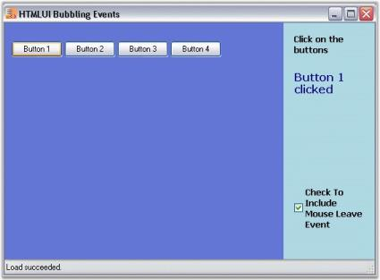

# Element Events in Windows Forms Html Viewer (HTMLUI)

Each HTML element in an HTML document is made to support events, such asClick, DoubleClick, MouseMove, KeyPress, and so on just like the Windows Forms controls.





<html>

<body>

<input type="text" id="text1"/>

</body>

</html>





// Object declaration for the textarea element in the html document rendered in the control.

private void htmluiControl1_LoadFinished(object sender, System.EventArgs e)

{

Hashtable tab = this.htmluiControl1.Document.GetElementsByUserIdHash();

BaseElement textElement  = tab["text1"] as BaseElement;

     // Event handlers declaration for the events on the html elements.

     textElement.Click += new EventHandler( textElement_Click );

   textElement.KeyDown += new EventHandler( textElement_KeyDown );

   textElement.MouseEnter += new EventHandler( textElement_MouseEnter );

}

// HTML element Click event definition.

private void textElement_Click( object sender, EventArgs e )

{

Console.WriteLine("Click Event Handled");

}

// HTML element KeyDown event definition.

private void textElement_KeyDown( object sender, EventArgs e )

{

Console.WriteLine("KeyDown Event Handled");

}

// HTML element MouseEnter event definition.

private void textElement_MouseEnter( object sender, EventArgs e )

{

Console.WriteLine("MouseDown Event Handled");

}  





' Object declaration for the textarea element in the html document rendered in the control.

Private Sub htmluiControl1_LoadFinished(ByVal sender As Object, ByVal e As System.EventArgs)

Dim tab As Hashtable = Me.htmluiControl1.Document.GetElementsByUserIdHash()

Dim textElement As BaseElement = Ctype(IIf(TypeOf tab("text1") Is BaseElement, tab("text1"), Nothing), BaseElement)

' Event handlers declaration for the events on the html elements.

AddHandler textElement.Click, AddressOf textElement_Click

AddHandler textElement.KeyDown, AddressOf textElement_KeyDown

AddHandler textElement.MouseEnter, AddressOf textElement_MouseEnter

End Sub

' HTML element Click event definition.

Private Sub textElement_Click(ByVal sender As Object, ByVal e As EventArgs)

Console.WriteLine("Click Event Handled")

End Sub

' HTML element KeyDown event definition.

Private Sub textElement_KeyDown(ByVal sender As Object, ByVal e As EventArgs)

Console.WriteLine("KeyDown Event Handled")

End Sub

' HTML element MouseEnter event definition.

Private Sub textElement_MouseEnter(ByVal sender As Object, ByVal e As EventArgs)

Console.WriteLine("MouseDown Event Handled")

End Sub





Another important feature of the HTMLUI is its Bubbling Event architecture. With this architecture, a single common event handler defined for a particular event of the parent can be used for all the Child Elements bound to that parent while executing the same event.





<html>

<body>

<input type="button" id="button1"/>

 

<input type="button" id="button2"/>

</body>

</html>





private void htmluiControl1_LoadFinished(object sender, System.EventArgs e)

{

IHTMLElement[] tab = this.htmluiControl1.Document.GetElementsByName("body");

tab[0].MouseLeave += new EventHandler(body_MouseLeave);

}

// Event occurs when the mouse pointer leaves the  control.

private void body_MouseLeave(object sender, EventArgs e)

{

   // Converts the  EventArgs object to BubblingEventArgs type if possible.

BubblingEventArgs argument = HTMLUIControl.GetBublingEventArgs(e);

   // Returns the first sender of the event.

BaseElement elem = argument.RootSender as BaseElement;

if( elem != null && elem is INPUTElementImpl)

{

if(elem.ID == "button1")

{

    this.label1.Text = "Mouse just left Button 1";

}

else if(elem.ID == "button2")

{

    this.label1.Text = "Mouse just left Button 2";

}

}

} 





‘Event occurs when the mouse pointer leaves the  control.

Private Sub htmluiControl1_LoadFinished(ByVal sender As Object, ByVal e As System.EventArgs)

Dim tab As IHTMLElement() = Me.htmluiControl1.Document.GetElementsByName("body")

AddHandler tab(0).MouseLeave, AddressOf body_MouseLeave

End Sub

Private Sub body_MouseLeave(ByVal sender As Object, ByVal e As EventArgs)

‘Converts the  EventArgs object to BubblingEventArgs type if possible.

Dim argument As BubblingEventArgs = HTMLUIControl.GetBublingEventArgs(e)

‘Returns the first sender of the event.

Dim elem As BaseElement = CType(IIf(TypeOf argument.RootSender Is BaseElement, argument.RootSender, Nothing), BaseElement)

If Not elem Is Nothing AndAlso TypeOf elem Is INPUTElementImpl Then

If elem.ID = "button1" Then

Me.label1.Text = "Mouse just left Button 1"

ElseIf elem.ID = "button2" Then

Me.label1.Text = "Mouse just left Button 2"

End If

End If

End Sub





## HTMLUI bubbling events sample

This sample demonstrates the implementation of Bubbling Event architecture in HTMLUI.

By default, this sample can be found under the following location:

...\_My Documents\Syncfusion\EssentialStudio\Version Number\Windows\HTMLUI.Windows\Samples\Advanced Editor Functions\ActionGroupingDemo_

## HTMLUI element events sample

This sample shows how element events are handled for creating effective user interfaces.

By default, this sample can be found under the following location:

...\_My Documents\Syncfusion\EssentialStudio\Version Number\Windows\HTMLUI.Windows\Samples\Advanced Editor Functions\ActionGroupingDemo_

