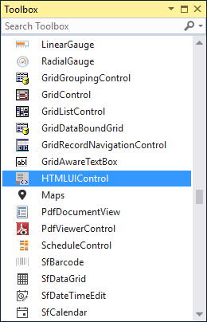
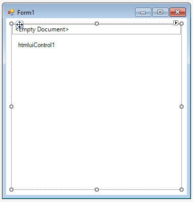
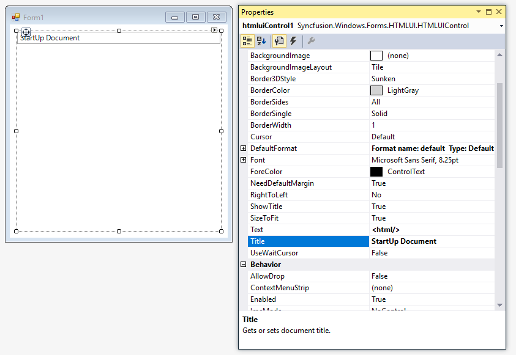
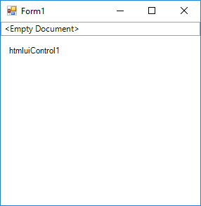
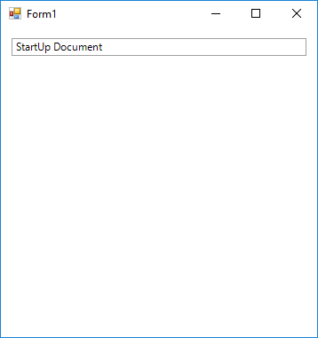
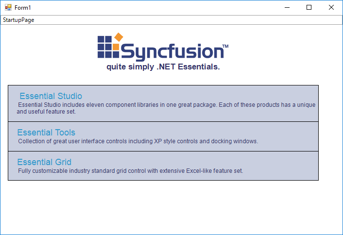

# Getting Started with WinForms HTML Viewer

This section describes how to configure a `WinForms HTML Viewer Control` in a Windows Forms application and overview of its basic functionalities.

## Assembly deployment

Refer to the [Control Dependencies](https://help.syncfusion.com/windowsforms/control-dependencies#htmluicontrol) section to get the list of assemblies or the NuGet package that needs to be added as a reference to use the control in any application.

Find more details on how to install NuGet packages in a Windows Forms application in the [How to install NuGet packages](https://help.syncfusion.com/windowsforms/installation/install-nuget-packages) link.

## Creating simple application with WinForms HTML Viewer Control

You can create a Windows Forms application with the WinForms HTML Viewer Control as follows:

1. [Creating the project](#creating-the-project)
2. [Adding control via designer](#adding-control-via-designer)
3. [Adding control manually using code](#adding-control-manually-using-code)
4. [Loading a file into document](#loading-a-file-into-document)

### Creating the project

Create a new Windows Forms project in Visual Studio to display the WinForms HTML Viewer Control.

## Adding control via designer

The WinForms HTML Viewer Control can be added to the application by dragging it from the toolbox and dropping it in the designer view. The following required assembly references will be added automatically:

* Syncfusion.HTMLUI.Base.dll
* Syncfusion.HTMLUI.Windows.dll
* Syncfusion.Scripting.Base.dll
* Syncfusion.Shared.Base

**Configure Title**

The title text can be set using the `Title` property. The visibility of the title can be customized using the `ShowTitle` property.

## Adding control manually using code

To add the control manually in C#, follow the steps:

**Step 1** : Add the following required assembly references to the project:

      * Syncfusion.HTMLUI.Base.dll
      * Syncfusion.HTMLUI.Windows.dll
      * Syncfusion.Scripting.Base.dll
      * Syncfusion.Shared.Base

**Step 2**: Include the namespace `Syncfusion.Windows.Forms.HTMLUI`.





using Syncfusion.Windows.Forms.HTMLUI;





Imports Syncfusion.Windows.Forms.HTMLUI





**Step 3** : Create the WinForms HTML Viewer Control instance and add it to the form.





HTMLUIControl htmluiControl1 = new HTMLUIControl();

this.htmluiControl1.Dock = System.Windows.Forms.DockStyle.Fill;

this.htmluiControl1.Text = "htmluiControl1";

this.Controls.Add(this.htmluiControl1);





Dim htmluiControl1 As New HTMLUIControl()

Me.htmluiControl1.Dock = System.Windows.Forms.DockStyle.Fill

Me.htmluiControl1.Text = "htmluiControl1"

Me.Controls.Add(Me.htmluiControl1)





**Configure Title**

Title text can be set using [Title](https://help.syncfusion.com/cr/windowsforms/Syncfusion.Windows.Forms.HTMLUI.HTMLUIControl.html#Syncfusion_Windows_Forms_HTMLUI_HTMLUIControl_Title) property. The visibility of the title can be customized using [ShowTitle](https://help.syncfusion.com/cr/windowsforms/Syncfusion.Windows.Forms.HTMLUI.HTMLUIControl.html#Syncfusion_Windows_Forms_HTMLUI_HTMLUIControl_ShowTitle) property.





this.htmluiControl1.ShowTitle = true;
this.htmluiControl1.Title = "StartUp Document";





Me.htmluiControl1.ShowTitle = True
Me.htmluiControl1.Title = "StartUp Document"





## Loading a file into document

A file can be loaded into the WinForms HTML Viewer Control using the [LoadHTML](https://help.syncfusion.com/cr/windowsforms/Syncfusion.Windows.Forms.HTMLUI.HTMLUIControl.html#Syncfusion_Windows_Forms_HTMLUI_HTMLUIControl_LoadHTML_System_IO_Stream_) method, with the file path given as a parameter.





this.htmluiControl1.LoadHTML(Path.GetDirectoryName(Application.ExecutablePath) + @"\..\..\FileName.htm");





Me.htmluiControl1.LoadHTML(Path.GetDirectoryName(Application.ExecutablePath) + @"\..\..\FileName.htm")





