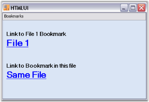
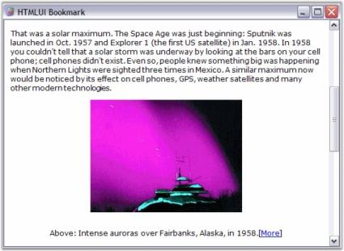

---
layout: post
title: HTML Bookmarks in Windows Forms HTMLUI control | Syncfusion®
description: Learn about HTML Bookmarks support in Syncfusion Windows Forms Html Viewer (HTMLUI) control and more details.
platform: windowsforms
control: HTMLUI
documentation: ug
---

# HTML bookmarks in Windows Forms HTMLUI control

Bookmarks feature is enabled in the HTMLUI control. This allows the user to switch to particular references in the page when the link is clicked. The HTMLUI control has another functionality of referring bookmarks which is, referring them not only in the same page, but also in other pages.





<html>

<body>

<a href="Newfile.htm#bookmark" aria-label="New file Book mark"> New file Book mark </a>

<a href="#bookmark" aria-label="Bookmark in same file"> Bookmark in same file </a>

......

......

 Syncfusion's HTMLUI Control 

</body>

</html>





## HTMLUI bookmarks sample

This sample illustrates the implementation of Bookmarks in HTMLUI.

By default, this sample can be found under the following location:

...\_My Documents\Syncfusion\EssentialStudio\Version Number\Windows\HTMLUI.Windows\Samples\Advanced Editor Functions\ActionGroupingDemo_

