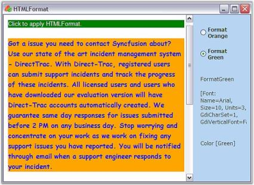

# HTML Format in Windows Forms Html Viewer (HTMLUI)

HTMLUI allows the user to apply formats to the elements at run time. The HTMLFormat class creates a format for the HTML elements displayed in the HTMLUI control. The user can apply the format on the execution of some events based on the necessity of the application.





// Implementation of HTMLFormat interface

Hashtable html = this.htmluiControl1.Document.GetElementsByUserIdHash();

BaseElement div = html["div1"] as BaseElement;

HTMLFormat format = new HTMLFormat("ClickedPara");

format.Font = new Font("Verdana", 12);

format.ForeColor = Color.Blue;

div.Format = format;





'  Implementation of HTMLFormat interface

Private html As Hashtable = Me.HtmluiControl1.Document.GetElementsByUserIdHash()

Private div As BaseElement = CType(IIf(TypeOf html("div1") Is BaseElement, html("div1"), Nothing), BaseElement)

Private format As HTMLFormat = New HTMLFormat("ClickedPara")

Private format.Font = New Font("Verdana",12)

Private format.ForeColor = Color.Blue

Private div.Format = format





With HTMLUI, the user can also access the location of the elements in the HTMLUI control.





Hashtable html = this.htmluiControl1.Document.GetElementsByUserIdHash();

BaseElement div = html["element"] as BaseElement;

beginPoint = element.Location;

endPoint = new Point(beginPoint.X + element.Size.Width, beginPoint.Y + element.Size.Height);





Private html As Hashtable = Me.HtmluiControl1.Document.GetElementsByUserIdHash()

Private div As BaseElement = CType(IIf(TypeOf html("element") Is BaseElement, Nothing), BaseElement)

Private beginPoint = element.Location

Private endPoint = New Point(beginPoint.X + element.Size.Width, beginPoint.Y + element.Size.Height)





## HTMLFormat sample

This sample shows how the styles are applied by using the HTML Format object.

By default, this sample can be found under the following location:

...\_My Documents\Syncfusion\EssentialStudio\Version Number\Windows\HTMLUI.Windows\Samples\Advanced Editor Functions\ActionGroupingDemo_

