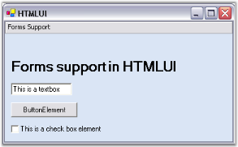
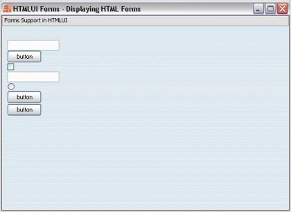

# HTML Forms in WinForms HTML Viewer

Forms are the containers for placing the elements in a HTML document. WinForms HTML Viewer supports the usage of forms for developing advanced and decorative pages in the user's application.





<html>

<body>

<form>

<input type = "text"/> 

<input type = "button"/> 

<input type = "checkbox" checked /> 

</form>

</body>

</html>





Loading the above HTML document into WinForms HTML Viewer creates a Form with the three controls specified as shown below.

## HTMLUIForms sample

This sample illustrates the implementation of Forms by using WinForms HTML Viewer.

