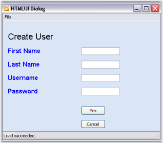
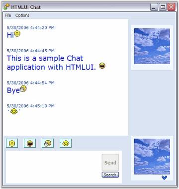

# HTML Layout in WinForms HTML Viewer

WinForms HTML Viewer can be used as a HTML viewer in two ways.

* Display Engine
* Layout Engine

The display purposes involve the functionality similar to Web browsers in displaying the contents of the HTML document. In the Layout purpose, it is used to layout and customize rich user-interactive interfaces.

WinForms HTML Viewer control can be used in a variety of applications which are common in our day-to-day life.

With WinForms HTML Viewer control's support to images and animated images, Chat applications can be developed. The form based dialog box applications used in the office desks can also be developed at ease by simply changing different HTML documents as per the needs. The other interesting applications that can be developed using WinForms HTML Viewer include games, animations, user blog, and so on.

The following figure shows a form based dialog that illustrates WinForms HTML Viewer as a Layout Engine.

## WinForms HTML Viewer chat sample

This sample illustrates how a Chat application can be implemented using WinForms HTML Viewer.

By default, this sample can be found under the following location:

...\_My Documents\Syncfusion\EssentialStudio\Version Number\Windows\HTMLUI.Windows\Samples\Advanced Editor Functions\ActionGroupingDemo_
