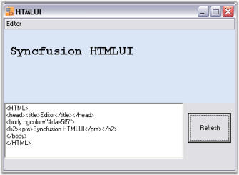
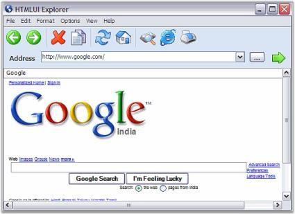
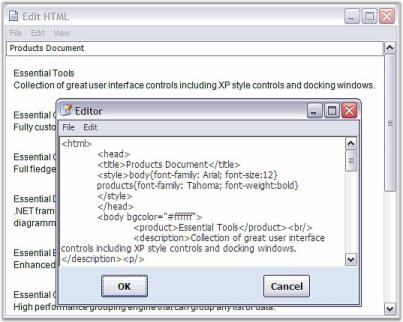

# HTML renderer in WinForms HTML Viewer control

As the WinForms HTML Viewer control supports rendering of web pages, it can be used like a light-weight web browser for compact applications that include links to references.





// Load the specified HTML document from System.Uri in to HTMLUI Control and renders it.

string path = "http://www.Google.com";

Uri uri = new Uri(path);

htmluiControl1.LoadHTML(uri);





' Load the specified HTML document from System.Uri in to HTMLUI Control and renders it.

Private path As String = "http://www.Google.com"

Private uri As Uri = New Uri(path)

HtmluiControl1.LoadHTML(uri)





Also the ability of the WinForms HTML Viewer control to load from strings can be used in creating HTML editors for tutorial applications.





// Load HTML Document from String.

string htmlString = "<HTML>

<BODY> Document loaded through the LoadFromString method </BODY> 

</HTML>"; 

this.htmluiControl1.LoadFromString(htmlString);





Private htmlString As String = "<HTML>"

<BODY>Document loaded through the LoadFromString method</BODY> 

</HTML>" 

Me.HtmluiControl1.LoadFromString(htmlString)





The following figure shows an HTML Editor rendered using WinForms HTML Viewer.

## WinForms HTML Viewer browser sample

This sample demonstrates the implementation of a Web Browser in WinForms HTML Viewer.

By default, this sample can be found under the following location:

...\_My Documents\Syncfusion\EssentialStudio\Version Number\Windows\HTMLUI.Windows\Samples\Advanced Editor Functions\ActionGroupingDemo_

## WinForms HTML Viewer editor sample

This sample demonstrates the implementation of HTML Editors in WinForms HTML Viewer.

By default, this sample can be found under the following location:

...\_My Documents\Syncfusion\EssentialStudio\Version Number\Windows\HTMLUI.Windows\Samples\Advanced Editor Functions\ActionGroupingDemo_
