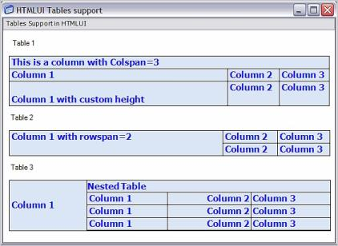

# HTML Tables in Windows Forms Html Viewer (HTMLUI)

HTMLUI has a rich table support that lets the user to decide the table's dimensions and design. The HTMLUI table support also comes with different alignments of text within the table. This helps the user in creating advanced and highly structured HTML applications.





<html>

<body>

<table>

<tr><td>Table support in HTMLUI</td></tr>

</table>

</body>

</html>





The HTML document that defines the Tables is then loaded into HTMLUI using any of the ways discussed in the section [Loading HTML](/windowsforms/htmlui/loading-html).

## HTMLUI tables sample

This sample illustrates how to implement Tables using HTMLUI.

By default, this sample can be found under the following location:

...\_My Documents\Syncfusion\EssentialStudio\Version Number\Windows\HTMLUI.Windows\Samples\Advanced Editor Functions\ActionGroupingDemo_

