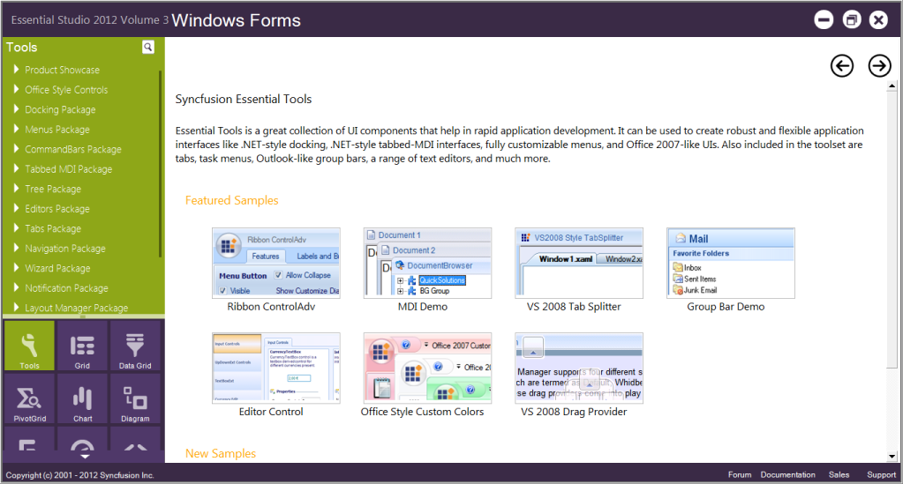

# Installation and deployment

This section covers information on the install location, samples, licensing, patches update and updation of the recent version of Essential Studio®. It comprises the following subsections:

## Installation

For step-by-step installation procedure for the installation of Essential Studio®, refer to the Installation topic under Installation and Deployment in the Common UG.

See also

For licensing, patches and information on adding or removing selective components, refer the following topics in Common UG under Installation and Deployment.

* Licensing
* Patches
* Add/Remove Components

## Sample and location

This section covers the location of the installed samples and describes the procedure to run the samples through the sample browser. It also lists the location of source code.

#### Sample installation location

The Essential® HTMLUI Windows Forms samples are installed in the following location.

...\_My Documents\Syncfusion\EssentialStudio\Version Number\Windows\HTMLUI.Windows\Samples\Advanced Editor Functions\ActionGroupingDemo_

Viewing Samples

To view the samples, follow the steps below:

1. Click Start-->All Programs-->Syncfusion-->Essential Studio <version number> -->Dashboard. Essential Studio® Enterprise Edition window is displayed.

2. In the Dashboard window, click Run Samples for Windows Forms under UI Edition. The UI Windows Form Sample Browser window is displayed.

N> You can view the samples in any of the following three ways:

* Run Samples-Click to view the locally installed samples.
* Online Samples-Click to view online samples.
* Explore Samples-Explore BI Web samples on disk.

3. Click HTML UI from the bottom-left pane. HTML UI samples will be displayed.

4. Select any sample and browse through the features.

Source Code Location

The source code for HTMLUI Windows is available at the following default location:

[System Drive]:\Program Files\Syncfusion\Essential Studio\[Version Number]\Windows\HTMLUI.Windows\Src

## Deployment requirements

This section illustrates the deployment requirements for using Essential® HTMLUI in the following topics:

### Toolbox entries

Essential® HTMLUI places the following control into your Visual Studio .NET toolbox, from where you can drag each control onto a form and start working with it.

* HTMLUIControl

### Assemblies

While deploying an application that references a Syncfusion® Essential® HTMLUI assembly, the following dependencies must be included in the distribution.

Windows Forms – HTMLUI

* Syncfusion.Shared.Base.dll
* Syncfusion.Shared.Windows.dll
* Syncfusion.HTMLUI.Base.dll
* Syncfusion.HTMLUI.Windows.dll
* Syncfusion.Scripting.Base.dll
* Syncfusion.MIME.Base.dll

 Syncfusion.HTMLUI.Base.dll depends on Syncfusion.MIME.Base.dll. So this needs to be included in the deployment of any application which uses HTMLUI.

