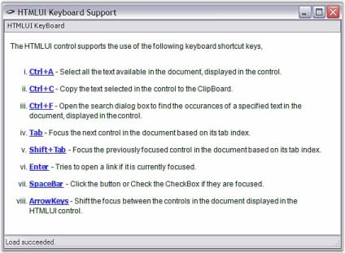

# Keyboard in WinForms HTML Viewer control

The WinForms HTML Viewer control also supports usage of keyboards for navigating through the links inside a HTML document. Like in popular browsers, WinForms HTML Viewer control uses the TAB key for shifting the focus on the links.

## WinForms HTML Viewer Keyboard sample

This sample shows how elements in the document can be focused by using the Keyboard support in WinForms HTML Viewer.

By default, this sample can be found under the following location:

...\_My Documents\Syncfusion\EssentialStudio\Version Number\Windows\HTMLUI.Windows\Samples\Advanced Editor Functions\ActionGroupingDemo_
