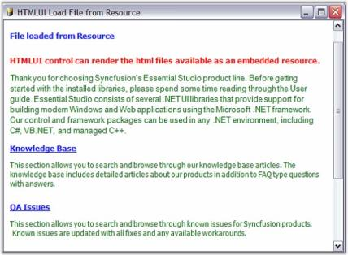

# Loading HTML in Windows Forms Html Viewer (HTMLUI)

HTML documents available at various resources can be easily loaded into the HTMLUI control. Some of the resources from where the HTML documents can be loaded are as follows.

* HTML files available on the disk.
* HTML files available in the embedded resource.
* As links from one HTML document to the other.
* HTML files available in the URI.
* HTML which is in the form of a text.

An HTML document can be loaded into the HTMLUI control in two ways.

## Loading as a startup document

There may be situations where the HTML document is to be loaded initially at startup. An HTML document is loaded at startup for the front page applications. It may be an introductory page or a page that contains information regarding forthcoming pages. An HTML document can be loaded at Startup by two ways:

* Using the Properties window.
* Coding.

Using the Properties window involves specifying the location of the Startup HTML file in the [StartupDocument](https://help.syncfusion.com/cr/windowsforms/Syncfusion.Windows.Forms.HTMLUI.HTMLUIControl.html#Syncfusion_Windows_Forms_HTMLUI_HTMLUIControl_StartupDocument) property available within the properties window for the HTMLUI control or by clicking the link Load from file shown at the bottom of the properties window.

While coding for the Startup Document, it should be written in the form_load event that is handled before the form is displayed for the first time.





// Get or Set the path to the Startup Document for the control.

private void Form1_Load(object sender, System.EventArgs e)

{

this.htmluiControl1.StartupDocument = @"C:\MyProjects\Startup\startup_page.htm";

}





‘Get/Set the path to the Startup Document for the control.

Private Sub Form1_Load(ByVal sender As Object, ByVal e As System.EventArgs)

Me.htmluiControl1.StartupDocument = "C:\MyProjects\Startup\startup_page.htm"

End Sub





### Startup file sample

This sample demonstrates the implementation of Startup Document by using HTML file in HTMLUI.

By default, this sample can be found under the following location:

_…\My Documents\Syncfusion\EssentialStudio\Version Number\Windows\HTMLUI.Windows\Samples\Advanced Editor Functions\ActionGroupingDemo_

##  Loading at run time

 HTML documents can also be loaded during runtime; for example, in a file link where an HTML file may link to another file. In that case a new file is loaded in the control after the one that was initially loaded.

The various ways of loading the document during the runtime from various resources are as follows:

* Loading the file from disk.
* As links from one HTML document to the other.
* Loading the file from URI.
* Loading HTML in the form of text.
* Loading the file from Resource.

### Loading the file from disk

The HTML file that is located in the user's disk can be loaded into the HTMLUIControl. It is loaded by specifying the location of the file in the disk.





// Load the specified HTML Document from user's drive.

string path = @"C:\MyProjects\LoadHTML\FromDisk.htm";

this.htmluiControl1.LoadHTML(path);





'Load the specified HTML Document from user's drive.

Private path As String = "C:\MyProjects\LoadHTML\FromDisk.htm"

Me.HtmluiControl1.LoadHTML(path)





#### Load file from disk sample

This sample demonstrates the implementation of Loading a file from Disk by using HTMLUI.

By default, this sample can be found under the following location:

_…\My Documents\Syncfusion\EssentialStudio\Version Number\Windows\HTMLUI.Windows\Samples\Advanced Editor Functions\ActionGroupingDemo_

### As links from one HTML document to another

The HTMLUI supports Link property. Links in HTML code are easily invoked in HTMLUI Control. The main document that contains links to other documents is loaded into the HTMLUI control. The linked document is loaded by clicking the respective link in the main document.





// Load the specified HTML Document that contains link for another document.

string path = @"C:\MyProjects\LoadHTML\Main.htm";

this.htmluiControl1.LoadHTML(path);





‘Load the specified HTML Document that contains link for another document.

Private path As String = "C:\MyProjects\LoadHTML\Main.htm"

Me.HtmluiControl1.LoadHTML(path)





HTML Code

An HTML document containing file links is illustrated by the code given below:





<HTML>

<HEAD>

<title>FILE LINK</title>

</HEAD>

<body bgColor="#ffffff">

THIS FORM IS A SAMPLE TO SHOW FILE LINKS

<A href="MODEL1.htm">To link1</a>

<A href="MODEL2.htm">To link2</a>

</body>

</HTML>





The following image shows file links that link to another HTML Document.

#### File links sample

This sample demonstrates how HTML files can be linked from one document to another by using HTMLUI.

By default, this sample can be found under the following location:

_…\My Documents\Syncfusion\EssentialStudio\Version Number\Windows\HTMLUI.Windows\Samples\Advanced Editor Functions\ActionGroupingDemo_

### Loading the file from URI

HTML contents can also be loaded from the URI (Uniform Resource Identifier). This is a great advantage of HTMLUI that it can be used for browsing purposes like popular web browsers.





// Load the HTML document from the specified Uri in to HTMLUI Control.

Uri uri = new Uri("http://www.syncfusion.com");

htmluiControl1.LoadHTML(uri);





‘Load the HTML document from the specified Uri in to HTMLUI Control.

Private uri As Uri = New Uri("http://www.syncfusion.com")

HtmluiControl1.LoadHTML(uri)





A new URI has to be declared in the code with the path from which the URI has to be loaded, as shown in the above example. The URI class provides an object representation of a URI and also provides easy access to the parts of the URI.

### Loading HTML which is in the form of text

The HTML code sometimes can be directly written and stored as a string. The HTML code available in the form of string is loaded into the HTMLUI Control by using the LoadFromString method and the HTML contents will be displayed in the HTMLUI control.





// Load HTML Document from String.

string htmlCode ="<HTML>

<HEAD>

<TITLE>HI</TITLE>

</HEAD>

<BODY bgcolor='#ffffff'>

<INPUT type='button' id='btn'/></INPUT>

</BODY>

</HTML>";

this.htmluiControl1.LoadFromString(htmlCode);





'  Load HTML Document from String

Private htmlCode As String = "<HTML>

<HEAD>

<TITLE>HI</TITLE>

</HEAD>

<BODY bgcolor='#ffffff'>

<INPUT type='button' id='btn'/></INPUT>

</BODY>

</HTML>"

Me.HtmluiControl1.LoadFromString(htmlCode)





### Load the file from resource

The HTML file can be loaded as an Embedded Resource in the HTMLUI control. The procedure to be followed for making an HTML file as an embedded resource is discussed below.

1. Open the Solution Explorer from the View menu of the Menu Bar.

2. Right-click on the C# file name in the Solution Explorer. A menu opens.

3. Click the Add tab; a sub-menu is displayed.

   

4. In the sub-menu, click AddNewItem; a template wizard is displayed.

5. In the wizard, select HTML Page. The default name for the page is 'HTMLPage1.htm'.

6. You can change the name by using the Name tab given at the bottom of the wizard.

   

7. The HTML file will be shown in the Solution Explorer as shown in the figure above.

8. In the properties grid of the resource HTML file, specify its BuildAction as the Embedded Resource.

   

The file can be retrieved from the resource by using the following C# code.





// Load the specified HTML file which is marked as the project's embedded resource.

htmlStream = (Stream)Assembly.GetExecutingAssembly().GetManifestResourceStream

("LoadingFileFromResource.report.htm");

this.htmluiControl1.LoadHTML(htmlStream); 





'  Load the specified HTML file which is marked as the project's embedded resource.

Private htmlStream = Ctype(System.Reflection.Assembly.GetExecutingAssembly().

GetManifestResourceStream ("LoadingFileFromResource.report.htm"), Stream)

Me.HtmluiControl1.LoadHTML(htmlStream)





It is necessary to invoke the System.IO and System.Reflection namespaces to use the classes and their methods used in the code above.

The [GetExecutingAssembly](https://learn.microsoft.com/en-us/dotnet/api/system.reflection.assembly.getexecutingassembly?view=netframework-4.7.2) method gets the assembly from which the code is currently running from and the GetManifestResourceStream method of the same class loads the specified manifest resource from the assembly.

The System.IO.Stream is used to provide a generic view of sequence of bytes when the IO in the assembly is referred.

N> The string entered inside the [GetManifestResourceStream](https://learn.microsoft.com/en-us/dotnet/api/system.reflection.assembly.getmanifestresourcestream?view=netframework-4.7.2) method is in reference to the Default namespace found in the Properties window of the C# file in the Solution Explorer. This may vary for the users.

The following image shows file loaded from an embedded resource.

#### Load resource file sample

This sample demonstrates the implementation of Loading Embedded Resource Files by using HTMLUI.

By default, this sample can be found under the following location:

...\_My Documents\Syncfusion\EssentialStudio\Version Number\Windows\HTMLUI.Windows\Samples\Advanced Editor Functions\ActionGroupingDemo_

