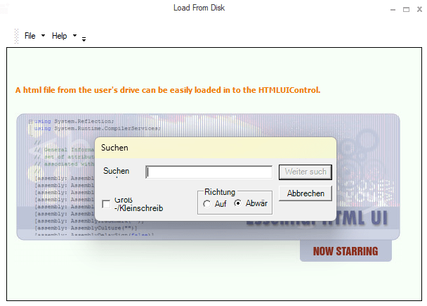

# Localization in Windows Forms Html Viewer (HTMLUI)

Localization is the process of making application multilingual by formatting the content according to the cultures. HTMLUIControl can be localized in any Languages, based on application requirement by following below steps.

Step 1: Need to initialize the [LocalizationProvider](https://help.syncfusion.com/cr/windowsforms/Syncfusion.Windows.Forms.LocalizationProvider.html) class, inherited from the ILocalizationProvider interface, before the InitializeComponent call in the constructor of an application.

Step 2: It will add the [GetLocalizedString](https://help.syncfusion.com/cr/windowsforms/Syncfusion.Windows.Forms.Grid.GridCellModelBase.html#Syncfusion_Windows_Forms_Grid_GridCellModelBase_GetLocalizedString_System_String_) function in the LocalizationProvider class. It is needed to provide the Localization content, for the required components used in HTMLUIControl.

For example:
Here, HTMLUIControl is localized in German Language.





//Call the Localizer

LocalizationProvider.Provider = new Localizer();

// localizer inherits the interface ILocationProvider

public class Localizer : ILocalizationProvider
    {
        #region ILocalizationProvider Members

        public string GetLocalizedString(System.Globalization.CultureInfo culture, string name, object obj)
        {
            switch (name)
            {
                 #region HTMLUI
                ///
 
                ///
                ///

                case HTMLUIResourceIdentifiers.FindNext:
                    return "Weiter suchen";

                ///

                ///
                ///
                    
                case HTMLUIResourceIdentifiers.Title:
                    return "Suchen";

                case HTMLUIResourceIdentifiers.Cancel:
                    return "Abbrechen";

                ///

                ///
                ///
                    
                case HTMLUIResourceIdentifiers.Direction:
                    return "Richtung";

                case HTMLUIResourceIdentifiers.Down:
                    return "Abwärts";

                ///

                ///
                ///
                    
                case HTMLUIResourceIdentifiers.FindWhat:
                    return "Suchen nach";

                case HTMLUIResourceIdentifiers.Matchcase:
                    return "Groß-/Kleinschreibung beachten";

                ///

                ///
                ///
                    
                case HTMLUIResourceIdentifiers.Up:
                    return "Aufwärts";
                ///

                /// default
                ///

                default:
                    return string.Empty;
                    #endregion
            }
        }

        #endregion
    }
}




'Call the Localizer
LocalizationProvider.Provider = New Localizer

' localizer inherits the interface ILocationProvider

Public Class Localizer
    Implements ILocalizationProvider
    
    Public Function GetLocalizedString(ByVal culture As System.Globalization.CultureInfo, ByVal name As String, ByVal obj As Object) As String
        Select Case (name)
        End Select
        
        #
        Dim HTMLUI As region
        HTMLUIResourceIdentifiers.FindNext
        Return "Weiter suchen"
        '''

        '''
        '''
                    
        HTMLUIResourceIdentifiers.Title
        Return "Suchen"
        HTMLUIResourceIdentifiers.Cancel
        Return "Abbrechen"
        '''

        '''
        '''
                    
        HTMLUIResourceIdentifiers.Direction
        Return "Richtung"
        HTMLUIResourceIdentifiers.Down
        Return "Abwärts"
        '''

        '''
        '''
                    
        HTMLUIResourceIdentifiers.FindWhat
        Return "Suchen nach"
        HTMLUIResourceIdentifiers.Matchcase
        Return "Groß-/Kleinschreibung beachten"
        '''

        '''
        '''
                    
        HTMLUIResourceIdentifiers.Up
        Return "Aufwärts"
        '''

        ''' default
        '''

        Return string.Empty
        #
        endregion
    End Function
End Class





