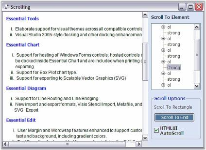

#  Scrolling in Windows Forms Html Viewer control

The Scroll property of the HTMLUI control helps in loading large HTML documents. This scroll property can be set as per the application. Also the HTMLUI control allows programmatic scrolling to a particular location or element with its extensive scroll properties support.





// Scroll controls in such  way that the specified element is visible

IHTMLElement elem = this.htmluiControl1.Document.GetElementByUserId("pre");

this.htmluiControl1.ScrollToElement(elem);





' Scroll controls in such  way that the specified element is visible

Private elem As IHTMLElement = Me.htmluiControl1.Document.GetElementByUserId("pre")

Me.htmluiControl1.ScrollToElement(elem)





## HTMLUIAutoScroll sample

This sample illustrates the Scrolling feature supported in HTMLUI.

By default, this sample can be found under the following location:

...\_My Documents\Syncfusion\EssentialStudio\Version Number\Windows\HTMLUI.Windows\Samples\Advanced Editor Functions\ActionGroupingDemo_

