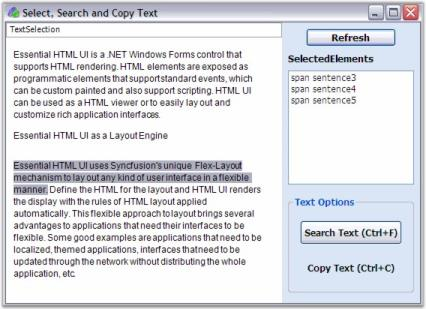

#  Searching in Windows Forms Html Viewer control

Like in popular browsers, the HTMLUI control helps the users to search for a given text in the document displayed in the HTMLUI control. The HTMLUI control uses the [DisplayFindForm](https://help.syncfusion.com/cr/windowsforms/Syncfusion.Windows.Forms.HTMLUI.HTMLUIControl.html#Syncfusion_Windows_Forms_HTMLUI_HTMLUIControl_DisplayFindForm) method for this purpose. This feature comes with an Updown search and also the Match case search that helps the user to easily find the required text from the displayed document.

The <kbd>Ctrl+F</kbd> shortcut can also be used for enabling this feature.





// Display the Find form for searching the text content of the HTMLUI control's current document

this.htmluiControl1.DisplayFindForm();





// Display the Find form for searching the text content of the HTMLUI control's current document

Me.htmluiControl1.DisplayFindForm()





## HTMLUISearching sample

This sample shows how a text can be searched in a document loaded into the HTMLUI.

