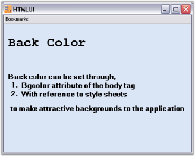

#  Style Sheets CSS in Windows Forms Html Viewer control

The support for style sheets is enabled in HTMLUI. This lets the user to define styles for HTML elements and decide the appearance of the HTML elements in the application. HTMLUI supports three types of style sheets.

* External Style sheets
* Internal Style sheets
* Inline Style sheets

External style sheets are linked to the file through the Link tag. While the internal style sheets are applied with the help of the Style tag inside the head section, inline style sheets are applied as the values of the style attributes of the specific HTML element.





<html>

<head>

<link type="text/css" rel="stylesheet" href="ExternalCSS.CSS"></link>

</head>

<body>

 This is an inline styled element 

 The Internal style sheet is applied for this element 

</body>

</html>





HTMLUI also supports updation of styles to the HTML document at run time. This can be done in two modes, either by changing the value of the style attribute for internal style or the class attribute for the inline style sheet.





if(this.textBox.Attributes.Contains("style") = = false) 

this.textBox.Attributes.Add("style"); 

this.textBox.Attributes["style"].Value = "background-color:red;"; 





If Me.textBox.Attributes.Contains("style") = False Then

Me.textBox.Attributes.Add("style")

End If

Private Me.textBox.Attributes("style").Value = "background-color:red;" 





## Cascading style sheets

Cascading style sheets contain the style definitions for various HTML tags that are defined in the document. Style sheets are included in a HTML document to make the document more clearer so that the actual contents will be inside the document while the styles for these contents will be applied from an external resource. This is to improve the readability of the document and also to apply style changes to the existing document at different times when required.

HTMLUI supports the following style sheets for adding styles to the HTML document:

### Inline StyleSheet

The Inline style sheet will be present inside the HTML tag as an attribute named Style, for the HTML element. The styles for the contents of the tag will be given as the values for this attribute.

The following snippet shows an inline style, which is applied as an attribute inside the tag to a HTML element, which is inside the document.





File name and location: C:\MyProjects\StyleSheets\inline.html

<html>

<body>

Inline style applied to a paragraph.

 

</body>

</html>





htmluiControl.LoadHTML(@"C:\MyProjects\StyleSheets\inline.html");





htmluiControl.LoadHTML(@"C:\MyProjects\StyleSheets\inline.html")





### Internal StyleSheet

The Internal style sheet is used to define the same styles to all the occurrences of a specific tag in the document. The internal style sheet is defined inside the Style tag, in the head section of the document. The user can create another style definition for other HTML tags with a new name inside the same style tag. The following snippet shows how an internal stylesheet is defined for a specific tag in a HTML document.





File name and location: C:\MyProjects\StyleSheets\internal.html

<html>

<head>

</head> 

<body>

This is a paragraph.
 

This is a division.

This is a new paragraph.

</body>

</html>





htmluiControl.LoadHTML(@"C:\MyProjects\StyleSheets\internal.html");





htmluiControl.LoadHTML(@"C:\MyProjects\StyleSheets\internal.html")





### External StyleSheet

The External style sheets contain style definitions in a separate .css file, for various HTML tags that are in the document. These styles are applied by linking the CSS file to the HTML document inside the Link tag. The Link tag should be placed in the head section of the HTML document as it contains the information about the cascading style sheet that is to be referred by this document.





FileName and location: C:\MyProjects\StyleSheets\styleSheet.css

body

 {

        background-color: #dae5f5;

        cursor: default;        

 }

 p

 {

        color: Green;

 }

 div

 {

        color: Blue;

        font-family: Tahoma;

 }





File name and location: C:\MyProjects\StyleSheets\external.html

<html>

<head>

        <link rel=Stylesheet type="text/css" href="C:\MyProjects\StyleSheets\styleSheet.css" />

</head> 

<body>

Green color for paragraph.
 

Blue color for division

</body>

</html>





The HTMLUI control uses two modes of applying styles to the HTML document with the help of the external style sheets.

#### Design time

This type of setting is carried out in the document at design time. It is used in circumstances where only a standard style is applied for the documents.





htmluiControl.LoadHTML(@"C:\MyProjects\StyleSheets\external.html");





htmluiControl.LoadHTML(@"C:\MyProjects\StyleSheets\external.html")





#### Run time

HTMLUI is so flexible that the user can define styles for the HTML document at run time. The LoadCSS method of the HTMLUI control helps the user to load another CSS file to the current document at run time.





htmluiControl.LoadHTML(@"C:\MyProjects\StyleSheets\external.html");

htmluiControl.LoadCSS(@"C:\MyProjects\StyleSheets\NewStyleSheet.css");





htmluiControl.LoadHTML(@"C:\MyProjects\StyleSheets\external.html"

htmluiControl.LoadCSS(@"C:\MyProjects\StyleSheets\NewStyleSheet.css")





### Class selectors

Internal and external styles are not only defined by mentioning the names of the tags, but also by the Style Class Selectors. The class selectors are used to define the styles under a common class name and apply the styles to different tags by specifying the name of the class as the value of the class attribute, for the specific element.

HTMLUI supports two types of styles definitions for the HTML documents with the help of the class selectors as given below:

#### Name class selectors

The Name Class Selectors contain a common name that is given to the style class, which is defined in the internal or external CSS file. The following snippet shows how the name class selectors are defined for HTML elements in the document.





File name and location: C:\MyProjects\StyleSheets\NameClass.html

<html>

<head>

  

</head>

<body>

    <h1 class="red">Red Heading</h1>

    
Blue colored paragraph.

</body>

</html>





htmluiControl.LoadHTML(@"C:\MyProjects\StyleSheets\NameClass.html");





htmluiControl.LoadHTML(@"C:\MyProjects\StyleSheets\NameClass.html")





#### ID class selectors

The ID Class Selectors are defined like the name class selectors. Instead of specifying names, a unique identity is specified for the styles while defining them, and these style names are passed as the values of the id attribute to the concerned HTML elements.





File name and location: C:\MyProjects\StyleSheets\idClass.html

<html>

<head>

  

</head> 

<body>

  <h1 id="red">Red Heading</h1>

  
Blue colored paragraph.
  

</body>

</html>





htmluiControl.LoadHTML(@"C:\MyProjects\StyleSheets\idClass.html");





htmluiControl.LoadHTML(@"C:\MyProjects\StyleSheets\idClass.html")





### CSS comments

The HTMLUI control supports comments inside the cascading style sheet. The comments helps the developer to explain his ideas behind the styles and also help the user to understand the functionality of the styles. A CSS comment begins with '/*' and ends with '*/' (For eg., /*This is a comment*/). The comments are not visible in the browser at run time.





/*blue colored font for the p elements*/

p {color: blue}

/*red colored font for the div elements*/

div{color: red}





## Supported CSS attributes

 The following attributes are supported in HTMLUI for the cascading style sheet definition.

### Background - CSS

The background attribute of CSS helps the user to set the back ground properties for the specified element. The following are the background properties that are supported in HTMLUI for a HTML element using CSS.

#### Background image

The background-image property is used to set an image as the background of the HTML element.





<html>

    <head>

      

    </head>

    <body>

      
Image in the background.

    </body>

</html>





#### Background color

The background-color property is used to set a background color for a HTML element.





<html>

<head>

</head>

<body>

Back ground color set to the body element.

</body>

</html>





#### Background repeat

The background-repeat property repeats the background that is set for the HTML element, horizontally or vertically.

* repeat-x: Repeats the background image horizontally.
* repeat-y: Repeats the background image vertically.
* repeat: Repeats the background image both horizontally and vertically.
* no-repeat: Fixes the background image at the top-left corner of the element and does not repeat the image display.





<html>

<head>

</head>

<body>

Back ground image for the document repeated horizontally.

</body>

</html>





###  Text – CSS

The text attribute in CSS helps the user to set properties for his text display. With these properties the appearance of the text can be modified according to the user’s requirements.

#### Text color

The color attribute is used to apply a specific color to the rendered text.





<html><head>

</head>

<body>

<h1>Text - HTMLUI - CSS</h1>

This is a paragraph

</body>

</html>





#### Text align

The text-align attribute is used to align the text inside an element to the specified horizontal direction.





<html>

<head>

</head>

<body>

Center aligned paragraph

</body>

</html>





#### Text decoration

The text-decoration attribute is used to decorate a text. The HTMLUI control supports the Underline and the None style values for the text decoration attribute.





<html><head>

</head>

<body>

Mouse over the links to see them change layout.

</body></html>





### Font – CSS

The font attribute is used to define the font specification for a HTML element in the HTMLUI. With the CSS font specification, the user can create good presentation applications in HTMLUI.

The HTMLUI control supports the following font attributes for the HTML elements.

#### Font family

The font-family attribute is used to specify a font for the text that is to be displayed in the specific HTML element.





<html><head>

</head>

<body>

This paragraph is given a font through styles.

</body>

</html>





#### Font size

The font-size attribute is used to specify a size for the rendered text that is to be displayed in the HTMLUI control.





<html><head>

</head>

<body>

A font size applied to the paragraph element.

</body>

</html>





#### Font style

The font-style attribute is used to format the specified text with the given styles. HTMLUI supports the normal and italic styles for the rendered text inside the HTML element.





<html><head>

</head>

<body>

Italic style applied to the formatted text.

</body>

</html>





#### Font weight

The font-weight attribute is used to specify the thickness or boldness of the rendered text. HTMLUI supports the normal and bold font-weight that is associated with the CSS text rendering.





<html><head>

</head>

<body>

Bold font applied to paragraph.

</body></html>





###  Border – CSS

The border attribute is used to specify the border properties for the rendered table element through CSS. The color and thickness of the border can also be specified through the border attribute. HTMLUI also supports applying border properties to the four sides of the table border independently.

#### Border color

* border-color: Specifies the color for the border of the rendered table.
* border-bottom-color: Specifies the color for the bottom border of the rendered table.
* border-top-color: Specifies the color for the top border of the rendered table.
* border-left-color: Specifies the color for the left border of the rendered table.
* border-right-color: Specifies the color for the right border of the rendered table.





<html><head>

</head>

<body>

<table border=1><tr><td>This is a table.</td></tr></table> 

<table class="table" border=1><tr><td>This is another table.</td></tr></table>

</body></html>





#### Border width

* border-width: Specifies the thickness for the border of the rendered table. The user can specify the border-width in units.
* border-bottom-width: Specifies the thickness for the bottom border of the rendered table.
* border-top-width: Specifies the thickness for the top border of the rendered table.
* border-left-width: Specifies the thickness for the left border of the rendered table.
* border-right-width: Specifies the thickness for the right border of the rendered table.





<html><head>

</head>

<body>

<table border=1><tr><td>This is a table.</td></tr></table> 

<table class="table" border=1><tr><td>This is another table.</td></tr></table>

</body></html>





### Padding – CSS

The CSS padding attribute in HTMLUI is used to define a fixed space between the element's border and its contents. The top, right, bottom and left padding attributes can be specified independently.





<html><head>

</head>

<body>

<table border=1><tr><td>This is a table.</td></tr></table> 

<table class="table" border=1><tr><td>This is another table.</td></tr></table>

</body>

</html>





#### Padding

The padding attribute is used to specify a fixed space for all the four sides of the element's contents.

#### Padding right

The padding-right attribute is used to specify the padding property at the right side of the HTML element.

#### Padding left

The padding-left attribute is used to specify the padding for the left side of the element.

#### Padding top

The padding-top attribute specifies the padding on the top edge of the element.

#### Padding bottom

The padding-bottom attribute specifies the padding at the bottom of the HTML element from its border.

### Dimension - CSS

The Dimension properties are used to specify the size for an HTML element.

* height: Specifies the height of an element. The HTMLUI control allows the user to specify the height either in percentage or units.
* width: Specifies the width of an element.

The width of an element in HTMLUI can be mentioned in terms of units.





<html>

<head>

</head>

<body>

<table border=1><tr><td>
NewSample</td></tr></table>

</body>

</html>





### Classification - CSS

The CSS Classification properties determine the display of an element in the HTMLUI control. The HTMLUI control supports the following classification property that determines how and where to display a HTML element.

* cursor: Specifies the cursor that is to be displayed when the mouse pointer is over the specified HTML element.





<html>

<head></head>

<body>

The HTMLUI Editor helps you to edit your HTML document.

</body>

</html>





### Positioning - CSS

The positioning attribute is used to determine the position of the HTML element that is to be displayed in the HTMLUI control.

* vertical-align: Specifies the vertical alignment of the element during display.





<html>

<head>

</head>

<body>

<table border=1 height="100%"><tr><td>Bottom Aligned table cell.</td></tr></table>

</body></html>





### Pseudo - Classes

The Pseudo-Classes are used to add special effects to the HTML hyperlink element display. For understanding this case clearly in HTMLUI, let us define a general case, where the link should change its appearance when a mouse pointer is moved over it.

The HTMLUI control supports the link and the hover classes in order to display the links in the HTMLUI control.

* link: Specifies the properties for the display of a hyperlink in the normal state.
* hover: Specifies the CSS properties for the hyperlink when a mouse is moved over the link.

The following sample shows how different properties can be set for the hyperlink element by using the pseudo-classes.





<html><head>

</head>

<body>

<a class="ChangeColor" href="none.htm" target="_blank">This link changes color</a> 

<a class="ChangeFont" href="none.htm" target="_blank">This link changes font</a> 

<a class="ChangeBgcolor" href="none.htm" target="_blank">This link changes background-color</a> 

<a class="ChangeTextDec" href="none.htm" target="_blank">This link changes text-decoration</a> 

</body>

</html>





##  HTMLUIUseCSS sample

This sample demonstrates the implementation of External Style Sheets in HTMLUI.

By default, this sample can be found under the following location:

...\_My Documents\Syncfusion\EssentialStudio\Version Number\Windows\HTMLUI.Windows\Samples\Advanced Editor Functions\ActionGroupingDemo_

### HTMLUIElementsCSS sample

This sample demonstrates the implementation of Internal Style Sheets on HTML Elements.

By default, this sample can be found under the following location:

...\_My Documents\Syncfusion\EssentialStudio\Version Number\Windows\HTMLUI.Windows\Samples\Advanced Editor Functions\ActionGroupingDemo_

## HTMLUI appearance

With HTMLUI, the application developer can decide the appearance of his application even at run time by setting the style according to his needs. A common application is changing the background color for a particular page based on the user signing in. These interactive applications help in developing user-friendly applications.

The HTMLUI control allows the following modes of changing the background color to your application.

* Inside the HTML document as Attribute.
* Using the Style Sheets.

The following HTML coding shows the different methods of changing the background color that HTMLUI control supports, leaving it to the user to choose the best among the various options as per the requirements.





<html>

<head>

<link type="text/css" rel="stylesheet" href="backgroundColor.CSS"></link>

</head>

<body bgcolor="#dae5f5">

Background color changed through the style attribute

</body>

</html>





The following figure shows the back color of the HTML document customized by using HTMLUI.

### HTMLUIAppearance sample

This sample illustrates the customization of HTMLUI Appearance.

HTMLUIBackColor Sample
{:.caption}

By default, this sample can be found under the following location:

...\_My Documents\Syncfusion\EssentialStudio\Version Number\Windows\HTMLUI.Windows\Samples\Advanced Editor Functions\ActionGroupingDemo_

