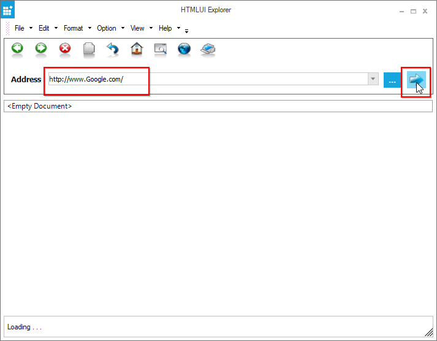

# Unsupported Formats in Windows Forms Html Viewer (HTMLUI)

The [HTMLUI](https://help.syncfusion.com/cr/windowsforms/Syncfusion.Windows.Forms.HTMLUI.HTMLUIControl.html) control contains advanced options with some limitations. It allows you to only load basic html or htm pages.
 
Unlike web browsers, the following cannot be loaded into web pages using `HTMLUI` control,
 
 * Complex objects 
 
    **Example:**
 
    From direct text to links cannot be navigated.
 

 
N> So, the html or htm files with complex objects will not be loaded in `HTMLUI` control.

