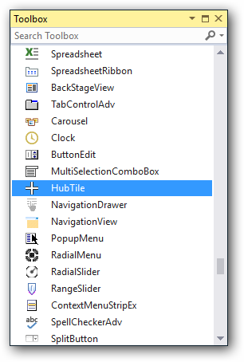
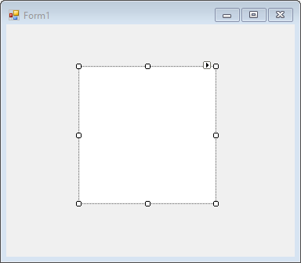
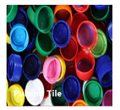
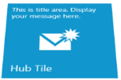
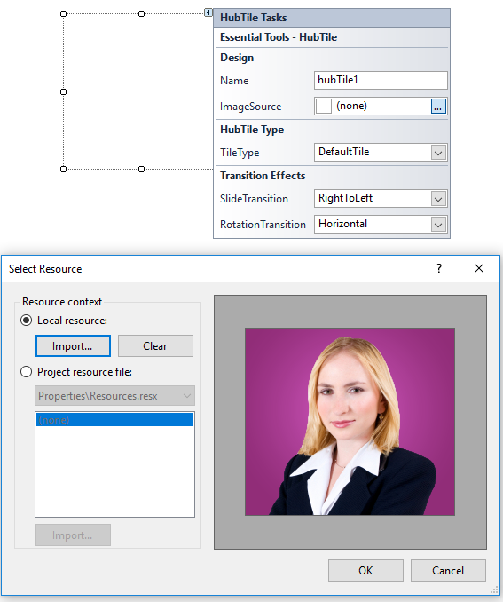
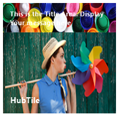
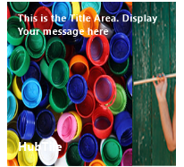

# Getting Started with Windows Forms Hub Tile

This section describes how to add `HubTile` control in a Windows Forms application and overview of its basic functionalities.

## Assembly deployment

Refer to the [control dependencies](https://help.syncfusion.com/windowsforms/control-dependencies#hubtile) section to get the list of assemblies or NuGet package that needs to be added as reference to use the control in any application. 
 
You can find more details about installing the NuGet packages in a Windows Forms application in the following link: 
 
[How to install nuget packages](https://help.syncfusion.com/windowsforms/installation/install-nuget-packages)

## Create a simple application with HubTile

You can create the Windows Forms application with HubTile control as follows:

1. [Creating project](#creating-the-project)
2. [Adding control via designer](#adding-control-via-designer)
3. [Adding control manually using code](#adding-control-manually-using-code)
4. [Customize background image](#customize-background-image)

### Creating the project

Create a new Windows Forms project in the Visual Studio to display the HubTile with transition effects.

## Add control via designer

The HubTile control can be added to the application by dragging it from the toolbox and dropping it in a designer view. The following required assembly references will be added automatically:

* Syncfusion.Grid.Base.dll
* Syncfusion.Grid.Windows.dll
* Syncfusion.Shared.Base.dll
* Syncfusion.Shared.Windows.dll
* Syncfusion.Tools.Base.dll
* Syncfusion.Tools.Windows.dll

## Add control manually using code

To add the control manually in C#, follow the given steps:

**Step 1** - Add the following required assembly references to the project:

        * Syncfusion.Grid.Base.dll
        * Syncfusion.Grid.Windows.dll
        * Syncfusion.Shared.Base.dll
        * Syncfusion.Shared.Windows.dll
        * Syncfusion.Tools.Base.dll
        * Syncfusion.Tools.Windows.dll

**Step 2** - Include the namespaces **Syncfusion.Windows.Forms.Tools**.





using Syncfusion.Windows.Forms.Tools;





Imports Syncfusion.Windows.Forms.Tools



 

**Step 3** - Create `HubTile` control instance and add it to the form.





HubTile HubTile1 = new HubTile();

this.Controls.Add(HubTile1);





Dim hubTile1 As HubTile = New HubTile()

Me.Controls.Add(hubTile1)





## Change tile 

HubTile control has following types of tile:

HubTile [DefaultTile] – This tile provides notifications through various transition effects.

RotateTile – This tile rotates itself in transition and direction.

PulsingTile – This tile zooms in and out and translates its image.

You can customize the types of tile using [TileType](https://help.syncfusion.com/cr/windowsforms/Syncfusion.Windows.Forms.Tools.HubTile.html#Syncfusion_Windows_Forms_Tools_HubTile_TileType) property of HubTileControl.



//Setting default tile
this.HubTile1.TileType = HubTileType.DefaultTile;

//Setting pulsing tile
this.HubTile2.TileType = HubTileType.PulsingTile;

//Setting rotate tile
this.HubTile3.TileType = HubTileType.RotateTile;


'Setting default tile
Me.HubTile1.TileType = HubTileType.DefaultTile

'Setting pulsing tile
Me.HubTile2.TileType = HubTileType.PulsingTile

'Setting rotate tile
Me.HubTile3.TileType = HubTileType.RotateTile



**HubTile**

**PulsingTile**

**RotateTile**

## Set header and footer

You can define the header and footer for tile by setting the [Title](https://help.syncfusion.com/cr/windowsforms/Syncfusion.Windows.Forms.Tools.HubTile.html#Syncfusion_Windows_Forms_Tools_HubTile_Title) and [Footer](https://help.syncfusion.com/cr/windowsforms/Syncfusion.Windows.Forms.Tools.HubTile.html#Syncfusion_Windows_Forms_Tools_HubTile_Footer) property of HubTile.



//Set hub tile title
hubTile1.Title.Text = "This is the title area. Display your image here";
//Set hub tile footer text
hubTile1.Footer.Text = "HubTile";
//Title color
hubTile1.Title.TextColor = Color.White;
//Footer color
hubTile1. Footer.TextColor = Color.White;
//HubTile back color
hubTile1.BackColor = Color.FromArgb(17, 158, 218);


'Set hub tile title
hubTile1.Title.Text = "This is the title area. Display your image here"
'Set hub tile footer text
hubTile1.Footer.Text = "HubTile"
'Title color
hubTile1.Title.TextColor = Color.White
'Footer color
hubTile1.Footer.TextColor = Color.White
'HubTile back color
hubTile1.BackColor = Color.FromArgb(17, 158, 218)



## Tile image

Background image can be added to HubTile through designer as well as through code.

**Add background image through designer**

Background image can be added to HubTile using `ImageSource` property in SmartTag.

**Adding background image manually through code**

Background image can be added to HubTile using `ImageSource` property in HubTile class.





this.hubTile1.ImageSource = ((System.Drawing.Image)(resources.GetObject("hubTile1.ImageSource")));





Me.hubTile1.ImageSource = ((System.Drawing.Image)(resources.GetObject("hubTile1.ImageSource")))





## Transition effects

In HubTile, image transition can be performed at specified intervals and in different directions. They include the following transition effects.

*   Bottom to Top
*	Top to Bottom
*	Left to Right
*	Right to Left

You can customize the transition direction by setting [SlideTransition](https://help.syncfusion.com/cr/windowsforms/Syncfusion.Windows.Forms.Tools.HubTile.html#Syncfusion_Windows_Forms_Tools_HubTile_SlideTransition) properties of HubTile. 



//Transition 
this.HubTile1.SlideTransition = TransitionDirection.BottomToTop;


'Transition 
Me.HubTile1.SlideTransition = TransitionDirection.LeftToRight



* **Bottom-to-Top**

* **Top-to-Bottom**

* **Left-to-Right**

* **Right-to-Left**

