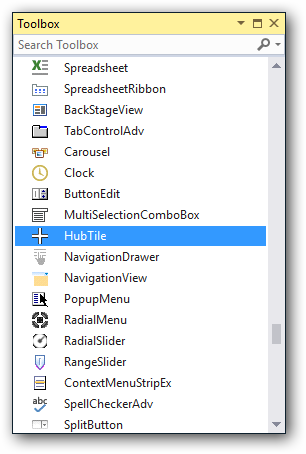
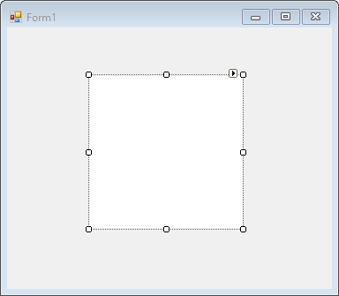
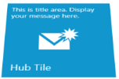
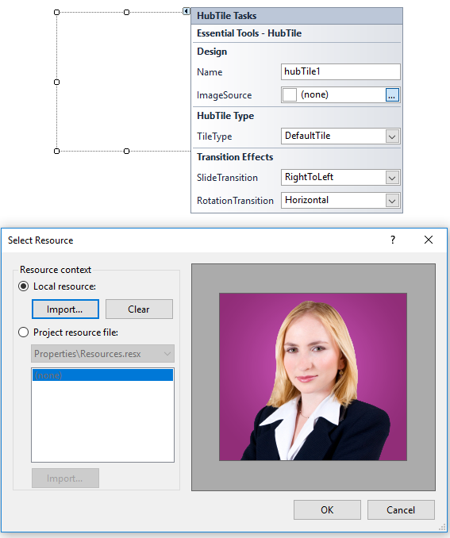
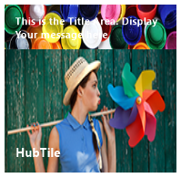
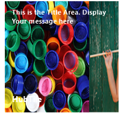

# Getting Started with Windows Forms HubTile

This section describes how to add the `HubTile` control to a Windows Forms application and provides an overview of its basic functionalities.

## Assembly deployment

Refer to the [control dependencies](https://help.syncfusion.com/windowsforms/control-dependencies#hubtile) section to get the list of assemblies or NuGet packages that need to be added as references in order to use the control in any application.

You can find more details about installing the NuGet packages in a Windows Forms application in the following link:

[How to install nuget packages](https://help.syncfusion.com/windowsforms/installation/install-nuget-packages)

```powershell
Install-Package Syncfusion.Tools.Windows
```

## Create a simple application with HubTile

You can create the Windows Forms application with the HubTile control as follows:

1. [Creating the project](#creating-the-project)
2. [Adding the control via designer](#adding-control-via-designer)
3. [Adding the control manually using code](#adding-control-manually-using-code)
4. [Setting a background image](#tile-image)

### Creating the project

Create a new Windows Forms project in Visual Studio to host the HubTile with transition effects. Add the **HubTile** assembly references (see [Assembly deployment](#assembly-deployment)) before continuing.

## Add the control via designer

The HubTile control can be added to the application by dragging it from the toolbox and dropping it in a designer view. The control is located under **Syncfusion** in the **Toolbox**. The following required assembly references will be added automatically:

* Syncfusion.Grid.Base.dll
* Syncfusion.Grid.Windows.dll
* Syncfusion.Shared.Base.dll
* Syncfusion.Shared.Windows.dll
* Syncfusion.Tools.Base.dll
* Syncfusion.Tools.Windows.dll





## Add control manually using code

To add the control manually in C#, follow the given steps:

**Step 1** - Add the following required assembly references to the project:

        * Syncfusion.Grid.Base.dll
        * Syncfusion.Grid.Windows.dll
        * Syncfusion.Shared.Base.dll
        * Syncfusion.Shared.Windows.dll
        * Syncfusion.Tools.Base.dll
        * Syncfusion.Tools.Windows.dll

**Step 2** - Add the following namespaces:




using Syncfusion.Windows.Forms.Tools;




Imports Syncfusion.Windows.Forms.Tools




**Step 3** - Create a `HubTile` instance and add it to the form.




namespace HubTileGettingStarted
{
    public partial class Form1 : Form
    {
        private HubTile hubTile1;

        public Form1()
        {
            this.hubTile1 = new HubTile();
            this.hubTile1.Location = new Point(20, 20);
            this.hubTile1.Name = "hubTile1";
            this.hubTile1.Size = new Size(170, 170);
            this.hubTile1.TabIndex = 0;

            this.AutoScaleDimensions = new SizeF(6F, 13F);
            this.AutoScaleMode = AutoScaleMode.Font;
            this.ClientSize = new Size(400, 300);
            this.Controls.Add(this.hubTile1);
            this.Name = "Form1";
            this.Text = "HubTile Getting Started";
        }
    }
}




Public partial Class Form1
    Inherits Form

    Private hubTile1 As HubTile

    Public Sub New()
        Me.hubTile1 = New HubTile()
        Me.hubTile1.Location = New Point(20, 20)
        Me.hubTile1.Name = "hubTile1"
        Me.hubTile1.Size = New Size(170, 170)
        Me.hubTile1.TabIndex = 0

        Me.AutoScaleDimensions = New SizeF(6.0F, 13.0F)
        Me.AutoScaleMode = AutoScaleMode.Font
        Me.ClientSize = New Size(400, 300)
        Me.Controls.Add(Me.hubTile1)
        Me.Name = "Form1"
        Me.Text = "HubTile Getting Started"
    End Sub
End Class




## Configure the tile type

The HubTile control provides the following tile types:

- **HubTile** (`DefaultTile`) — Displays notifications using various transition effects.
- **RotateTile** — Rotates itself with a configurable transition direction.
- **PulsingTile** — Zooms in and out, and translates its image.

The active tile type is set via the [TileType](https://help.syncfusion.com/cr/windowsforms/Syncfusion.Windows.Forms.Tools.HubTile.html#Syncfusion_Windows_Forms_Tools_HubTile_TileType) property of `HubTile`.




// Setting default tile type
hubTile1.TileType = HubTileType.DefaultTile;

// Setting pulsing tile type
hubTile1.TileType = HubTileType.PulsingTile;

// Setting rotate tile type
hubTile1.TileType = HubTileType.RotateTile;




'Setting default tile
Me.HubTile1.TileType = HubTileType.DefaultTile

'Setting pulsing tile
Me.HubTile2.TileType = HubTileType.PulsingTile

'Setting rotate tile
Me.HubTile3.TileType = HubTileType.RotateTile




**HubTile**


**PulsingTile**


**RotateTile**



## Set the header and footer

You can define the header and footer text of a tile by setting the [Title](https://help.syncfusion.com/cr/windowsforms/Syncfusion.Windows.Forms.Tools.HubTile.html#Syncfusion_Windows_Forms_Tools_HubTile_Title) and [Footer](https://help.syncfusion.com/cr/windowsforms/Syncfusion.Windows.Forms.Tools.HubTile.html#Syncfusion_Windows_Forms_Tools_HubTile_Footer) properties of `HubTile`.




//Set hub tile title
hubTile1.Title.Text = "This is the title area. Display your image here";
//Set hub tile footer text
hubTile1.Footer.Text = "HubTile";
//Title color
hubTile1.Title.TextColor = Color.White;
// Footer color
hubTile1.Footer.TextColor = Color.White;
// HubTile back color
hubTile1.BackColor = Color.FromArgb(17, 158, 218);




'Set hub tile title
hubTile1.Title.Text = "This is the title area. Display your image here"
'Set hub tile footer text
hubTile1.Footer.Text = "HubTile"
'Title color
hubTile1.Title.TextColor = Color.White
'Footer color
hubTile1.Footer.TextColor = Color.White
'HubTile back color
hubTile1.BackColor = Color.FromArgb(17, 158, 218)





## Set the tile image

A background image can be assigned to `HubTile` either through the designer or programmatically.

**Add background image through the designer**

In the designer, use the `ImageSource` property exposed in the `HubTile` smart tag.



**Add background image via code**

Background image can be added to HubTile using `ImageSource` property in HubTile class.




hubTile1.ImageSource = Properties.Resources.sampleImage;




Me.hubTile1.ImageSource = ((System.Drawing.Image)(resources.GetObject("hubTile1.ImageSource")))





## Transition effects

The `HubTile` image transition can be performed at specified intervals and in one of the following directions:

- Bottom to Top
- Top to Bottom
- Left to Right
- Right to Left

The transition direction is set with the [SlideTransition](https://help.syncfusion.com/cr/windowsforms/Syncfusion.Windows.Forms.Tools.HubTile.html#Syncfusion_Windows_Forms_Tools_HubTile_SlideTransition) property of `HubTile`.




// Transition direction
hubTile1.SlideTransition = TransitionDirection.BottomToTop;




' Transition direction
hubTile1.SlideTransition = TransitionDirection.BottomToTop




* **Bottom-to-Top**



* **Top-to-Bottom**


* **Left-to-Right**



* **Right-to-Left**


