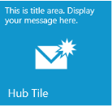

# About Syncfusion® Windows Forms Hub Tile Control

Hub Tile is a content control that functions as live tiles in an application for user interface. Its content updates are shown by a variety of animations, similar to the live tile updates of Windows 8 and Windows Phone. A Hub Tile can have an image, title, body and footer for updation in the tile.

 
 
## Key features

* **Default tile** –  This tile provides notifications through various transition effects.

* **Rotate tile** –  This tile rotates itself in transition and direction.

* **Pulsing tile** – This tile zooms in and out and translates its image.

* **Freezing** – Provides option to freeze notification functionality through a bool property.