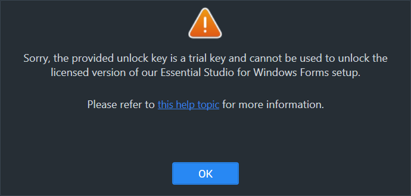
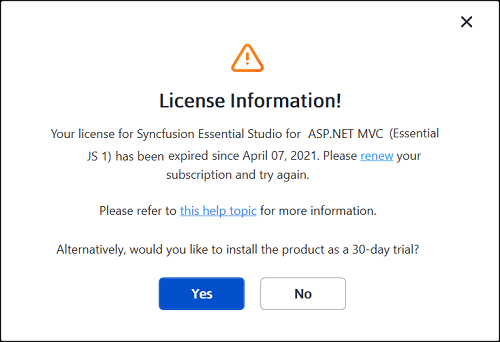
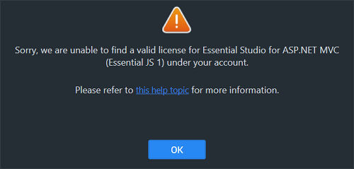
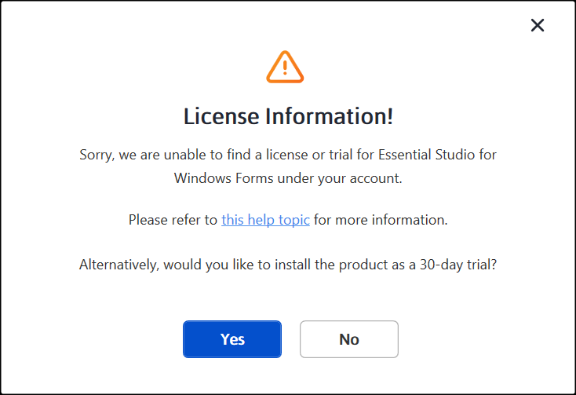
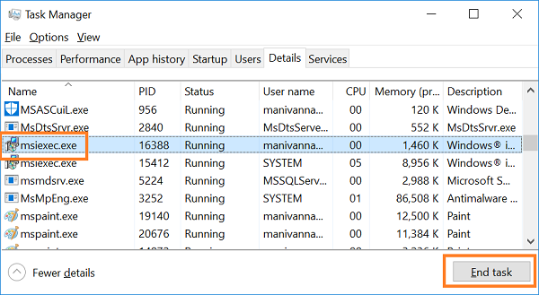
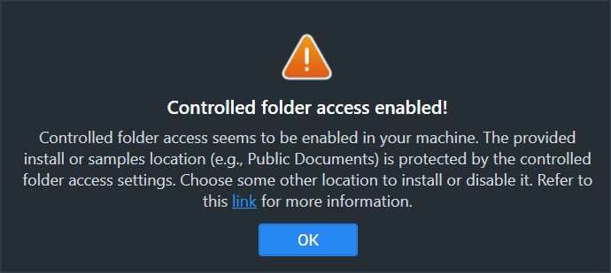
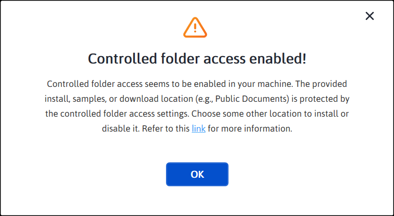

# Common Installation Errors

This article describes the most common installation errors, as well as the causes and solutions to those errors.

* [Unlocking the license installer using the trial key](https://help.syncfusion.com/windowsforms/installation/installation-errors#unlocking-the-license-installer-using-the-trial-key)
* [License has expired](https://help.syncfusion.com/windowsforms/installation/installation-errors#license-has-expired)
* [Unable to find a valid license or trial](https://help.syncfusion.com/windowsforms/installation/installation-errors#unable-to-find-a-valid-license-or-trial)
* [Unable to install because of another installation](https://help.syncfusion.com/windowsforms/installation/installation-errors#unable-to-install-because-of-another-installation)
* [Unable to install due to controlled folder access](https://help.syncfusion.com/windowsforms/installation/installation-errors#unable-to-install-due-to-controlled-folder-access)

## Unlocking the license installer using the trial key

### Problem

**Error Message:** Sorry, the provided unlock key is a trial unlock key and cannot be used to unlock the licensed version of our Essential Studio for Windows Forms installer.

### Reason

You are attempting to use a Trial unlock key to unlock the licensed installer.

### Suggested Solution

Only a licensed unlock key can unlock a licensed installer. So, to unlock the Licensed installer, use the Licensed unlock key. To generate the licensed unlock key, refer to [this](https://www.syncfusion.com/kb/8069/how-to-generate-unlock-key-for-essentials-studio-products) article.

## License has expired

### Problem

**Error Message:** Your license for Syncfusion Essential Studio for Windows Forms has been expired since the date shown in the error dialog (format: `MM/DD/YYYY`). Please renew your subscription and try again.

**Online Installer**

### Reason

This error message will appear if your license has expired.

### Suggested Solution

You can choose from the options listed below.

1. You can renew your subscription [here](https://www.syncfusion.com/account/my-renewals).
2. You can get a new license [here](https://www.syncfusion.com/sales/products).
3. You can reach out to our sales team by emailing <sales@syncfusion.com>.
4. You can also extend the 30-day trial period after your trial license has expired by following the steps in [this](https://www.syncfusion.com/kb/8069/how-to-generate-unlock-key-for-essentials-studio-products) Knowledge Base article.

N> Refer to the latest Syncfusion licensing documentation for any grace period that may apply between license expiry and renewal. Grace period availability is subject to the Syncfusion version installed.

## Unable to find a valid license or trial

### Problem

**Error Message:** Sorry, we are unable to find a valid license or trial for Essential Studio for Windows Forms under your account.

<em>**Offline installer**</em>

<em>**Online installer**</em>

### Reason

The following are possible causes of this error:

* When your trial period expired.
* When you do not have a license or an active trial.
* You are not the license holder of your license.
* Your account administrator has not yet assigned you a license.

### Suggested Solution

You can choose from the options listed below.

1. You can get a new license [here](https://www.syncfusion.com/sales/products).
2. Contact your account administrator and ask them to assign a Syncfusion license to your account. If you do not know who your administrator is, contact your organization's IT team or Syncfusion support.
3. Send an email to <clientrelations@syncfusion.com> to request a license.
4. You can reach out to our sales team by emailing <sales@syncfusion.com>.

## Unable to install because of another installation

### Problem

**Error Message:** Another installation is in progress. You cannot start this installation without completing all other currently active installations. Click cancel to end this installer or retry to attempt after currently active installation completed to install again.

### Reason

You are trying to install when another installation is already running on your machine.

### Suggested Solution

Open and kill the `msiexec` process in the Task Manager and then continue to install Syncfusion. If the problem persists, restart the computer and try the Syncfusion installer again. Use the following steps to end the `msiexec` process.

1. Open the Windows Task Manager.
2. Browse the **Details** tab.
3. Select the `msiexec.exe` process and click **End task**.

## Unable to install due to controlled folder access

### Problem

#### Offline:

**Error Message:** Controlled folder access seems to be enabled in your machine. The provided install or samples location (e.g., Public Documents) is protected by the controlled folder access settings.

#### Online:

**Error Message:** Controlled folder access seems to be enabled in your machine. The provided install, samples, or download location (e.g., Public Documents) is protected by the controlled folder access settings.

### Reason

You have enabled controlled folder access settings on your computer.

### Suggested Solution

**Suggestion 1:**

1. We ship our demos in the Public Documents folder by default.
2. You have controlled folder access enabled on your machine, so our demos cannot be installed in the Documents folder. To identify the protected folder, open **Windows Security → Virus & threat protection → Ransomware protection → Controlled folder access** and review the **Protected folders** list. If you need to install our demos in the Documents folder, follow the steps in this [link](https://support.microsoft.com/en-us/windows/allow-an-app-to-access-controlled-folders-b5b6627a-b008-2ca2-7931-7e51e912b034) to either disable controlled folder access or add an exception for the Syncfusion installer. The Microsoft article walks you through opening **Windows Security**, selecting **Virus & threat protection**, choosing **Manage settings** under **Ransomware protection**, and adding an allowed app for the Syncfusion installer.
3. You can re-enable controlled folder access after installing the Syncfusion setup.

**Suggestion 2:**

1. If you do not want to disable controlled folder access, you can install our demos in another directory.

## Post-installation troubleshooting

If you have completed the installation but your application is not behaving as expected, use the following guidance for the most common post-installation issues.

* **Missing Syncfusion controls in the Visual Studio toolbox.** Re-run the installer and ensure that the **Configure Syncfusion controls in Visual Studio** option is selected in the Additional Settings step. You can also rerun the Syncfusion Control Panel and use the **Modify** option to enable toolbox configuration.
* **License runtime errors.** Confirm that a valid license key has been generated for the active Syncfusion account and that the key is registered with your application. For more information, refer to the [Licensing overview](https://help.syncfusion.com/windowsforms/licensing/overview).
* **Missing assemblies in the project.** If you are using NuGet, restore the packages in Visual Studio. If you are using the installer, confirm that the **Register Syncfusion Assemblies in GAC** option was selected during installation, and add a reference to the Syncfusion assemblies from the install path.

## Log file collection

Installer log files are required when contacting Syncfusion support. Use the following guidance to collect them.

* For silent installations, specify the `/log` parameter to direct the installer to write a log file to a known path.
* For UI installations, the installer log file is written to the `%TEMP%` folder when the installation is launched from the command line with the `/log` argument.
* The MSI uninstaller writes its log to `%TEMP%` and shows the full path on completion.
* For NuGet installations, use `dotnet restore --verbosity normal` or the Visual Studio **Output** window (set to **Show output from: NuGet**) to capture the package activity.

## Contacting Syncfusion support

To contact Syncfusion support:

1. Visit the [Syncfusion support portal](https://support.syncfusion.com/support/tickets) and create a new ticket.
2. Provide the Syncfusion version, the installer or NuGet package used, the Windows and .NET versions, and a description of the issue.
3. Attach the installer or NuGet log file collected as described in [Log file collection](#log-file-collection).
4. For trial and licensing questions, refer to the Knowledge Base at [https://www.syncfusion.com/kb](https://www.syncfusion.com/kb) or contact the Syncfusion sales team at <sales@syncfusion.com>.

## See Also

* [Web installer - how to install](https://help.syncfusion.com/windowsforms/installation/web-installer/how-to-install)
* [Web installer - how to download](https://help.syncfusion.com/windowsforms/installation/web-installer/how-to-download)
* [Offline installer - how to install](https://help.syncfusion.com/windowsforms/installation/offline-installer/how-to-install)
* [Offline installer - how to download](https://help.syncfusion.com/windowsforms/installation/offline-installer/how-to-download)
* [Install Syncfusion Windows Forms NuGet packages](https://help.syncfusion.com/windowsforms/installation/install-nuget-packages)
* [Licensing overview](https://help.syncfusion.com/windowsforms/licensing/overview)
