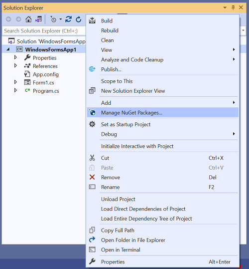
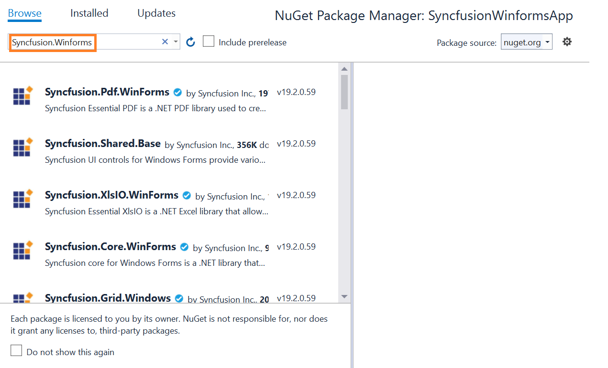
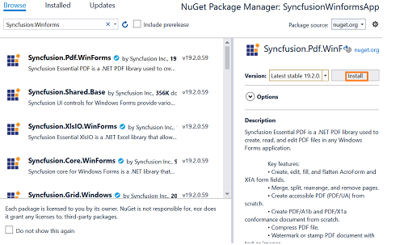
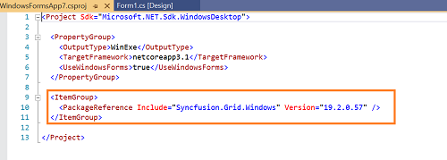
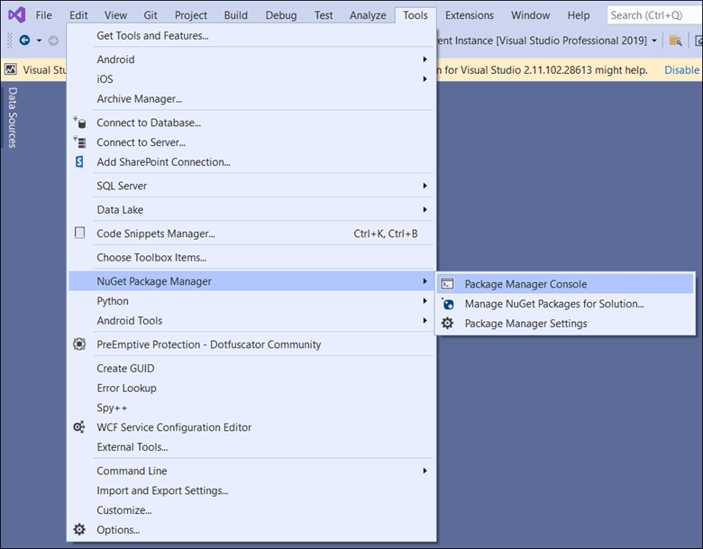
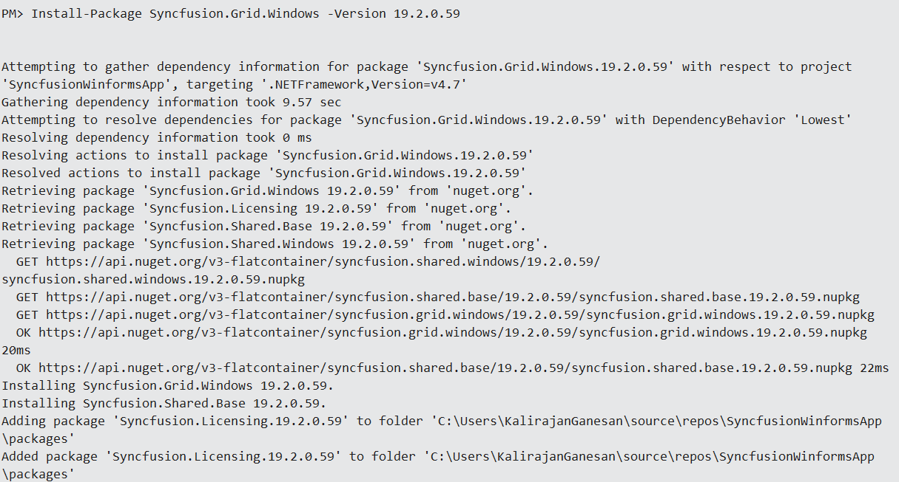

# Install Syncfusion Windows Forms NuGet packages

## Overview

**NuGet** is a Package management system for Visual Studio. It makes it easy to add, update and remove external libraries in our application. Syncfusion publishes all Windows Forms NuGet packages in [nuget.org](https://www.nuget.org/packages?q=Tags%3A%22Winforms%22+syncfusion). The Syncfusion Windows Forms NuGet packages can be used without installing the Syncfusion Essential Studio setup. You can simply use the Syncfusion Windows Forms NuGet packages in a Windows Forms application to develop with the Syncfusion Windows Forms components.

> From v16.2.0.46 (2018 Volume 2 Service Pack 1) onwards, all the Syncfusion Windows Forms components are available as NuGet packages at nuget.org.

## Prerequisites

Before installing Syncfusion Windows Forms NuGet packages, make sure the following prerequisites are met:

* A supported version of Visual Studio with the **.NET desktop development** workload installed. Refer to the [System Requirements](https://help.syncfusion.com/windowsforms/system-requirements) page for the supported Visual Studio versions.
* A supported .NET Framework or .NET (Core) SDK. Refer to the [System Requirements](https://help.syncfusion.com/windowsforms/system-requirements) page for the supported .NET versions.
* NuGet client tools (NuGet Package Manager UI, NuGet Package Manager Console, or the `dotnet` CLI) shipped with Visual Studio or the .NET SDK.
* A Windows Forms project (.NET Framework or .NET) created in Visual Studio. If you do not have a project yet, create one from **File → New → Project → Windows Forms App**.

## Licensing

Syncfusion NuGet packages require a valid Syncfusion license at runtime. You can use a Community License, a Trial License, or a paid commercial license. For more information about licensing, refer to the [Licensing overview](https://help.syncfusion.com/windowsforms/licensing/overview). To generate a license key for active trial or licensed products, refer to the [how to generate the license key](https://help.syncfusion.com/windowsforms/licensing/how-to-generate) topic.

## Choosing a Method

You can install Syncfusion Windows Forms NuGet packages using one of three methods. Use the table below to choose the method that fits your workflow.

| Method | When to use |
|--------|-------------|
| [Package Manager UI](#installation-using-package-manager-ui) | Interactive search and install from inside Visual Studio. Best for visual browsing of packages. |
| [dotnet (.NET) CLI](#installation-using-dotnet-net-cli) | Automation, build scripts, and command-line workflows. |
| [Package Manager Console](#installation-using-package-manager-console) | Quick install commands from inside Visual Studio without searching. |

## Package Selection

Syncfusion publishes individual control packages (such as `Syncfusion.Grid.Windows`) and full-suite convenience packages. The full Windows Forms suite is covered by multiple individual packages. Browse the full list of Syncfusion Windows Forms NuGet packages at [nuget.org](https://www.nuget.org/packages?q=Tags%3A%22winforms%22+syncfusion).

## Installation using Package Manager UI

The NuGet **Package Manager UI** allows you to search, install, uninstall, and update Syncfusion Windows Forms NuGet packages in your applications and solutions. You can find and install the Syncfusion Windows Forms NuGet packages in your Visual Studio Windows Forms application and this process is easy with the steps below:

1. Right-click on the Windows Forms application or solution in the Solution Explorer, and choose **Manage NuGet Packages...**

    

    As an alternative, after opening the Windows Forms application in Visual Studio, go to the **Tools** menu and after hovering **NuGet Package Manager**, select **Manage NuGet Packages for Solution...**

2. The Manage NuGet Packages window will open. Navigate to the **Browse** tab, then search for the Syncfusion Windows Forms NuGet packages using a term like **"Syncfusion.WinForms"** and select the appropriate Syncfusion Windows Forms NuGet package for your development.

    > The [nuget.org](https://api.nuget.org/v3/index.json) package source is selected by default in the Package source drop-down. If your Visual Studio does not have nuget.org configured, follow the instructions in the [Microsoft documents](https://learn.microsoft.com/en-us/nuget/consume-packages/install-use-packages-visual-studio#package-sources) to set up the nuget.org feed URL. If you use a private NuGet feed, add the feed URL in the Package source drop-down before browsing.

    

3. When you select a package, the right side panel will provide more information about it.

4. By default, the package selected is the latest version. You can choose the required version and click the **Install** button and accept the license terms. The package will be added to your Windows Forms application.

    

5. At this point, your application has all the required Syncfusion assemblies, and you will be ready to start building high-performance, responsive apps with [Syncfusion Windows Forms components](https://www.syncfusion.com/winforms-ui-controls). Also, you can refer to the [Syncfusion Windows Forms help document](https://help.syncfusion.com/windowsforms/overview) for development.

## Installation using Dotnet (.NET) CLI

The [dotnet Command Line Interface (CLI)](https://learn.microsoft.com/en-us/nuget/consume-packages/install-use-packages-dotnet-cli), allows you to add, restore, pack, publish, and manage packages without making any changes to your application files. [Dotnet add package](https://learn.microsoft.com/en-us/dotnet/core/tools/dotnet-add-package?tabs=netcore2x) adds a package reference to the application file, then runs [dotnet restore](https://learn.microsoft.com/en-us/dotnet/core/tools/dotnet-restore?tabs=netcore2x) to download the package and its dependencies.

Follow the below instructions to use the dotnet CLI command to install the Syncfusion Windows Forms NuGet packages.

1. Open a command prompt and navigate to the directory where your Syncfusion Windows Forms project file is located.
2. To install a NuGet package, run the following command.

    ```dotnet add package <Package name>```

    **For Example:**
    dotnet add package Syncfusion.Grid.Windows

    > If you don’t provide a version flag, this command will be upgrading to the latest version by default. To specify a version, add the -v parameter: dotnet add package Syncfusion.Grid.Windows -v 19.2.0.57

3. Examine the Syncfusion Windows Forms project file after the command has completed to ensure that the Syncfusion Windows Forms package was installed. To see the added reference, open the .csproj file.

    

4. Then run  [dotnet restore](https://learn.microsoft.com/en-us/dotnet/core/tools/dotnet-restore?tabs=netcore2x) command to restores all the packages listed in the application file.

    > Restoring is done automatically with **dotnet build** and **dotnet run** in .NET Core 2.0 and later.

5. At this point, your application has all the required Syncfusion assemblies, and you will be ready to start building high-performance, responsive apps with [Syncfusion Windows Forms components](https://www.syncfusion.com/winforms-ui-controls). Also, you can refer to the [Syncfusion Windows Forms help document](https://help.syncfusion.com/windowsforms/overview) for development.

## Installation using Package Manager Console

The **Package Manager Console** saves NuGet packages installation time since you don't have to search for the Syncfusion Windows Forms NuGet package which you want to install, and you can just type the installation command to install the appropriate Syncfusion Windows Forms NuGet package. Follow the instructions below to use the Package Manager Console to reference the Syncfusion Windows Forms component as NuGet packages in your Windows Forms application.

1. To show the Package Manager Console, open your Windows Forms application in Visual Studio and navigate to **Tools -> NuGet Package Manager -> Package Manager Console**. The Package Manager Console is available for any project type in Visual Studio, including Windows Forms projects.

    

2. The **Package Manager Console** will be shown at the bottom of the screen. You can install the Syncfusion Windows Forms NuGet packages by entering the following NuGet installation commands.

    ***Install specified Syncfusion Windows Forms NuGet package.***

    The below command will install the Syncfusion Windows Forms NuGet package in the default Windows Forms application.

    ```Install-Package <Package Name>```

    **For example:** Install-Package Syncfusion.Grid.Windows

    > You can find the list of Syncfusion Windows Forms NuGet packages which are published in nuget.org from [here](https://www.nuget.org/packages?q=Tags%3A%22winforms%22+syncfusion)

    ***Install specified Syncfusion Windows Forms NuGet package in specified Windows Forms application***

    The below command will install the Syncfusion Windows Forms NuGet package in the given Windows Forms application.

    ```Install-Package <Package Name> -ProjectName <Project Name>```

    **For example:** Install-Package Syncfusion.Grid.Windows -ProjectName SyncfusionWinformsApp

3. By default, the package will be installed with the latest version. You can give the required version with the `-Version` term like below to install the Syncfusion Windows Forms NuGet packages in the appropriate version.

    ```Install-Package Syncfusion.Grid.Windows -Version 19.2.0.59```

    

4. The NuGet package manager console will install the Syncfusion Windows Forms NuGet package as well as its dependencies. When the installation is complete, the console will show that your Syncfusion Windows Forms package has been successfully added to the application.

5. At this point, your application has all the required Syncfusion assemblies, and you will be ready to start building high-performance, responsive apps with [Syncfusion Windows Forms components](https://www.syncfusion.com/winforms-ui-controls). Also, you can refer to the [Syncfusion Windows Forms help document](https://help.syncfusion.com/windowsforms/overview) for development.

## Update and Upgrade

To update a Syncfusion Windows Forms NuGet package to a newer version, use the NuGet Package Manager UI, the `dotnet add package` command with a new version, or the Package Manager Console `Update-Package` command. When you upgrade to a new Syncfusion release, refer to the [release notes](https://help.syncfusion.com/windowsforms/release-notes/v34.1.29?type=all) for breaking changes that may affect your application.

## Transitive Dependencies

Syncfusion Windows Forms NuGet packages may declare transitive dependencies on other Syncfusion or third-party packages. NuGet automatically resolves and installs these dependencies when you install the parent package, so you do not need to install them manually. To inspect the dependency graph, use `dotnet list package` or the NuGet Package Manager UI.

## See Also

* [Web installer - how to install](https://help.syncfusion.com/windowsforms/installation/web-installer/how-to-install)
* [Web installer - how to download](https://help.syncfusion.com/windowsforms/installation/web-installer/how-to-download)
* [Offline installer - how to install](https://help.syncfusion.com/windowsforms/installation/offline-installer/how-to-install)
* [Offline installer - how to download](https://help.syncfusion.com/windowsforms/installation/offline-installer/how-to-download)
* [Common Installation Errors](https://help.syncfusion.com/windowsforms/installation/installation-errors)