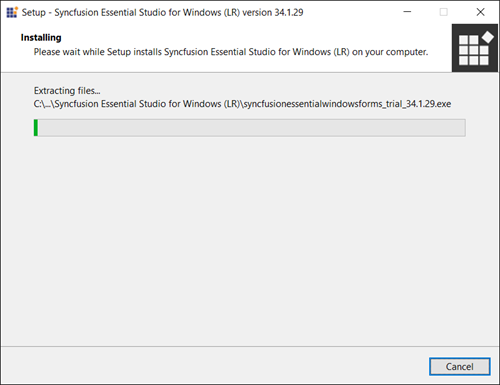
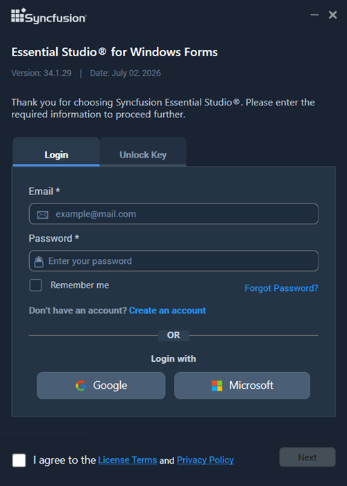
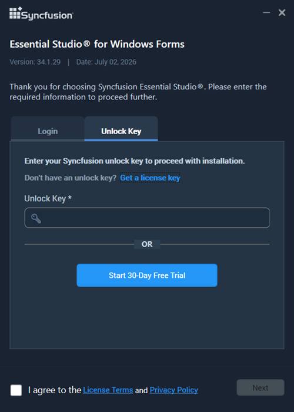
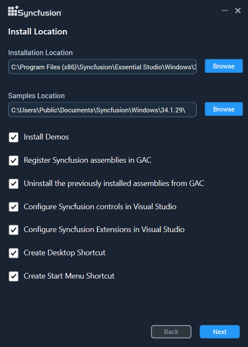
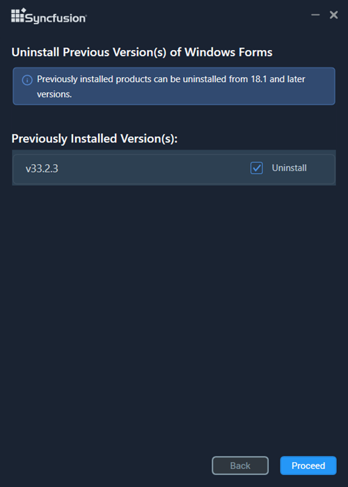
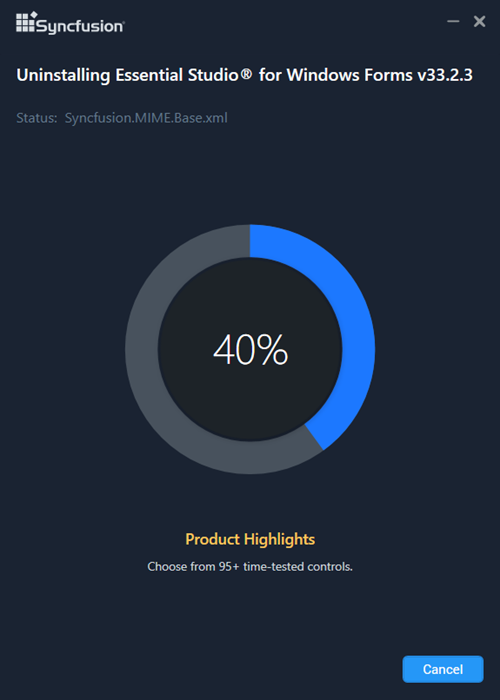
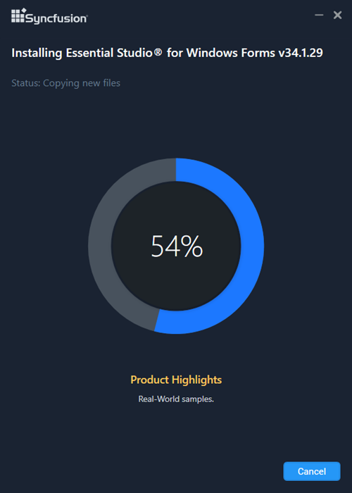
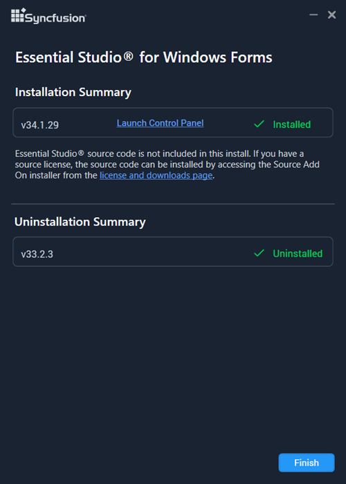

# Installing Syncfusion Windows Forms Offline Installer

## Prerequisites

Before running the offline installer, make sure the following prerequisites are met:

* Administrative privileges on the machine.
* A supported Windows operating system and .NET version. Refer to the [System Requirements](https://help.syncfusion.com/windowsforms/system-requirements) page.
* A valid Syncfusion Unlock Key (for licensed installs) or a Syncfusion account with an active trial.
* If an antivirus product is installed on the machine, add an exception for the installer executable and the chosen install path before running the installer.

## Installing with UI   

The steps below show how to install the Essential Studio Windows Forms installer.

1.	Open the Syncfusion Windows Forms offline installer file from downloaded location by double-clicking it. The Installer Wizard automatically opens and extracts the package.

     

    N> The Installer wizard extracts the syncfusionessentialwindowsforms_(version).exe dialog, which displays the package's unzip operation.

2.	To unlock the Syncfusion offline installer, you have two options:

   
    * *Login To Install*
   
    * *Use Unlock Key*
   
   
   
    **Login To Install**
   
    You must enter your Syncfusion email address and password. If you don't already have a Syncfusion account, you can sign up for one by clicking **"Create an account"**. If you have forgotten your password, click on **"Forgot Password"** to create a new one. Once you've entered your Syncfusion email and password, click Next.

       

    **Use Unlock Key**
   
    Unlock keys are used to unlock the Syncfusion offline installer, and they are product and version specific. You should use either Syncfusion licensed or trial Unlock key to unlock Syncfusion Windows Forms installer.
   
    The trial unlock key is only valid for 30 days, and the installer will not accept an expired trial key. 
   
    To learn how to generate an unlock key for both trial and licensed products, see [this](https://www.syncfusion.com/kb/8069/how-to-generate-unlock-key-for-essentials-studio-products) Knowledge Base article.

       

3.	After reading the License Terms and Privacy Policy, check the **“I agree to the License Terms and Privacy Policy”** check box. Click the Next button.

4.	Change the install and sample locations here. You can also change the Additional settings. Click Next or Install, depending on the wizard state, to install with the default settings.

    

    **Additional Settings**

	* Select the **Install Demos** check box to install Syncfusion samples. Leave the check box unchecked if you do not want to install Syncfusion samples (default: unchecked).
	* Select the **Register Syncfusion Assemblies in GAC** check box to install the latest Syncfusion assemblies in GAC. Clear this check box when you do not want to install the latest assemblies in GAC (default: unchecked).
    * Select the **Configure Syncfusion controls in Visual Studio** check box to configure the Syncfusion controls in the Visual Studio toolbox. Clear this check box when you do not want to configure the Syncfusion controls in the Visual Studio toolbox during installation (default: unchecked). Note that you must also select the Register Syncfusion assemblies in GAC check box when you select this check box.
    * Select the **Configure Syncfusion Extensions controls in Visual Studio** checkbox to configure the Syncfusion Extensions in Visual Studio. Clear this check box when you do not want to configure the Syncfusion Extensions in Visual Studio (default: unchecked).
    * Check the **Create Desktop Shortcut** checkbox to add a desktop shortcut for Syncfusion Control Panel (default: unchecked).
    * Check the **Create Start Menu Shortcut** checkbox to add a shortcut to the start menu for Syncfusion Control Panel (default: unchecked).

5.	If any previous versions of the current product is installed, the Uninstall Previous Version(s) wizard will be opened. Select **Uninstall** checkbox to uninstall the previous versions and then click the Proceed button.

    
	
	
	N> From the 2021 Volume 1 release, Syncfusion has added the option to uninstall previous versions from 18.1 while installing the new version.
	
	
	N> If any version is selected to uninstall, a confirmation screen will appear; if Continue is selected, the Progress screen will display the uninstall and install progress, respectively. If none of the versions are chosen to be uninstalled, only the installation progress will be displayed.
	
	**Confirmation Alert**
	
	
	
	**Uninstall Progress:**
	
	
	
	**Install Progress**
	
	

    N> The Completed screen is displayed once the Windows Forms product is installed. If any version is selected to uninstall, the Completed screen will display both install and uninstall status.

	

6.  After installing, click the **Launch Control Panel** link to open the Syncfusion Control Panel. The Syncfusion Control Panel lists the installed Syncfusion products and provides options to modify, repair, or remove them.

7.  Click the Finish button. The Syncfusion Essential Studio Windows Forms product has been installed on your system.

## Uninstalling with UI

You can uninstall Syncfusion Essential Studio Windows Forms using the standard Windows uninstall workflow.

1. Open the Windows Control Panel and select **Programs and Features** (or **Add or Remove Programs** on earlier Windows versions).
2. Select **Syncfusion Essential Studio for Windows Forms {version}** from the list and click **Uninstall**.
3. Follow the on-screen prompts in the MSI uninstallation window to complete the removal.
4. When the uninstall completes, click **Finish** in the summary window.

## Installing in silent mode

The Syncfusion Essential Studio Windows Forms Installer supports installation and uninstallation via the command line.

### Shared steps for command-line install and uninstall

The following steps are common to both silent install and silent uninstall. Perform these steps once before running the install or uninstall command.

1.	Run the Syncfusion Windows Forms installer by double-clicking it. The Installer Wizard automatically opens and extracts the package.
2.	The file syncfusionessentialwindowsforms_(version).exe will be extracted into the Temp directory.
3.	Run %temp%. The Temp folder will be opened. The syncfusionessentialwindowsforms_(version).exe file will be located in one of the folders.
4.	Copy the extracted syncfusionessentialwindowsforms_(version).exe file to a local drive.
5.	Exit the Wizard.

### Command Line Installation

To install through the Command Line in Silent mode, follow the steps below.

1.	Complete the [Shared steps for command-line install and uninstall](#shared-steps-for-command-line-install-and-uninstall) above.
2.	Run Command Prompt in administrator mode and enter the following arguments.

   **Arguments:**






"installer file path\SyncfusionEssentialStudio(product)_(version).exe" /Install silent /UNLOCKKEY:"(product unlock key)" [/log "{Log file path}"] [/InstallPath:{Location to install}] [/InstallSamples:{true/false}] [/InstallAssemblies:{true/false}] [/UninstallExistAssemblies:{true/false}] [/InstallToolbox:{true/false}]





{{ codesnippet1 | OrderList_Indent_Level_1 }}

    N> [..] – Arguments inside the square brackets are optional.

    **Example:**






"D:\Temp\syncfusionessentialwindowsforms_x.x.x.x.exe" /Install silent /UNLOCKKEY:"product unlock key" /log "C:\Temp\EssentialStudio_Platform.log" /InstallPath:C:\Syncfusion\x.x.x.x /InstallSamples:true /InstallAssemblies:true /UninstallExistAssemblies:true /InstallToolbox:true





{{ codesnippet2 | OrderList_Indent_Level_1 }}

3.  Essential Studio for Windows Forms is installed.

    N> `x.x.x.x` should be replaced with the Essential Studio version, and the Product Unlock Key needs to be replaced with the Unlock Key for that version.

#### Command-line parameters

The following table describes the parameters used in the silent installation. `Install`, `silent`, and `UNLOCKKEY` are required. All other parameters are optional. The exact behavior of each flag is subject to the Syncfusion version installed; refer to the [release notes](https://www.syncfusion.com/releases) for version-specific behavior.

| Parameter | Required | Description |
|-----------|----------|-------------|
| `/Install` | Yes | Performs the installation. |
| `silent` | Yes | Runs the installer without user interaction. |
| `/UNLOCKKEY` | Yes | Specifies the product unlock key. Replace `(product unlock key)` with the unlock key for the version being installed. |
| `/log` | No | Writes the installation log to the specified file path. Use this to troubleshoot installation failures. |
| `/InstallPath` | No | Specifies the folder in which Essential Studio is installed. If omitted, the default installation path is used. |
| `/InstallSamples` | No | Accepts `true` or `false`. When set to `true`, installs the Syncfusion samples. |
| `/InstallAssemblies` | No | Accepts `true` or `false`. When set to `true`, installs the Syncfusion assemblies. |
| `/UninstallExistAssemblies` | No | Accepts `true` or `false`. When set to `true`, removes existing Syncfusion assemblies before installing the new version. |
| `/InstallToolbox` | No | Accepts `true` or `false`. When set to `true`, configures the Syncfusion controls in the Visual Studio toolbox. |

#### Verifying the installation

After the silent install completes, verify the result using one of the following:

* Check the installer exit code. A return code of `0` indicates success. Non-zero codes indicate a failure.
* Open the Windows Control Panel and confirm that the **Syncfusion Essential Studio for Windows Forms** entry is listed under **Programs and Features**.
* If you specified the `/log` parameter, review the generated log file for any errors or warnings.

N> Some configurations may require a system reboot to complete the installation, particularly when GAC registration is involved. If the installer prompts for a reboot, complete the reboot before running the application.

### Command Line Uninstallation

Syncfusion Essential Windows Forms can be uninstalled silently using the Command Line.

1.	Complete the [Shared steps for command-line install and uninstall](#shared-steps-for-command-line-install-and-uninstall) above.
2.	Run Command Prompt in administrator mode and enter the following arguments.

   **Arguments:**






"Copied installer file path\syncfusionessentialwindowsforms_(version).exe" /uninstall silent





{{ codesnippet3 | OrderList_Indent_Level_1 }}

    **Example:**






"D:\Temp\syncfusionessentialwindowsforms_x.x.x.x.exe" /uninstall silent





{{ codesnippet4 | OrderList_Indent_Level_1 }}

3.  Essential Studio for Windows Forms is uninstalled.

#### Verifying the uninstallation

After the silent uninstall completes, verify the result using one of the following:

* Check the installer exit code. A return code of `0` indicates success. Non-zero codes indicate a failure.
* Open the Windows Control Panel and confirm that the **Syncfusion Essential Studio for Windows Forms** entry is no longer listed under **Programs and Features**.

## ZIP format offline installer

If you downloaded the offline installer in ZIP format instead of EXE, extract the ZIP archive to a local folder, then run the setup executable that is contained inside the extracted folder. The UI installation and silent-mode command-line steps above apply to the EXE extracted from the ZIP archive.

## See Also

* [Downloading the Offline Installer](how-to-download)
* [Installing the Web Installer](../web-installer/how-to-install)
* [Install Syncfusion WinForms NuGet packages](../install-nuget-packages)
* [Common Installation Errors](../Installation-errors)
