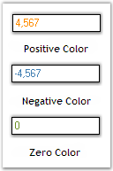

# Appearance Settings in Windows Forms Integer TextBox

## Background settings

The background settings of the IntegerTextBox control are discussed below.

### Background color

The background color of the control can be set using the properties given below.

* [BackColor](https://help.syncfusion.com/cr/windowsforms/Syncfusion.Windows.Forms.Tools.NumberTextBoxBase.html#Syncfusion_Windows_Forms_Tools_NumberTextBoxBase_BackGroundColor)
* [ReadOnlyBackColor](https://help.syncfusion.com/cr/windowsforms/Syncfusion.Windows.Forms.Tools.NumberTextBoxBase.html#Syncfusion_Windows_Forms_Tools_NumberTextBoxBase_ReadOnlyBackColor)



this.integerTextBox1.BackColor = System.Drawing.Color.PeachPuff;
this.integerTextBox1.ReadOnly = true;
this.integerTextBox1.ReadOnlyBackColor = System.Drawing.Color.LavenderBlush;


Me.integerTextBox1.BackColor = System.Drawing.Color.PeachPuff
Me.integerTextBox1.ReadOnly = True
Me.integerTextBox1.ReadOnlyBackColor = System.Drawing.Color.LavenderBlush



 

N> The [ReadOnly](https://learn.microsoft.com/en-us/dotnet/api/system.windows.forms.textboxbase.readonly?view=windowsdesktop-7.0&viewFallbackFrom=net-5.0) property must be set to 'True' for the above setting to take effect.

The methods associated with the above properties are given below.

* [ResetBackColor](https://help.syncfusion.com/cr/windowsforms/Syncfusion.Windows.Forms.Tools.NumberTextBoxBase.html#Syncfusion_Windows_Forms_Tools_NumberTextBoxBase_ResetControlBackColor)
* ResetReadOnlyBackColor

## Foreground settings

The foreground settings of the IntegerTextBox control are discussed below.

### Foreground color

The foreground color of the control can be set using the properties given below.

* [PositiveColor](https://help.syncfusion.com/cr/windowsforms/Syncfusion.Windows.Forms.Tools.NumberTextBoxBase.html#Syncfusion_Windows_Forms_Tools_NumberTextBoxBase_PositiveColor)
* [NegativeColor](https://help.syncfusion.com/cr/windowsforms/Syncfusion.Windows.Forms.Tools.NumberTextBoxBase.html#Syncfusion_Windows_Forms_Tools_NumberTextBoxBase_NegativeColor)
* [ZeroColor](https://help.syncfusion.com/cr/windowsforms/Syncfusion.Windows.Forms.Tools.NumberTextBoxBase.html#Syncfusion_Windows_Forms_Tools_NumberTextBoxBase_ZeroColor)





this.integerTextBox1.PositiveColor = System.Drawing.Color.DarkOrange;
this.integerTextBox1.NegativeColor = System.Drawing.Color.SteelBlue;
this.integerTextBox1.ZeroColor = System.Drawing.Color.OliveDrab;





Me.integerTextBox1.PositiveColor = System.Drawing.Color.DarkOrange

Me.integerTextBox1.NegativeColor = System.Drawing.Color.SteelBlue

Me.integerTextBox1.ZeroColor = System.Drawing.Color.OliveDrab




 

The methods associated with the above properties are given below.

* ResetForeColor
* ResetPositiveColor
* ResetNegativeColor
* ResetZeroColor
* SetControlColor
* ShouldSerializePositiveColor
* ShouldSerializeNegativeColor
* ShouldSerializeZeroColor

## Visual style

Please refer the [TextBoxExt Visual style](/windowsforms/TextBoxExt/Appearance-Settings) to set themes for IntegerTextBox.

A sample which demonstrates the Foreground Settings of IntegerTextBox control is available in the below sample installation path.

…\System Drive:\Users\Username\AppData\Local\Syncfusion\EssentialStudio\Version Number\Windows\Tools.Windows\Samples\Editor Controls\Editor Controls\CS
