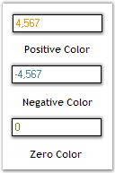

# Appearance Settings in WinForms Integer TextBox

## Background settings

The background settings of the WinForms Integer TextBox control are discussed below.

### Background color

The background color of the control can be set using the following properties:

* [BackColor](https://help.syncfusion.com/cr/windowsforms/Syncfusion.Windows.Forms.Tools.NumberTextBoxBase.html#Syncfusion_Windows_Forms_Tools_NumberTextBoxBase_BackGroundColor) - Sets the background color of the control.
* [ReadOnlyBackColor](https://help.syncfusion.com/cr/windowsforms/Syncfusion.Windows.Forms.Tools.NumberTextBoxBase.html#Syncfusion_Windows_Forms_Tools_NumberTextBoxBase_ReadOnlyBackColor) - Sets the background color when the control is read-only.



this.integerTextBox1.BackColor = System.Drawing.Color.PeachPuff;
this.integerTextBox1.ReadOnly = true;
this.integerTextBox1.ReadOnlyBackColor = System.Drawing.Color.LavenderBlush;


Me.integerTextBox1.BackColor = System.Drawing.Color.PeachPuff
Me.integerTextBox1.ReadOnly = True
Me.integerTextBox1.ReadOnlyBackColor = System.Drawing.Color.LavenderBlush



>**NOTE**: The [ReadOnly](https://learn.microsoft.com/en-us/dotnet/api/system.windows.forms.textboxbase.readonly?view=windowsdesktop-7.0&viewFallbackFrom=net-5.0) property must be set to `true` for the `ReadOnlyBackColor` setting to take effect.

The methods associated with the above properties are:

* [ResetBackColor](https://help.syncfusion.com/cr/windowsforms/Syncfusion.Windows.Forms.Tools.NumberTextBoxBase.html#Syncfusion_Windows_Forms_Tools_NumberTextBoxBase_ResetControlBackColor)
* ResetReadOnlyBackColor

## Foreground settings

The foreground settings of the WinForms Integer TextBox control are discussed below.

### Foreground color

The foreground color of the control can be set using the following properties:

* [PositiveColor](https://help.syncfusion.com/cr/windowsforms/Syncfusion.Windows.Forms.Tools.NumberTextBoxBase.html#Syncfusion_Windows_Forms_Tools_NumberTextBoxBase_PositiveColor) - Foreground color used for positive values.
* [NegativeColor](https://help.syncfusion.com/cr/windowsforms/Syncfusion.Windows.Forms.Tools.NumberTextBoxBase.html#Syncfusion_Windows_Forms_Tools_NumberTextBoxBase_NegativeColor) - Foreground color used for negative values.
* [ZeroColor](https://help.syncfusion.com/cr/windowsforms/Syncfusion.Windows.Forms.Tools.NumberTextBoxBase.html#Syncfusion_Windows_Forms_Tools_NumberTextBoxBase_ZeroColor) - Foreground color used when the value is zero.





this.integerTextBox1.PositiveColor = System.Drawing.Color.DarkOrange;
this.integerTextBox1.NegativeColor = System.Drawing.Color.SteelBlue;
this.integerTextBox1.ZeroColor = System.Drawing.Color.OliveDrab;





Me.integerTextBox1.PositiveColor = System.Drawing.Color.DarkOrange

Me.integerTextBox1.NegativeColor = System.Drawing.Color.SteelBlue

Me.integerTextBox1.ZeroColor = System.Drawing.Color.OliveDrab




The methods associated with the above properties are:

* ResetForeColor
* ResetPositiveColor
* ResetNegativeColor
* ResetZeroColor
* SetControlColor
* ShouldSerializePositiveColor
* ShouldSerializeNegativeColor
* ShouldSerializeZeroColor

## Visual style

Please refer to the [TextBoxExt Visual Style](https://help.syncfusion.com/windowsforms/textboxext/overview) page to set themes for the WinForms Integer TextBox.

A sample that demonstrates the Foreground Settings of the WinForms Integer TextBox control is available at the following sample installation path:

`%LOCALAPPDATA%\Syncfusion\EssentialStudio\<Version Number>\Windows\Tools.Windows\Samples\Editor Controls\Editor Controls\CS`
